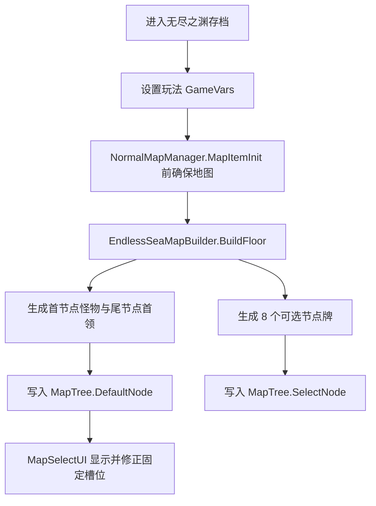

# 无尽之渊：玩法介绍、机制与数值文档

本文档用于审阅当前已实现的【无尽之渊】玩法。历史开发名为【无尽之海之塔】，因此内部仍保留 `EndlessSea*` 类名、存档键与部分 Hook 名称，用于兼容旧存档、旧测试和既有架构断言；玩家可见文本统一使用【无尽之渊】。

## 玩法定位

【无尽之渊】是一个基于普通模式流程接入的无限下潜玩法。玩家从模式选择页进入后，会创建带有专属标记的普通模式存档；运行期间通过独立地图生成器持续生成下一层，并在到达本层终点后推进层数。

设计目标：

- 提供无上限推进的地图循环。
- 复用原生 `NormalMapManager` 的稳定启动链路，同时用专属 GameVars 标记玩法身份。
- 每层固定第一个怪物节点和最后一个首领节点，中间 4 个节点由可选节点牌配置。
- 通过敌人 HP 成长、节点类型区分、专属战斗奖励、默认卡牌限制、【注视等级】和【深渊震荡】维持长期压力。
- 从第 2 层开始提供【无尽之渊】专属里程碑奖励选择。

非目标：

- 当前不提供事件节点。
- 当前不提供专属剧情结算。
- 当前不与使魔成长系统联动。
- 当前不改造原生卡牌奖励候选池；玩法内通过奖励、商店、角色技能等渠道获得或生成的卡牌由运行期统一追加模式限制词条。

## 命名约定

玩家可见命名：

- 玩法名：【无尽之渊】。
- 第 1-6 层阶段：【潜行模式】。
- 第 7 层起阶段：【无尽模式】。
- 压力等级：【注视等级】，初始值为 1。
- 统一惩罚事件：【深渊震荡】。

内部兼容命名：

- `EndlessSea*`：历史代码命名，表示无尽之渊主玩法运行时。
- `SunExp_EndlessSeaMode` 等 GameVars：历史存档键，不随玩家可见命名变更。
- `SunExpEndlessSea`：旧版 modeType 兼容迁移标记。

## 入口与存档

入口位于模式选择界面中【日耀回忆】之后，排序值为 `110`。入口复用原生 `SublimationMode` 模板，并通过共享的模式入口布局系统追加到现有入口之后。

进入玩法时创建普通模式存档：

- `SaveInfo.modeType = "Normal"`：必须保持官方普通模式承载类型，确保 `GameServer.StartRole` 能通过 `GameSaveManager.GetSaveType()` 正确选择 `NormalMapManager`。
- `LobbyManager.SetLobbyModeType("Normal")`：运行时仍复用官方 `NormalMapManager`，避免原生地图启动链路拿到自定义模式类型。
- `SunExp_EndlessSeaMode = "1"`：标记当前存档为无尽之渊。
- `SunExp_EndlessSeaFloor = "1"`：当前层数从第 1 层开始。
- `SunExp_EndlessSeaGeneratedFloor = "0"`：记录已生成地图的层数。
- `SunExp_EndlessSeaSeed = seed`：保存本次运行种子。
- `SunExp_EndlessAbyssGazeLevel = "1"`：注视等级初始值为 1。
- `SunExp_EndlessAbyssLedger`：记录深渊震荡与里程碑奖励结算。
- `SunExp_EndlessAbyssPendingShock`：记录待处理的深渊震荡，防止重复触发。
- `ExLockDes = "0"`：不额外增加原生锁定槽位；无尽之渊运行时只锁定首节点和尾节点。
- `ExDeleteDes = "0"`：不删除额外地图槽位。
- 保留当前难度词条选择：`HardTags = SunExpHardTagRuntime.SelectedRuntimeHardTags()`。

多人边界：

- 只有房主可以开始无尽之渊运行。
- 客户端只做本地展示和同步修复，不推进共享层数。

## 地图结构

每层无尽之渊使用 6 个可视槽位：

| 可视槽位 | UI 位置 | 节点类型 |
| --- | --- | --- |
| 0 | `Start` | 固定为当前层普通怪 |
| 1 | `Node1` | 初始为空，由玩家拖入节点牌 |
| 2 | `Node2` | 初始为空，由玩家拖入节点牌 |
| 3 | `Node3` | 初始为空，由玩家拖入节点牌 |
| 4 | `Node4` | 初始为空，由玩家拖入节点牌 |
| 5 | `End` | 首领或无尽首领 |

固定槽位为 `Start` 怪物和 `End` 首领。`Node1-4` 在地图初始状态下保持空槽，由玩家从手上的可选节点牌中拖入。建筑和休息处不再写入可视固定槽，而是进入可选节点牌：

```text
selectableNodes = 1 Rest + 1 Building + dynamic Fight nodes
```

每层生成 8 个可选节点，用于原生地图选择流程消费；玩家从中选择 4 张填入中间槽位。配比由 `EndlessSeaSelectableNodeDeckPlanner` 生成，并用地图骰子做确定性洗牌。

### 节点类型

当前需要区分 4 类战斗节点：

- 普通怪：基础战斗节点。
- 精英：更高强度的战斗节点。
- 首领：潜行模式和普通层终点节点。
- 无尽首领：进入无尽模式后的终点节点，用于承接更高强度和后续扩展奖励。

`EndlessSeaNodeKind` 保存节点分类。奖励、额外敌人、深渊震荡触发和后续 UI 展示都应优先读取节点分类，而不是只依赖层数。

### 独立地图生成

无尽之渊不调用原生世界推演地图生成器，也不调用 `TypeGenerate`。当前实现由 `EndlessSeaMapBuilder` 直接生成当前层所需的 `MapTree.DefaultNode` 和 `MapTree.SelectNode`。



为了适配原生 `DefaultNode` 的内部顺序，无尽之渊维护一层视觉槽位到原生顺序的映射。原生初始化阶段的 `DefaultNode[0]` 会先使用安全的休息处占位，避免官方 `Start` 节点初始化用怪物节点触发空引用；`NormalMapManager.MapItemInit` 完成后，再把可视 `Start` 槽修正为楼层计划中的固定怪物。

| 原生 `DefaultNode` index | 原生初始化用途 | 无尽之渊最终可视槽位 |
| --- | --- | --- |
| 0 | `Start` 安全占位 | `Start`，随后替换为固定怪物 |
| 1 | `End` 首领 | `End` |

每次构建或确认地图时，无尽之渊会：

- 强制保存 `ExLockDes = 0` 和 `ExDeleteDes = 0`。
- 确保 `MapTree.hasUsed` 包含 `0`，使原生生成器不再把第 0 段当作未使用层段重新生成。
- 在原生 `NormalMapManager.GeneratrMap` 后再次修复无尽之渊地图状态。
- 地图标题显示为：`无尽之渊 第X层`。

## 层数推进

无尽之渊层数和原生地图层数分离：

- 无尽之渊层数：`SunExp_EndlessSeaFloor`。
- 原生地图层数：`MapManager.Instance.Level` / `NormalMapManager.Level`。

当原生层数达到 6 时，运行时在 `NormalMapManager.ReadyToChangeMap` 前执行推进：

1. 房主将 `SunExp_EndlessSeaFloor` 加 1。
2. 将 `SunExp_EndlessSeaGeneratedFloor` 重置为 `0`。
3. 将原生 `MapManager` 层数重置为 `0`。
4. 强制生成下一层无尽之渊地图。

这样可以规避原生普通模式地图的层数上限，并持续复用 6 槽位地图结构。

## 潜行模式与无尽模式

阶段由层数决定：

| 层数 | 阶段 | 说明 |
| --- | --- | --- |
| 1-6 | 潜行模式 | 基础下潜阶段，每层地图场景触发一次【深渊震荡】 |
| 7+ | 无尽模式 | 无固定终点，每场战斗触发一次【深渊震荡】 |

`endless_abyss.config.json` 负责配置关键参数：

- `stealthMaxFloor`：潜行模式最高层，当前为 6。
- `endlessMinLevel`：无尽模式起始层，当前为 7。
- `initialGazeLevel`：注视等级初始值，当前为 1。
- `maxRequiredShockChoices`：深渊震荡单次最高必选数量，当前为 3。

## 注视等级

【注视等级】是无尽之渊的长期压力量表，初始值为 1。它的语义是“深渊对玩家的凝视与干涉程度”，不等同于普通数值等级。

注视等级影响【深渊震荡】必须选择的惩罚数量：

```text
requiredChoices = clamp(1 + floor((gazeLevel - 1) / 2), 1, 3)
```

当前节奏：

- 注视等级 1-2：必须选择 1 项。
- 注视等级 3-4：必须选择 2 项。
- 注视等级 5+：必须选择 3 项。

该公式保证进入无尽模式后，如果玩家用【注视加深】回避其它损耗，会较快达到 3 项必选上限。

## 深渊震荡

【深渊震荡】统一承载潜行模式和无尽模式的惩罚结算。

触发频率：

- 潜行模式：每层触发一次，发生在地图节点场景。
- 无尽模式：每场战斗触发一次。

触发后会弹出地图节点场景专属 UI。玩家必须根据当前注视等级选择指定数量的互斥策略，结算后才能继续。

当前策略：

| 策略 | 结算 |
| --- | --- |
| 遗物坠落 | 随机销毁 1 件已装备遗物 |
| 湮灭浸染 | 给当前卡组内随机 3 张卡添加【湮灭】 |
| 注视加深 | 注视等级 +1 |

运行状态防重：

- 已触发、已结算的震荡写入 `EndlessAbyssRunLedger`。
- 待处理震荡写入 `SunExp_EndlessAbyssPendingShock`。
- UI 重开、Hook 重入或地图刷新不会重复生成同一个震荡结算。

## 战斗成长

当前无尽之渊会调整敌方 HP，并根据节点类型追加额外敌人压力；未来仍可扩展敌方伤害、行动和奖励参数。

触发时机：

- `Enemy.Init` 后。
- 仅在无尽之渊存档中生效。
- 每个敌人每层只缩放一次，通过动态变量 `SunExpEndlessSeaHpScaledFloor` 防止重复缩放。

HP 倍率公式：

```text
hpMultiplier(floor) =
    min(
        20,
        1
        + 0.12 * max(0, floor - 1)
        + 0.03 * max(0, floor - 10)
    )
```

示例：

| 层数 | HP 倍率 |
| --- | --- |
| 1 | 1.00 |
| 2 | 1.12 |
| 5 | 1.48 |
| 10 | 2.08 |
| 20 | 3.58 |
| 50 | 8.08 |
| 100 | 15.58 |
| 130+ | 20.00 |

## 战斗奖励与卡组运营

无尽之渊战斗奖励会在原生奖励生成后清理本体默认奖励 UI，再按 `EndlessSeaRewardPlan` 生成专属奖励。该逻辑由 `EndlessSeaRewardRuntime` 注册到 `BattleRewardsUI.ModeSetReward` 后执行。

当前奖励类型由层数和节点类型共同决定：

| 阶段 | 普通战斗 | 首领 / 无尽首领 |
| --- | --- | --- |
| 1-2 层 | 2 次卡牌选择、1 次祝福、1 个 1 阶遗物 | 同普通战斗 |
| 3-4 层 | 2 次卡牌选择、1 次祝福、1 个 2 阶遗物 | 同普通战斗 |
| 5-6 层 | 3 次卡牌选择、1 次祝福、1 个 1-3 阶遗物 | 5 次卡牌选择、1 次祝福、1 个 3-4 阶遗物 |
| 7+ 层 | 5 次卡牌选择、1 个遗物奖励 | 5 次卡牌选择、1 次祝福、1 个 3-4 阶遗物 |

### 默认限制词条

为了防止无限卡组运营失控，无尽之渊中通过任意渠道获得或生成的卡牌会默认添加原生 `Burnout` 标签。

处理点：

1. `CardChoiceItem.Initialize` 后：读取候选卡的 `DataConfig`，添加 `Burnout`，并刷新候选卡展示。
2. `CardChoiceUI.Select` 前：在卡牌进入玩家未装备牌列表之前再次添加 `Burnout` 兜底。
3. `PlayerInfo` 加卡、商店/仓库/卡包展示、战斗卡牌生成与抽牌相关 Hook：统一调用 `EndlessSeaCardAffixService`，扫描 `RoleTable.cardList`、`RoleTable.UnCardList` 与战斗 UI 卡牌列表，补齐通过非奖励路径进入本玩法的卡牌限制。

## 里程碑奖励

从第 2 层开始，每层可以展开一次奖励选择 UI。里程碑结算写入 `EndlessAbyssRunLedger`，防止重复领取。

当前奖励选项卡：

- 任意挑选 1 件 1/2/3 阶遗物。
- 随机获得 1 张异次元卡。
- 选择 1 张卡牌清除【焚毁】。
- 选择 1 张卡牌添加【绝灭】。

## 数值总表

| 参数 | 当前值 | 说明 |
| --- | --- | --- |
| 玩法入口排序 | `110` | 位于日耀回忆之后 |
| 存档承载类型 | `Normal` | 交给原生 `NormalMapManager` 启动；无尽之渊身份由 `SunExp_EndlessSeaMode` 标记 |
| 每层可视节点数 | `6` | `Start` + `Node1-4` + `End` |
| 每层可选节点数 | `8` | 1 休息处 + 1 建筑 + 动态战斗节点 |
| 潜行模式层数 | `1-6` | 每层触发一次深渊震荡 |
| 无尽模式层数 | `7+` | 每场战斗触发一次深渊震荡 |
| 注视等级初始值 | `1` | 存档初始化时写入 |
| 深渊震荡最高必选 | `3` | 由注视等级公式控制 |
| 敌方 HP 早期成长 | `+12% / 层` | 从第 2 层开始 |
| 敌方 HP 后期成长 | 第 11 层起 `+3% / 层` | 与早期成长叠加 |
| 敌方 HP 倍率上限 | `20x` | 约第 130 层达到 |
| 战斗奖励 | `EndlessSeaRewardPlan` | 替换本体默认战斗奖励 |
| 获得卡限制 | `Burnout` | 无尽之渊内任意渠道获得的卡牌默认焚毁 |
| 里程碑奖励 | 第 2 层起 | 每层一次，写入 ledger 防重 |

## 主要实现文件

| 文件 | 职责 |
| --- | --- |
| `SunExp/endless_abyss.config.json` | 无尽之渊配置 |
| `SunExp-Dev/Infrastructure/SunExpIds.cs` | 玩法标记、标题、常量、节点元数据键 |
| `SunExp-Dev/Hooks/EndlessSeaModeEntryRuntime.cs` | 模式选择入口注册与展示 |
| `SunExp-Dev/Hooks/EndlessSeaRunLauncher.cs` | 无尽之渊存档创建与启动 |
| `SunExp-Dev/Hooks/EndlessSeaSaveCacheRuntime.cs` | 玩法存档与官方 Normal 缓存 / 新开局清理的隔离 |
| `SunExp-Dev/GameApi/ModeChoiceSaveCacheApi.cs` | 官方 `ModeChoiceUI.beforeSave` 与 `GameEntryUI.selectedSave` 的安全访问封装 |
| `SunExp-Dev/Hooks/EndlessSeaModeRuntime.cs` | 地图 Hook、层推进、UI 修复、同步修复 |
| `SunExp-Dev/Mechanics/EndlessSeaMapBuilder.cs` | 独立地图构建与默认节点映射 |
| `SunExp-Dev/Mechanics/EndlessSeaNodePoolService.cs` | 怪物、精英、首领、无尽首领、建筑、休息处节点池筛选与抽取 |
| `SunExp-Dev/Mechanics/EndlessSeaSelectableNodeDeckPlanner.cs` | 可选节点牌配比与确定性洗牌 |
| `SunExp-Dev/Hooks/EndlessSeaCombatRuntime.cs` | 敌方 HP 成长与额外敌人压力 |
| `SunExp-Dev/Hooks/EndlessSeaRewardRuntime.cs` | 专属战斗奖励替换与战后流程 |
| `SunExp-Dev/Hooks/EndlessSeaCardAffixRuntime.cs` | 卡牌限制 Hook |
| `SunExp-Dev/Mechanics/EndlessSeaCardAffixService.cs` | 获得卡牌默认焚毁服务 |
| `SunExp-Dev/Mechanics/EndlessAbyssConfig.cs` | 配置加载与默认值 |
| `SunExp-Dev/Mechanics/EndlessAbyssShockService.cs` | 深渊震荡触发、选择和结算 |
| `SunExp-Dev/Mechanics/EndlessAbyssRunLedger.cs` | 震荡与里程碑防重记录 |
| `SunExp-Dev/Mechanics/EndlessAbyssMilestoneRewardService.cs` | 里程碑奖励发放 |
| `SunExp-Dev/Hooks/Ui/EndlessAbyssShockPanel.cs` | 深渊震荡选择 UI |
| `SunExp-Dev/Hooks/Ui/EndlessAbyssMilestoneRewardPanel.cs` | 里程碑奖励选择 UI |

## 存档兼容说明

- 无尽之渊存档的 `SaveInfo.modeType` 必须保持为 `Normal`。官方 `GameServer.StartRole` 会使用 `GameSaveManager.GetSaveType()` 选择地图管理器；如果这里写入 `SunExpEndlessSea`，原生 `MapManager.SetMap` 无法拿到 `NormalMapManager`，随后 `SetLevel` 会空引用。
- 玩法身份由 `GameVars["SunExp_EndlessSeaMode"] = "1"` 标记，不再依赖 `SaveInfo.modeType`。
- `EndlessSeaRunStateStore.RepairSave` 会把旧版 `SunExpEndlessSea` 存档迁移回 `Normal`，同时保留玩法专属 GameVars。
- `EndlessSeaSaveCacheRuntime` 负责隔离官方普通模式缓存：清理 `ModeChoiceUI.beforeSave["Normal"]` 中误缓存的无尽之渊档，并在官方普通模式新开局清理 Normal 存档时临时保护无尽之渊档，避免误删。

## 验证方式

推荐验证链：

```powershell
tools\Build-SunExpDll.ps1
tools\Test-SunExpArchitecture.ps1
tools\Test-SunExpCSharp.ps1
.codex\skills\sunexp-mod-dev\scripts\validate-sunexp.ps1
```
