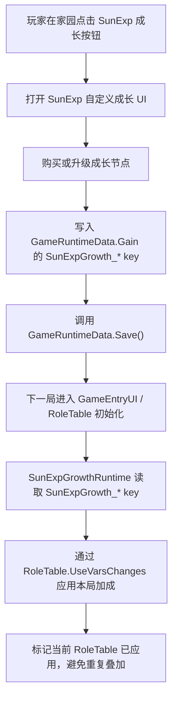

# SunExp 局外成长系统设计草案

本文档整理 SunExp 后续新增“局外成长”功能的初步设计。目标是在官方“属性加点 / 唤醒本源”相关入口旁边新增一个 SunExp 自定义 UI 按钮，并使用 SunExp 自己的列表界面展示、购买和管理成长节点。

本文只讨论系统边界、官方实现参考、SunExp 推荐实现路径和风险点；不在本阶段确定最终数值、成长条目文案或 UI 美术细节。

## 背景

官方已有一套局外成长系统。玩家在家园中进入类似“唤醒本源”的界面，购买属性、物品、角色或其他解锁项。属性成长最终会影响下一局的初始属性。

SunExp 希望新增一套独立的局外成长系统：

- 入口放在官方“属性加点 / 唤醒本源”功能入口旁边。
- 使用 SunExp 自定义 UI，不直接复用官方 `OutsiderShopUI` 的条目列表。
- 成长内容可以包含基础属性强化，也可以扩展为 SunExp 专属路线、日耀回忆奖励、Boss 图鉴进度或其他长期成长。
- 成长状态需要跨局保存，并在新一局开始时稳定落地。

## 参考资料范围

本轮分析使用了当前仓库内资料：

- `SunExp-Dev/Hooks/SolarMemorySetupFlowRuntime.cs`
- `SunExp-Dev/Hooks/SolarMemoryBlessingPickerRuntime.cs`
- `SunExp-Dev/Hooks/SolarMemoryPreparationRuntime.cs`
- `SunExp-Dev/Hooks/RuntimeHooks.cs`
- `开发参考资料/反编译文件夹v1.0.23715745/Witch/RoleTable.cs`
- `开发参考资料/反编译文件夹v1.0.23715745/Witch/GameRuntimeData.cs`
- `开发参考资料/反编译文件夹v1.0.23715745/Witch/UI/Window/GameEntryUI.cs`
- `开发参考资料/反编译文件夹v1.0.23715745/Witch/UI/Window/HouseManager.cs`
- `开发参考资料/反编译文件夹v1.0.23715745/Witch/UI/Window/HouseUI.cs`
- `开发参考资料/反编译文件夹v1.0.23715745/Witch/UI/Window/OutsiderShopUI.cs`
- `开发参考资料/反编译文件夹v1.0.23715745/Witch/UI/Window/OutsideShopItem.cs`
- `开发参考资料/反编译文件夹v1.0.23715745/Witch/UI/Window/StatusUI.cs`

当前 `开发参考资料` 目录下只发现反编译工程，未发现单独的官方 mod 仓库目录。若后续补充官方 mod 仓库，应再对照更新本文档。

## 官方当前实现思路

### 局外存档层

官方局外成长的核心数据在 `GameRuntimeData`。

`GameRuntimeData` 内置 `Gain` 字典，默认包含：

- `flushmoneychange`
- `firstMoney`
- `exMaxHp`
- `Strength`
- `Lucky`
- `Perceive`
- `Wisdom`
- `SetLanguage`

其中四个属性 key 是官方局外本源成长与下一局初始属性之间的主要桥梁。

`RoleTable.VarsMap` 初始化时会读取：

- `Singleton<GameRuntimeData>.Instance.Gain["Strength"]`
- `Singleton<GameRuntimeData>.Instance.Gain["Lucky"]`
- `Singleton<GameRuntimeData>.Instance.Gain["Perceive"]`
- `Singleton<GameRuntimeData>.Instance.Gain["Wisdom"]`

因此官方逻辑不是在每次打开局外 UI 时直接修改当前 `RoleTable`，而是把永久成长保存在 `GameRuntimeData.Gain` 中，再由下一局的 `RoleTable` 初始化自然读取。

### 官方商店入口

家园界面通过 `HouseManager` / `HouseUI` 打开 `OutsiderShopUI`。

`OutsiderShopUI.InitType(string Type)` 按 Type 过滤条目：

- `Type == "Card"` 时显示类似“借阅图书”的卡牌 / 卡包条目。
- 其他分支会显示类似“唤醒本源”的非卡牌条目，包括属性物品。

`OutsideShopItem.TryBuy()` 是购买主流程：

1. 检查 `Time` 或 `Truth` 是否足够。
2. 增加 `GameRuntimeData.BuyedItems[itemId]`。
3. 写入 `UsedBuyedItems`。
4. 调用 `GameConfigManager.BuySaveByName(...)`。
5. 运行条目的 `BuyScript`。
6. 扣除 `Time` 或 `Truth`。
7. 刷新商店 UI。

这意味着官方商店条目的真正效果通常由 CSV 数据中的 `BuyScript` 决定，商店 UI 主要负责展示、扣费、购买次数与脚本触发。

### 开局属性选择

`GameEntryUI` 负责开局前的主 / 副本源选择。

初始化时，官方默认选中：

- 主本源：`Strength`
- 副本源：`Wisdom`

开始普通游戏时，`GameEntryUI.NormalGame()` 会：

1. 将当前 UI 选中的主 / 副属性写入 `RoleTable.Instance.ChooseVars`。
2. 给选中的属性各增加 2 点。
3. 按选中属性发放对应初始卡牌。
4. 刷新 `TopBarUI` 属性显示。

### 属性变动与上限

官方属性变动统一走 `RoleTable.UseVarsChanges(string key, int value)`。

该方法会修改 `VarsMap[key]`，随后调用 `VarsCheck(key)`。`VarsCheck` 会按属性身份截断上限：

- 主本源：`MainVarUpperBound`，默认 40。
- 副本源：`SecondaryVarUpperBound`，默认 39。
- 其他属性：`OtherVarUpperBound`，默认 20。

同时，属性达到 10 / 20 / 30 / 40 阈值时，会自动尝试添加对应超凡祝福。`Wisdom` 变动还会刷新卡组上下限等派生值。

这部分非常关键：SunExp 若通过 `UseVarsChanges` 落地属性成长，就能复用官方上限、派生刷新和阈值祝福逻辑；但也必须注意成长数值会触发官方超凡祝福节奏。

## SunExp 现有可复用基础

SunExp 已经有两套相关能力可以复用。

### 日耀回忆整备状态机

`SolarMemoryPreparationRuntime` 已经把“日耀回忆”整备流程抽象为轻量状态机：

- `DeckSelection`
- `OriginAllocation`
- `BlessingSelection`
- `Complete`

每一步都有明确的进入、完成和跳转语义，并通过 `SunExp_SolarMemoryPrepStep` 等 key 保持存档兼容。

这证明 SunExp 可以用独立 runtime 管理一个多步骤流程，而不是把所有逻辑塞进单个入口函数。

### 自定义本源加点 UI

`SolarMemorySetupFlowRuntime.OpenOriginSetupWindow()` 已经实现过一套自定义本源加点窗口：

- 在 `UIManager.Instance.upperCanvasTf ?? UIManager.Instance.canvasTf` 下创建面板。
- 列出四项属性。
- 维护 `pendingOriginAdds`。
- 显示当前值、待加值、上限和剩余点数。
- 点击确认后调用 `role.UseVarsChanges(...)`。
- 完成后推进整备状态机。

这套 UI 是“本局整备阶段”用途，不是局外永久成长，但其 UI 构造、属性显示和上限读取逻辑可以作为新系统参考。

### 自定义滚动列表 UI

`SolarMemoryBlessingPickerRuntime` 已经有更复杂的自定义列表面板：

- 左右列表。
- 选择 / 移除按钮。
- 页脚确认。
- 图标加载与缺失资源兜底。
- 保存当前选择。

局外成长 UI 如果需要列出多个成长条目、节点等级、花费与描述，这个 runtime 的结构更接近最终形态。

## 设计目标

1. 在官方局外成长入口旁新增 SunExp 按钮。
2. 使用 SunExp 自定义 UI 展示成长条目。
3. 成长状态跨局保存。
4. 成长效果在新一局开始时稳定应用。
5. 不破坏官方 `OutsiderShopUI`、`GameEntryUI` 与 `RoleTable` 的默认逻辑。
6. 不把 SunExp 永久成长直接混入官方购买项计数。
7. 保留后续扩展到 Boss 图鉴、日耀回忆、事件进度奖励的空间。

## 非目标

- 不重写官方 `OutsiderShopUI`。
- 不替换官方“唤醒本源”条目。
- 不在本阶段调整官方 `GameRuntimeData.Gain["Strength"]` 等四个原生 key 的含义。
- 不在战斗中即时修改局外成长。
- 不把局外成长写入 `SunExp/Data/**/sunexp.csv` 的静态数据行。
- 不在第一版处理多人联机同步之外的复杂场景；如需支持，优先限制为主机可操作。

## 推荐架构

### 新增 Runtime

建议新增：

- `SunExp-Dev/Hooks/SunExpGrowthRuntime.cs`

并在 `RuntimeHooks.Initialize(ModConfig modConfig)` 中注册。

职责：

- 注入入口按钮。
- 监听或 Hook 官方 UI 生命周期。
- 打开 / 关闭 SunExp 成长面板。
- 读取 / 写入局外成长状态。
- 在开局时应用成长效果。

### 可选 Mechanics 拆分

当成长条目和计算逻辑变复杂后，建议拆出：

- `SunExp-Dev/Mechanics/SunExpGrowthState.cs`
- `SunExp-Dev/Mechanics/SunExpGrowthCatalog.cs`
- `SunExp-Dev/Mechanics/SunExpGrowthCost.cs`
- `SunExp-Dev/Mechanics/SunExpGrowthApplier.cs`

推荐职责：

- `SunExpGrowthCatalog`：定义可购买成长条目、等级上限、描述模板、效果类型。
- `SunExpGrowthState`：从存档读取当前等级、点数和版本。
- `SunExpGrowthCost`：计算升级花费。
- `SunExpGrowthApplier`：把已保存成长转换为本局 `RoleTable` 加成。

第一版可以先只写 `SunExpGrowthRuntime`，但不要把 UI、存档和效果计算写死到无法拆分的程度。

## 入口按钮设计

优先方案：在家园层级中，找到官方打开“属性加点 / 唤醒本源”的入口按钮，在其旁边创建同级按钮。

推荐 Hook / 刷新时机：

- `HouseManager.Awake after`
- `HouseManager.OnEnable after`
- `HouseManager.ChangeUIShow after`
- 如按钮实际挂在滚动家园条目上，再补 `HouseUI` 相关入口刷新点。

按钮创建应当幂等：

- 固定 GameObject 名称：`SunExp_OutOfRunGrowthButton`。
- 每次刷新先查找同名节点，存在则只刷新位置、可见性和点击回调。
- 不重复添加 listener。
- 如果官方目标节点找不到，记录日志并跳过，不让 UI 初始化失败。

备选方案：在 `OutsiderShopUI.InitType("Roll") after` 中给官方“唤醒本源”窗口标题区或分类区增加按钮。

优先级建议：

1. 家园入口旁按钮：用户能在进入官方属性加点前看到 SunExp 系统。
2. `OutsiderShopUI` 内按钮：定位更稳定，但用户需要先打开官方界面。

## 自定义 UI 设计

面板建议命名：

- `SunExp_OutOfRunGrowthPanel`

挂载位置：

- `UIManager.Instance.upperCanvasTf ?? UIManager.Instance.canvasTf`

第一版布局：

- 左侧：成长条目列表。
- 中间：当前等级、下一级效果、花费。
- 右侧：当前持有资源、已购总览、重置 / 确认按钮。
- 底部：关闭按钮与简短状态提示。

第一版条目类型建议：

- 属性成长：魔力 / 精神 / 感知 / 幸运。
- 日耀回忆成长：初始整备点、祝福选择数、Boss 连战奖励修正。
- 图鉴成长预留：击败特定 Boss 后解锁节点。

UI 交互建议：

- 单次点击立即购买并保存，适合简单节点。
- 或者先进入 pending 状态，点击确认统一保存，适合加点式分配。

如果第一版重点是“属性加点旁边的新系统”，建议先使用“点击购买并立即保存”的节点式 UI，比再做一套 pending 加点更容易和官方本源系统区分。

## 存档模型

推荐使用 `GameRuntimeData.Gain` 存 SunExp 自有 key。

示例 key：

```text
SunExpGrowth_Version
SunExpGrowth_Currency
SunExpGrowth_Strength
SunExpGrowth_Lucky
SunExpGrowth_Perceive
SunExpGrowth_Wisdom
SunExpGrowth_SolarMemoryOriginPointBonus
SunExpGrowth_SolarMemoryBlessPickBonus
SunExpGrowth_BossCodexTier
```

使用 `GameRuntimeData.Gain` 的原因：

- 它已经是官方局外成长使用的持久字典。
- JSON 字典天然支持额外 key。
- 不需要修改官方存档类字段。
- `GameRuntimeData.Save()` 已经被官方商店用于局外购买保存。

不建议直接写官方原生属性 key：

- `Strength`
- `Lucky`
- `Perceive`
- `Wisdom`

原因是这些 key 已经由官方“唤醒本源”拥有。SunExp 若直接改它们，玩家很难区分官方成长和 SunExp 成长来源，也不利于后续迁移、回滚或单独平衡。

## 成长落地流程

推荐流程：



应用时机需要谨慎选择。

优先候选：

- `GameEntryUI.NormalGame after`：官方已经写入 `ChooseVars` 并完成主 / 副属性 +2，SunExp 再叠加更直观。
- `GameEntryUI.CheckCareer after`：更早，但此时主 / 副本源选择与后续 +2 可能尚未完成。
- `RoleTable` 初始化后某个稳定点：需要进一步确认 Hook 点，避免重复应用。

推荐第一版使用 `GameEntryUI.NormalGame after`，并做当前 `RoleTable` 实例级防重复标记。

防重复策略：

- runtime 内维护最近应用过的 `RoleTable` 引用或实例 ID。
- 或在本局 GameVar 中写入 `SunExpGrowth_Applied=1`。
- 如果支持读档进入同一局，需要更谨慎地判断是否已应用。

## 属性加成规则

第一版建议遵守官方属性上限：

- 主本源最多 40。
- 副本源最多 39。
- 其他属性最多 20。

应用属性时使用 `RoleTable.UseVarsChanges(key, delta)`，而不是直接写 `VarsMap[key]`。

原因：

- 官方会自动执行 `VarsCheck`。
- `Wisdom` 会触发卡组上下限刷新。
- 属性阈值祝福逻辑能保持一致。
- `TopBarUI` / `StatusUI` 更容易感知属性变化。

注意：属性达到 10 / 20 / 30 / 40 会触发官方超凡祝福。SunExp 成长数值如果过大，会间接改变游戏节奏。第一版建议每项属性只提供小额成长，或把高等级成长绑定到较高解锁条件。

## 资源与货币

可选货币来源：

1. 直接消耗官方 `Truth`。
2. 直接消耗官方 `Time`。
3. 使用 SunExp 自有点数：`SunExpGrowth_Currency`。
4. 使用 Boss 图鉴 / 日耀回忆进度解锁，不消耗货币。

推荐第一版：

- 消耗官方 `Truth` 或 SunExp 自有点数二选一。
- 如果要强调 SunExp 独立性，用 `SunExpGrowth_Currency`。
- 如果要更快接入官方经济，用 `Truth`。

如果使用 `Truth`，购买后需要刷新 `HouseManager.ChangeUIShow()` 相关显示，保证真理之晶数量更新。

## 与日耀回忆的关系

当前日耀回忆已有一次性整备流程，包括本源加点和祝福选择。新局外成长不应直接替换该流程。

建议关系：

- 局外成长提供长期加成。
- 日耀回忆整备提供本次挑战的额外配置。
- 两者在 UI 和存档 key 上完全分离。

可预留的日耀回忆成长节点：

- 日耀回忆初始本源点 +N。
- 日耀回忆祝福选择上限 +N。
- Boss 连战胜利后额外奖励。
- 特定 Boss 首胜后解锁成长节点。

这些节点不应直接写死在 `SolarMemorySetupFlowRuntime` 内。更好的方式是让 `SolarMemorySetupFlowRuntime` 查询 `SunExpGrowthRuntime` 或 `SunExpGrowthState` 提供的 bonus。

## 与 Boss 图鉴的关系

用户提到希望使用自定义 UI 列出。局外成长可以和后续 Boss 图鉴共享一部分 UI / 状态思路：

- Boss 图鉴负责展示已见、已击败、词条、特性 buff、掉落或解锁条件。
- 局外成长负责展示可购买或可激活的长期节点。
- Boss 图鉴进度可以成为成长节点的解锁条件。

示例：

- 击败“日耀回忆”第一层 Boss 后解锁一阶日耀成长。
- 击败“白耀圣女·乌娜”后解锁圣庭相关成长。
- 完成隐藏结局后解锁高阶成长节点。

## 多人模式注意事项

官方 `GameEntryUI` 中存在主机 / 客户端判断，部分开始游戏逻辑只允许主机操作。

第一版建议：

- SunExp 局外成长 UI 仅在本地家园菜单展示。
- 多人开局时只由主机应用成长。
- 若客户端也有个人成长，需要单独设计同步机制；第一版不处理。

## 风险点

### UI 生命周期

家园 UI 和官方商店 UI 可能在多处刷新、隐藏或重建。入口按钮不能只在一个 Start / Awake 中创建一次。

应对：

- 多个生命周期点幂等刷新。
- 固定节点名。
- 找不到父节点时只记录 warning。

### 存档兼容

`GameRuntimeData.Gain` 支持额外 key 的概率较高，但仍需要实机验证 JSON 读写是否保留未知 key。

应对：

- 首次读取时如果 key 不存在，写入默认值。
- 保存后重启游戏检查 key 是否保留。
- 保留 `SunExpGrowth_Version` 供后续迁移。

### 重复应用

如果开局 hook 被重复触发，属性成长可能叠加多次。

应对：

- 对当前 `RoleTable` 设置应用标记。
- 日志输出每次应用的成长汇总。
- 测试重复进入 / 返回开局页 / 读档流程。

### 官方超凡祝福节奏

属性成长会触发官方 10 / 20 / 30 / 40 阈值祝福。

应对：

- 第一版成长数值保守。
- UI 中明确显示“本局属性加成”。
- 若后续想绕开超凡祝福，需设计非属性类成长，不直接调用 `UseVarsChanges`。

### 与官方本源购买混淆

如果 SunExp 直接写官方 `Gain["Strength"]` 等 key，玩家无法分辨加成来源。

应对：

- 使用 `SunExpGrowth_*` 自有 key。
- UI 内显示 SunExp 成长贡献。
- 开局时再转换成本局属性加成。

## 推荐 MVP

第一版只做最小闭环：

1. 在官方“唤醒本源”入口旁新增 `SunExp` 成长按钮。
2. 打开一个 SunExp 自定义成长面板。
3. 面板列出四个属性成长节点：
   - 魔力成长
   - 精神成长
   - 感知成长
   - 幸运成长
4. 每个节点最多 3 级，每级提供本局对应属性 +1。
5. 成长等级保存到 `GameRuntimeData.Gain["SunExpGrowth_<Attr>"]`。
6. 购买后调用 `GameRuntimeData.Save()`。
7. 开局时在 `GameEntryUI.NormalGame after` 读取成长等级，并通过 `RoleTable.UseVarsChanges` 应用。
8. 日志记录实际应用结果。

MVP 暂不处理：

- Boss 图鉴联动。
- 日耀回忆额外整备点。
- 复杂重置机制。
- 多人独立成长同步。
- 新货币产出链路。

## 后续扩展方向

### 成长节点分类

后续可拆分为多个页签：

- 属性
- 日耀回忆
- 图鉴
- 圣庭
- 资源

### Boss 图鉴联动

可在 Boss 击败后写入：

- `SunExpBossCodex_<BossId>_Seen`
- `SunExpBossCodex_<BossId>_Defeated`
- `SunExpBossCodex_<BossId>_BestTier`

成长节点通过这些 key 判断是否解锁。

### 日耀回忆联动

可以让成长系统提供：

- 本源整备点 bonus。
- 祝福选择数 bonus。
- 初始卡组编辑限制调整。
- Boss 连战失败后的保底奖励。

### 重置与迁移

需要预留：

- `SunExpGrowth_Version`
- 成长点返还规则。
- 调整数值后的迁移策略。
- 调试命令或开发者重置入口。

## 实施顺序建议

1. 进一步确认官方入口按钮的具体 Transform 路径。
2. 新建 `SunExpGrowthRuntime` 并注册 Hook。
3. 实现按钮幂等注入。
4. 实现最小成长面板。
5. 实现 `GameRuntimeData.Gain` 读写包装。
6. 实现开局应用与防重复标记。
7. 添加 C# 测试覆盖 key 读写、成本计算和应用计算。
8. 构建 DLL 并运行本地验证脚本。
9. 进游戏手动验证按钮、保存、重启、开局应用。

## 验证计划

自动验证：

```powershell
tools\Build-SunExpDll.ps1
tools\Test-SunExpCSharp.ps1
.codex\skills\sunexp-mod-dev\scripts\validate-sunexp.ps1
```

手动验证：

1. 进入家园后，官方“属性加点 / 唤醒本源”入口旁出现 SunExp 按钮。
2. 多次打开 / 关闭家园 UI，不重复生成按钮。
3. 点击按钮能打开 SunExp 成长面板。
4. 购买成长后扣除资源并保存。
5. 重启游戏后成长等级仍存在。
6. 开始新局后，对应属性增加。
7. 返回开局页或重复触发 Hook 时不会重复加成。
8. `StatusUI` / `TopBarUI` 显示与实际属性一致。
9. 属性达到官方阈值时，超凡祝福行为符合预期。

## 待决问题

1. SunExp 成长第一版使用官方 `Truth`，还是新增 SunExp 自有成长点？
2. 成长是否允许重置？如果允许，是否返还全部资源？
3. 属性成长是否受官方本源上限限制，还是存在突破上限的高级节点？
4. Boss 图鉴是否与成长系统第一版同时上线，还是作为第二阶段扩展？
5. 多人模式下是否隐藏按钮，还是仅允许主机操作？
6. UI 视觉风格更偏官方家园商店，还是沿用日耀回忆整备界面的深色日耀风格？

