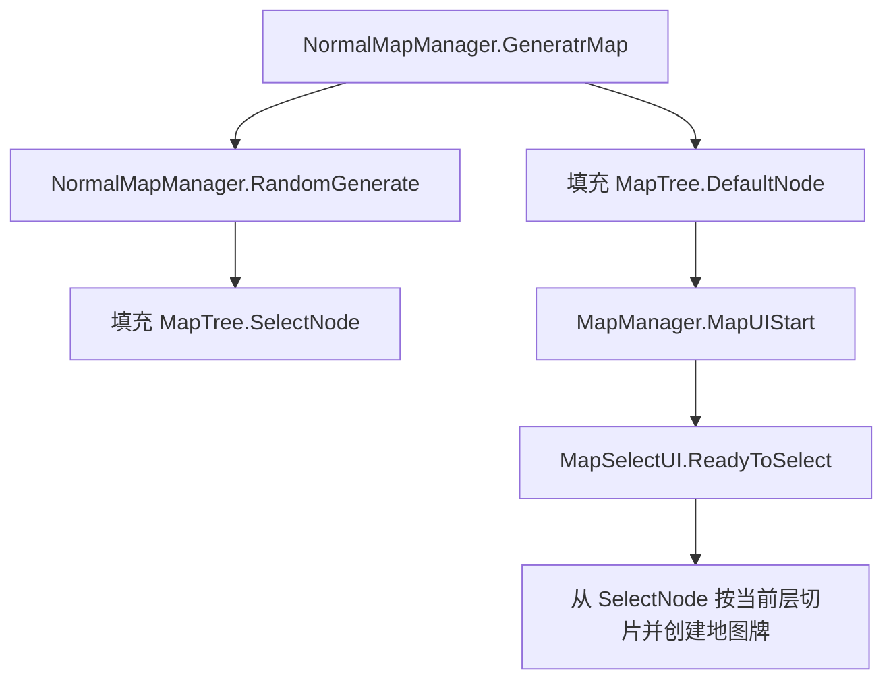
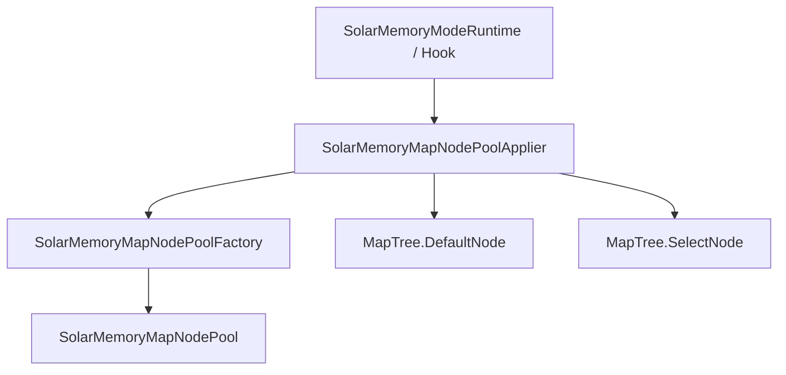
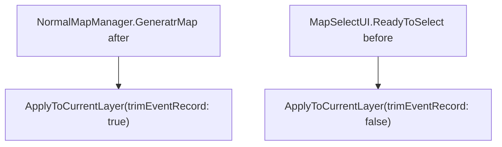
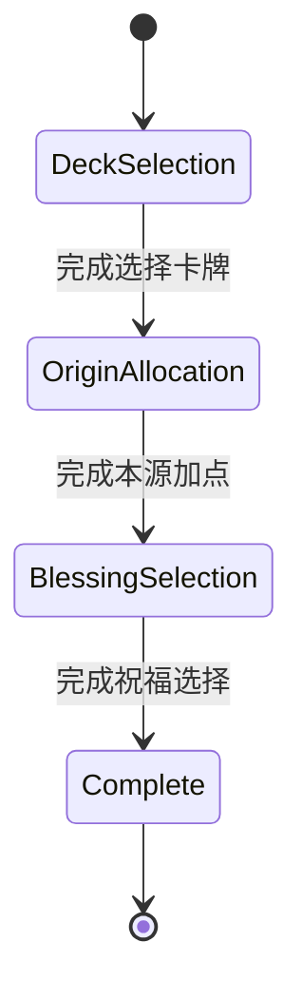
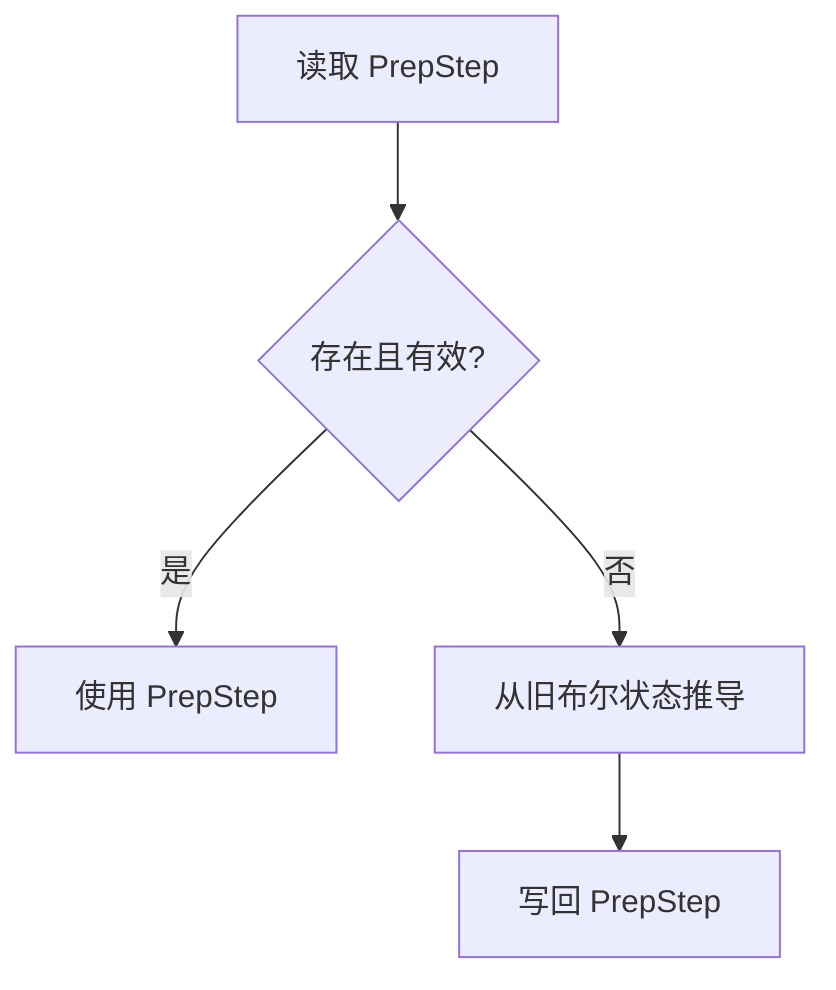
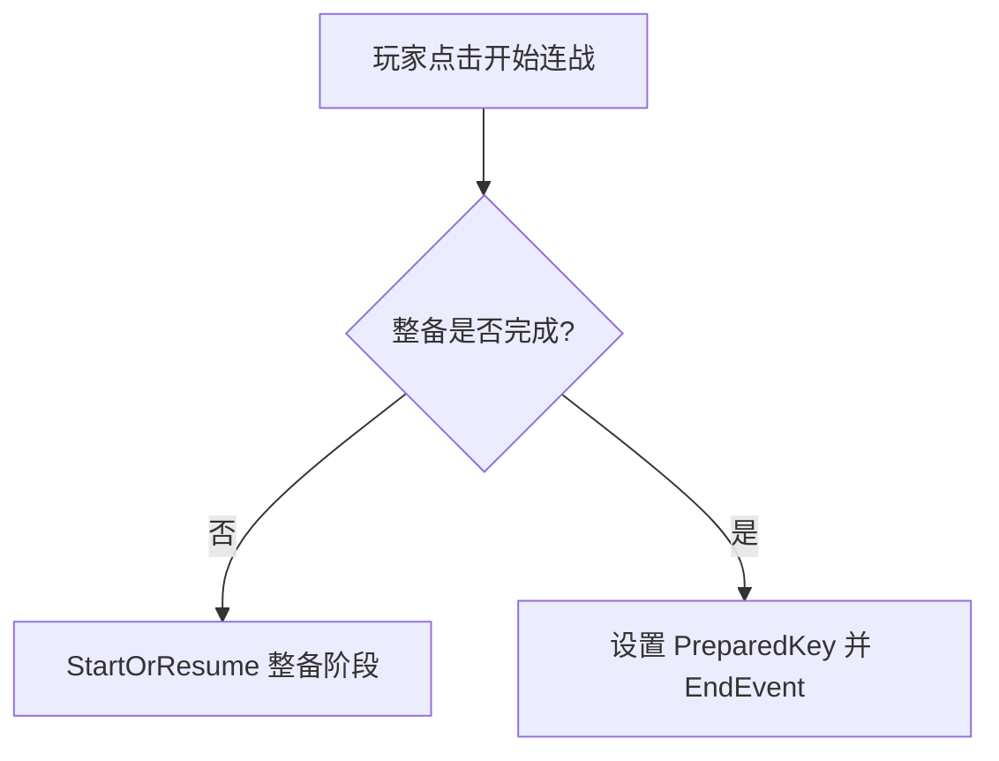

# Solar Memory 地图节点池与整备阶段设计

本文档定义 Solar Memory 后续修改中两个核心模块的目标设计：

- 地图节点池：负责生成并应用 Solar Memory 的地图节点结构。
- 整备阶段：负责进入地图流程前的固定步骤编排。

本文不讨论卡牌奖励池、备用牌池、事件牌过滤、数值平衡或入口存档创建方式。

## 背景

当前 Solar Memory 已经通过 Hook 方式接入原生普通模式流程。模式入口创建 Solar Memory 存档后，后续仍复用 `NormalMapManager`、`MapTree` 和 `MapSelectUI`。

当前地图节点相关逻辑集中在 `SolarMemoryModeRuntime`：

- `NormalMapManager.GeneratrMap` 后重写地图。
- `MapSelectUI.ReadyToSelect` 前再次确保地图状态。
- `MapManager` 同步地图数组前修正 Solar Memory 事件节点。
- `NormalMapManager.ReadyToChangeMap` 后检查是否到达最终层并进入结算。

当前整备相关逻辑分散在：

- `SolarMemoryStarterDeckRuntime`：负责初始卡牌选择 UI，并在完成后启动后续设置流程。
- `SolarMemorySetupFlowRuntime`：负责本源加点与祝福选择。
- `EventScripts`：负责事件选项进入整备 UI 或开始 Boss 连战。

这套实现能运行，但两个领域的边界还不够清晰：

- 地图节点池目前是若干重写函数，而不是一个可替换、可测试的生成模块。
- 整备阶段目前是若干布尔标记串接，不是一个显式阶段模型。

## 目标

1. 将 Solar Memory 的地图节点生成收束为独立工厂。
2. 让工厂输出完整的本层节点池，再由应用器写入 `MapTree`。
3. 将整备阶段抽象为轻量状态机。
4. 让整备阶段的每个步骤具有明确的进入、完成和跳转语义。
5. 保留对现有存档布尔状态的兼容。
6. 保持当前入口形式不变：点击 Solar Memory 后仍可直接创建 Solar Memory 存档并进入游戏入口流程。

## 非目标

- 不改造通用备战界面。
- 不讨论卡牌奖励池、事件牌过滤或备用牌池清理。
- 不重写原生 `NormalMapManager.RandomGenerate` 的完整算法。
- 不依赖跳过原生方法执行的 Hook 能力。
- 不在本阶段调整 Solar Memory 的剧情事件文本或卡包文本。

## 地图节点池设计

### 原生流程约束

反编译流程显示，普通模式地图生成大致为：



`MapSelectUI.ReadyToSelect` 不负责生成节点，只消费 `MapTree.SelectNode`。因此 Solar Memory 的可控边界应放在 `MapTree` 层面：在原生生成后，将当前层的 `DefaultNode` 与 `SelectNode` 层段替换成 Solar Memory 需要的节点池。

当前 Hook 能力以 before/after 为主。设计上不假设可以取消原方法或直接替换返回值。因此工厂不负责阻止原生生成，只负责生成目标节点池；应用器负责在安全时机覆盖原生生成结果。

### 模块拆分

建议新增：

- `SunExp-Dev/Mechanics/SolarMemoryMapNodePoolFactory.cs`
- `SunExp-Dev/Mechanics/SolarMemoryMapNodePool.cs`
- `SunExp-Dev/Hooks/SolarMemoryMapNodePoolRuntime.cs` 或保留 Hook 在 `SolarMemoryModeRuntime` 中调用应用器。

推荐职责如下：



`SolarMemoryMapNodePoolFactory`：

- 根据 `NormalMapManager.Level` 计算 Solar Memory 当前层。
- 生成当前层默认路径节点。
- 生成当前层可选地图节点。
- 创建固定剧情事件节点。
- 创建 Boss 连战节点。
- 不直接操作 UI。

`SolarMemoryMapNodePool`：

- 保存本层生成结果。
- 包含 `DefaultNodes` 与 `SelectNodes`。
- 可包含调试元数据，例如 `Layer`、`SourceLevel`、`StoryEventIds`。

`SolarMemoryMapNodePoolApplier`：

- 计算 `MapTree.DefaultNode` 当前层段起点。
- 计算 `MapTree.SelectNode` 当前层段起点。
- 将工厂结果覆盖到对应层段。
- 处理节点数量不足、Break 节点、当前层越界等防御逻辑。
- 返回是否发生变更。

### 建议接口

```csharp
public sealed class SolarMemoryMapNodePool
{
    public int Layer { get; }
    public IReadOnlyList<MapTree.Node> DefaultNodes { get; }
    public IReadOnlyList<MapTree.Node> SelectNodes { get; }
}
```

```csharp
public static class SolarMemoryMapNodePoolFactory
{
    public static SolarMemoryMapNodePool GenerateLayer(NormalMapManager manager, MapTree tree);
}
```

```csharp
public static class SolarMemoryMapNodePoolApplier
{
    public static bool ApplyToCurrentLayer(NormalMapManager manager, string source, bool trimEventRecord);
}
```

### 节点池结构

当前 Solar Memory 以三层为上限，每层安排两个固定剧情事件：

- 层开端事件：放入默认路径开端位置，并同步到必要的地图显示。
- 层中段事件：放入可选节点的固定槽位。

推荐把结构声明为常量或配置数组：

```csharp
public readonly record struct SolarMemoryLayerNodeSpec(
    int Layer,
    int OpeningStorySlot,
    int MidStorySlot,
    IReadOnlyList<string> StoryEventIds);
```

现阶段可以继续使用：

- opening slot: `0`
- mid-layer slot: `3`
- max layer: `3`

但这些数值应由工厂读取统一定义，而不是散在多个重写函数中。

### 生成规则

每层节点池生成规则：

1. 计算当前层：`manager.Level / 6` 后钳制到 Solar Memory 层范围内。
2. 生成默认路径层段：
   - 第一个节点为本层 opening story event。
   - 其余默认路径节点为 Boss 节点。
3. 生成可选节点层段：
   - 指定 mid slot 为本层 mid story event。
   - 其他非 Break 节点为 Boss 节点。
   - Break 节点保留或按应用器策略跳过。
4. 返回 `SolarMemoryMapNodePool`。

### 应用时机

保留两个应用时机：



`GeneratrMap after` 是主应用点。  
`ReadyToSelect before` 是防御点，用于 UI 消费前确保 `MapTree` 未被其他流程改坏。

如果原生生成期间消耗了普通事件记录，仍需保留事件记录修正逻辑。该逻辑不属于工厂，可作为应用器后处理。

### 同步修正

地图节点池工厂只负责生成 `MapTree.Node`。多人/网络同步数组修正仍应独立保留：

- 只修正 Solar Memory 固定事件节点。
- 不全局改写普通事件节点。
- 以期望的 map id 与 event id 数组为准。

后续可将同步修正从 `SolarMemoryModeRuntime` 拆到：

`SolarMemoryMapSelectionSyncRepair`

但这不是第一阶段必须项。

## 整备阶段设计

### 阶段定义

整备阶段是 Solar Memory 的固定前置阶段。它发生在 RoleTable 初始化后、正式进入 Boss 连战/地图推进前。

当前已存在的步骤：

1. 选择卡牌
2. 本源加点
3. 选择祝福

本文只定义步骤编排与状态转换，不定义卡牌候选池或备用牌池策略。

### 状态机模型

建议新增主状态：

```csharp
SunExp_SolarMemoryPrepStep
```

建议枚举：

```csharp
public enum SolarMemoryPrepStep
{
    None,
    DeckSelection,
    OriginAllocation,
    BlessingSelection,
    Complete
}
```

状态转换：



### 控制器

建议新增：

`SunExp-Dev/Hooks/SolarMemoryPreparationRuntime.cs`

它是整备阶段唯一的流程控制入口。

建议接口：

```csharp
public static class SolarMemoryPreparationRuntime
{
    public static void StartOrResume();
    public static void CompleteDeckSelection();
    public static void CompleteOriginAllocation();
    public static void CompleteBlessingSelection();
    public static bool IsComplete();
}
```

控制器职责：

- 读取当前 `PrepStep`。
- 若没有 `PrepStep`，从旧布尔状态推导。
- 打开当前 step 对应 UI。
- 在 step 完成后推进到下一 step。
- 在完成全部 step 后写入 `SolarMemorySetupFinishedKey = "1"`。
- 避免多个整备 UI 同时打开。

### Step Handler

第一版可以用 `switch` 实现，不必引入完整 OO State Pattern。

如果后续步骤变多，再升级为 Handler 注册表：

```csharp
public interface ISolarMemoryPrepStepHandler
{
    SolarMemoryPrepStep Step { get; }
    bool IsComplete();
    void Enter();
    SolarMemoryPrepStep NextStep { get; }
}
```

推荐第一版轻量实现：

```csharp
private static void EnterStep(SolarMemoryPrepStep step)
{
    switch (step)
    {
        case SolarMemoryPrepStep.DeckSelection:
            SolarMemoryStarterDeckRuntime.OpenOrResume();
            return;
        case SolarMemoryPrepStep.OriginAllocation:
            SolarMemorySetupFlowRuntime.OpenOriginSetupWindow();
            return;
        case SolarMemoryPrepStep.BlessingSelection:
            SolarMemoryBlessingPickerRuntime.Open(CompleteBlessingSelection);
            return;
        case SolarMemoryPrepStep.Complete:
            FinishPreparation();
            return;
    }
}
```

### 兼容旧状态

现有存档已经使用布尔状态：

- `SolarMemoryDeckConfiguredKey`
- `SolarMemoryStarterDeckAppliedKey`
- `SolarMemoryOriginConfiguredKey`
- `SolarMemoryBlessConfiguredKey`
- `SolarMemorySetupFinishedKey`

新增 `PrepStep` 后不能直接废弃旧 key。读取流程建议：



推导规则：

- `SetupFinished == 1`：`Complete`
- `BlessConfigured == 1`：`Complete`
- `OriginConfigured == 1`：`BlessingSelection`
- `DeckConfigured == 1` 或 `StarterDeckApplied == 1`：`OriginAllocation`
- 否则：`DeckSelection`

旧 key 在第一阶段继续写入，用于兼容现有测试与旧逻辑。

### 步骤职责

#### DeckSelection

职责：

- 打开选择卡牌 UI。
- 允许玩家完成初始卡牌配置。
- 完成后调用 `SolarMemoryPreparationRuntime.CompleteDeckSelection()`。

不在本文中定义：

- 卡牌候选池如何生成。
- 是否清理备用牌池。
- 是否过滤事件牌。

#### OriginAllocation

职责：

- 打开本源加点 UI。
- 校验所有可分配点数已分配。
- 应用本源点数变化。
- 完成后调用 `SolarMemoryPreparationRuntime.CompleteOriginAllocation()`。

当前 `ConfirmOriginSetup()` 中直接打开祝福步骤的行为应改为通知准备控制器。

#### BlessingSelection

职责：

- 打开祝福选择 UI。
- 校验配额选择完成。
- 发放祝福。
- 完成后调用 `SolarMemoryPreparationRuntime.CompleteBlessingSelection()`。

当前祝福选择完成后直接 `FinishSetup()` 的行为应改为通知准备控制器。

#### Complete

职责：

- 写入 `SolarMemorySetupFinishedKey = "1"`。
- 关闭整备 UI。
- 允许事件选项开始 Boss 连战或继续地图流程。

### 事件脚本接入

事件脚本不应直接判断复杂步骤状态。建议提供稳定入口：

```csharp
public static void OpenSolarMemoryPreparation()
{
    SolarMemoryPreparationRuntime.StartOrResume();
}
```

`StartSolarMemoryBossRush()` 建议变为：



这样事件选项的职责更清楚：它只请求开始连战，是否允许继续由整备阶段控制。

## 推荐实施顺序

1. 新增 `SolarMemoryMapNodePoolFactory` 与 `SolarMemoryMapNodePool`。
2. 新增 `SolarMemoryMapNodePoolApplier`，迁移当前 `RewriteSolarMemoryDefaultLayer`、`RewriteSolarMemorySelectLayer`、`CreateSolarMemoryEventNode`、`CreateBossChainNode` 的语义。
3. 让现有 Hook 调用应用器，保持行为不变。
4. 新增 `SolarMemoryPrepStepKey` 与 `SolarMemoryPrepStep`。
5. 新增 `SolarMemoryPreparationRuntime.StartOrResume()` 与旧状态推导。
6. 将 `SolarMemoryStarterDeckRuntime` 完成回调改为通知准备控制器。
7. 将本源确认、祝福确认改为通知准备控制器。
8. 调整事件脚本：开始连战前检查整备是否完成。
9. 更新测试脚本，验证新模块存在、Hook 调用新模块、旧 key 兼容仍然存在。

## 验证点

地图节点池验证：

- Solar Memory run 下，`GeneratrMap after` 会调用节点池应用器。
- `ReadyToSelect before` 会再次调用节点池应用器。
- 每层 opening slot 是固定 Solar Memory 剧情事件。
- 每层 mid slot 是固定 Solar Memory 剧情事件。
- 非剧情槽位生成 Boss 节点。
- 同步修正仍只修正 Solar Memory 固定事件节点。
- 到达 `SolarMemoryMaxLayer * 6` 后仍进入结算。

整备阶段验证：

- 新存档默认进入 `DeckSelection`。
- 选择卡牌完成后进入 `OriginAllocation`。
- 本源加点完成后进入 `BlessingSelection`。
- 祝福选择完成后进入 `Complete`。
- 旧存档可从布尔 key 推导当前 step。
- 未完成整备时点击开始连战会打开当前缺失步骤。
- 完成整备后点击开始连战才设置 `PreparedKey` 并结束事件。

## 风险与注意事项

- 原生 `RandomGenerate` 仍可能消耗普通事件记录，因此事件记录修正逻辑不能随工厂迁移而删除。
- `MapSelectUI.ReadyToSelect` 读取 `SelectNode` 时按当前层切片，节点池应用器必须严格保持层段长度与索引。
- 多人同步修正与节点池生成不是同一职责，避免把网络数组修正塞进工厂。
- 整备状态迁移要兼容旧布尔 key，否则旧存档可能卡在已完成步骤。
- 第一版状态机应保持轻量，避免为了未来扩展引入过重抽象。
