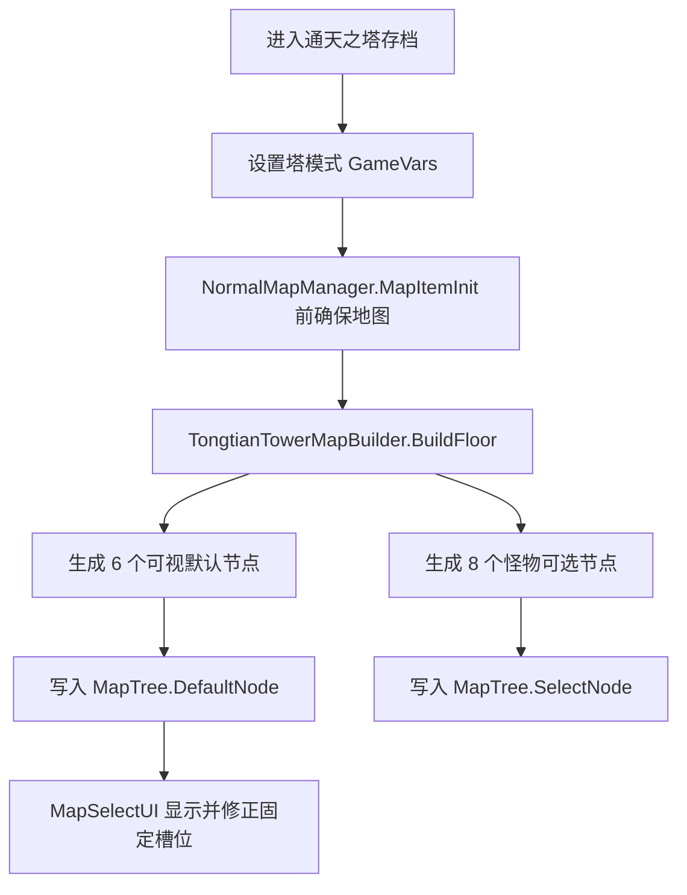

# 通天之塔：玩法介绍、机制与数值文档

本文档用于审阅当前已实现的“通天之塔”模式。它描述实际落地机制、关键数值、可调整参数与后续设计空位。

## 玩法定位

通天之塔是一个基于普通模式流程接入的无限爬塔模式。玩家从模式选择页进入后，会创建带有专属标记的普通模式存档；运行期间通过独立地图生成器持续生成下一层，并在到达本层终点后推进塔层。

设计目标：

- 提供无上限推进的地图循环。
- 移除“世界推演”地图层数与布局写死限制。
- 只提供怪物、首领、建筑三类节点，不生成事件节点。
- 每层固定一个首领节点，固定一个建筑节点，其余为怪物节点。
- 通过敌人 HP 成长、奖励卡增量和奖励卡默认焚毁，维持长期推进压力与卡组供给。

非目标：

- 当前不提供事件节点。
- 当前不提供通天塔专属剧情结算。
- 当前不改造原生卡牌奖励候选池，只在奖励选择阶段追加模式限制词条。
- 当前不接入官方“限制使用次数”型诅咒炼金词条；已落地策略为原生 `Burnout`。

## 入口与存档

入口位于模式选择界面中“日耀回忆”之后，排序值为 `110`。入口复用原生 `SublimationMode` 模板，并通过共享的模式入口布局系统追加到现有入口之后。

进入模式时创建普通模式存档：

- `modeType = "Normal"`。
- `SunExp_TongtianTowerMode = "1"`：标记当前存档为通天之塔。
- `SunExp_TongtianTowerFloor = "1"`：当前塔层从第 1 层开始。
- `SunExp_TongtianTowerGeneratedFloor = "0"`：记录已生成地图的塔层。
- `SunExp_TongtianTowerSeed = seed`：保存本次运行种子。
- `ExLockDes = "4"`：打开六个可视地图槽位。
- `ExDeleteDes = "0"`：不删除额外地图槽位。
- 保留当前难度词条选择：`HardTags = SunExpHardTagRuntime.SelectedRuntimeHardTags()`。

多人边界：

- 只有房主可以开始通天之塔运行。
- 客户端只做本地展示和同步修复，不推进共享塔层。

## 地图结构

每层通天之塔使用 6 个可视槽位：

| 可视槽位 | UI 位置 | 节点类型 |
| --- | --- | --- |
| 0 | `Start` | 怪物 |
| 1 | `Node1` | 建筑或怪物 |
| 2 | `Node2` | 建筑或怪物 |
| 3 | `Node3` | 建筑或怪物 |
| 4 | `Node4` | 建筑或怪物 |
| 5 | `End` | 首领 |

建筑槽位按塔层循环：

```text
buildingSlot = 1 + ((floor - 1) % 4)
```

因此建筑位置循环为：

| 塔层 | 建筑槽位 |
| --- | --- |
| 1 | 1 |
| 2 | 2 |
| 3 | 3 |
| 4 | 4 |
| 5 | 1 |
| 6 | 2 |

每层还生成 8 个可选节点，全部为怪物节点，用于原生地图选择流程消费。

### 独立地图生成

通天之塔不调用原生世界推演地图生成器，也不调用 `TypeGenerate`。当前实现由 `TongtianTowerMapBuilder` 直接生成当前层所需的 `MapTree.DefaultNode` 和 `MapTree.SelectNode`。

地图构建流程：



为了适配原生 `DefaultNode` 的内部顺序，通天之塔维护一层视觉槽位到原生顺序的映射：

| 原生 `DefaultNode` index | 对应可视槽位 |
| --- | --- |
| 0 | 0 |
| 1 | 5 |
| 2 | 4 |
| 3 | 3 |
| 4 | 2 |
| 5 | 1 |

运行时读取和修复地图时都通过该映射还原可视槽位，避免 UI 位置与节点数据错位。

### 原生生成器抑制

每次构建或确认地图时，通天之塔会：

- 强制保存 `ExLockDes = 4` 和 `ExDeleteDes = 0`。
- 确保 `MapTree.hasUsed` 包含 `0`，使原生生成器不再把第 0 段当作未使用层段重新生成。
- 在原生 `NormalMapManager.GeneratrMap` 后再次修复通天塔地图状态。

这不是跳过原生流程，而是在安全 Hook 点把原生结果修正为通天塔目标结构。

### 固定槽位修复

首领槽位和建筑槽位是每层的固定槽位。地图 UI 和网络同步过程中，这两个槽位会被反复校验：

- 如果 UI 中节点数据与通天塔默认节点不一致，替换为通天塔节点。
- 如果 `maps` / `mapData` 同步数组中固定槽位被随机候选覆盖，改回通天塔首领或建筑节点。
- 建筑节点使用建筑卡背景贴图。
- 地图标题显示为：`通天之塔 第X层`。

## 节点池

通天之塔节点池独立封装在 `TongtianTowerNodePoolService`。节点池本身不自带静态数据，而是从游戏主体的 `DataType.Map` 表筛选数据，便于后续接入自定义节点池。

### 通用过滤

所有节点类型都会先经过通用可用性过滤：

- `Id` 和 `NodeId` 必须存在。
- 排除 `Id` 或 `NodeId` 以 `*` 开头的隐藏行。
- 排除 `Id` 或 `NodeId` 包含 `Breaks` 的断点行。
- 排除 `Rarity = 7` 的特殊行。
- 排除 `Type = Event` 的事件行。
- 排除 `Note = 普通事件` 的事件行。
- 排除当前游戏运行时仍处于锁定状态的行。

### 楼层解锁

地图行的 `Level` 字段会按塔层分段解锁：

```text
unlockedTier = min(4, max(0, (floor - 1) / 3))
```

| 塔层 | 解锁 tier |
| --- | --- |
| 1-3 | 0 |
| 4-6 | 1 |
| 7-9 | 2 |
| 10-12 | 3 |
| 13+ | 4 |

当地图行 `Level < 0` 时视为无楼层限制。

### 类型筛选

怪物节点：

- `Type = Fight`。
- 不是首领。
- `Note` 为空、`普通` 或 `精英`。

首领节点：

- `Type = Fight`。
- `Note = 首领`；或
- 对应 `Level` 表的 `Note` 包含 `boss` / `首领`；或
- `NodeId` 包含 `boss`。

建筑节点：

- `Type = Build`；或
- `Note = 建筑`。

### 抽取规则

怪物与首领节点使用 `RandomPool` 和当前 `MapTree.treedice` 抽取。若抽取失败，则按 `Id` 排序取第一个候选。

建筑节点不随机抽取，而是按 `Id`、`NodeId` 排序后按楼层循环：

```text
buildingRowIndex = (floor - 1) % buildingCandidates.Count
```

如果某类节点没有候选，会回退到 `map_0` 兜底节点，并在节点元数据中标记来源为 `fallback`。

## 无限层推进

通天塔层数和原生地图层数分离：

- 通天塔层数：`SunExp_TongtianTowerFloor`。
- 原生地图层数：`MapManager.Instance.Level` / `NormalMapManager.Level`。

当原生层数达到 6 时，运行时在 `NormalMapManager.ReadyToChangeMap` 前执行推进：

1. 房主将 `SunExp_TongtianTowerFloor` 加 1。
2. 将 `SunExp_TongtianTowerGeneratedFloor` 重置为 `0`。
3. 将原生 `MapManager` 层数重置为 `0`。
4. 强制生成下一层通天塔地图。

这样可以规避原生普通模式地图的层数上限，并持续复用 6 槽位地图结构。

## 战斗成长

当前通天塔只调整敌方 HP，不改敌方伤害、行动、奖励或玩家属性。

触发时机：

- `Enemy.Init` 后。
- 仅在通天塔存档中生效。
- 每个敌人每层只缩放一次，通过动态变量 `SunExpTongtianTowerHpScaledFloor` 防止重复缩放。

HP 倍率公式：

```text
hpMultiplier(floor) =
    min(
        20,
        1
        + 0.12 * max(0, floor - 1)
        + 0.03 * max(0, floor - 10)
    )
```

示例：

| 塔层 | HP 倍率 |
| --- | --- |
| 1 | 1.00 |
| 2 | 1.12 |
| 5 | 1.48 |
| 10 | 2.08 |
| 20 | 3.58 |
| 50 | 8.08 |
| 100 | 15.58 |
| 130+ | 20.00 |

缩放方式：

- `MaxHp` 和 `CurHp` 同步缩放。
- 使用 `Math.Round` 四舍五入。
- 当前 HP 不超过缩放后的最大 HP。
- 同步刷新 `FightManager.statusData` 中的 `StatusDataTransfer`。

## 战斗奖励与卡组运营

通天塔战斗奖励会在原生奖励生成后额外追加随机卡牌奖励。追加逻辑通过通用 `BattleRewardAdjustmentService` 注册规则，避免同一个奖励 UI 重复追加。

额外卡牌奖励数量：

```text
extraCardCount = min(4, 1 + ((floor - 1) / 8))
```

| 塔层 | 额外卡牌奖励 |
| --- | --- |
| 1-8 | +1 |
| 9-16 | +2 |
| 17-24 | +3 |
| 25+ | +4 |

追加方式：

- 调用原生 `BattleRewardsUI.RandomSetCard()`。
- 仅在当前奖励确认为战斗奖励时生效。
- 遗物、建筑、非战斗奖励不受该规则影响。

### 默认限制词条

为了防止无限卡组运营失控，通天塔模式下的奖励卡选择会默认添加原生 `Burnout` 标签。

处理点：

1. `CardChoiceItem.Initialize` 后：读取候选卡的 `DataConfig`，添加 `Burnout`，并刷新候选卡展示。
2. `CardChoiceUI.Select` 前：在卡牌进入玩家未装备牌列表之前再次添加 `Burnout` 兜底。

这意味着：

- 通天塔中通过奖励选择进入卡组的卡牌默认具有焚毁限制。
- 普通模式、日耀回忆和其他非通天塔模式不受影响。
- 当前所有奖励选牌都会被处理，包括原生奖励卡和通天塔追加的额外奖励卡。

后续可选方案：

- 保持全量 `Burnout`，让每场战斗奖励更多卡牌来补充消耗。
- 改为概率性 `Burnout`，降低运营压力。
- 引入官方“限制使用次数”型词条，与 `Burnout` 按权重随机。
- 按楼层提高限制强度，例如高层强制 `Burnout`，低层仅部分卡牌限制。

## 数值总表

| 参数 | 当前值 | 说明 |
| --- | --- | --- |
| 模式入口排序 | `110` | 位于日耀回忆之后 |
| 存档模式类型 | `Normal` | 复用普通模式流程 |
| 每层可视节点数 | `6` | `Start` + `Node1-4` + `End` |
| 每层可选节点数 | `8` | 全部为怪物节点 |
| 首领槽位 | `5` | 固定为 `End` |
| 建筑槽位 | `1 + ((floor - 1) % 4)` | 在 `Node1-4` 循环 |
| 楼层解锁跨度 | 每 3 层提升 1 tier | 最高 tier 4 |
| 敌方 HP 早期成长 | `+12% / 层` | 从第 2 层开始 |
| 敌方 HP 额外后期成长 | 第 11 层起 `+3% / 层` | 与早期成长叠加 |
| 敌方 HP 倍率上限 | `20x` | 约第 130 层达到 |
| 额外卡牌奖励 | `+1` 到 `+4` | 每 8 层提升 1，25 层后封顶 |
| 奖励卡限制 | `Burnout` | 奖励选牌默认焚毁 |
| 事件节点 | `0` | 节点池主动排除事件 |

## 审阅重点

建议优先审阅这些问题：

1. HP 成长是否太平滑：当前第 10 层约 2.08 倍，第 50 层约 8.08 倍。
2. 额外奖励卡是否足够支撑全量 `Burnout`：当前第 1 层起即 +1，25 层后 +4。
3. 建筑节点是否应该固定不可点，还是仅固定出现但允许玩家选择。
4. 建筑循环是否按位置循环即可，还是需要按建筑种类池强制轮换。
5. 楼层解锁是否应该每 3 层提升，还是更快进入高等级怪物池。
6. 是否需要额外缩放首领强度，而不是只按普通敌人 HP 统一缩放。
7. 是否要加入通天塔专属掉落、遗物或阶段性里程碑奖励。
8. 是否要把 `Burnout` 改为“焚毁 / 限制使用次数”混合词条池。

## 主要实现文件

| 文件 | 职责 |
| --- | --- |
| `SunExp-Dev/Infrastructure/SunExpIds.cs` | 通天塔模式标记、标题、常量、节点元数据键 |
| `SunExp-Dev/Hooks/TongtianTowerModeEntryRuntime.cs` | 模式选择入口注册与展示 |
| `SunExp-Dev/Hooks/TongtianTowerRunLauncher.cs` | 通天塔存档创建与启动 |
| `SunExp-Dev/Hooks/TongtianTowerModeRuntime.cs` | 地图 Hook、层推进、UI 修复、同步修复 |
| `SunExp-Dev/Mechanics/TongtianTowerMapBuilder.cs` | 独立地图构建与默认节点映射 |
| `SunExp-Dev/Mechanics/TongtianTowerNodePoolService.cs` | 怪物、首领、建筑节点池筛选与抽取 |
| `SunExp-Dev/Hooks/TongtianTowerCombatRuntime.cs` | 敌方 HP 成长 |
| `SunExp-Dev/Hooks/TongtianTowerRewardRuntime.cs` | 额外卡牌奖励 |
| `SunExp-Dev/Hooks/TongtianTowerCardAffixRuntime.cs` | 奖励卡默认焚毁限制 |
| `SunExp-Dev/GameApi/BattleRewardApi.cs` | 原生奖励 UI 的安全追加封装 |
| `SunExp-Dev/Hooks/ModeChoiceLayoutRuntime.cs` | 模式入口追加与横向拖拽区域扩展 |

## 验证方式

推荐验证链：

```powershell
powershell -ExecutionPolicy Bypass -File tools\Build-SunExpDll.ps1
powershell -ExecutionPolicy Bypass -File tools\Test-SunExpArchitecture.ps1
powershell -ExecutionPolicy Bypass -File tools\Test-SunExpCSharp.ps1
powershell -ExecutionPolicy Bypass -File .codex\skills\sunexp-mod-dev\scripts\validate-sunexp.ps1
```

本轮实现已通过：

- C# DLL 构建：0 warnings / 0 errors。
- 架构断言：通过。
- C# source assertions：183 项通过。
- SunExp 数据/资源校验：`cards=51, relics=13, buffs=27, packs=5, enemies=3, warnings=0`。
