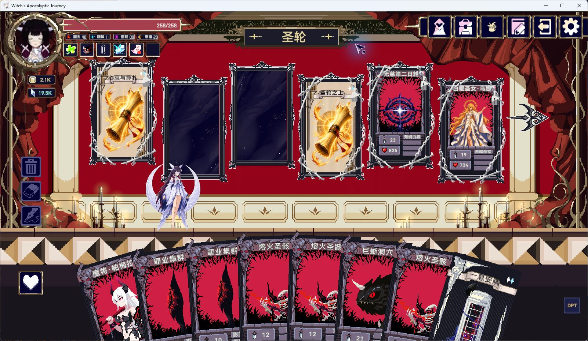

# 2026-09-20 新版游戏适配与日耀回忆验收

已适配游戏 **v1.1.25405741**；发布版本为 **Terrias 0.6.1 / AuraToolsExp 0.12.1**。
两个产品已通过统一发布事务安装到实际游戏目录。

## 日耀回忆的实际故障路径

使用更新后的 Steam 游戏和原有日耀回忆存档，恢复哥伦比娅在第二层末尾的进度：

1. 进入「白曜圣庭」，固定首领白曜镜阵正常显示。
2. 通过实际出牌击败首领，执行原生战斗结束和战利品确认。
3. 第三层「圣轮」成功初始化。「心哀与挣扎」「圣轮之上」、
   「无慈第二日轮」「白曜圣女·乌娜」均显示正常。
4. 日志 `AuraTools-20260920-130211.log` 中没有 Unity/Error、Command/Error 或数组越界。
   13:08:50 的帧调度记录确认地图动画临时覆盖的恢复任务已执行。
5. 退出游戏后恢复了原冒险存档、另一份暂存的普通存档和精灵全局档案，
   并核对恢复后的哈希。测试新建的存档只保留在外部验收备份目录。

这次修复纠正了资源能力检查：共享缓存能适配读取的 MOD Texture，
不能被当成原生 MapItem 所需 Texture2D 的读取能力。修复保留节点、剧情、
战斗动画与原存档身份，详见 [根因与兼容性记录](compatibility-review.md)。

## 自动验证与安装

27 组发布检查全部通过，随后 DLL 打包检查和完整安装哈希校验通过。
发布事务：`29a51256e40d465ca2a41995358b4a60`，实际更新 18 个安装文件。

- 完整反编译：253 个程序集、253 个项目、28,010 个 C# 文件。
- 全程序集 API 比较：没有删除的公开接口，233 项新增候选。
- Terrias：918 项断言；AuraTools：2,259 项断言；自定义卡牌：709 项断言。
- 原生地图加载回归：在新版加载器上重现两名第三层首领的旧越界路径，
  并验证构建产物的检查结果不再误判。
- 新版开场动画 detour：25 项断言，包含真实宿主方法的安装和卸载。
- Unity：96 张界面检查画面、32 项原生界面/资源适配测试；实际 XLua 13 项用例。
- 内容、资源、分层、共享 ABI、网络接收与恢复、发布中断恢复检查均通过。

证据：[发布验证](release-validation.json)、
[安装核验](deployment-verification.json)、
[验收清理](acceptance-cleanup.json)。

双端联机实机、第三层之后的完整终局、所有新增 CG 在游戏内逐个播放未执行；
本次实际游戏验证覆盖了原日志对应的旧存档、第二层首领结算和第三层地图显示。

## 资源与美餐 CG

已把完整新版资源导出替换到 `D:/MNRS`，17 张本体立绘同步至
`D:/Project/Apocalypic-journey-mods-creator/Mod的素材参考/角色立绘`。
8,525 张导出的 PNG 均通过结构检查。旧资源、旧立绘和测试前后存档保存在
`D:/MNRS_work/25405741`，没有删除旧资源备份。

通过内置 ImageGen 工具生成 8 张 CG。工具未提供模型选择接口，因此没有将
它们标记为某个不可核实的模型版本。输出均已检查、复制入库并完成资源注册：

| 角色 | 最终图片 |
| --- | --- |
| 权天使 可可 | AuraToolsExp/SharedResources/CG/Feast/Roles/career_10/feast_cg.png |
| 启明天使 卡洛琳 | AuraToolsExp/SharedResources/CG/Feast/Roles/career_11/feast_cg.png |
| 混沌天使 厄米娅 | AuraToolsExp/SharedResources/CG/Feast/Roles/career_12/feast_cg.png |
| 赛琳妮 | AuraToolsExp/SharedResources/CG/Feast/Roles/career_14/feast_cg.png |
| 境界旅人 露 | AuraToolsExp/SharedResources/CG/Feast/Roles/career_15/feast_cg.png |
| 墨丝汀 | AuraToolsExp/SharedResources/CG/Feast/Roles/career_16/feast_cg.png |
| 闪耀偶像 阿米莉娅 | AuraToolsExp/SharedResources/CG/Feast/Roles/career_17/feast_cg.png |
| 极限突破 厄米娅 | AuraToolsExp/SharedResources/CG/Feast/Roles/career_18/feast_cg.png |

现在 16 张独立美餐图片覆盖本体全部 18 个职业形态；两组共用立绘的形态使用
明确的资源别名，原有角色 MOD 的 CG 保持独立。
[完整提示词与图片哈希](feast-cg-prompts.json)、
[官方角色快照](official-roles.json)、
[导出与备份记录](asset-export-report.json)。
