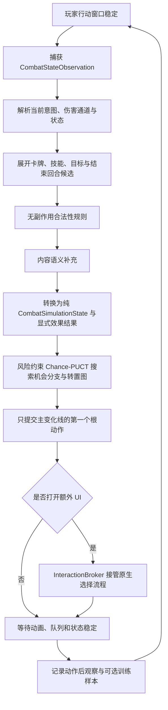

# 当前基线与系统架构

## 代码边界

| 层 | 主要目录 | 职责 |
| --- | --- | --- |
| 通用决策层 | `AuraDecisionShared/` | 决策图、条件比较、效用向量、候选排序、多选规划、残差模型接口 |
| 战斗共享层 | `AuraCombatAiShared/` | 战斗观察、动作、目标、语义、合法性、交互事务、训练样本和扩展注册 |
| 宿主适配层 | `AuraCombatAiShared/GameApi/` | 将 Witch 的 FightUI、DeckUI、卡牌、技能和 StatusManager 转为共享协议 |
| 工具控制层 | `AuraToolsExp-Dev/Features/AutoBattle/` | 设置生效、战斗按钮、单动作控制循环、影子预测标记、超时和训练样本落盘 |
| 内容扩展层 | `Terrias-Dev/` 等内容 MOD | 注册内容语义、纯合法性规则和复杂交互提示 |
| 交付层 | `AuraToolsExp/`、`Terrias/`、`SanGuoShaExp/` | 游戏实际加载的 DLL、配置和资源 |

AuraToolsExp 和 Terrias 是共享层的平级消费者。AuraToolsExp 不得调用 Terrias 内部实现；Terrias 也不得把 AuraToolsExp 当作运行基础。

## 运行流程

控制器不是逐帧连续出牌器。它维持“观察、选择、提交一个动作、等待结算、重新观察”的事务边界。

## 硬约束

1. 候选检查不得调用 `CommonCardItem.TryUse`。该方法会移除手牌、扣费和触发事件。
2. 最终动作只能调用一次原生 `TrueUse` 或结束回合按钮。
3. 定向动作只在最终提交时写入目标。
4. DeckUI/FightUI 选择必须经过原生按钮或原生选择入口，不能直接调用业务回调。
5. 自动战斗关闭时，已经打开的必选界面应交还玩家，不能强制关闭。
6. 未识别的自定义 UI 不做坐标点击；只能等待、降权、停止或交还玩家。
7. 学习模型不能改变硬合法性结果，也不能直接持有 Unity 或 Witch 对象。
8. 运行时一次最多展开 64 个普通候选；组合动作必须有独立预算。

## 当前支持

| 能力 | 状态 | 说明 |
| --- | --- | --- |
| 普通卡牌 | 已实现 | 费用、不可用标签和基础行动窗口预检 |
| 定向攻击卡 | 已实现 | 为每个存活敌方目标展开候选 |
| 无目标技能 | 已实现 | `BaseScript=CommonCardItem` |
| 目标技能 | 已实现 | 敌方目标与自身目标候选 |
| 结束回合 | 已实现 | 没有正收益合法动作时回退 |
| DeckUI 单选/多选 | 已实现 | 通过原生 ButtonManager 提交 |
| FightUI 手牌选择 | 已实现 | 通过原生选择状态与确认按钮提交 |
| 随机结果 | 已实现基础策略 | 不预测随机内部结果，结算后重新观察 |
| 排序、滑条、拖放、文本输入 | 未实现 | 必须交还玩家 |
| 联机远端角色控制 | 禁止 | 只允许本地 FightUI 的本地行动窗口 |

## 当前复杂流程

| 流程 | 接入方式 | 选择偏好 |
| --- | --- | --- |
| Amelia 主动技能及普通 PackToDeckAction | 通用 DeckUI 适配 | 选择估值较高的候选 |
| Terrias 选择手牌焚毁 | `BurnCards` 交互提示 | 选择估值较低的候选 |
| 洛奈尔指引选择 | `Guidance` 交互提示 | 选择估值较高的候选 |
| 晨星换位 | `ChooseCards/Hand` 提示 | 优先保留并强化高价值牌 |

## 配置基线

`AuraToolsExp/Config/MatchExperienceSettings.json` 的自动战斗配置包含：

- `enabled`：是否在战斗中提供自动战斗按钮；
- `startActive`：进入战斗时是否立即接管；
- `profile`：`balanced`、`aggressive`、`defensive`；
- `decisionIntervalMs`：动作结算后的最小决策间隔；
- `actionTimeoutSeconds`：非结束回合动作的等待超时；
- `unknownActionPolicy`：`conservative`、`allow`、`handoff`；
- `captureTrainingSamples`：是否写入训练样本。
- `searchSimulationBudget`：单次决策的搜索模拟预算，默认 `1536`；
- `searchNodeBudget`：单次决策允许保留的搜索节点上限，默认 `8192`；
- `searchMaxPly`：单条模拟最多动作层数，默认 `16`；
- `trainingMode`：`auto`、`shadow`、`hybrid`；
- `showPredictionMarkers`：是否显示黄光动作和红/绿目标预测标记；
- `trainedModelMode`：`off`、`shadow`、`active`，控制已导入模型的运行方式；
- `training`：训练预设以及轮数、学习率、L2、最大修正、最低偏好对和类别最低样本。

## 已知限制

- 语义估值目前主要读取配置数字、脚本关键字和内容 MOD 注册信息，不能理解任意脚本文本。
- 当前可以读取公开的当前意图和基础意图池规模，但任意 MOD 私有脚本仍需内容方注册精确威胁语义。
- 当前搜索显式处理已注册的随机动作结果，并对本回合与敌方当前威胁做叶评估；未知抽牌、完整牌堆概率和跨回合隐状态仍需内容方提供效果结果。
- v3 即时奖励已区分有效/溢出护盾，但仍需离线折扣回报和终局结果代表长期价值。
- 当前测试机没有进行游戏内烟雾测试，因此按钮布局、动画时序和实际复杂 UI 仍是待验证项。
