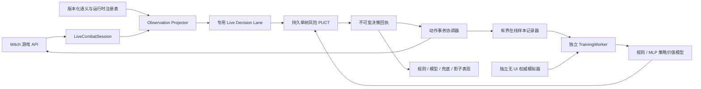

# 系统架构

## 目标

自动战斗 AI 在不读取隐藏随机结果、不绕过游戏合法性、不阻塞 Unity 主线程的前提下，完成战斗观测、候选生成、模型搜索、事务执行、训练采集和离线评估。规则底模始终存在，但在模型应用模式下只承担技术故障时的可用性兜底，不参与覆盖正常模型决策。

## 数据流

## 模块职责

### `AuraCombatAiShared`

- 定义公开观测、动作、威胁、决策和训练合同。
- 生成并评分合法候选。
- 运行 `CombatRiskAwareRootSamplingPuctPlanner`。
- 提供前向模型、风险统计、预算策略和策略价值网络。
- 不依赖 Unity UI，不直接写 MOD 配置。

### `AuraCombatSimulationShared`

- 运行确定种子、可并行、可复现的无 UI 战斗。
- 管理场景、战役、旅程、规则集和模拟结果。
- 对终局一致性、权威覆盖和状态哈希负责。

### `AuraToolsExp-Dev/Features/AutoBattle`

- `AuraToolsLiveCombatSession` 是一场战斗的唯一在线状态机，负责采集、提交、执行、结算和终局。
- 动态观测与静态语义分离：知识/注册表在变更时发布快照，卡牌脚本估值按配置身份和内容修订缓存；每次决策只准备一份独占状态。
- `CombatLiveDecisionLane` 使用独立命名线程和持久 worker；执行请求优先，影子/预测/教师请求是可丢弃机会任务。
- 默认只运行一棵 PUCT 树；arena 在同一 worker 内复用，战斗终局主动收缩。
- 动作事务只经原生卡牌/技能事务路由和公开状态确认，不对敌人调用全局协程停止。
- 表现层只消费决策回执，明确显示规则、模型、技术兜底或影子模型来源。
- 游戏进程只记录有界样本和加载已发布模型；训练、进化和大规模模拟只能在独立 `TrainingWorker` 中运行。

### `AuraFoundationTrainer.Worker`

- 校验规则集和原生程序包。
- 执行权威快检、课程自博弈、训练、竞技场和最终验证。
- 原子写入进度、结果和可恢复检查点。
- 用明确完成类型区分预检、晋级、拒绝、取消和失败。

## 决策路径

1. 观测适配器形成玩家可知的 `CombatStateObservation`。
2. 候选生成器只输出当前可执行动作。
3. 规则评分器生成可解释的基础效用，残差模型只做有限修正。
4. 支配规则移除严格劣势动作，但不能依据未知结果剪枝。
5. 动态预算策略按强制动作、分支数、Boss、循环风险和质量档分配搜索量。
6. 根节点为每次模拟抽取隐藏随机假设，树内复用该假设。
7. 根动作按生存约束和统一风险效用排序。
8. 动作事务再次验证会话、序列、目标、费用和交互窗口，然后提交。
9. 结算探测先检查轻量 UI 门，再按递增退避采集完整状态；不会随帧率重复构造快照。
10. `BattleFinalized` 是训练终局边界：权威胜负补齐最后轨迹回报、封口 episode 并释放会话内存；未执行候选不会被伪造为结果标签。

## 运行模式

- `off`：关闭模型应用；玩家界面通过关闭“自动战斗”进入此状态。
- `shadow`：影子评估。模型参与预测和评估，不改变实际动作。
- `trial`：实机试用。由玩家在当前战斗手动开启接管，完整保留模型策略。
- `full`：完整应用。允许进入战斗时自动接管，完整保留模型策略。

`shadow` 的标记和日志展示模型自己的提案，并以“影子模型”注明来源；它不接管动作。`trial/full` 中，策略价值网络拥有动作选择权：规则分、支配规则、低置信度、质量认证、死亡风险偏好和未知动作策略不得替换其可执行提案。游戏机制合法性、公开信息边界、动作绑定与事务执行校验仍是硬边界。模型加载失败、推理异常或硬截止时，运行时临时切到技术兜底；动作结算、交互或 UI 问题直接停止/交还玩家，不计作模型能力故障。

## 配置原则

生产配置只暴露 `searchQuality`。具体模拟数、节点数和深度由 `CombatSearchBudgetPolicy` 根据上下文决定。测试可构造 `SearchBudgetMode = "fixed"` 的内部 profile，以获得确定的单元测试预算，但固定预算不是用户配置面。
