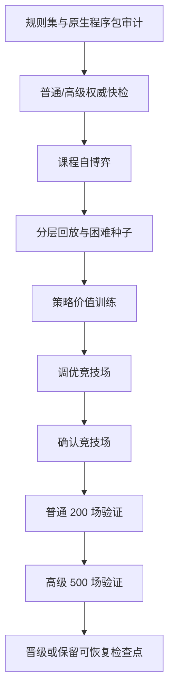

# 权威模拟与底模训练

## 无 UI 模拟

`AuraCombatSimulation.Cli` 和共享模拟器使用相同规则集、前向模型和策略接口。CLI 当前搜索策略名为 `risk-puct`：

```powershell
powershell -ExecutionPolicy Bypass -File tools/Run-AuraCombatSimulation.ps1 `
  -Ruleset docs/AuraCombatAI/examples/simulation-ruleset.example.json `
  -Scenario docs/AuraCombatAI/examples/simulation-scenario.example.json `
  -Count 100 -Parallel 8 -Policy risk-puct
```

批量模拟按种子排序合并。改变并行度不得改变单局状态哈希、终局或结果顺序。

## 底模训练流程



课程训练按难度、战斗深度、失败簇和终局结果分层。模型 minibatch 进一步按难度、旅程阶段、胜负和关键决策 frame 分层，并将稀有层权重限制在安全上限内。困难遭遇失败时，可从同一 checkpoint、同一世界种子运行零探索规则教师反事实分支；该分支仍须通过权威模拟和完整性校验。`hard-encounter-counterfactual-v2` 只接纳教师胜利或达到显著伤害增益的分支，后者使用 0.35 样本权重；无增益失败只记入诊断，不进入 replay。训练、竞技场、调优和最终验证的种子区间必须互不重叠。

终局信用采用 `terminal-credit-v2`：失败遭遇保留强负标签，之前已经获胜的遭遇按离失败距离衰减终局惩罚，避免将整轮旅程统一污染成负样本。奖励残差同时覆盖卡牌、遗物和祝福；人工配置偏置与学习残差分别限幅。

`foundation-stagnation-v1` 在最近两轮困难反事实求解率低于 5% 时，将困难样本占比限制到 12%，并让连续无恢复的 seed 进入冷却。已有 Champion 后连续三个候选被拒时停止继续生成同类候选，直接使用 Champion 进入能力探针和隔离验证。

## 成功案例库

`success-case-archive-worker-v2` 由 .NET 8 Worker 独占加载、兼容性校验、迁移和写入。net472 游戏宿主只传递案例库根目录和回放配额，不再枚举案例文件。

- v2 使用 16 字符兼容键目录和 24 字符案例文件名，完整哈希仍保存在 JSON 内并在读取时校验；
- Worker 同时读取旧 `v1/<完整兼容键>/.../<完整案例 ID>.json`；
- 合法 v1 文件会复制到 v2，旧文件不会删除；
- 加载诊断分别报告 v1/v2 文件数、迁移数、拒绝原因、路径访问失败和最大观察路径长度；
- `Loaded=0` 且存在被拒文件时不得报告“compatible archive loaded”。

## Worker 协议

Worker schema 为 7。结果的 `CompletionKind` 只能表示当前实际完成语义：

| `CompletionKind` | 含义 | 检查点 |
|---|---|---|
| `preflight-passed` | 仅快检并通过 | 不保留 |
| `preflight-failed` | 仅快检但失败 | 不保留 |
| `training-accepted` | 完成训练并晋级 | 删除 |
| `training-rejected-resumable` | 完成训练但未过门禁 | 保留 |
| `training-rejected` | 未过门禁且无有效恢复点 | 不宣称可恢复 |
| `cancelled-resumable` | 取消且检查点完整 | 保留 |
| `cancelled` | 取消且无恢复点 | 不保留 |
| `failed-resumable` | 异常且检查点完整 | 保留 |
| `failed` | 异常且无恢复点 | 不保留 |

`Resumable` 只有在训练任务且 checkpoint JSON 与 episode JSONL 同时存在时才为真。预检不会制造训练检查点。

## 检查点

当前文件：

- `foundation-training-checkpoint-v7.json`
- `foundation-training-checkpoint-episodes-v7.jsonl`
- `foundation-training-episodes-v3.jsonl`

检查点包含：

- 请求指纹；
- 规则集和原生程序包哈希；
- 训练/验证战役哈希；
- 当前协议、特征编码和网络维度；
- 课程位置、困难种子和回放；
- frame 分层、终局信用与困难遭遇反事实协议；
- 案例库中 expert cases 与 observations 的独立加载计数、拒绝计数和兼容键；
- Champion、工作模型和模型优化器状态；
- 进度遥测。

任一清单项不相等就拒绝恢复，不尝试转换。

## 资源与主线程

- Worker 以隐藏、无 shell、重定向输出的独立进程运行。
- CPU 并行度受配置和处理器数共同限制。
- Worker 以原子替换写进度与结果。
- 游戏主线程只轮询进度并应用最终状态。
- 取消先写取消标记；超过宽限时间才终止进程。
- 训练失败或取消不能把不完整 replay 当作正式训练产物。
