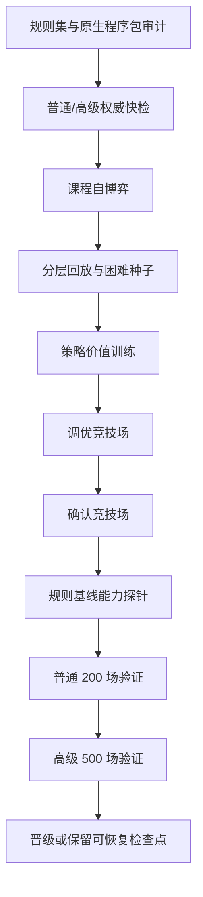

# 权威模拟与底模训练

## 无 UI 模拟

`AuraCombatSimulation.Cli` 和共享模拟器使用相同规则集、前向模型和策略接口。CLI 当前搜索策略名为 `risk-puct`：

```powershell
powershell -ExecutionPolicy Bypass -File tools/Run-AuraCombatSimulation.ps1 `
  -Ruleset docs/AuraCombatAI/examples/simulation-ruleset.example.json `
  -Scenario docs/AuraCombatAI/examples/simulation-scenario.example.json `
  -Count 100 -Parallel 8 -Policy risk-puct
```

批量模拟按种子排序合并。改变并行度不得改变单局状态哈希、终局或结果顺序。

## 底模训练流程



课程训练按难度、战斗深度、失败簇和终局结果分层。模型 minibatch 进一步按难度、旅程阶段、胜负和关键决策 frame 分层，并将稀有层权重限制在安全上限内。困难遭遇失败时，可从同一 checkpoint、同一世界种子运行零探索规则教师反事实分支；该分支仍须通过权威模拟和完整性校验。`hard-encounter-counterfactual-v2` 只接纳教师胜利或达到显著伤害增益的分支，后者使用 0.35 样本权重；无增益失败只记入诊断，不进入 replay。训练、竞技场、调优和最终验证的种子区间必须互不重叠。

训练生产和回放都保留 40% Advanced 下限；单个 Episode 默认均匀抽取最多
96 个 frame，防止长开局战斗淹没中后期决策。内容层通过
`hardEncounterWeights` 配置关键遭遇配额。当前将 97% 的困难种子预算分给
`level_10011`、`level_10040`、`level_10004`、`level_10001`、
`level_10009`、`level_10006` 和其余早中期遭遇，仅保留 3% 给最终 Boss，
避免已经稳定通过的终局挤占前段薄弱遭遇。共享训练器不硬编码具体关卡 ID。

反事实结果会把困难种子标为 `action-solvable`、`action-sensitive`、
`build-limited-provisional`、`build-limited` 或 `unknown`。连续两次反事实
无胜利、无显著改善的种子降为构筑受限，并退出战斗策略困难种子调度；
已有两次训练失败但反事实证据尚不完整时先标为 provisional，避免继续把动作
学习预算浪费在战前构筑问题上。

权威教师审计使用当前动作因果链上的 `DamageDealt`、`BlockGained`、
`Healed`、`CardDrawn`、`CardCreated`、`EnergyChanged` 和直接生命赋值事件，不再使用整张状态的净差。
审计分为固有效果和有效结果两层：先按 `SourceActionId`、卡牌实例和触发来源
隔离卡牌自身事件；原生 `on-use` handler 只要 `SourceRewardId` 与当前卡牌
定义一致，仍归入卡牌固有效果，其他遗物、状态和奖励触发归入上下文效果。随后
再对伤害吸收、过量伤害、感知/攻防倍率、治疗上限和状态层数上限作上下文归一化。静态摘要保留为来源漂移诊断；精确分支从动作归因事件生成已实现语义，写回训练观测后再接受选中动作门禁。生成到手牌的卡牌按“生成”而非“抽牌”计数，直接设定生命值用 `VariableChanged(Hp)` 保留可审计归因。结果分别记录候选动作和最终执行动作失配率，并输出
按来源的审计分母、`来源×类型` 失配率、可解释差异分类及最多 32 个复现样本。
报告中的 `unexplained` 才表示尚未解释的投影错误；`absorbed-by-block`、
`overkill-clamped`、`status-cap-or-no-op` 和 `trigger-side-effect` 不再混入
错误率。

已实现语义中的伤害、格挡和治疗均为结算后数值。`ProjectEffective` 识别该来源后直接使用，不得重复套用力量、感知、攻防或治疗倍率；零伤害语义也不得因固定伤害属性被凭空投影为正伤害。

Advanced 专家回放不足时不会把 Normal 冒充为 Advanced；Advanced 缺口会按比例提高下一轮
Advanced 训练下限，最高 60%。Normal 配额始终独立装满，并可用未重复的 Normal 成功案例利用
Advanced 缺口留下的空余容量，避免少量 Advanced 样本反向切断已经形成的普通难度知识。
正式隔离验证前先运行同种子规则基线能力探针：
Champion 必须在 Normal/Advanced 均不回归，并达到配置的胜场或平均战斗深度
增益，否则直接保留可恢复检查点并跳过昂贵验证。

最终验收同时执行结束回合行为门槛。模拟器逐回合记录已执行动作、已消耗魔能、
回合初敌方生命、空回合、未用魔能结束和连续无进展回合。没有明确回合末遗物/
BUFF 收益时，只要仍存在安全且可支付的卡牌或技能，结束回合就记为严重判断失误；
正式隔离验证对此零容忍，胜率达标也不得发布底模。

交互动作使用 `action-contract-v2` 区分游戏入口和策略入口；后置条件优先按同一 `SourceActionId` 下的卡牌实例事件验证，原生程序未产生细粒度事件时使用动作执行前后的原子快照核对同一实例从抽牌堆进入手牌。两种路径都不依赖区域净数量，允许动作同时生成、抽取或移动其他卡牌：

- `GameInvocable` 表示游戏是否允许调用；
- `PolicyEligible` 表示动作是否允许进入模型和 PUCT 候选；
- 前置条件失败可以忠实返回 `NoEffect`，但不得伪造冷却、抽牌或其他战斗状态变化；
- 无效果调用只写入本回合控制器失败记忆，搜索状态哈希必须包含该记忆；
- 已知必然无效果的动作在策略评分前硬过滤，有限权重惩罚只作为未知失败后的辅助信号。

正式隔离验证要求无效果动作、重复无效果动作、已知必然无效果动作和交互契约
失败全部为 0。模型特征协议自此为 v24，训练语义为
`nana-doom-heal-stable-transform-terminal-snapshot-v12`；旧底模和旧语义检查点不参与兼容迁移，必须重新训练。
奈奈的【厄运吞噬】使用显式目标范围，同时支持自身、友方和敌方；策略观察必须包含目标类别、负面状态稀有度与层数、预计厄运收益和敌方净化损失。
【灾厄化身】区分首次变身与已变身后重复使用，显式投影形态、属性快照和行动后群体伤害；形态切换本身不改变当前战斗的生命上限。
专家回放分别报告 Normal/Advanced 的目标与缺口；普通样本可以利用剩余总容量，但不会改变 Advanced 的计数或验收结论。要求基线增益时，普通、高阶或总胜场任一已观测退化都不得以“证据不足”继续通过能力门禁。

`王族律令` 使用权威整手转化语义：按当前灵魂层数选择黑耀棋子档位，逐实例保留手牌位置并清除旧强化/变量；策略侧分别衡量诅咒清理收益、高价值与循环引擎损失、衍生牌烧尽后的续航风险、灵魂成长和下一档阈值机会。该技能本身不伪装成即时伤害，前向模型先替换整手牌，再在新的公开行动窗口继续规划。

奈奈的永久最大生命加成由 `buff_DoomPower` 自身负责。每次层数发生一次变动，原生脚本只执行一次 `ChangeMaxHp(变动后的总层数)`；例如从 10 层一次增加到 15 层，本次获得 15 点最大生命，而不是补齐 `11 + 12 + 13 + 14 + 15`。因此累计加成取决于历次层数变动，不能仅由最终层数还原。跨战斗恢复时，已持久化层数与重建的 BUFF 层数相同则对账为 0；新的吞噬事件会同步增加相同数值的当前生命，并把最大生命增量通过通用战役进度接口写入 `PersistentVariableDeltas["MaxHp"]`。Shared 不识别奈奈或内容 ID。形态切换只替换当前角色形态及其技能/冷却，不改写已经进入战斗状态的当前生命或最大生命。

奈奈的角色专属策略通过通用 `ICombatRoleStrategyProvider` 注入，Shared 只声明协议和特征前缀，具体角色、技能、BUFF 与卡牌 ID 全部留在 AuraToolsExp。策略状态机分为“铺设、吞噬、爆发准备、化身爆发、生存接管”五个阶段。吞噬用永久生命收益、清除收益、敌方负面状态未来价值和五回合冷却共同计算净值；确定且同回合可执行的负面状态铺设优先于吞噬，随机铺设只施加软惩罚。对敌吞噬默认要求至少两类负面状态，或目标已经能在本回合死亡，避免为了单层成长替敌方免费净化。

【灾厄化身】直接按当前且保持不变的 `MaxHp` 计算每次行动对全体敌人造成的 `floor(MaxHp / 50)` 伤害，并统计当前魔能真正可支付的后续动作数、厄运属性快照价值以及下一档被动阈值。除已经处于化身状态时重复变身属于硬禁止外，吞噬机会、跨回合蓄力和成长目标只形成条件分数，不再把有潜在斩杀价值的首次变身一律排除。

训练报告中的 `journey-final-max-hp.*` 与 `journey-final-doom.*` 来自每次完整训练冒险结束时记录的 CampaignObservation，而不是从采样后的回放中猜测“最后一场”。报告同时按 Normal/Advanced 与胜利/失败拆分均值；局部困难遭遇不会被误计为完整冒险终局。

噩梦原型的 `blessing_40` 作为玩家已持有祝福进入公开观测。策略按动作实际产生的负面 `AddBuff` 事件数逐次计算 20% 额外一层的期望，不把一次增加多层误算成多次触发；同时计算额外一层是否跨过吞噬贡献公式 `min(max(1, rarity * level / 5), 10)` 的整数阈值。该收益是铺设动作的增量协同分，不替代卡牌本身的伤害、控制和生存价值。

训练 worker 在创建隔离决策引擎时会冻结当前的语义、角色策略与预检规则快照。启动探针必须在该冻结快照中观察到奈奈的权威吞噬语义和阶段约束；正式回放还要求奈奈帧的角色策略覆盖率为 100%，否则训练不得验收。

【终曲】只有在同一回合存在可支付、可执行的自我厄运吞噬，且当前没有毒素、终曲不会结束回合时，才获得“安全续接证书”。证书允许它越过通用终曲高风险门禁；缺少证书时仍按可能切断牌组、无法回收诅咒的高风险动作处理。该证书是动作窗口内的权威事实，不是模型可以自行伪造的分数。

结束回合不再只按“本回合是否还有可支付动作”判断，而是统一计算反事实收益：

- 区分超过魔能上限且可带入下回合的结余，以及结束回合会过期的魔能；
- 计算非保留手牌进入弃牌堆后的回流延迟，并区分推测、可达和已认证循环；
- 按“回合末 BUFF -> 敌方意图 -> 回合初 BUFF”的顺序投影生命、护盾、魔能和抽牌；
- 有正收益动作、可避免致死或已认证循环时，结束回合属于硬禁止候选；
- 被支配的结束回合仍写入训练动作集合，但目标概率强制为 0，形成明确反事实负样本；
- 生命周期信息无法完整解释时采用保守不确定判定，不把未知结算虚构成安全收益。

正式隔离验证对“被支配结束回合”“进入可避免致死”“放弃已认证循环”均为
零容忍；携带超上限魔能和未知生命周期只作为诊断指标，不直接制造假阳性。

前向模型按游戏主体的真实回合边界处理结束回合：先结算玩家回合末事件和
弃牌/保留，再承受当前敌方行动；进入下一玩家行动窗前清除全体普通护盾、补足
基础魔能并抽牌，同时以保守概率投影下一轮敌方意图。下一轮威胁不得再被清空为
零；未知敌人、BUFF、遗物和意图使用默认保守投影，而不是制造“结束回合后无风险”
的虚假叶节点。

当前 Worker 以 40% 作为专家回放的 Advanced 配额；为复用稀缺但完整的困难胜利
旅程，每个成功 run 最多抽取 16 个 Episode。配额不足时记录 Advanced 缺口并提高新一轮
Advanced 自博弈下限；Normal 保持自己的目标配额，并可利用总容量的剩余位置，但不会被统计成 Advanced。

终局信用采用 `terminal-credit-v2`：失败遭遇保留强负标签，之前已经获胜的遭遇按离失败距离衰减终局惩罚，避免将整轮旅程统一污染成负样本。奖励残差同时覆盖卡牌、遗物和祝福；人工配置偏置与学习残差分别限幅。

`foundation-stagnation-v1` 只在 Advanced 竞技场已经达到验收线后，才允许在最近
两轮困难反事实求解率低于 5% 时把困难样本占比限制到 12%；未达到目标前始终
保留配置的困难种子预算。形式 Champion 与工作模型分离：当 Advanced 尚未达标，
候选必须在该难度取得严格胜率增益，不能只靠 Normal 或总体深度晋级；达标后仍
执行逐难度不回归门禁。只有连续课程回归才触发停滞终止。

## 成功案例库

`success-case-archive-worker-v4` 由 .NET 8 Worker 独占加载、兼容性校验和写入。专家目录仅保存指向 `c/` 中规范成功案例的小型引用，不再复制整份 episode；net472 游戏宿主只传递案例库根目录和回放配额，不枚举案例文件。

- v3 使用 16 字符兼容键目录和 24 字符案例文件名，完整哈希仍保存在 JSON 内并在读取时校验；
- 兼容键覆盖规则集、完整战役指纹、原生程序包、训练策略、搜索策略、特征协议和资源循环语义；
- Worker 在应用奖励残差前冻结兼容键，后续观察与成功案例始终写回该目录，避免学习后的奖励权重改变战役指纹并把案例分流到不可复用目录；
- Worker 只读取当前 v3，不迁移或保留旧案例；
- 加载诊断报告当前文件数、拒绝原因、路径访问失败和最大观察路径长度；
- `Loaded=0` 且存在被拒文件时不得报告“compatible archive loaded”。

## 游戏参数快照

游戏参数与训练参数彼此独立。每次任务冻结一个角色与使魔预设，内容包括角色技能及冷却、角色初始状态、使魔固有祝福、已开启奖励卡包和牌组数量倾向。`cardpack_1`、`cardpack_2` 始终开启，`cardpack_13` 不进入普通奖励选择；空 `PackBelong` 按 `cardpack_1` 处理。

第 0 场战斗的开局牌组取自权威 campaign，不由卡包开关改写。战役获得的卡先进入储备区；每层结束后，构筑器可在全部已拥有卡牌间不限次数调整活动牌组，使其尽量落在预设区间，同时保留后续永久删牌、转化等冒险效果。区间是构筑倾向，不是奖励获取上限。

角色技能和使魔固有祝福都参与战斗与策略完成度，但分别标记为 `SkillOnly` 和 `FamiliarInnate`，不得混入普通奖励池。卡包过滤完成后，候选牌仍按原稀有度与权重抽取；同一奖励面板不重复，跨遭遇仍允许重复获得。

角色、使魔、卡包集合、牌组倾向和固定开局牌组共同进入游戏参数指纹、案例指纹、检查点和外部模型包兼容键。关闭卡包后不可获得的组件不能为循环或无限组合提供完成度。

独立训练控制台使用 `witch-game-subjects-v1.catalog.json` 提供本体角色、使魔与离线卡包目录，并在自己的 `controller-settings.json` 中持久化完整、已解析的游戏主体预设。控制台启动任务时把同一预设快照同时应用到训练与验证 campaign；切换角色、使魔、卡包或牌组倾向会改变 `GameParameterHash`，旧检查点和上一轮 Champion 不得跨主体继续使用。

检查点续训与模型导入采用不同边界。检查点仍要求训练主体和冻结语义完全一致；外部底模导入只验证工件协议、网络维度、内部元数据一致性以及正式训练验收，不再要求当前游戏角色、使魔、卡包、战役哈希或 Worker 二进制哈希完全相同。Worker 哈希只作为来源信息展示。

模型包保存训练主体与声明覆盖清单，包括角色、使魔、已开启卡包、角色技能、使魔祝福、初始牌组、敌人、状态、遗物和祝福。运行时按集合覆盖关系评估：

- 训练卡包是当前卡包的超集时视为完全覆盖，多开的训练卡包不会阻止模型用于较小卡池；
- 当前游戏存在训练范围外的卡包或实体时视为部分覆盖，不拒绝导入；
- 角色不同时，通用卡牌仍使用模型，角色技能的学习评分归零并交给默认规则 AI；
- 未覆盖卡牌的学习评分归零；未覆盖敌人、状态、遗物和祝福的身份特征不进入模型输入，但游戏权威合法性、脚本效果和默认规则评估仍照常执行；
- 当一个决策窗口中所有可执行动作都未覆盖时，整个窗口使用默认 AI。

当前只接受 `foundation-model-package-v3.json`。包必须显式携带覆盖清单、`ContentSetHash` 与 `OwnerModSetHash`；旧包不做隐式补全，必须使用当前 Worker 重新训练导出。

## Transformer 世界模型教师

独立训练器可在每轮分层 Replay 固定后启动离线 `aura.combat-transformer-world-model.v2`。默认模型为标准 6 层 Encoder、`hidden=384`、8 heads、`FFN=1536`，约处于 10M 至 20M 参数区间。每个样本同时输入：

- 公开对象 Token：角色、使魔、敌人、意图、Buff、手牌实例、牌堆信念、遗物、难度、资源、延迟效果和类型化动作；
- 同一 Episode 内的历史公开状态与已执行动作；
- 兼容 MLP Champion 的分区状态向量和全部合法候选。

模型联合学习搜索 Policy、长期 Value、辅助策略阶段、执行动作后的下一公开状态、胜负/死亡/剩余生命/剩余回合 Outcome 和 Terminal。卡牌与技能动作保留不同 lifecycle；对象编码器即使达到普通 Token 上限，也不得截断当前合法动作、手牌实例、存活单位、资源和关键延迟效果。

当前世界模型处于 Training/Shadow：它输出逐候选软概率并以最多 0.75 的权重混入原搜索目标，游戏内 Champion 仍是 MLP + 权威前向模型 PUCT。训练/验证按 Episode 隔离；必须同时通过“策略交叉熵不劣于均匀基线”和世界模型 Dynamics/Outcome 门禁才应用蒸馏。脚本缺失、PyTorch 不可用、CUDA 请求不成立或任一质量门禁失败时，本轮明确记录报告并回退到原搜索监督，不中断基础训练。

CPU 机器初始化：

```powershell
powershell -NoProfile -ExecutionPolicy Bypass `
  -File tools/Setup-AuraTransformerTeacher.ps1 -Backend cpu
```

CUDA 机器使用 `-Backend cuda`，必要时通过 `-TorchIndexUrl` 指定与驱动匹配的官方
Wheel 源。`Python 可执行程序=auto` 是默认值，不等于直接调用 PATH 中的 `python`。
运行时解析器会实际导入 PyTorch 与 NumPy，并按“显式路径、`AURA_TRANSFORMER_PYTHON`、
`%LOCALAPPDATA%\AuraTF\cuda|cpu`、工程 `.venv`/`venv`、PATH”顺序探测；`backend=auto`
优先选择探测成功的 CUDA 环境，否则选择 CPU，`backend=cuda` 不允许静默降级。控制中心
显示解析来源、绝对路径、Python/PyTorch 版本与设备，启动前再次验证，因而界面中的
`auto` 始终保留用户的自动意图，不能提前改写成某台机器的路径。

教师执行计划把“有效 Batch”与“设备 Microbatch”分开。前者决定一次优化器更新的训练
语义，后者只决定显存/内存中的切片大小；切片梯度按样本数加权累积后只执行一次
optimizer step。`CPU 线程`、`CPU interop 线程`、`Microbatch`、`DataLoader workers` 为 0
时自动计算，显式正数则严格覆盖自动值。CPU 会用真实前后向计算校准线程候选并缓存；
CUDA 会从完整 Batch 开始，OOM 时逐级减半 Microbatch，并按设备能力启用 BF16 或 FP16。
Pinned memory 只在 CUDA 路径启用，CPU 不创建无收益的数据搬运线程。

数据集在每轮开始时只张量化一次，历史序列也预先转换；随后按对象数、动作数和历史长度
分桶组批，避免每个 epoch 重建张量并减少 padding。CUDA 可启用预取、少量 DataLoader
worker、non-blocking copy 和混合精度；CPU 默认在主训练进程组批，避免 DataLoader
多进程与 PyTorch 算子线程相互争抢。教师自动计划保存在成功案例库的
`transformer-runtime-auto-tune-v1.json`，键包含 OS、CPU、PyTorch、设备、模型尺寸和
有效 Batch；同一 Worker 进程还复用 Python 运行时探测结果，不会每个 epoch/iteration
重复启动解释器探测。

每轮产物保存在结果目录的 `transformer-teacher/iteration-XX/`，文件名使用
`world-model-*-v2`，包括对象数据集、模型、标注和报告。报告同时记录请求值与有效值、
自动计划/缓存命中、数据准备与校准时间、训练 frames/s、数值精度和峰值设备内存，不能
只用任务管理器的瞬时 CPU 百分比判断训练效率。

教师不再在每轮从随机权重重新训练。`EnableWarmStart` 默认开启，后续轮次从上一轮
`world-model-v2.pt` 恢复相同结构的权重；纯 CPU 默认每 2 轮刷新一次，中间轮只用已有
权重评估当前 Replay 并重新生成标注，刷新轮执行 4 个增量 Epoch，最后一轮执行 12 个
最终 Epoch。CUDA 仍可每轮执行增量训练，因为模型计算不再与战役模拟争用同一组 CPU
核心。首次训练、结构不兼容和最终训练都不会伪装成“复用完成”，报告必须分别记录
`WarmStarted`、`TrainingRefreshed`、`RequestedEpochs` 和 `ResumeModelPath`。

教师子进程通过 `AURA_TEACHER_PROGRESS` 行协议持续上报读取、张量化、校准、训练、评估、
标注和保存阶段，并报告真实 Python 进程 CPU、工作集、Epoch、Frames/s 与阶段 ETA。
控制中心在该阶段不再展示已经停止变化的 C# campaign/GC 指标，也不再把轮次显示为
`0/N`。加载大数据集时进度条可以保持在 0，但阶段、子进程资源和心跳必须继续变化；
这表示数据读取/张量化，而不是 UI 或 Worker 死锁。

训练热点探针使用 `foundation-performance-probe-v1`。Worker 对 setup、preflight、
auto-tune、capability-probe、self-play、replay-selection、transformer-teacher、
model-training、tuning、arena-screening、arena-confirmation 和 validation 分别记录墙钟时间、
Worker CPU 时间、托管分配字节、实际峰值并发工作数与参与线程数。Python 教师的 CPU 时间
作为 external-process CPU 单独回填到 transformer-teacher，避免把最昂贵阶段误判为
“Worker CPU 很低”；同时记录子进程峰值工作集，并把 loading、preparing、calibrating、
training、evaluating、annotating、saving 的耗时拆开。训练结束后
`foundation-training-analysis-v1.json` 按墙钟时间生成 phase 和 transformer-stage 两组排名，
包含墙钟占比、有效 CPU 利用率、分配速率与并发证据。优化前必须先用该报告定位瓶颈，
不能只根据整机平均 CPU 调大线程数。

Replay 同时使用通用 `roleStrategy:*` 特征形成 survival、finale、transform、growth、bank
等策略层。MLP 的 frame-strata 使用逆频率权重，Transformer 数据集把非 baseline 策略帧
重复 2 次进入长度分桶采样。分类器不识别角色 ID，因此奈奈的成长、变身和生存接管样本
可以获得覆盖，而不会新增角色专用在线决策分支。该变化由
`foundation-governance-v20-strategy-stratified-replay` 标识，旧训练检查点必须重新开始。

开发档位把预算从“重复验证为主”改为“增加训练、压缩中间评估”：

| 项目 | 旧开发默认 | 当前开发默认 |
|---|---:|---:|
| 每轮自博弈 | 64 | 96 |
| Arena 初筛/难度 | 32 | 16 |
| Arena 确认/难度 | 64 | 48 |
| 最终普通/高级验证 | 200 / 500 | 100 / 200 |
| 能力探针/难度 | 128 | 64 |
| 8 轮静态估算 | 5188 | 3764 |

正式 release/custom 档位的验收线不因开发默认值而降低。开发档位以更高的 Replay 生成量
换取较少的重复验证；最终模型仍需通过独立发布档验证后才能晋级。

## 确定性组合基线

标准战役内置两套可完成击杀的无限与六套循环。表中的牌组数是组合可执行条件；超过该数量仍保留部分完成度，但不能标记为已成型。

| 类型 | 组合 | 必需组件 | 活动牌组上限 |
|---|---|---|---:|
| 无限 | 破损表盘·瞬念·剑盾 | 瞬念、破损表盘、剑盾 | 24 |
| 无限 | 破损表盘·瞬念·红石 | 瞬念、破损表盘、红石 | 24 |
| 循环 | 时虫之鳞·魔能电池·冥想 | 魔能电池、冥想、咒闪刃、时虫之鳞 | 18 |
| 循环 | 魔力源晶·元素升华循环 | 元素升华、元素循环、元素爆发、魔力源晶 | 20 |
| 循环 | 行星研究·仪式过牌 | 秘位：行星研究、引思、秘位：大书库、灵感债券 | 20 |
| 循环 | 阴阳·血契冥想 | 冥想、血契冥想、阴&阳 | 18 |
| 循环 | 魔网源流·序列重构 | 咒闪刃、法术护盾、序列重构、魔网源流 | 20 |
| 循环 | 笼中雀·封装钟声 | 钟声、封装、赝造神选、笼中雀 | 20 |

这些组合同时参与奖励边际价值、层末牌组调整和出牌优先级。`瞬念` 带有 `Recycle`，会留在手中；破损表盘补回其费用，剑盾或红石提供可累积至击杀的输出，因此不依赖额外过牌，也不同于不成立的“破损表盘 + 两张咒闪刃”。

## Worker 协议

Worker schema 为 10。结果的 `CompletionKind` 只能表示当前实际完成语义：

| `CompletionKind` | 含义 | 检查点 |
|---|---|---|
| `preflight-passed` | 仅快检并通过 | 不保留 |
| `preflight-failed` | 仅快检但失败 | 不保留 |
| `training-accepted` | 完成训练并晋级 | 删除 |
| `training-rejected-resumable` | 完成训练但未过门禁 | 保留 |
| `training-rejected` | 未过门禁且无有效恢复点 | 不宣称可恢复 |
| `cancelled-resumable` | 取消且检查点完整 | 保留 |
| `cancelled` | 取消且无恢复点 | 不保留 |
| `failed-resumable` | 异常且检查点完整 | 保留 |
| `failed` | 异常且无恢复点 | 不保留 |

`Resumable` 只有在训练任务且 checkpoint JSON 与 episode JSONL 同时存在时才为真。预检不会制造训练检查点。

训练任务由 `CombatFoundationWorkerJobFactory` 统一生成。游戏运行时和外部控制台不能各自拼装任务 JSON；两条入口必须共享相同的参数归一化、种子分区、冻结工件、内容集合绑定和检查点规则。Worker 成功接纳候选后额外输出 `foundation-model-package-v3.json`，供另一台游戏进程或之后的验证流程以可验证方式导入。

正式 Worker 不持久化完整 `ValidationRuns` 战斗图。最终验证使用固定窗口的滚动工作队列：
并发 Worker 完成一个种子后立即补入下一个，不再等待整批最慢任务；协调器按种子序号提交
结果，因此早停前缀、案例顺序和聚合结果保持确定。每条结果提交时先提取案例、终局一致性
和验收计数，再把战斗、回合状态、奖励和检查点对象替换为轻量记录。待提交和运行中的完整
对象上限受并行窗口约束，不随普通/高级验证总样本数增长。最终 Worker 结果仅保存
`Validation` 聚合指标，并使用流式原子 JSON 写入，禁止通过
`SerializeObject -> StringBuilder.ToString()` 构造整份结果字符串。

发布外部训练器：

```powershell
powershell -NoProfile -ExecutionPolicy Bypass `
  -File tools/Build-AuraFoundationTrainer.ps1 `
  -Configuration Release
```

发布目录同时包含：

- `AuraFoundationTrainer.Worker.exe`：无 UI 训练执行器；
- `AuraFoundationTrainer.ControlCenter.exe`：参数编辑、启动、恢复、取消和迭代控制台。

## 检查点

当前文件：

- `foundation-training-checkpoint-v10.json`
- `foundation-training-checkpoint-episodes-v8.snapshot-*.jsonl`
- `foundation-training-episodes-v4.jsonl`

回放检查点使用不可变快照。训练器先完成分层 Replay 采样，再写入带代次的
JSONL 快照；小型 checkpoint JSON 最后原子切换到新快照。每个模型 Epoch
只更新模型状态指针，不重复覆盖大型回放文件。快照记录 Episode 数、字节数、
Replay 身份和 SHA-256，恢复前全部校验。

Windows 文件替换采用唯一临时名、共享删除读取和退避重试。短暂的杀毒扫描、
索引或 UI 轮询不会立即终止训练；检查点写入失败时继续使用上一份有效快照并
在 Worker 结果中报告警告。主指针损坏时尝试 `.bak`，读取失败不会删除旧恢复点。
成功完成或接纳训练后才清理检查点；普通运行保留最近快照并清除孤立临时文件。

检查点包含：

- 请求指纹；
- 规则集和原生程序包哈希；
- 训练/验证战役哈希；
- 当前协议、特征编码和网络维度；
- 课程位置、困难种子和回放；
- frame 分层、终局信用与困难遭遇反事实协议；
- 案例库中 expert cases 与 observations 的独立加载计数、拒绝计数和兼容键；
- Champion、工作模型和模型优化器状态；
- 进度遥测。

任一清单项或训练参数指纹不相等就拒绝恢复，不尝试转换。控制台发现上一轮
可恢复任务与当前档位、学习率、调优样本、验收线或困难遭遇分布不同时，会明确
提示本轮从新模型开始；Worker 对所有入口执行同一严格门禁。

续训指纹只冻结会改变训练语义的参数，不包含本次迭代预算、附加迭代数以及新任务请求的种子起点。恢复成功后必须继续使用检查点记录的原始运行种子、Normal/Advanced 分区和模型种子；只有恢复被严格门禁拒绝时，才退回本次请求的新种子方案。`training-rejected-resumable` 可以从 `WorkingChampion` 继续，正式 `Champion` 仍只代表已经通过全部门禁的模型，二者不得混用。

训练分析文件的 `RoleStrategyMetrics` 记录角色策略是否真正形成，包括最终最大生命均值/峰值、吞噬净值、非正收益吞噬、化身准备度、生存接管、噩梦原型期望额外层数与阈值收益、吞噬后一个回合内化身的联动率、终曲安全证书率、主动蓄力结束回合和灾厄输出密度。它们是诊断和后续验收依据，不直接替代胜率、能力探针或正式隔离门禁。

当前功能尚未发布，不保留旧训练数据兼容层。设置页的“清空全部训练数据”
会直接删除玩家样本、训练快照、候选/冠军/模型库、Worker 任务、检查点、
成功案例库、模拟结果和历史训练报告，同时保留权威知识包、战役与规则配置。
重训必须从当前参数生成新模型；仍满足当前兼容键的成功案例库可继续作为专家
回放输入，旧模型检查点不会混入。

## 资源与主线程

- Worker 以隐藏、无 shell、重定向输出的独立进程运行。
- CPU 并行度受执行档位和处理器数共同限制。`cpu-16`、`cpu-32` 用于固定并行度复现，`custom` 使用显式配置；`auto` 在最多 64 路的硬件上限内，从 4/6/8/12/14/16/24/32/48/64 与机器上限的去重集合中实测相同种子和搜索预算，再独立比较直连推理与 1/2/4/8 lanes、2/4/8 batch 的合法组合。选择依据是有效搜索吞吐、CPU、分配速率、Gen2 压力和用户选择的吞吐/平衡目标，而不是逻辑核心数公式。
- `auto` 的测量结果按稳定硬件档、OS、规则集、战役结构、训练语义和搜索预算生成兼容键，写入成功案例库根目录的 `foundation-auto-tune-v4.json`。硬件内存使用稳定容量档，不使用会随系统压力波动的瞬时可用值；成功案例库每轮学习出的奖励残差不进入执行计划键。30 天内且置信度足够的结果直接复用；规则、预算、硬件或结构语义变化会自动失效。控制中心显示 `auto -> 实际并行度/lane/batch`、是否命中缓存和原始测量证据。
- 训练、推理和检查点序列化使用分阶段资源计划，不把所有线程池简单相加。模型梯度分片为 0 时按 Batch 与有效并行度确定；检查点序列化为 0 时从单路开始，仅在回放规模、硬件并行度和实测序列化耗时同时达到阈值时把后续快照扩展到两路。结果报告有效线程数、是否扩展、序列化总耗时以及入队/执行/合并计数。
- PUCT 前向模拟通过每个规划器私有的状态 Arena 复用卡堆、敌人、威胁、特征和动作使用计数存储；Arena 不跨战役、不跨线程共享，且每次搜索按槽位重置，因此不会改变种子顺序或确定性结果。
- Worker 以带重试的原子替换写进度、结果和检查点指针。
- Worker 在成功案例库根目录持有跨进程排他写租约；并发训练会在写入前失败。
- 游戏主线程只轮询进度并应用最终状态。
- 取消先写取消标记；超过宽限时间才终止进程。
- 训练失败或取消不能把不完整 replay 当作正式训练产物。
