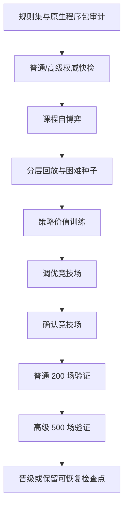

# 权威模拟与底模训练

## 无 UI 模拟

`AuraCombatSimulation.Cli` 和共享模拟器使用相同规则集、前向模型和策略接口。CLI 当前搜索策略名为 `risk-puct`：

```powershell
powershell -ExecutionPolicy Bypass -File tools/Run-AuraCombatSimulation.ps1 `
  -Ruleset docs/AuraCombatAI/examples/simulation-ruleset.example.json `
  -Scenario docs/AuraCombatAI/examples/simulation-scenario.example.json `
  -Count 100 -Parallel 8 -Policy risk-puct
```

批量模拟按种子排序合并。改变并行度不得改变单局状态哈希、终局或结果顺序。

## 底模训练流程



课程训练按难度、战斗深度、失败簇和终局结果分层。困难种子可重新进入训练，但训练、竞技场、调优和最终验证的种子区间必须互不重叠。

## Worker 协议

Worker schema 为 4。结果的 `CompletionKind` 只能表示当前实际完成语义：

| `CompletionKind` | 含义 | 检查点 |
|---|---|---|
| `preflight-passed` | 仅快检并通过 | 不保留 |
| `preflight-failed` | 仅快检但失败 | 不保留 |
| `training-accepted` | 完成训练并晋级 | 删除 |
| `training-rejected-resumable` | 完成训练但未过门禁 | 保留 |
| `training-rejected` | 未过门禁且无有效恢复点 | 不宣称可恢复 |
| `cancelled-resumable` | 取消且检查点完整 | 保留 |
| `cancelled` | 取消且无恢复点 | 不保留 |
| `failed-resumable` | 异常且检查点完整 | 保留 |
| `failed` | 异常且无恢复点 | 不保留 |

`Resumable` 只有在训练任务且 checkpoint JSON 与 episode JSONL 同时存在时才为真。预检不会制造训练检查点。

## 检查点

当前文件：

- `foundation-training-checkpoint-v4.json`
- `foundation-training-checkpoint-episodes-v4.jsonl`
- `foundation-training-episodes-v3.jsonl`

检查点包含：

- 请求指纹；
- 规则集和原生程序包哈希；
- 训练/验证战役哈希；
- 当前协议、特征编码和网络维度；
- 课程位置、困难种子和回放；
- Champion、工作模型和模型优化器状态；
- 进度遥测。

任一清单项不相等就拒绝恢复，不尝试转换。

## 资源与主线程

- Worker 以隐藏、无 shell、重定向输出的独立进程运行。
- CPU 并行度受配置和处理器数共同限制。
- Worker 以原子替换写进度与结果。
- 游戏主线程只轮询进度并应用最终状态。
- 取消先写取消标记；超过宽限时间才终止进程。
- 训练失败或取消不能把不完整 replay 当作正式训练产物。
