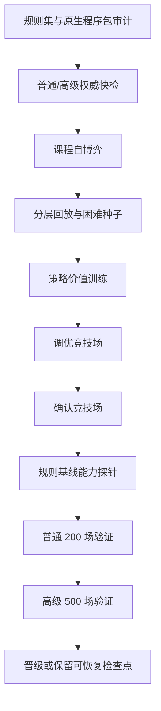

# 权威模拟与底模训练

## 无 UI 模拟

`AuraCombatSimulation.Cli` 和共享模拟器使用相同规则集、前向模型和策略接口。CLI 当前搜索策略名为 `risk-puct`：

```powershell
powershell -ExecutionPolicy Bypass -File tools/Run-AuraCombatSimulation.ps1 `
  -Ruleset docs/AuraCombatAI/examples/simulation-ruleset.example.json `
  -Scenario docs/AuraCombatAI/examples/simulation-scenario.example.json `
  -Count 100 -Parallel 8 -Policy risk-puct
```

批量模拟按种子排序合并。改变并行度不得改变单局状态哈希、终局或结果顺序。

## 底模训练流程



课程训练按难度、战斗深度、失败簇和终局结果分层。模型 minibatch 进一步按难度、旅程阶段、胜负和关键决策 frame 分层，并将稀有层权重限制在安全上限内。困难遭遇失败时，可从同一 checkpoint、同一世界种子运行零探索规则教师反事实分支；该分支仍须通过权威模拟和完整性校验。`hard-encounter-counterfactual-v2` 只接纳教师胜利或达到显著伤害增益的分支，后者使用 0.35 样本权重；无增益失败只记入诊断，不进入 replay。训练、竞技场、调优和最终验证的种子区间必须互不重叠。

训练生产和回放都保留 35% Advanced 下限；单个 Episode 默认均匀抽取最多
96 个 frame，防止长开局战斗淹没中后期决策。内容层通过
`hardEncounterWeights` 配置关键遭遇配额，当前分配为 `level_10011` 50%、
最终 Boss 合计 30%、`level_10040` 10%、其余 10%。共享训练器不硬编码
具体关卡 ID。

反事实结果会把困难种子标为 `action-solvable`、`action-sensitive`、
`build-limited-provisional`、`build-limited` 或 `unknown`。连续两次反事实
无胜利、无显著改善的种子降为构筑受限，并退出战斗策略困难种子调度；
已有两次训练失败但反事实证据尚不完整时先标为 provisional，避免继续把动作
学习预算浪费在战前构筑问题上。

权威教师审计使用当前动作因果链上的 `DamageDealt`、`BlockGained`、
`Healed`、`CardDrawn`、`EnergyChanged` 等事件，不再使用整张状态的净差。
审计分为固有效果和有效结果两层：先按 `SourceActionId`、卡牌实例和触发来源
隔离卡牌自身事件，再对伤害吸收、过量伤害、感知/攻防倍率、治疗上限和状态
层数上限作上下文归一化。结果分别记录候选动作和最终执行动作失配率，并输出
按来源的审计分母、`来源×类型` 失配率、可解释差异分类及最多 32 个复现样本。
报告中的 `unexplained` 才表示尚未解释的投影错误；`absorbed-by-block`、
`overkill-clamped`、`status-cap-or-no-op` 和 `trigger-side-effect` 不再混入
错误率。

Advanced 专家回放不足时不会以 Normal 静默补齐；缺口会按比例提高下一轮
Advanced 训练下限，最高 60%。正式隔离验证前先运行同种子规则基线能力探针：
Champion 必须在 Normal/Advanced 均不回归，并达到配置的胜场或平均战斗深度
增益，否则直接保留可恢复检查点并跳过昂贵验证。

终局信用采用 `terminal-credit-v2`：失败遭遇保留强负标签，之前已经获胜的遭遇按离失败距离衰减终局惩罚，避免将整轮旅程统一污染成负样本。奖励残差同时覆盖卡牌、遗物和祝福；人工配置偏置与学习残差分别限幅。

`foundation-stagnation-v1` 在最近两轮困难反事实求解率低于 5% 时，将困难样本占比限制到 12%，并让连续无恢复的 seed 进入冷却。形式 Champion 与工作模型分离：通过课程不回归检查的候选可进入工作窗口，窗口内只保留竞技场得分/深度更优的模型作为下一轮起点；正式 Champion 仍必须满足配对胜率或得分深度增益门禁。只有连续课程回归才触发停滞终止。

## 成功案例库

`success-case-archive-worker-v3` 由 .NET 8 Worker 独占加载、兼容性校验和写入。net472 游戏宿主只传递案例库根目录和回放配额，不再枚举案例文件。

- v3 使用 16 字符兼容键目录和 24 字符案例文件名，完整哈希仍保存在 JSON 内并在读取时校验；
- 兼容键覆盖规则集、完整战役指纹、原生程序包、训练策略、搜索策略、特征协议和资源循环语义；
- Worker 只读取当前 v3，不迁移或保留旧案例；
- 加载诊断报告当前文件数、拒绝原因、路径访问失败和最大观察路径长度；
- `Loaded=0` 且存在被拒文件时不得报告“compatible archive loaded”。

## Worker 协议

Worker schema 为 8。结果的 `CompletionKind` 只能表示当前实际完成语义：

| `CompletionKind` | 含义 | 检查点 |
|---|---|---|
| `preflight-passed` | 仅快检并通过 | 不保留 |
| `preflight-failed` | 仅快检但失败 | 不保留 |
| `training-accepted` | 完成训练并晋级 | 删除 |
| `training-rejected-resumable` | 完成训练但未过门禁 | 保留 |
| `training-rejected` | 未过门禁且无有效恢复点 | 不宣称可恢复 |
| `cancelled-resumable` | 取消且检查点完整 | 保留 |
| `cancelled` | 取消且无恢复点 | 不保留 |
| `failed-resumable` | 异常且检查点完整 | 保留 |
| `failed` | 异常且无恢复点 | 不保留 |

`Resumable` 只有在训练任务且 checkpoint JSON 与 episode JSONL 同时存在时才为真。预检不会制造训练检查点。

训练任务由 `CombatFoundationWorkerJobFactory` 统一生成。游戏运行时和外部控制台不能各自拼装任务 JSON；两条入口必须共享相同的参数归一化、种子分区、冻结工件和检查点规则。Worker 成功接纳候选后额外输出 `foundation-model-package-v1.json`，供另一台游戏进程或之后的验证流程以可验证方式导入。

发布外部训练器：

```powershell
powershell -NoProfile -ExecutionPolicy Bypass `
  -File tools/Build-AuraFoundationTrainer.ps1 `
  -Configuration Release
```

发布目录同时包含：

- `AuraFoundationTrainer.Worker.exe`：无 UI 训练执行器；
- `AuraFoundationTrainer.ControlCenter.exe`：参数编辑、启动、恢复、取消和迭代控制台。

## 检查点

当前文件：

- `foundation-training-checkpoint-v8.json`
- `foundation-training-checkpoint-episodes-v8.snapshot-*.jsonl`
- `foundation-training-episodes-v4.jsonl`

回放检查点使用不可变快照。训练器先完成分层 Replay 采样，再写入带代次的
JSONL 快照；小型 checkpoint JSON 最后原子切换到新快照。每个模型 Epoch
只更新模型状态指针，不重复覆盖大型回放文件。快照记录 Episode 数、字节数、
Replay 身份和 SHA-256，恢复前全部校验。

Windows 文件替换采用唯一临时名、共享删除读取和退避重试。短暂的杀毒扫描、
索引或 UI 轮询不会立即终止训练；检查点写入失败时继续使用上一份有效快照并
在 Worker 结果中报告警告。主指针损坏时尝试 `.bak`，读取失败不会删除旧恢复点。
成功完成或接纳训练后才清理检查点；普通运行保留最近快照并清除孤立临时文件。

检查点包含：

- 请求指纹；
- 规则集和原生程序包哈希；
- 训练/验证战役哈希；
- 当前协议、特征编码和网络维度；
- 课程位置、困难种子和回放；
- frame 分层、终局信用与困难遭遇反事实协议；
- 案例库中 expert cases 与 observations 的独立加载计数、拒绝计数和兼容键；
- Champion、工作模型和模型优化器状态；
- 进度遥测。

任一清单项不相等就拒绝恢复，不尝试转换。

当前功能尚未发布，不保留旧训练数据兼容层。设置页的“清空全部训练数据”
会直接删除玩家样本、训练快照、候选/冠军/模型库、Worker 任务、检查点、
成功案例库、模拟结果和历史训练报告，同时保留权威知识包、战役与规则配置。
重训必须从当前协议生成全新的样本和案例。

## 资源与主线程

- Worker 以隐藏、无 shell、重定向输出的独立进程运行。
- CPU 并行度受配置和处理器数共同限制。
- Worker 以带重试的原子替换写进度、结果和检查点指针。
- Worker 在成功案例库根目录持有跨进程排他写租约；并发训练会在写入前失败。
- 游戏主线程只轮询进度并应用最终状态。
- 取消先写取消标记；超过宽限时间才终止进程。
- 训练失败或取消不能把不完整 replay 当作正式训练产物。
