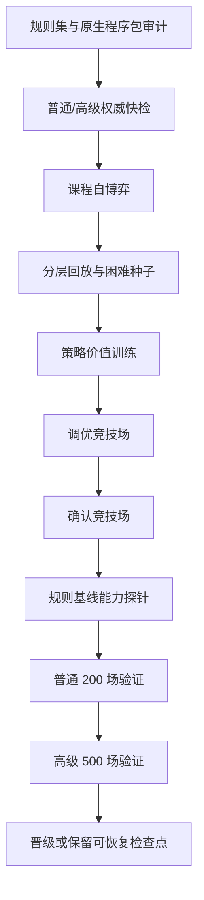

# 权威模拟与底模训练

## 无 UI 模拟

`AuraCombatSimulation.Cli` 和共享模拟器使用相同规则集、前向模型和策略接口。CLI 当前搜索策略名为 `risk-puct`：

```powershell
powershell -ExecutionPolicy Bypass -File tools/Run-AuraCombatSimulation.ps1 `
  -Ruleset docs/AuraCombatAI/examples/simulation-ruleset.example.json `
  -Scenario docs/AuraCombatAI/examples/simulation-scenario.example.json `
  -Count 100 -Parallel 8 -Policy risk-puct
```

批量模拟按种子排序合并。改变并行度不得改变单局状态哈希、终局或结果顺序。

## 底模训练流程



课程训练按难度、战斗深度、失败簇和终局结果分层。模型 minibatch 进一步按难度、旅程阶段、胜负和关键决策 frame 分层，并将稀有层权重限制在安全上限内。困难遭遇失败时，可从同一 checkpoint、同一世界种子运行零探索规则教师反事实分支；该分支仍须通过权威模拟和完整性校验。`hard-encounter-counterfactual-v2` 只接纳教师胜利或达到显著伤害增益的分支，后者使用 0.35 样本权重；无增益失败只记入诊断，不进入 replay。训练、竞技场、调优和最终验证的种子区间必须互不重叠。

训练生产和回放都保留 40% Advanced 下限；单个 Episode 默认均匀抽取最多
96 个 frame，防止长开局战斗淹没中后期决策。内容层通过
`hardEncounterWeights` 配置关键遭遇配额。当前将 97% 的困难种子预算分给
`level_10011`、`level_10040`、`level_10004`、`level_10001`、
`level_10009`、`level_10006` 和其余早中期遭遇，仅保留 3% 给最终 Boss，
避免已经稳定通过的终局挤占前段薄弱遭遇。共享训练器不硬编码具体关卡 ID。

反事实结果会把困难种子标为 `action-solvable`、`action-sensitive`、
`build-limited-provisional`、`build-limited` 或 `unknown`。连续两次反事实
无胜利、无显著改善的种子降为构筑受限，并退出战斗策略困难种子调度；
已有两次训练失败但反事实证据尚不完整时先标为 provisional，避免继续把动作
学习预算浪费在战前构筑问题上。

权威教师审计使用当前动作因果链上的 `DamageDealt`、`BlockGained`、
`Healed`、`CardDrawn`、`EnergyChanged` 等事件，不再使用整张状态的净差。
审计分为固有效果和有效结果两层：先按 `SourceActionId`、卡牌实例和触发来源
隔离卡牌自身事件；原生 `on-use` handler 只要 `SourceRewardId` 与当前卡牌
定义一致，仍归入卡牌固有效果，其他遗物、状态和奖励触发归入上下文效果。随后
再对伤害吸收、过量伤害、感知/攻防倍率、治疗上限和状态层数上限作上下文归一化。结果分别记录候选动作和最终执行动作失配率，并输出
按来源的审计分母、`来源×类型` 失配率、可解释差异分类及最多 32 个复现样本。
报告中的 `unexplained` 才表示尚未解释的投影错误；`absorbed-by-block`、
`overkill-clamped`、`status-cap-or-no-op` 和 `trigger-side-effect` 不再混入
错误率。

Advanced 专家回放不足时不会以 Normal 静默补齐；缺口会按比例提高下一轮
Advanced 训练下限，最高 60%。正式隔离验证前先运行同种子规则基线能力探针：
Champion 必须在 Normal/Advanced 均不回归，并达到配置的胜场或平均战斗深度
增益，否则直接保留可恢复检查点并跳过昂贵验证。

最终验收同时执行结束回合行为门槛。模拟器逐回合记录已执行动作、已消耗魔能、
回合初敌方生命、空回合、未用魔能结束和连续无进展回合。没有明确回合末遗物/
BUFF 收益时，只要仍存在安全且可支付的卡牌或技能，结束回合就记为严重判断失误；
正式隔离验证对此零容忍，胜率达标也不得发布底模。

交互动作使用 `action-contract-v1` 区分游戏入口和策略入口：

- `GameInvocable` 表示游戏是否允许调用；
- `PolicyEligible` 表示动作是否允许进入模型和 PUCT 候选；
- 前置条件失败可以忠实返回 `NoEffect`，但不得伪造冷却、抽牌或其他战斗状态变化；
- 无效果调用只写入本回合控制器失败记忆，搜索状态哈希必须包含该记忆；
- 已知必然无效果的动作在策略评分前硬过滤，有限权重惩罚只作为未知失败后的辅助信号。

正式隔离验证要求无效果动作、重复无效果动作、已知必然无效果动作和交互契约
失败全部为 0。模型特征协议自此为 v16，训练语义为
`end-turn-counterfactual-v5`；旧 v15 底模和检查点不参与兼容迁移，必须重新训练。

结束回合不再只按“本回合是否还有可支付动作”判断，而是统一计算反事实收益：

- 区分超过魔能上限且可带入下回合的结余，以及结束回合会过期的魔能；
- 计算非保留手牌进入弃牌堆后的回流延迟，并区分推测、可达和已认证循环；
- 按“回合末 BUFF -> 敌方意图 -> 回合初 BUFF”的顺序投影生命、护盾、魔能和抽牌；
- 有正收益动作、可避免致死或已认证循环时，结束回合属于硬禁止候选；
- 被支配的结束回合仍写入训练动作集合，但目标概率强制为 0，形成明确反事实负样本；
- 生命周期信息无法完整解释时采用保守不确定判定，不把未知结算虚构成安全收益。

正式隔离验证对“被支配结束回合”“进入可避免致死”“放弃已认证循环”均为
零容忍；携带超上限魔能和未知生命周期只作为诊断指标，不直接制造假阳性。

前向模型按游戏主体的真实回合边界处理结束回合：先结算玩家回合末事件和
弃牌/保留，再承受当前敌方行动；进入下一玩家行动窗前清除全体普通护盾、补足
基础魔能并抽牌，同时以保守概率投影下一轮敌方意图。下一轮威胁不得再被清空为
零；未知敌人、BUFF、遗物和意图使用默认保守投影，而不是制造“结束回合后无风险”
的虚假叶节点。

当前 Worker 以 40% 作为专家回放的 Advanced 配额；为复用稀缺但完整的困难胜利
旅程，每个成功 run 最多抽取 16 个 Episode。配额仍不足时只记录缺口并提高新一轮
Advanced 自博弈下限，不用 Normal 补位。

终局信用采用 `terminal-credit-v2`：失败遭遇保留强负标签，之前已经获胜的遭遇按离失败距离衰减终局惩罚，避免将整轮旅程统一污染成负样本。奖励残差同时覆盖卡牌、遗物和祝福；人工配置偏置与学习残差分别限幅。

`foundation-stagnation-v1` 只在 Advanced 竞技场已经达到验收线后，才允许在最近
两轮困难反事实求解率低于 5% 时把困难样本占比限制到 12%；未达到目标前始终
保留配置的困难种子预算。形式 Champion 与工作模型分离：当 Advanced 尚未达标，
候选必须在该难度取得严格胜率增益，不能只靠 Normal 或总体深度晋级；达标后仍
执行逐难度不回归门禁。只有连续课程回归才触发停滞终止。

## 成功案例库

`success-case-archive-worker-v3` 由 .NET 8 Worker 独占加载、兼容性校验和写入。net472 游戏宿主只传递案例库根目录和回放配额，不再枚举案例文件。

- v3 使用 16 字符兼容键目录和 24 字符案例文件名，完整哈希仍保存在 JSON 内并在读取时校验；
- 兼容键覆盖规则集、完整战役指纹、原生程序包、训练策略、搜索策略、特征协议和资源循环语义；
- Worker 在应用奖励残差前冻结兼容键，后续观察与成功案例始终写回该目录，避免学习后的奖励权重改变战役指纹并把案例分流到不可复用目录；
- Worker 只读取当前 v3，不迁移或保留旧案例；
- 加载诊断报告当前文件数、拒绝原因、路径访问失败和最大观察路径长度；
- `Loaded=0` 且存在被拒文件时不得报告“compatible archive loaded”。

## 游戏参数快照

游戏参数与训练参数彼此独立。每次任务冻结一个角色与使魔预设，内容包括角色技能及冷却、角色初始状态、使魔固有祝福、已开启奖励卡包和牌组数量倾向。`cardpack_1`、`cardpack_2` 始终开启，`cardpack_13` 不进入普通奖励选择；空 `PackBelong` 按 `cardpack_1` 处理。

第 0 场战斗的开局牌组取自权威 campaign，不由卡包开关改写。战役获得的卡先进入储备区；每层结束后，构筑器可在全部已拥有卡牌间不限次数调整活动牌组，使其尽量落在预设区间，同时保留后续永久删牌、转化等冒险效果。区间是构筑倾向，不是奖励获取上限。

角色技能和使魔固有祝福都参与战斗与策略完成度，但分别标记为 `SkillOnly` 和 `FamiliarInnate`，不得混入普通奖励池。卡包过滤完成后，候选牌仍按原稀有度与权重抽取；同一奖励面板不重复，跨遭遇仍允许重复获得。

角色、使魔、卡包集合、牌组倾向和固定开局牌组共同进入游戏参数指纹、案例指纹、检查点和外部模型包兼容键。关闭卡包后不可获得的组件不能为循环或无限组合提供完成度。

独立训练控制台使用 `witch-game-subjects-v1.catalog.json` 提供本体角色、使魔与离线卡包目录，并在自己的 `controller-settings.json` 中持久化完整、已解析的游戏主体预设。控制台启动任务时把同一预设快照同时应用到训练与验证 campaign；切换角色、使魔、卡包或牌组倾向会改变 `GameParameterHash`，旧检查点和上一轮 Champion 不得跨主体继续使用。

检查点续训与模型导入采用不同边界。检查点仍要求训练主体和冻结语义完全一致；外部底模导入只验证工件协议、网络维度、内部元数据一致性以及正式训练验收，不再要求当前游戏角色、使魔、卡包、战役哈希或 Worker 二进制哈希完全相同。Worker 哈希只作为来源信息展示。

模型包保存训练主体与声明覆盖清单，包括角色、使魔、已开启卡包、角色技能、使魔祝福、初始牌组、敌人、状态、遗物和祝福。运行时按集合覆盖关系评估：

- 训练卡包是当前卡包的超集时视为完全覆盖，多开的训练卡包不会阻止模型用于较小卡池；
- 当前游戏存在训练范围外的卡包或实体时视为部分覆盖，不拒绝导入；
- 角色不同时，通用卡牌仍使用模型，角色技能的学习评分归零并交给默认规则 AI；
- 未覆盖卡牌的学习评分归零；未覆盖敌人、状态、遗物和祝福的身份特征不进入模型输入，但游戏权威合法性、脚本效果和默认规则评估仍照常执行；
- 当一个决策窗口中所有可执行动作都未覆盖时，整个窗口使用默认 AI。

旧 `foundation-model-package-v2.json` 没有扩展覆盖字段时仍可导入；工具会依据包内旧主体字段和本地权威 campaign/ruleset 补全覆盖，无法精确补全时进入兼容模式并显示提示。

## 确定性组合基线

标准战役内置两套可完成击杀的无限与六套循环。表中的牌组数是组合可执行条件；超过该数量仍保留部分完成度，但不能标记为已成型。

| 类型 | 组合 | 必需组件 | 活动牌组上限 |
|---|---|---|---:|
| 无限 | 破损表盘·瞬念·剑盾 | 瞬念、破损表盘、剑盾 | 24 |
| 无限 | 破损表盘·瞬念·红石 | 瞬念、破损表盘、红石 | 24 |
| 循环 | 时虫之鳞·魔能电池·冥想 | 魔能电池、冥想、咒闪刃、时虫之鳞 | 18 |
| 循环 | 魔力源晶·元素升华循环 | 元素升华、元素循环、元素爆发、魔力源晶 | 20 |
| 循环 | 行星研究·仪式过牌 | 秘位：行星研究、引思、秘位：大书库、灵感债券 | 20 |
| 循环 | 阴阳·血契冥想 | 冥想、血契冥想、阴&阳 | 18 |
| 循环 | 魔网源流·序列重构 | 咒闪刃、法术护盾、序列重构、魔网源流 | 20 |
| 循环 | 笼中雀·封装钟声 | 钟声、封装、赝造神选、笼中雀 | 20 |

这些组合同时参与奖励边际价值、层末牌组调整和出牌优先级。`瞬念` 带有 `Recycle`，会留在手中；破损表盘补回其费用，剑盾或红石提供可累积至击杀的输出，因此不依赖额外过牌，也不同于不成立的“破损表盘 + 两张咒闪刃”。

## Worker 协议

Worker schema 为 8。结果的 `CompletionKind` 只能表示当前实际完成语义：

| `CompletionKind` | 含义 | 检查点 |
|---|---|---|
| `preflight-passed` | 仅快检并通过 | 不保留 |
| `preflight-failed` | 仅快检但失败 | 不保留 |
| `training-accepted` | 完成训练并晋级 | 删除 |
| `training-rejected-resumable` | 完成训练但未过门禁 | 保留 |
| `training-rejected` | 未过门禁且无有效恢复点 | 不宣称可恢复 |
| `cancelled-resumable` | 取消且检查点完整 | 保留 |
| `cancelled` | 取消且无恢复点 | 不保留 |
| `failed-resumable` | 异常且检查点完整 | 保留 |
| `failed` | 异常且无恢复点 | 不保留 |

`Resumable` 只有在训练任务且 checkpoint JSON 与 episode JSONL 同时存在时才为真。预检不会制造训练检查点。

训练任务由 `CombatFoundationWorkerJobFactory` 统一生成。游戏运行时和外部控制台不能各自拼装任务 JSON；两条入口必须共享相同的参数归一化、种子分区、冻结工件和检查点规则。Worker 成功接纳候选后额外输出 `foundation-model-package-v2.json`，供另一台游戏进程或之后的验证流程以可验证方式导入。

正式 Worker 不持久化完整 `ValidationRuns` 战斗图。最终验证按并行批次运行；每批完成后先提取案例、终局一致性和验收计数，再把战斗、回合状态、奖励和检查点对象替换为轻量验证记录。因而 24–32 路并行时，完整验证对象的常驻上限是一个并行批次，而不是普通与高级验证样本总数。最终 Worker 结果仅保存 `Validation` 聚合指标，并使用流式原子 JSON 写入，禁止通过 `SerializeObject -> StringBuilder.ToString()` 构造整份结果字符串。

发布外部训练器：

```powershell
powershell -NoProfile -ExecutionPolicy Bypass `
  -File tools/Build-AuraFoundationTrainer.ps1 `
  -Configuration Release
```

发布目录同时包含：

- `AuraFoundationTrainer.Worker.exe`：无 UI 训练执行器；
- `AuraFoundationTrainer.ControlCenter.exe`：参数编辑、启动、恢复、取消和迭代控制台。

## 检查点

当前文件：

- `foundation-training-checkpoint-v8.json`
- `foundation-training-checkpoint-episodes-v8.snapshot-*.jsonl`
- `foundation-training-episodes-v4.jsonl`

回放检查点使用不可变快照。训练器先完成分层 Replay 采样，再写入带代次的
JSONL 快照；小型 checkpoint JSON 最后原子切换到新快照。每个模型 Epoch
只更新模型状态指针，不重复覆盖大型回放文件。快照记录 Episode 数、字节数、
Replay 身份和 SHA-256，恢复前全部校验。

Windows 文件替换采用唯一临时名、共享删除读取和退避重试。短暂的杀毒扫描、
索引或 UI 轮询不会立即终止训练；检查点写入失败时继续使用上一份有效快照并
在 Worker 结果中报告警告。主指针损坏时尝试 `.bak`，读取失败不会删除旧恢复点。
成功完成或接纳训练后才清理检查点；普通运行保留最近快照并清除孤立临时文件。

检查点包含：

- 请求指纹；
- 规则集和原生程序包哈希；
- 训练/验证战役哈希；
- 当前协议、特征编码和网络维度；
- 课程位置、困难种子和回放；
- frame 分层、终局信用与困难遭遇反事实协议；
- 案例库中 expert cases 与 observations 的独立加载计数、拒绝计数和兼容键；
- Champion、工作模型和模型优化器状态；
- 进度遥测。

任一清单项或训练参数指纹不相等就拒绝恢复，不尝试转换。控制台发现上一轮
可恢复任务与当前档位、学习率、调优样本、验收线或困难遭遇分布不同时，会明确
提示本轮从新模型开始；Worker 对所有入口执行同一严格门禁。

当前功能尚未发布，不保留旧训练数据兼容层。设置页的“清空全部训练数据”
会直接删除玩家样本、训练快照、候选/冠军/模型库、Worker 任务、检查点、
成功案例库、模拟结果和历史训练报告，同时保留权威知识包、战役与规则配置。
重训必须从当前参数生成新模型；仍满足当前兼容键的成功案例库可继续作为专家
回放输入，旧模型检查点不会混入。

## 资源与主线程

- Worker 以隐藏、无 shell、重定向输出的独立进程运行。
- CPU 并行度受配置和处理器数共同限制。
- Worker 以带重试的原子替换写进度、结果和检查点指针。
- Worker 在成功案例库根目录持有跨进程排他写租约；并发训练会在写入前失败。
- 游戏主线程只轮询进度并应用最终状态。
- 取消先写取消标记；超过宽限时间才终止进程。
- 训练失败或取消不能把不完整 replay 当作正式训练产物。
