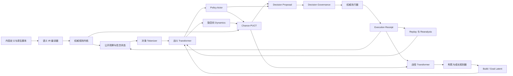
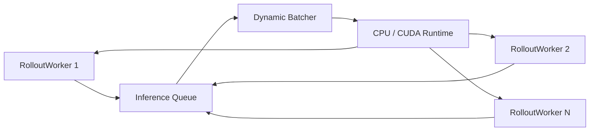

# Transformer 世界模型与分层决策目标架构

## 文档状态

本文是自动战斗 AI 下一代架构的详细设计基线，覆盖：

- 对象化战斗与战役状态；
- 类型化动作协议；
- Transformer 世界模型；
- 风险敏感 Chance-PUCT；
- Policy Actor；
- 决策与模型 Governance；
- 后续内容接入与 Transformer LoRA；
- CPU/GPU 训练、推理和迁移路线。

本文同时描述目标架构和迁移门禁。2026-08-04 已完成第一轮纵向开发：对象协议、
类型化动作、Coverage Manifest、战斗/战役 Tokenizer、Shadow Episode、标准 6 层
Transformer 世界模型教师、单步 Dynamics/Outcome、通用 Governance、Anytime 墙钟与
模型调用预算、风险偏好、门禁式 Actor 候选裁剪和 Transformer LoRA v2 已进入代码。
当前运行合同仍以 [README](README.md) 中的“当前合同”和 01 至 10 号文档为准；
latent Chance-PUCT、Actor 快速路径和战役 Transformer 尚未取得生产动作控制权。

### 当前落地矩阵

| 阶段 | 状态 | 当前边界 |
|---|---|---|
| 0 协议与观测审计 | Active | Coverage、耗时、模型调用、缓存、候选保留和停止原因均有结构化遥测 |
| 1 对象 IR/Tokenizer | Shadow | 公开对象、卡牌/技能 lifecycle、Transition Envelope 与战役对象已写入训练帧 |
| 2 Transformer/Actor 教师 | Training | 6x384/8 heads/1536 FFN，CPU/CUDA 同协议，仍只蒸馏 MLP Champion |
| 3 Afterstate/Outcome | Training | 已训练单步下一状态、Outcome、Terminal；3 至 5 步 latent unroll 和 Learned Chance 未启用 |
| 4 latent Chance-PUCT | Not Active | 生产 PUCT 仍使用权威前向模型，不允许用未验收 latent 替代 |
| 5 Governance/快速路径 | Partial Active | Governance、截止和安全回退已启用；Actor 硬裁剪默认关闭，快速路径未启用 |
| 6 战役/LoRA v2 | Tooling | 战役 Tokenizer、LoRA 校验/组合/预合并已实现；战役 Transformer 尚未晋级 |
| 7 移除旧特化 | Blocked by gates | 在新模型通过奈奈、随机性、延迟和基础内容回归前不删除 Champion 路径 |

## 1. 决策摘要

目标架构固定为：

```text
对象化语义 IR
  + 权威规则内核
  + 6 层 Transformer 世界模型
  + 风险敏感 Chance-PUCT
  + 搜索蒸馏 Policy Actor
  + 输入/决策/执行/模型四层 Governance
  + 战斗/战役双时间尺度规划
  + 内容感知 LoRA
```

已经确认的关键决策如下：

1. 卡牌与技能共享动作外壳，但必须保持不同的类型、来源和生命周期。
2. 合法性、费用、目标、冷却、触发顺序和已知概率由权威规则内核负责。
3. Transformer 学习状态表示、未知结果、策略、价值、风险和不确定性，不猜测硬规则。
4. Chance-PUCT 在根部使用真实公开观察和信念状态，只在根以下执行短程隐空间规划。
5. Policy Actor 只提出先验或动作建议，不直接操作游戏。
6. Governance 不表达角色打法，只表达通用边界、风险阈值、准入和回滚。
7. 战斗内决策和战役长期成长使用两个时间尺度的世界模型与规划器。
8. 默认底模采用 6 层、`d_model=384` 的均衡配置，完整模型目标约 25 至 40M 参数。
9. 10 至 100M 是允许的模型包范围，不是要求把默认运行模型扩张到 100M。
10. 新内容优先通过语义 IR 零样本接入；LoRA 用于分布和协同适配，不能代替新规则实现。
11. 角色专用规则从在线策略路径迁出，保留为权威语义、训练课程和能力验收案例。
12. 纯 CPU 与 GPU 使用同一模型和任务协议，只替换推理后端、批次和并发配置。

## 2. 目标与非目标

### 2.1 目标

- 对新卡牌、新角色、新使魔、新敌人和新遗物具备组合泛化能力。
- 同时处理当前行动收益、数回合战术、整场战斗和整轮冒险价值。
- 显式处理抽牌、随机目标、敌人意图和生成内容等随机性。
- 在纯 CPU 机器上维持可接受的训练与运行能力，在 GPU 机器上扩大吞吐和教师质量。
- 允许后续内容 MOD 以稳定、可校验的包和 LoRA 工件扩展底模。
- 让搜索、快速策略和治理拥有清晰且可测试的职责边界。
- 对奈奈等复杂角色使用通用建模能力解决问题，而不是继续叠加在线特判。

### 2.2 非目标

- 不让神经网络替代游戏权威结算。
- 不允许模型读取玩家无法获得的牌序、随机种子或敌方隐藏选择。
- 不在游戏进程内进行无门禁的在线梯度更新。
- 不用一个无限上下文模型同时模拟所有战斗和整轮冒险细节。
- 不保证所有新内容无需数据即可达到最佳策略；零样本接入只保证可解释和可运行。
- 不通过增大参数量掩盖语义缺失、数据污染或搜索流程错误。

## 3. 不可破坏的系统约束

### 3.1 权威性

以下内容必须来自规则内核：

- 动作是否可调用、是否允许进入策略候选；
- 卡牌和技能的费用、冷却、次数与目标集合；
- 卡牌实例从手牌到弃牌堆、消耗堆或其他区域的移动；
- Buff、遗物、使魔祝福和难度词条的确定触发顺序；
- 已知随机池及其精确概率；
- 战斗终止、胜负、奖励和战役持久化结算。

模型可以预测这些结果以支持隐空间搜索，但预测结果不能反向覆盖真实执行规则。

### 3.2 玩家等价信息

每个输入字段必须标记为：

```text
PublicExact       玩家当前明确可见
PublicDerived     可由公开信息确定推导
Belief            根据公开历史形成的概率信念
Unknown           不可观测且不能输入
```

训练、模拟和运行时必须经过同一可见性投影。教师模型也不能获得学生运行时不可见的字段，
除非该字段只用于生成监督标签且与输入张量完全隔离。

### 3.3 策略与规则分离

“技能需要抽牌堆中至少有一张牌”属于语义前置条件；“此时保留技能更有价值”属于策略。
前者进入规则内核，后者由 Actor、搜索和价值模型学习。任何角色 ID、卡牌 ID 或流派名驱动的
在线加减分，都必须经过迁移审计。

### 3.4 提议与执行分离

Transformer、Actor 和 Chance-PUCT 只能输出 `DecisionProposal`。只有 Governance 返回
`Accept`，并由执行器完成实时重新绑定和合法性复检后，动作才可以提交给游戏。

## 4. 总体架构



## 5. 领域状态模型

### 5.1 战斗状态必须覆盖的对象

| 对象 | 最低字段 |
|---|---|
| 全局战斗 | 回合、阶段、行动窗口、延迟效果、难度词条、战斗上下文 |
| 角色 | 身份、形态、生命/上限、护盾、属性、角色变量、技能槽位 |
| 使魔/友方 | 身份、生命/护盾、被动、祝福、冷却、触发状态 |
| 敌人 | 身份、生命/上限、护盾、属性、当前与候选意图、阶段 |
| Buff/Debuff | 所有者、来源、层数、上限、持续时间、触发阶段、可驱散性 |
| 手牌实例 | 卡牌 ID、实例 ID、费用、强化、保留、消耗、生成来源、实例变量 |
| 抽牌堆信念 | 数量、已知顶牌、已知底牌、未知多重集、洗牌代次 |
| 弃牌/消耗堆 | 可见内容、实例或同类计数、区域顺序语义 |
| 遗物/祝福 | 身份、所有者、计数器、触发阶段、每战状态 |
| 资源 | 当前魔能、上限、临时魔能、跨回合保留、其他角色资源 |
| 动作候选 | 类型、来源实例、目标集合、费用、语义、精确机会分支 |

遗漏用户可见但决策相关的对象时，不允许把空值解释为“不存在”。必须区分“不存在”、
“未知”、“采集失败”和“当前协议不支持”。

### 5.2 对象 Token

推荐 Token 家族：

```text
[GLOBAL]
[ROLE] [FAMILIAR] [FRIENDLY]
[ENEMY]
[STATUS]
[HAND_CARD]
[DRAW_TOP] [DRAW_BOTTOM] [DRAW_BELIEF]
[DISCARD_CARD] [EXHAUST_CARD]
[RELIC] [BLESSING] [DIFFICULTY]
[RESOURCE]
[DEFERRED_EFFECT]
[HISTORY_EVENT]
[ACTION_CANDIDATE]
```

每个 Token 由以下嵌入之和或投影组成：

```text
内容语义 + 实体类型 + 所有者 + 区域 + 来源 + 目标关系
+ 连续数值投影 + 可见性 + 时间/阶段 + 实例位置
```

对象顺序采用规范排序保证可复现；对本质无序的集合使用集合注意力语义，不把排序位置误当作
游戏规则。牌堆已知顶底顺序和事件历史保留真实相对位置。

### 5.3 Token 数量控制

默认上下文上限为 192，允许 GPU 配置扩展到 256。超过上限时按以下方式压缩：

1. 当前合法动作、手牌实例、存活单位和关键延迟效果永不被摘要掉。
2. 同 ID 且无实例差异的卡牌可合并为带计数的区域 Token。
3. 低决策相关度的历史事件按阶段汇总，但保留最近事件。
4. Buff 按所有者分组，只合并语义完全相同且来源不影响结算的实例。
5. 摘要过程必须确定化，并输出被压缩对象数量用于覆盖监控。

### 5.4 Coverage Manifest

每种内容和字段都维护六态覆盖清单：

```text
Present -> Observable -> Encoded -> Trained -> Validated -> Active
```

“采集到了字段”不等于“模型正在使用”。发布报告必须分别展示角色、技能、卡牌、敌人、Buff、
遗物、使魔、难度词条和战役动作的六态覆盖率。

## 6. 类型化动作协议

### 6.1 动作结构

统一动作定义为：

```text
TypedAction(
    ActionType,
    SourceDefinitionId,
    SourceRuntimeId,
    TargetSet,
    Mode,
    ResourcePayment,
    Preconditions,
    EffectProgramId)
```

`ActionType` 至少包含：

```text
PlayCard
UseSkill
UseActiveRelic
EndTurn
ResolvePrompt
CampaignRewardChoice
CampaignDeckEdit
CampaignRouteChoice
CampaignGrowthChoice
```

### 6.2 卡牌与技能分离

卡牌动作必须保留：

- 手牌实例和原始定义；
- 当前费用与费用修改来源；
- 强化、变量、保留、消耗和生成标记；
- 使用后的目的区域；
- 与抽牌、弃牌、回收和卡组循环的关系。

技能动作必须保留：

- 角色/使魔所有者和技能槽位；
- 冷却、初始冷却、充能、次数限制；
- 形态与角色变量要求；
- 每回合、每战或永久生命周期；
- 是否打开后续交互窗口。

两者共享目标、费用、语义效果、机会结果和事务执行接口，但不能通过混用内容 ID 抹平差异。

### 6.3 目标因子化

动作来源与目标分开编码。同一来源动作选择不同敌人，应生成不同搜索边或由模型明确输出
`P(source) * P(target | source)`。第一版优先使用完整合法候选边，避免因因子化错误产生非法组合。

### 6.4 动作结果信封

规则内核向模型和搜索提供：

```text
TransitionEnvelope
  Legal
  RejectionReason
  DeterministicAfterstate
  ExactChanceOutcomes[]
  UnknownResidualDescriptor
  ObservablePostconditions
  ExecutionBinding
```

精确机会结果优先于学习结果。只有无法合理穷举的部分进入离散 Chance Code。

## 7. 双时间尺度世界模型

### 7.1 战斗世界模型

战斗模型处理动作窗口内和若干回合内的状态变化：

```text
z0      = h_battle(observation_history, build_goal)
za      = g_afterstate(z, typed_action)
p(c)    = f_chance(za, exact_chance_context)
z_next  = g_outcome(za, chance_code)
heads   = f_prediction(z_next)
```

`h_battle` 是对象 Transformer 表征；`g_afterstate` 与 `g_outcome` 是较浅、可批处理的动态模块。
模型不需要解码完整游戏状态，但必须预测规划所需的奖励、终止、风险和关键状态差分。

### 7.2 战役世界模型

战役状态至少包含：

- 当前层、路线、遭遇分布和难度；
- 角色身份、形态、永久属性、生命和资源；
- 活动牌组、储备牌、卡牌实例强化；
- 遗物、祝福、使魔和持久变量；
- 可用奖励池、商店或事件上下文；
- 已完成战斗的结果摘要和构筑稳定性；
- 当前 `Build / Goal Latent`。

战役动作包括选牌、跳过、删牌、升级、活动牌组调整、遗物/祝福选择、路线选择和角色成长。
战役动态不逐动作重演战斗，而是消费战斗模型或验证模拟器给出的结果分布：

```text
P(胜负、死亡、掉血、回合数、资源消耗、构筑暴露缺陷 | 战役状态, 遭遇)
```

### 7.3 Build / Goal Latent

`BuildEncoder` 从卡牌效果、费用曲线、抽牌能力、资源循环、防御、成长、状态交互和已有装备中学习
构筑向量。可以使用离散 VQ 代码或连续向量，但不能要求构筑预先属于人工命名流派。

人工命名的复生、时间牢笼或角色阶段可以继续用于：

- 数据分层；
- 能力探针；
- 训练课程；
- 可解释性报告。

它们不能继续作为在线策略硬分支。战斗模型接收战役层产生的 Goal Latent，以区分当前动作是在
生存、铺设、转换、循环还是爆发，但最终动作仍由搜索和风险价值决定。

## 8. Transformer 规格

### 8.1 默认结构

正式默认配置：

```text
EncoderLayers       = 6
ModelDimensions     = 384
AttentionHeads      = 8
HeadDimensions      = 48
FeedForwardDimensions = 1536
Normalization       = Pre-LN
Activation          = GELU
TrainingDropout     = 0.05
MaximumTokens       = 192
HistoryEvents       = 12，按覆盖实验调整
ChanceCodes         = 32，允许扩展到 64
```

状态表征使用双向 Encoder 注意力。历史事件带因果时间位置，但当前完整公开状态内的对象可以相互注意。
不采用语言模型式逐 Token 自回归生成作为核心推理路径。

### 8.2 参数预算

| 档位 | `d_model` | Heads | FFN | 6 层主干 | 完整模型目标 |
|---|---:|---:|---:|---:|---:|
| `cpu-light` | 256 | 8 | 1024 | 约 4.8M | 12 至 20M |
| `balanced` | 384 | 8 | 1536 | 约 10.7M | 25 至 40M |
| `gpu-large` | 512 | 8 | 2048 | 约 19M | 45 至 70M |

完整模型还包含语义嵌入、动作编码、Dynamics、Chance、Policy、Value、Risk 和辅助预测头。
100M 只作为允许上限和大型教师候选，不作为默认运行配置。

### 8.3 输出头

战斗模型至少输出：

- 合法候选策略 logit；
- 状态价值和动作条件价值；
- 回报分位数或离散价值分布；
- 胜率、死亡率；
- 终局剩余生命比例与剩余回合；
- Chance Code 概率；
- 即时奖励和终止概率；
- 关键状态差分；
- epistemic/ensemble 不确定性指标；
- OOD 分数。

合法性预测只能作为语义覆盖诊断头，不能作为运行时合法性来源。

### 8.4 Dynamics 结构

为了控制搜索成本：

- 根表征运行完整 6 层 Encoder；
- Afterstate 和 Outcome 使用 2 至 4 层共享或轻量 Transformer Block；
- 相同内容嵌入和数值编码器跨模块共享；
- Dynamics 请求支持批处理；
- 不为 Representation、Afterstate 和 Outcome 分别复制三套独立 6 层主干。

### 8.5 Dynamics 后端选择

轻量 Dynamics 是性能最高优先级，但目标架构不预先绑定 GAU、线性注意力或某一种 RNN。
第一轮必须在相同训练数据、参数预算、展开深度和硬件上比较：

| 候选 | 主要用途 | 必测风险 |
|---|---|---|
| 2 层 Transformer | GPU 与质量基线 | 单步延迟、批次敏感性 |
| GRU | CPU 低延迟候选 | 长展开漂移、Chance 表达能力 |
| 残差 MLP | 确定性短转移候选 | 对复杂对象交互表达不足 |
| 其他注意力实现 | 后端专项优化 | 短序列上是否真实快于标准 Attention |

标准 Attention 是默认可移植基线。FlashAttention、稀疏注意力和线性注意力只有在目标后端的
端到端基准中同时改善延迟、吞吐和决策质量时才启用。对于不超过 192 个 Token 的上下文，
不能仅根据渐进复杂度断言线性注意力一定更快。

### 8.6 表征复用与模型调用预算

同一个公开观察只运行一次完整 Representation。候选动作必须共享根状态编码，并在一次或少量批次中完成
Action 编码与策略评分，禁止为每个 `(action, target)` 重复运行 6 层主干。

搜索除模拟数和节点数外，还必须独立限制：

```text
RepresentationCalls
ActionScoringCalls
AfterstateDynamicsCalls
OutcomeDynamicsCalls
PredictionCalls
```

以下缓存均绑定模型、规则、内容、适配器和公开状态身份：

- 根状态编码缓存；
- 状态/动作 Afterstate 缓存；
- Afterstate/Chance Outcome 缓存；
- 转置状态 Prediction 缓存。

权威规则内核能够低成本精确生成的确定性转移可以使用快捷路径。模型仍可在叶节点提供价值和风险，
但不应为一个已经精确已知的简单状态差分重复支付完整 Dynamics 成本。

## 9. Chance-PUCT 细则

### 9.1 节点类型

搜索树包含：

```text
DecisionNode
  -> ActionEdge
  -> AfterstateNode
  -> ChanceEdge
  -> DecisionNode
```

DecisionNode 保存公开或隐空间状态、合法动作、先验、访问量和风险统计。AfterstateNode 表示玩家动作
已应用、随机结果尚未揭示。ChanceEdge 保存精确概率或模型预测概率及其来源可信度。

### 9.2 决策边选择

```text
Score(s, a) = Qrisk(s, a)
            + c_puct * Pactor(a | s)
              * sqrt(N(s)) / (1 + N(s, a))
```

统一风险值：

```text
Qrisk = ExpectedReturn
      - lambda_tail  * (ExpectedReturn - CVaR_alpha)
      - lambda_death * DeathProbability
      - lambda_unc   * Uncertainty
```

现有均值、下尾均值、死亡风险和标准误统计可以迁移，但所有树内选择、根排序、早停和主变化解释
必须消费同一个风险定义，不能在不同阶段临时换公式。

初版使用经过验证的固定风险权重。后续可以暴露受治理限制的 `RiskPreference`，在预先校准的范围内
调整 `lambda_tail` 和软风险项，以表达保守或进取倾向。硬死亡风险限制、非法动作和明显可避免致死
不受玩家偏好覆盖；风险偏好不需要通过个人 LoRA 实现。

### 9.3 Chance 分支

- 权威内核能枚举的机会结果按精确概率展开。
- 概率极小但会导致死亡或永久重大损失的结果必须获得最低访问证据。
- 大分支使用渐进扩展，并以累计概率质量而不是固定 Top-K 作为主要覆盖条件。
- 模型 Chance Code 只表示未知残差，不得重复采样已经由规则内核处理的随机性。
- 训练时记录真实结果、预测概率、采样概率和重要性权重，避免机会采样造成偏差。

### 9.4 根状态与重新锚定

每次真实动作结算后必须根据新观察重新编码根状态。发生抽牌、生成卡牌、意图揭示、洗牌或交互选择时，
旧树只有在公开指纹、信念状态和结果分支都能一致绑定时才允许复用；否则丢弃或仅保留统计先验。

可以利用动作动画和结算等待时间提前计算，但只能采用两种形式：

1. 新公开观察已经完成，只是 UI 尚未允许提交下一动作时，提前启动真实根搜索；
2. 对权威内核列出的多个可能结果分别进行投机搜索，真实结果出现后只绑定完全匹配的分支。

禁止根据“期望抽牌”“最可能意图”或其他平均状态提前确定并执行动作。投机搜索命中率、节省时间、
错误绑定数和废弃计算量都必须进入遥测；收益不足时应关闭该能力。

### 9.5 候选裁剪

Actor 可以排序候选，但裁剪必须满足：

- 只从权威合法候选中选择；
- 结束回合作为合法候选保留，但不把它预设为安全回退；
- 保留所有 Governance 要求的回退候选；
- 每个动作来源至少保留一个高分目标，避免目标组合整体消失；
- 同时满足 Top-K 和累计策略概率质量覆盖，而不是只依赖固定 K；
- 只有权威支配证明可以直接硬删除动作，普通启发式只能降权；
- 训练期定期运行全候选搜索，测量被裁剪动作的反事实价值；
- 裁剪召回率未通过门禁时禁用 Actor 裁剪。

### 9.6 搜索预算

初始基准，不作为永久常量：

| 用途 | 模拟数 | 隐空间深度 |
|---|---:|---:|
| CPU 在线均衡 | 96 至 256 | 5 至 8 |
| GPU 在线/深度 | 256 至 768 | 6 至 10 |
| 离线教师 | 512 至 2048 | 8 至 12 |

最终预算由分支数、价值差距、风险、OOD、Boss、Chance 复杂度和当前设备吞吐动态决定。
早停仍要求动作覆盖、最小访问量、风险价值差距和统计稳定性同时成立。

搜索采用 Anytime 协议：每完成一批模拟就更新当前最佳治理合格动作；达到墙钟截止时间、模型调用预算
或取消信号时立即返回当前最佳结果。超时不能触发未经验证的固定结束回合动作。

## 10. Policy Actor

### 10.1 定义

`PolicyActor` 是从 Chance-PUCT 访问分布和风险价值蒸馏出的轻量策略网络。生成对局的并行进程统一称为
`RolloutWorker`，不得与 Policy Actor 混用名称。

### 10.2 职责

Policy Actor 只承担：

1. 为 PUCT 提供合法动作先验；
2. 在通过召回门禁后进行候选排序和有限裁剪；
3. 搜索超时时提供治理可接受的回退建议；
4. 在简单、高置信、低风险、非 OOD 状态下提供快速路径建议。

Actor 不负责合法性、结算、随机概率和模型晋级。

### 10.3 训练目标

```text
L_actor = KL(search_visit_policy || actor_policy)
        + w_rank * pairwise_action_ranking
        + w_q    * action_value_distillation
        + w_risk * risk_classification
        + w_cal  * confidence_calibration
```

搜索访问量必须经过温度和根探索修正，不能把训练期噪声原样作为部署策略。关键风险状态、稀有角色机制和
未覆盖内容需要提高蒸馏权重，但单一角色不得占据大部分批次。

### 10.4 快速路径开放顺序

1. 第一阶段：Actor 只提供搜索先验。
2. 第二阶段：允许 Actor 作为搜索超时回退。
3. 第三阶段：允许简单状态 Actor 快速路径。
4. 第四阶段：按设备和内容覆盖动态选择 Actor 或 PUCT。

复杂角色、Boss 阶段转换、未知内容、高死亡风险、价值差距小和 OOD 状态默认强制搜索。

## 11. Governance

### 11.1 命名边界

现有 `CombatFoundationGovernanceProfiles` 管理训练调优频率。目标架构新增的运行治理应使用独立名称，
例如 `CombatDecisionGovernance` 和 `CombatModelLifecycleGovernance`，避免把训练日程与实时动作治理混为一谈。

### 11.2 输入治理

- 协议、Tokenizer、规则 IR 和内容集合版本匹配；
- 所有数值有限且在声明范围内；
- 可见性边界通过；
- 必需实体和动作覆盖完整；
- 未知内容、压缩比例和 OOD 分数在限制内；
- 当前模型和适配器绑定正确的底模与内容集合。

### 11.3 决策治理

- 判断是否允许 Actor 快速路径；
- 根据风险、置信度和 OOD 强制搜索或增加预算；
- 检查根动作访问量、价值差距和 Chance 覆盖；
- 对超过死亡风险阈值的提议要求重新搜索或使用安全回退；
- 所有动作越界时选择风险最小的权威合法候选，而不是返回非法空动作。

安全回退按以下顺序选择：

```text
已完成搜索中的最佳安全动作
-> 权威规则证明安全的保守动作
-> 风险最小的合法动作
-> 仅在通过结束回合安全认证或没有其他动作时 EndTurn
```

结束回合可能进入可避免致死、浪费可支付动作或切断循环，因此不得被 Governance 固定视为安全阀。

### 11.4 执行治理

- 重新检查战斗会话、序列和公开指纹；
- 将动作来源实例和目标重新绑定到最新观察；
- 复检费用、冷却、目标、交互窗口和手牌位置；
- 提交后等待可审计的后置条件；
- 生成 `ExecutionReceipt`，区分成功、无效果、拒绝、状态过期和未知失败；
- 失败动作进入本行动窗口抑制记忆，防止无限重试。

### 11.5 模型生命周期治理

- 数据来源、规则集、训练代码、底模和适配器全链路 Hash；
- 训练/验证/测试按 Journey 和种子隔离；
- Champion/Candidate、影子运行、Canary 和自动回滚；
- 按角色、使魔、难度、敌人和构筑阶段分别报告门禁；
- 基础内容不回归门禁和新增内容能力门禁同时通过；
- 模型输出校准、搜索收益、Actor 搜索召回和真实执行失败率均达标。

### 11.6 Verdict 协议

Governance 只返回：

```text
Accept
RequireSearch
RequireMoreSearch
UseSafeFallback
Reject
```

Governance 可以要求重新计算，但不能指定角色专属打法。诸如“奈奈第三回合使用某技能”的逻辑禁止进入治理层。

## 12. 模型与运行接口

目标数据对象：

```text
ObservationEnvelope
  observation identity
  public objects
  belief objects
  event history
  content/rule identity

ModelRequest
  tokens
  legal action envelopes
  build/goal latent
  requested heads

ModelPrediction
  policy priors
  value/risk distributions
  chance distribution
  latent state
  uncertainty/OOD

SearchResult
  proposed action
  root visits
  return/risk distribution
  chance coverage
  confidence and stop reason

GovernanceVerdict
  decision
  reason codes
  required budget/fallback

ExecutionReceipt
  bound action
  authoritative result
  observed deltas/events
  completion status
```

接口必须支持单条和批量推理。运行时禁止通过共享可变字典隐式传递模型状态。

## 13. 训练体系

### 13.1 数据来源

- 权威模拟器自博弈；
- 深度 Chance-PUCT 教师轨迹；
- 当前 Champion 与候选模型竞技场；
- 真实游戏完成事务；
- 内容 MOD 权威 Episode；
- 困难种子反事实重分析；
- 构筑受限种子的战役层课程。

所有数据必须保存模型、规则、内容、适配器、观察协议和采样策略身份。

### 13.2 训练目标

世界模型联合损失：

```text
L = w_policy      * L_search_policy
  + w_value       * L_distributional_value
  + w_reward      * L_reward
  + w_terminal    * L_terminal
  + w_chance      * L_chance
  + w_consistency * L_latent_consistency
  + w_delta       * L_observable_delta
  + w_risk        * L_death_and_tail_risk
  + w_aux         * L_auxiliary_semantics
```

`L_latent_consistency` 对齐预测下一隐状态与真实下一观察重新编码后的隐状态。辅助语义只用于稳定表示，不能把
隐藏字段混入模型输入。

一致性损失需要提高生命、护盾、资源、区域移动、终止、敌人意图和 Chance 结果等决策相关维度的权重，
同时配合方差或对比约束防止所有状态坍缩到相同 latent。单纯提高一致性损失权重不能替代多步误差门禁。

### 13.3 训练顺序

1. 语义嵌入与公开状态辅助预训练；
2. 单步 Afterstate、Chance、Outcome 训练；
3. 3 至 5 步 latent unroll；
4. Policy/Value 与搜索蒸馏；
5. 完整 Chance-PUCT reanalysis；
6. Actor 蒸馏；
7. 战役结果模型和构筑规划；
8. 联合门禁，不建议第一版端到端同时训练所有模块。

### 13.4 Replay

Replay 按以下维度分层：

- Normal/Advanced 和具体难度词条；
- 角色、使魔和形态；
- 战役层与遭遇深度；
- 胜利、死亡和构筑受限；
- 动作类型；
- Chance 复杂度；
- 新内容和基础内容；
- 关键决策、普通决策和结束回合反例。

不得让单一角色、单一 Boss 或大量简单回合占满训练批次。基础回放长期保留，防止新增内容训练造成灾难性遗忘。

### 13.5 Reanalysis

旧 Episode 可以由新世界模型和更强搜索重新生成策略、价值和风险目标，但必须保留原始动作、真实结果和旧标签，
并记录 Reanalysis 模型身份。不能用新模型预测结果覆盖真实 Execution Receipt。

## 14. CPU/GPU 执行架构

### 14.1 统一协议

训练任务、检查点和模型包不得绑定 CUDA。设备配置只决定：

- 推理提供程序；
- 精度与量化；
- minibatch；
- RolloutWorker 数量；
- 搜索并发和推理队列参数。

### 14.2 并发拓扑



训练吞吐主要来自多场战斗并发，而不是强行把单棵搜索树拆成大量线程。单树可使用虚拟损失并行扩展，
但必须避免多个线程反复等待不足批次的模型调用。

训练与在线运行使用不同调度策略：

- 独立训练器通过多个 RolloutWorker 填充大批次；
- 游戏内通常只有一场战斗，依靠同树叶节点微批次、表征复用、缓存和 Actor 快速路径；
- 不得用训练器的多战斗吞吐结果代替游戏内单决策延迟验收。

推理服务至少区分 `interactive-search`、`rollout`、`actor` 三类队列。实时搜索具有较高优先级，
但每类队列都有保底配额，防止长时间饥饿。调度报告需要输出等待时间、有效批次和超时数量。

### 14.3 CPU 建议

- 默认使用 `cpu-light` 或 INT8 `balanced`；
- Representation 与 Dynamics 分开组批；
- 以物理核心和内存带宽确定 Worker 数，不以逻辑核心数直接翻倍；
- 推理线程池与模拟线程池隔离；
- 优先填满多个独立战斗的批次；
- 监控平均批次、排队时间、模型时间、模拟时间和空闲比例。

### 14.4 GPU 建议

- 使用 FP16/BF16，数值敏感风险头可保留 FP32 累积；
- 采用单设备中央推理服务，避免每个 Worker 独占模型；
- 扩大并行战役数量和批次，而不是只提高单棵树模拟数；
- GPU 利用率不足时先检查数据准备、队列和模拟器供给，不盲目增大模型。

### 14.5 在线延迟 SLO

延迟门禁必须绑定明确的参考 CPU、线程配置、模型精度和内容集合，同时报告 P50、P95 和 P99。
第一版目标为：

| 决策类型 | 目标延迟 |
|---|---:|
| 强制/简单 Actor 路径 | P95 不超过 50ms |
| 普通搜索 | P50 不超过 150ms，P95 不超过 300ms |
| 复杂/Boss 搜索 | P95 不超过 400ms |
| 决策绝对截止 | 450ms |

绝对截止预留约 50ms 给 Governance、实时重新绑定和事务提交，确保整个动作路径不超过 500ms。
平均延迟不能替代尾延迟门禁。

### 14.6 分阶段性能遥测

每次决策至少记录：

```text
Observation / Tokenizer
Representation
ActionScoring / Actor
AfterstateDynamics / OutcomeDynamics
Prediction
TreeBookkeeping
Governance / Binding
TotalWallClock
```

同时记录模型调用次数、缓存命中、平均批次、候选原始/保留数量、完成模拟数、投机搜索命中和截止原因。
优化按端到端收益排序，不能因为单个算子微基准更快就直接替换生产后端。

## 15. 后续内容与 LoRA

### 15.1 内容分类

新增内容接入前执行三类判定：

| 类型 | 条件 | 处理 |
|---|---|---|
| A：已有语义 | 只组合现有语义操作 | IR 编译、零样本探针，不要求 LoRA |
| B：新协同/分布 | 规则可表达但策略或结果分布显著变化 | 内容 LoRA |
| C：新机制 | 出现新区域、资源、阶段或结算操作 | 扩展规则/IR/Tokenizer，再训练或 LoRA |

LoRA 不能为类型 C 内容伪造规则支持。

### 15.2 组合式内容嵌入

新内容身份嵌入由内容 ID 嵌入和语义描述编码共同组成。未训练过的新 ID 至少可以通过以下信息形成表示：

- 动作类型与目标类型；
- 费用和资源变化；
- 效果操作序列；
- 区域移动；
- 状态、触发阶段和持续时间；
- 随机池与概率；
- 所有者、卡包和公开标签。

因此新卡牌不因缺少独立 ID 权重而完全退化为未知动作。

### 15.3 适配器类型

| 适配器 | 允许修改 | 禁止修改 |
|---|---|---|
| `ContentLoRA` | 表征、Dynamics、Chance 残差、Policy、受限 Value | 权威合法性和精确概率 |
| `CampaignLoRA` | 构筑表征、战役 Dynamics、长期 Policy/Value | 战斗权威结算 |
| `PreferenceAdapter` | Policy Actor | Dynamics、Q、死亡率、规则 |

### 15.4 默认 LoRA 规格

```text
简单内容组合       rank = 8
完整角色/卡牌包    rank = 16
个人策略偏好       rank = 4
alpha              = rank 或 2 * rank
dropout            = 0.05
```

首批目标模块：

- Attention `Q`、`V`；
- 后三层 FFN 输入/输出投影；
- Action、Afterstate、Chance、Outcome 投影；
- 新内容的身份与语义融合层。

LayerNorm 和基础内容嵌入默认冻结。`rank=32` 仍无法通过门禁时，应优先判定语义缺失或底模容量不足。

### 15.5 adapter.v2

现有 `adapter.v1` 是扁平状态/动作上的低秩策略 logit 残差，不是 Transformer 权重 LoRA。目标协议需要新增
`adapter.v2`，至少记录：

```text
AdapterId / AdapterKind
OwnerModId / PackageId
BaseModelId / BaseModelHash
TokenizerSchemaVersion
RuleIrSchemaVersion
ContentSetHash / OwnerModSetHash
TargetModules
Rank / Alpha / Dropout
TrainingDataHash
SupportedContentIds
ValidationMetrics
QuantizationCompatibility
AdapterWeightHash
```

`adapter.v1` 在迁移期间只作为旧 MLP 策略兼容工件，不自动转换为 `adapter.v2`。

### 15.6 多适配器组合

多个内容适配器使用内容感知门控：

```text
DeltaW(context) = sum(
    gate_i(active_content, state_tokens)
    * scale_i * B_i * A_i / rank_i)
```

约束：

- 只有所属内容激活或相关 Token 出现时才启用适配器；
- 加载和合成顺序按规范 ID 排序；
- 总修正范数和激活适配器数量受治理限制；
- 强跨 MOD 协同使用绑定 owner 集合的组合适配器；
- 冲突、缺少依赖或底模不匹配时拒绝相关适配器，不影响权威内容运行。

### 15.7 LoRA 训练流程

```text
内容包与规则审计
-> 语义覆盖分类
-> 零样本能力探针
-> 针对性 Rollout 与 PUCT 教师
-> 冻结底模训练 LoRA/新嵌入
-> 新内容验证
-> 20% 至 40% 基础内容回归
-> 适配器组合验证
-> 影子部署
-> 发布或回滚
```

新内容训练优先优化 Dynamics、Chance 和状态差分，再优化 Policy/Value。只训练策略而不验证世界模型，会让 PUCT
在新内容上使用错误转移进行更自信的错误规划。

### 15.8 合并与量化

- GPU 可以运行时加载 LoRA，也可以预合并。
- CPU 默认在模型加载或发布阶段合并 LoRA，再执行 INT8 量化。
- 合并缓存键为 `{baseHash, adapterHashes, backend, precision}`。
- 量化后的模型必须重新执行策略、价值、风险和世界模型一致性门禁。
- 不允许把一个 INT8 模型的 LoRA 增量直接解释为另一个量化方案的兼容增量。

## 16. 奈奈与复杂角色迁移

奈奈是目标架构的关键能力验收对象，但不是独立架构分支。迁移原则：

1. 厄运吞噬、灾厄化身、永久最大生命和技能冷却进入权威语义与持久化协议。
2. 角色、形态、Buff、目标、技能槽位和构筑目标成为对象 Token。
3. 铺设、吞噬、爆发和生存阶段只作为辅助标签或能力解释，不作为在线硬状态机。
4. 构筑受限失败进入战役层课程，不能继续只训练战斗动作模型。
5. 搜索必须评估清除敌方 Debuff 的机会成本、永久成长和数回合冷却价值。
6. 奈奈能力门禁保留目标选择、成长、变身、终曲续接和 Normal/Advanced 长期表现。
7. 任何新增奈奈特判都必须证明属于权威规则，否则不得进入生产决策路径。

这一路径同样适用于后续复杂角色：内容差异进入语义和数据，通用策略能力进入模型和搜索。

## 17. 评估与验收

### 17.1 世界模型

- 单步与多步关键状态差分准确率；
- Reward、Terminal、Chance 交叉熵；
- 真实下一观察与预测 latent 一致性；
- 胜率、死亡率和生命预测校准；
- 按展开深度统计的误差增长；
- 精确规则分支与模型残差是否重复计数；
- 未见卡牌、角色和敌人的语义泛化。

### 17.2 Chance-PUCT

- 相同根状态、种子和预算下确定性；
- Chance 概率质量与高损失尾部覆盖；
- 搜索相对 Actor 的决策增益；
- 模拟数、节点数、价值差距和早停可靠性；
- 根重锚定和旧树错误复用率；
- 投机搜索命中率、废弃计算量和错误绑定数；
- 搜索建议与真实执行结果的一致性。

### 17.3 Actor

- 搜索访问分布 KL；
- Top-1/Top-K 与关键动作召回；
- 候选裁剪最优动作召回；
- 按动作来源和目标族拆分的裁剪召回；
- Actor 快速路径相对完整搜索的回归；
- 置信度和错误率校准；
- OOD 状态下是否正确触发搜索。

### 17.4 Governance

- 非法动作、过期动作和错误目标必须为 0；
- 隐藏信息输入必须为 0；
- 执行 Receipt 缺失和未知失败在发布阈值内；
- 风险越界时必须触发增加搜索或安全回退；
- 模型、内容和适配器身份不匹配必须拒绝；
- 回滚必须能够恢复上一 Champion 和无适配器底模。

### 17.5 长期决策

- 完整冒险胜率、死亡率、最终生命和深度；
- 选牌、跳过、删牌、升级和牌组调整反事实价值；
- 构筑受限种子解决率；
- 构筑在不同敌人和难度下的稳健性；
- 角色成长与短期掉血之间的权衡；
- 新内容提升与基础内容不回归。

### 17.6 性能

- 参考 CPU 上按决策类型报告 P50/P95/P99；
- 根 Representation 每个公开观察最多执行一次；
- 各类模型调用数和缓存命中率；
- 游戏内单战斗微批次与训练多战斗批次分别报告；
- 轻量 Dynamics 候选在相同质量约束下的延迟和吞吐；
- 超过 450ms 截止时间的决策比例；
- 超时返回动作的安全性和相对完整搜索回归。

## 18. 迁移路线

### 阶段 0：协议与观测审计

- 建立 Coverage Manifest；
- 清点所有扁平特征和角色专用策略；
- 冻结当前 MLP + PUCT 作为对照 Champion；
- 为战斗和战役对象定义规范序列化；
- 建立分阶段耗时、模型调用、缓存和在线延迟基线。

### 阶段 1：对象 IR 与 Tokenizer

- 建立类型化动作和 Transition Envelope；
- 完成卡牌/技能/目标分离；
- 将角色、使魔、遗物、难度和资源提升为一等对象；
- 保持当前决策器运行，只在 Shadow 中记录 Token。

### 阶段 2：6 层 Transformer 表征与 Actor 教师

- 以真实观察训练对象 Transformer；
- 先提供 Policy/Value 软标签，不进入 Dynamics；
- 对照当前 Transformer 教师和 MLP 指标；
- 完成 CPU/CUDA 统一训练工件；
- 实现根表征复用和候选动作批量评分。

### 阶段 3：Afterstate + Chance + Outcome

- 训练单步世界模型；
- 接入 3 至 5 步 latent unroll；
- 对精确随机和模型残差执行重复计数审计；
- 在离线 PUCT 中运行，不改变游戏动作；
- 对 GRU、残差 MLP 和轻量 Transformer Dynamics 进行同预算基准；
- 建立模型调用预算、确定性转移快捷路径和 Anytime 截止机制。

### 阶段 4：Chance-PUCT Shadow

- 新旧搜索同状态对照；
- 记录动作差异、风险差异和真实结算；
- 验证候选裁剪召回、树复用和投机搜索绑定；
- 通过奈奈和复杂随机专项能力门禁；
- 不通过时回到世界模型或语义层修复，不增加角色在线特判。

### 阶段 5：Active 与 Actor 快速路径

- 先启用完整搜索；
- 再开放 Actor 超时回退；
- 最后开放高置信简单状态快速路径；
- 保留旧 Champion 一键回滚直到完整发布周期结束。

### 阶段 6：战役模型与 LoRA v2

- 接入构筑、奖励和成长决策；
- 将 build-limited 数据转入战役课程；
- 发布内容分类、LoRA 训练和多适配器组合工具；
- 完成基础内容回归和跨 MOD 组合门禁。

### 阶段 7：移除旧特化路径

- 删除被对象语义和模型取代的在线角色评分；
- 只保留权威规则、故障回退和能力测试；
- 切换当前合同文档和协议版本；
- 旧模型和旧适配器不做隐式兼容转换。

## 19. 现有模块迁移映射

| 当前模块 | 目标处理 |
|---|---|
| `CombatStateObservation` | 演进为对象 Observation Envelope 的来源 |
| `CombatActionObservation` | 演进为 TypedAction 与 Transition Envelope |
| `CombatBeliefState` | 保留并扩展为统一公开信念对象 |
| `CombatForwardModel` | 权威可知部分进入规则内核，近似部分由世界模型替代 |
| `CombatRiskAwareRootSamplingPuctPlanner` | 演进为 Decision/Afterstate/Chance 三类节点搜索 |
| `CombatPolicyValueNetwork` | MLP 对照 Champion，之后由 Transformer/Actor 替代 |
| `CombatTransformerTeacher` | 保留为 v1 教师链路，新增世界模型训练协议 |
| `CombatArchetypePolicy` | 迁出在线策略，转为语义、课程和能力标签 |
| `CombatActionExecutionPolicy` | 通用事务逻辑保留，内容前置条件下沉规则 IR |
| `CombatFoundationGovernanceProfiles` | 保留训练日程职责，不承担实时治理 |
| `CombatLowRankPolicyAdapterDefinition` | 保留 adapter.v1 兼容，新增 Transformer adapter.v2 |
| `CombatCampaignState/BuildPlan` | 演进为战役 Transformer 的规范输入和动作空间 |

## 20. 主要风险与缓解

| 风险 | 缓解措施 |
|---|---|
| 世界模型误差随深度累积 | 短程规划、真实观察重锚定、多步一致性门禁 |
| PUCT 调用模型导致 CPU 变慢 | 轻量 Dynamics、多战斗批处理、Actor 先验、INT8 |
| Actor 裁掉关键动作 | 强制保留集合、全候选审计、召回门禁 |
| LoRA 破坏基础内容 | 冻结底模、基础 replay、内容感知门控、不回归测试 |
| 多 MOD 适配器冲突 | 规范组合、范数限制、组合适配器、失败时停用 |
| 角色辅助标签固化人工流派 | 标签只做辅助和解释，最终监督来自搜索与结果 |
| 模型学习隐藏信息 | 统一可见性投影、字段级审计、输入/标签隔离 |
| 参数扩大但收益不增 | 小/中/大消融，按搜索增益和吞吐而非模型大小晋级 |
| 世界模型替代权威规则 | Governance 禁止模型生成合法性与精确概率 |
| 长期信用污染战斗策略 | 战斗/战役价值分离，终局信用按时间和责任边界传播 |

## 21. 完成定义

目标架构只有同时满足以下条件才视为完成：

1. 用户列出的战斗信息全部进入 Coverage Manifest，并达到 `Validated`。
2. 卡牌、技能、目标和战役动作使用类型化协议。
3. 6 层 Transformer 在 CPU 和 CUDA 上产生兼容模型工件。
4. 世界模型通过单步、多步、随机和 OOD 门禁。
5. Chance-PUCT 使用 Afterstate 与显式 Chance 节点，并完成真实观察重锚定。
6. Actor 的先验、裁剪、回退和快速路径分别通过独立门禁。
7. 四层 Governance 可以拒绝过期、非法、越界和不兼容决策。
8. 战役层能够学习卡组体系、成长和奖励选择，而非只依赖命名流派。
9. `adapter.v2` 支持新内容、组合审计、CPU 合并量化和 GPU 动态加载。
10. 奈奈和其他复杂角色通过专项能力与长期表现门禁，且生产路径不新增角色策略特判。
11. 新架构在相同硬件预算下相对当前 Champion 有可重复的质量或吞吐收益。
12. 当前合同、测试、示例、模型包和发布文档完成同步切换。
