# MOD 底模训练 Rule IR 合同与导出认证

## 文档状态

本文是内容 MOD 接入独立底模训练器的下一版设计基线，记录已经确认的架构决策、
权威边界、导出流程、认证门禁和作者工具方向。本文不表示
`aura.combat-ai.content-package.v2` 已经进入生产；当前运行合同仍由
[内容 MOD 训练包与玩家适配器](10-内容MOD训练包与玩家适配器.md) 中的 v1 协议描述。

本文确认以下不可反转的边界：

1. MOD 实机运行继续以 MOD 自身 C# 脚本为事实源，不要求迁移到 Rule IR。
2. Rule IR 是绑定某个 MOD 当前版本的训练语义合同，只在独立训练和模拟侧执行。
3. 实机与训练彼此分离；不得为了适配训练器改变 MOD 的正常实机行为。
4. Rule IR 不能靠作者声明成为权威，必须完成结构闭环、实机对照和版本封存。
5. 独立训练器只消费已经封存的规范包，不扫描其他 MOD 的源码、安装目录或私有数据目录。

## 目标与非目标

### 目标

- 让独立训练器动态配置基础游戏和已认证 MOD 提供的角色、使魔与卡包。
- 完整描述卡牌、角色技能、被动、形态、BUFF、祝福、遗物、敌人和特殊资源。
- 证明训练侧 Rule IR 与指定 MOD 版本的 C# 行为在声明范围内一致。
- 将内容所有权、实机事实源、训练规则、验证证据和模型身份分开记录。
- 为其他 MOD 作者提供可复用的 Codex Skill、模板和确定性校验工具。
- 在内容或依赖变化时使旧认证和旧底模明确失效，不静默复用。

### 非目标

- 不把 Rule IR 变成 MOD 的实机脚本语言。
- 不要求 MOD 为训练器重写、裁剪或替换已有 C# 行为。
- 不在独立训练器中加载或执行任意 MOD DLL。
- 不把少量测试案例、SHA-256 或 `Authoritative=true` 当作语义正确证明。
- 不承诺自动把任意 C# 程序完整反编译成 Rule IR。
- 不允许近似规则进入要求精确前向结算的正式底模自博弈。

## 双轨权威模型

系统同时承认两条职责不同的权威链：

```text
实机权威链
  MOD C# + 最终有效 DataConfig + 游戏运行时
  -> 玩家实际经历的合法性、事件、状态变化和结算

训练权威链
  Certified Rule IR + 冻结内容定义 + 训练规则内核
  -> 独立训练器中的合法性、前向转移、随机分支和战役变化
```

训练包应显式声明：

```text
RuntimeAuthority = CSharp
TrainingSemantics = RuleIR
ConformanceStatus = Draft | StructurallyClosed | ConformancePassed | Certified | Stale
```

这里的 `Certified` 不表示 Rule IR 是实机实现，也不表示对任意未来环境都正确。它表示：

> 在绑定的游戏版本、MOD 版本、依赖集合、内容范围、状态合同和测试域内，
> Rule IR 已通过实机 C# 对照，可以作为独立训练器的权威前向规则。

认证结论与证据来源必须分开记录。建议另设：

```text
AttestationLevel = Untrusted | PublisherAttested | LocallyReproduced
```

- `Untrusted` 表示只有包内声明和摘要，可以查看但不能进入正式训练。
- `PublisherAttested` 表示作者或作者 CI 已完成认证，是否信任取决于后续发布者身份与签名策略。
- `LocallyReproduced` 表示当前安装环境中的游戏侧 Probe 已重新执行实机 C# 对照。

初版正式底模训练应要求 `Certified + LocallyReproduced`。可移植包可以携带作者证据，
但在签名与发布者信任根确定前，不应仅凭包内自带的 certification 文件取得本机最高认证。

## 组件与职责

```mermaid
flowchart LR
    A["MOD 源码、CSV 与资源"] --> B["作者 Skill 与源码侧 Package Builder"]
    B --> C["Draft Rule IR 包"]
    C --> D["已加载游戏中的 Runtime Probe"]
    D --> E["Runtime Receipts 与最终数据快照"]
    C --> F["训练侧 Conformance Validator"]
    E --> F
    F --> G["Certified Content Package"]
    G --> H["AuraShared 规范存储与目录"]
    H --> I["独立训练控制台"]
    I --> J["Resolved Content Graph"]
    J --> K["Worker 训练、验证与模型封包"]
```



各组件的职责固定如下：

| 组件 | 职责 | 不得承担 |
|---|---|---|
| MOD C# | 实机行为事实源 | 为训练器提供可执行 DLL |
| 作者 Skill | 盘点、生成草稿、提示缺口、调用工具 | 自行签发认证 |
| Package Builder | 规范化结构、校验引用、计算摘要 | 猜测不明确的 C# 语义 |
| Runtime Probe | 在真实游戏入口运行案例并导出回执 | 修改正常实机规则 |
| Conformance Validator | 执行 IR、比较回执、生成报告 | 放宽未知或未解释差异 |
| AuraShared | 保存、复制、索引封存包 | 重新解释内容语义 |
| 独立训练器 | 选择内容、解析闭包、执行训练 | 扫描其他 MOD 私有目录 |

## 两阶段导出

### 阶段 A：源码侧作者导出

源码侧导出在 MOD 仓库中运行，目标是形成可审查的 Draft，而不是直接认证。

必须完成：

1. 读取 MOD 身份、版本、构建输出和内容目录。
2. 盘点角色、使魔、卡包、卡牌、BUFF、祝福、遗物、敌人及其他战斗实体。
3. 从 CSV 脚本列追踪到稳定 C# 入口，并继续追踪事件 Hook、GameApi 调用和状态变量。
4. 对常见模式生成 Rule IR 草稿；无法可靠推导的行为生成显式缺口，不得猜测。
5. 生成内容依赖图、状态合同、可观测字段清单和差分案例计划。
6. 执行静态类型、owner、引用、能力和闭包检查。
7. 输出 `Draft` 或 `StructurallyClosed` 包。

源码侧扫描至少覆盖：

- Data 与 Text 行的 ID 和归属；
- CSV 中调用的 C# 入口；
- 卡牌使用、抽取、弃置、消耗和生成路径；
- BUFF 初始化、添加、移除、衰减和事件触发；
- 角色被动、技能冷却、形态切换和战斗结束行为；
- 使魔固有祝福、主动能力、友方实体和召唤状态；
- 遗物、祝福的战斗与战役回调；
- `Vars`、特殊字典、静态字段、卡牌实例变量和延迟回调；
- 跨 MOD 引用、基础内容引用和可能的内容覆盖。

阶段 A 不拥有游戏加载后的最终数据，因此不能证明其他 MOD 覆盖、加载顺序和宿主兼容性。

### 阶段 B：游戏侧实机认证

游戏侧认证只在显式的导出/认证模式运行，不改变普通游戏流程。

必须完成：

1. 等待全部 MOD 和共享运行时初始化完成。
2. 冻结最终有效的游戏 Build、活动 MOD 集合、加载顺序和依赖版本。
3. 从最终 DataConfig 和注册表导出当前真正生效的内容定义。
4. 核对源码侧声明与最终实体、脚本入口、卡包成员和 owner 映射。
5. 通过真实 C# 入口运行差分案例，记录规范前状态、事件、随机结果和后状态。
6. 将同一前状态、选择结果和随机结果送入 Rule IR。
7. 比较 Runtime Receipt 与 Training Receipt，生成逐字段差异和覆盖报告。
8. 仅在全部硬门禁通过后计算封存摘要并签发 `Certified` 报告。

阶段 B 生成的包必须复制到 AuraShared 规范存储。独立训练器不得直接消费 MOD 源目录中的 Draft。

### 阶段 C：训练启动前组合预检

单个包通过认证后，训练器仍须针对本次选择执行组合预检：

- 解析角色、使魔、卡包和战役的传递依赖；
- 检查包版本、依赖版本、PatchTarget 和 capability；
- 拒绝 ID 冲突、owner 冲突、缺失实体和未知操作；
- 计算本次实际使用的内容图，而不是直接使用机器上全部已安装内容；
- 确认每个可达实体和程序仍为 `Certified`；
- 生成不可变的 `ResolvedContentGraphHash` 和 `GameSubjectHash`。

## 建议的 v2 包结构

```text
AuraCombatAI/
  package.json
  runtime-source.json
  subjects.json
  entities.json
  programs.rule-ir.json
  state-contract.json
  observability.json
  campaign-overlay.json
  dependencies.json
  verification/
    coverage.json
    conformance-plan.json
    runtime-receipts.jsonl
    training-receipts.jsonl
    conformance-report.json
    certification.json
  training/
    authoritative-episodes-v5.jsonl
  adapters/
    policy-adapter.json
    transformer-adapter.json
```

`package.json` 只保存身份、协议、工件摘要、内容单元索引和认证状态，不复制详细实体定义。

`runtime-source.json` 绑定实机事实源：

- 游戏 Build；
- `OwnerModId`、MOD ID、MOD 版本；
- 行为 DLL、脚本和最终数据摘要；
- 活动依赖 MOD 的版本与摘要；
- 共享运行时、Rule IR 内核和导出器版本；
- 实机认证时的加载顺序和内容注册摘要。

`subjects.json` 定义训练控制台可以选择的角色、使魔和卡包。

`entities.json` 定义其传递依赖实体和获取方式。

`programs.rule-ir.json` 定义训练侧规则程序，不包含原始 C#、程序集或任意可执行代码。

`verification/` 保存认证证据。认证报告参与包身份，但运行时大体积调试轨迹可以通过摘要和外部归档引用，避免无限放大分发包。

## 基础游戏与 MOD 内容身份

基础内容与 MOD 内容可以使用相同的实体和 Rule IR 结构，但不能使用相同的信任来源。

- `BaseGame` 身份只能由 Aura 基础内容构建流程签发，MOD manifest 不得自行声明。
- MOD 内容使用注册来源给出的 `OwnerModId`，不得通过文件字段改变 owner。
- 规范实体身份使用 `OwnerModId + EntityKind + RuntimeId`。
- 游戏原始 ID 作为 `RuntimeId` 保留，用于实机绑定和回执比较。
- 同一个 RuntimeId 被多个来源占用时，必须按宿主实际加载结果拒绝、声明 Patch，或生成明确的组合身份。
- 修改基础或其他 MOD 内容的包必须声明 `PatchTarget`、目标版本和目标行为摘要。

训练控制台应按来源分组显示，例如：

```text
基础游戏
  角色 / 使魔 / 卡包

Terrias 0.5.0  Certified
  角色 / 使魔 / 卡包

ExampleMod 1.2.0  StructurallyClosed
  可检查，但不可用于正式底模训练
```

## 内容主体合同

### 角色

角色单元至少包含：

- 基础生命、资源、属性和初始变量；
- 技能槽位、技能动作、费用、冷却、次数和目标；
- 战斗开始、回合、行动、受伤、死亡、胜利、逃跑等被动绑定；
- 初始 BUFF、隐藏但决策相关的角色状态；
- 形态列表、转换条件和转换程序；
- 每个状态在形态变化时的 `Preserve / Reset / Recompute / Transfer` 规则；
- 战斗内、战斗间和永久成长的持久化规则；
- 角色可能创建或引用的卡牌、BUFF、友方、遗物和祝福闭包。

角色技能必须保持独立动作类型，不得仅因为实机以卡牌对象承载就混入普通奖励卡牌。

### 使魔

使魔单元至少包含：

- 固有祝福和初始状态；
- 被动事件程序；
- 主动技能、冷却和选择窗口；
- 友方实体、召唤、离场、复活或形态机制；
- 使魔自身变量和跨战斗状态；
- 与角色、卡牌、BUFF、遗物和祝福的依赖。

只有祝福 ID 的目录不足以证明使魔语义完整。

### 卡包

卡包单元至少包含：

- 显示身份、owner 和版本；
- 完整成员和每个成员的获取类型；
- 奖励权重、稀有度、互斥和必选约束；
- 普通奖励牌、技能牌、生成牌、起始牌、诅咒和隐藏系统牌的区别；
- 卡包关闭后仍可能通过角色、使魔或其他内容生成的例外路径；
- 卡包依赖的状态、遗物、祝福和特殊资源。

训练器不能只通过 `PackBelong` 反推卡包闭包。

### 卡牌、BUFF、遗物与祝福

卡牌必须覆盖合法性、支付、目标、实例变量、区域移动以及使用、抽取、弃置、消耗和生成程序。

BUFF 必须覆盖叠层、上限、持续、衰减、驱散、来源、事件优先级、计数器、重入和清除程序。

遗物与祝福必须覆盖获取方式、唯一性、层数、战斗变量、战役变量、事件程序和组合转化。

任何实体产生新的资源、区域、行动阶段或选择窗口时，都必须声明相应 Rule IR capability。

## Rule IR 最低结构

Rule IR 是训练器可执行的受限规则语言，最低包含：

```text
Program
Binding
Expression
Selector
Command
```

`Program` 声明稳定 ID、owner、输入、输出、所需 capability、指令预算和语义版本。

`Binding` 将程序绑定到动作入口或生命周期事件，并声明来源、目标关系、优先级和次数限制。

`Expression` 是有类型、无副作用的表达式，只能读取声明过的状态、事件参数和局部值。

`Selector` 选择角色、友方、敌人、卡牌实例、状态实例或奖励候选；对无序集合使用规范排序。

`Command` 是唯一允许改变训练状态的节点，例如伤害、治疗、加状态、移动卡牌、修改变量、切换形态、召唤和创建选择窗口。

第一版控制流限制为：

- `Sequence`
- `If`
- `Switch`
- `ForEachBounded`
- `RandomChoice`
- `RequestChoice`
- `Return`

禁止任意循环、无限递归、反射、文件、网络、系统时间、线程、动态代码和任意程序集调用。

训练器遇到未知 capability、未知节点或超过预算时必须拒绝当前内容闭包，不能把未知行为当作无效果。

### 随机与玩家选择

`RandomChoice` 与 `RequestChoice` 必须分开：

- 随机分支声明规范随机流、候选池、精确权重和无候选行为；
- 实机认证记录实际随机结果，IR 对照时重放相同结果；
- 另行执行分布审计，防止候选权重本身错误；
- 玩家选择生成新的类型化动作窗口，由模型或搜索选择；
- Rule IR 不得把策略选择伪装成随机结果或规则默认值。

## 状态合同

每个会影响未来行为的状态字段都必须声明：

```text
FieldId
ValueType
DefaultValue
Minimum / Maximum
OwnerScope
Lifetime
Visibility
ResetPolicy
PersistencePolicy
IncludedInFullStateHash
ObservationProjection
RuntimeExtractor
RuleIrBinding
```

`OwnerScope` 至少区分全局战斗、角色、使魔、友方、敌人、卡牌实例、BUFF 实例、遗物实例和祝福实例。

`Lifetime` 至少区分动作、回合、战斗、冒险和永久进度。

`Visibility` 使用 `PublicExact / PublicDerived / Belief / HiddenLabelOnly`；隐藏字段不得进入模型输入。

只要字段影响未来合法性、随机概率、触发条件或结算，它就必须进入完整状态哈希。玩家可见或可确定推导的字段必须进入公开观察。

MOD 将状态保存在私有字典、静态字段或自定义对象时，需要为认证模式提供只读提取器。
提取器只用于生成 Runtime State Envelope，不授予训练器执行 MOD 代码的能力。

无法提取、无法定义生命周期或无法映射到 IR 的决策相关状态会阻止认证。

## 五类闭环

### 内容闭环

当前角色、使魔、卡包和战役能够触达的所有实体都有 owner、类型、定义和获取路径。

### 行为闭环

所有动作和生命周期事件都有对应 IR 程序或明确的无状态声明。仅覆盖卡牌主动使用不算闭环。

### 状态闭环

所有影响未来行为的 C# 状态都有规范字段、实机提取方式和 IR 对应状态。

### 随机闭环

所有随机池、概率、分支、无候选行为和确定性排序均已声明并通过重放与分布审计。

### 版本与组合闭环

认证绑定当前游戏、MOD、依赖、最终数据、Rule IR、状态合同和规则内核。组合中的跨包影响都有依赖或集成包表达。

任一闭环不成立时，包可以继续提供知识、诊断或 Episode，但不能进入正式权威自博弈。

## 差分回执

Runtime Receipt 与 Training Receipt 使用相同的规范外壳：

```text
CaseId
EnvironmentIdentity
ContentGraphIdentity
ProgramId
EntryPoint
BeforeFullStateHash
BeforeObservationHash
InputAction
InjectedChoices
InjectedRandomOutcomes
OrderedEvents
StateDeltas
PersistentDeltas
AfterFullStateHash
AfterObservationHash
Outcome
TerminationReason
UnsupportedReasons
```

比较规则：

- 生命、护盾、资源、费用、冷却、层数、区域移动、持久变量和终局必须精确一致；
- 明确的整数取整和浮点规范化必须在合同中声明，不使用宽松误差掩盖差异；
- 事件顺序只比较决策相关规范事件，不比较动画、音效、UI 和纯表现回调；
- 实机额外产生但 IR 无法解释的决策相关增量计为 `UnexplainedRuntimeDelta`；
- IR 额外产生但实机不存在的增量计为 `PhantomTrainingDelta`；
- 两类差异在 `Certified` 包中都必须为零。

### 案例矩阵

每个程序的案例至少覆盖：

- 合法、非法和无效果入口；
- 数值零值、最小值、最大值和上限溢出；
- 单目标、多目标、目标死亡和无目标；
- BUFF 不存在、初始层、临界层和最大层；
- 手牌、抽牌堆、弃牌堆、消耗堆为空和接近容量上限；
- 冷却可用、剩一回合和不可用；
- 每个随机分支和无候选随机池；
- 每个形态与形态转换边界；
- 战斗开始、回合边界、死亡、胜利和跨战斗持久化；
- 角色、使魔、遗物、祝福与卡牌的关键组合触发。

自动生成的案例矩阵是最低要求。复杂机制必须由 MOD 作者追加性质测试和回归案例。

## 状态混叠与可观测性审计

差分结算一致仍不足以证明模型输入完整。认证必须查找以下情况：

```text
相同公开观察 + 相同动作
因未投影的完整状态不同
产生不同合法性、下一观察、结果或随机分布
```

发现这种情况时，必须：

1. 将遗漏字段加入公开观察；或
2. 将其声明为 Belief，并提供可由公开历史更新的信念状态；或
3. 证明该字段不应影响玩家决策；或
4. 将相关内容标记为不可进入正式训练。

不能通过把隐藏实机字段直接喂给模型来消除混叠。

## 认证身份与失效

建议分别计算：

| 身份 | 内容 |
|---|---|
| `BaseSnapshotHash` | 基础游戏定义、游戏 Build 与基础规则包 |
| `RuntimeBehaviorHash` | MOD 行为 DLL、脚本入口和相关程序集 |
| `EffectiveDataHash` | 游戏加载完成后的最终有效内容数据 |
| `DependencySetHash` | 依赖 MOD、版本、行为摘要和加载关系 |
| `RuleIrHash` | 规范化 Rule IR 程序 |
| `StateContractHash` | 状态字段、生命周期和可见性合同 |
| `ConformanceCorpusHash` | 差分案例、回执和报告摘要 |
| `RuleKernelHash` | 训练器 Rule IR 解释器与 capability 集合 |
| `PackageCertificationHash` | 上述身份和签发结果的总身份 |
| `ResolvedContentGraphHash` | 本次选择实际可达的实体和程序图 |
| `GameSubjectHash` | 角色、使魔、卡包、牌组倾向和开局构筑 |

初版采用保守失效策略：MOD DLL、数据、依赖或游戏 Build 任一变化都使认证变为 `Stale`。
以后可以在有可靠所有权边界后区分 BehaviorHash 与 PresentationHash，但不能由作者自行声称 DLL 改动只影响表现。

旧认证失效时：

- 包可以保留供审计查看；
- 训练器不得启动新的正式训练；
- 旧检查点不得在新内容身份上续训；
- 已发布底模只允许在完全匹配的旧内容图上激活；
- 重新导出和认证会形成新的包版本和谱系。

## 多 MOD、Patch 与集成包

单包认证不自动证明任意组合正确。

普通组合满足以下条件时可以直接进入组合预检：

- 包只拥有自己的实体；
- 通过共享事件和已声明引用组合；
- 不修改其他 owner 的定义或私有状态；
- Rule IR capability 与事件顺序没有冲突。

修改基础内容或其他 MOD 时必须声明：

```text
PatchTargetOwner
PatchTargetPackage
PatchTargetVersion
PatchTargetBehaviorHash
PatchedEntityIds
PatchPrograms
```

强跨 MOD 专属协同使用集成包，集成包绑定全部参与 owner 和版本。缺少任一参与包时，集成包不激活。

训练启动前重新计算组合内容图，并对以下项目执行预检：

- 重复 ID 和 owner 欺骗；
- 同一事件优先级冲突；
- 公共特征和状态字段合同冲突；
- Patch 目标漂移；
- 组合后新出现的可达实体；
- 组合适配器与底模身份；
- 未被任何认证覆盖的跨包路径。

## 独立训练控制台

控制台需要两个只读内容渠道：

1. 已安装内容渠道：读取 AuraShared 持久化的规范 catalog 和认证包。
2. 可移植导入渠道：导入经过相同协议校验的封存包，用于开发机或作者 CI 产物。

两条渠道使用同一加载器和认证门禁。手工选择一个包含 `package.json` 的任意目录只能进入开发检查，不得自动取得 `Certified`。

控制台按来源和认证状态展示角色、使魔和卡包。选择变化时实时解析闭包并报告：

- 自动加入的依赖包和内容实体；
- 未认证、过期或冲突的内容；
- 不受支持的 Rule IR capability；
- 无法解释的角色被动或状态字段；
- 本次 `ResolvedContentGraphHash`；
- 旧检查点、Champion 和模型是否兼容。

控制台配置保存稳定 ID 和认证身份，不只保存显示名称。重新打开后如果原包已经更新，不得静默指向新版本。

## MOD 作者 Skill

建议创建可分发 Skill：

```text
aura-combat-ai-mod-export/
  SKILL.md
  agents/
    openai.yaml
  references/
    package-schema.md
    rule-ir-schema.md
    entity-coverage.md
    state-contract.md
    conformance-gates.md
    csharp-mapping-patterns.md
  scripts/
    inventory-mod.ps1
    validate-package.ps1
    build-conformance-plan.ps1
    compare-receipts.ps1
    seal-package.ps1
  assets/
    content-package-v2/
```

### Skill 触发范围

当用户要求为内容 MOD 导出、补齐、校验、审查或升级底模训练包、Rule IR、角色主体目录、状态合同或认证案例时使用。

### Skill 工作流

1. 识别 MOD 根、构建面、生产入口和 owner。
2. 盘点内容实体并生成所有权和引用报告。
3. 追踪 C# 行为入口、事件和状态写入。
4. 复用已知映射生成 Rule IR，未知行为保持显式缺口。
5. 生成 `subjects`、`entities`、`state-contract` 和案例矩阵。
6. 运行确定性校验脚本，修复结构错误。
7. 提示作者在游戏认证模式生成 Runtime Receipts。
8. 比较回执，列出未解释差异和未覆盖路径。
9. 只有正式工具返回全部硬门禁通过时才调用封包工具。
10. 输出认证摘要、剩余风险和训练器可选择的内容单元。

### Skill 硬规则

- 不把 C# 方法名、描述文本或卡牌名称当作行为语义。
- 不为无法确认的分支填写看似合理的效果。
- 不因示例案例通过而删除未覆盖路径。
- 不直接修改 MOD 的实机 C# 行为来迎合 Rule IR。
- 不把源目录 Draft 注册成正式训练包。
- 不自行写入 `Certified`；认证状态只能来自确定性工具结果。
- 不允许内容 MOD 伪装基础游戏 owner。
- 不遗漏角色被动、使魔机制、持久变量和生成内容闭包。
- 不把可观察性缺口改成隐藏标签输入。

Skill 是作者助手，不是认证根。Schema、规范化、回执比较和封存必须由可测试的确定性工具完成。

## v1 到 v2 的迁移

当前 v1 包仍按生产合同工作。v2 落地后采用显式迁移，不隐式把 v1 标为 Certified：

1. v1 的 knowledge、Episode 和适配器可以作为迁移输入。
2. v1 ruleset/overlay 可以转换为 Draft v2 实体和程序草稿。
3. v1 `FoundationTrainingEnabled` 只表达作者意图，不转换成认证结论。
4. v1 单一 transition audit 只能作为案例种子，不满足 v2 差分语料门禁。
5. 未完成状态合同、主体目录和实机对照的包只能提供知识或诊断数据。
6. v2 模型、检查点和认证身份不与 v1 内容集合隐式兼容。

## 实施阶段

### 阶段 0：协议冻结

- 确认双轨权威和两阶段导出边界；
- 冻结 v2 包、Rule IR、状态合同和回执的最小协议；
- 定义 `Certified`、`Stale` 和组合预检语义。

### 阶段 1：确定性工具

- 实现规范化 Package Builder；
- 实现 Rule IR 类型检查、能力检查和引用闭包；
- 实现 Receipt 比较与报告；
- 实现摘要和封存，不先依赖 Skill 自动推导。

### 阶段 2：作者 Skill

- 创建 `aura-combat-ai-mod-export`；
- 提供 v2 模板、盘点脚本和常见 C# 映射；
- 使用真实 MOD 验证缺口报告不会伪造绿色结果。

### 阶段 3：游戏侧认证

- 增加显式认证模式和 Runtime State Envelope；
- 支持 MOD 注册只读私有状态提取器；
- 生成可重放随机结果、选择结果和生命周期回执。

### 阶段 4：训练器组合

- 读取 AuraShared 规范 catalog；
- 合并基础游戏与 MOD subjects；
- 实现内容闭包、身份、冲突和 capability 预检；
- 将解析快照同时绑定训练、验证、检查点和模型包。

### 阶段 5：参考 MOD

- 使用 Terrias 覆盖角色、使魔、卡包、被动、形态和持久变量；
- 保留至少一个无法自动映射的 C# 机制，验证 Skill 会正确阻断；
- 完成单 MOD、基础内容混用、Patch 和多 MOD 集成案例。

## 完成定义

本设计只有同时满足以下条件才视为落地：

1. 实机仍完全执行原 MOD C#，普通游戏不依赖 Rule IR。
2. v2 包可以表达角色、使魔、卡包及其完整依赖闭包。
3. 决策相关私有状态有只读认证提取路径。
4. 随机结果能够重放，概率分布能够独立审计。
5. Runtime Receipt 与 Training Receipt 对决策相关状态零未解释差异。
6. 认证绑定游戏、MOD、依赖、数据、IR、状态合同和规则内核。
7. 过期、冲突、未知 capability 和闭环不足会阻止正式训练。
8. 控制台能够动态组合基础内容与已认证 MOD 内容。
9. 模型、检查点、Episode 和适配器绑定解析后的内容图。
10. 作者 Skill 能生成草稿、缺口和案例，但不能伪造认证。

## 待后续决策

- 认证由本机工具签发、作者 CI 签发，还是同时支持两级证明；
- 可移植封存包使用目录、ZIP 还是独立扩展名；
- Runtime State Extractor 的共享接口和宿主加载时机；
- 大型回执语料的包内保留上限与外部归档协议；
- 差分案例的最低数量是否按实体类型固定，或按程序复杂度计算；
- BehaviorHash 与纯表现改动的安全拆分条件；
- Patch 包与多 owner 集成包的签发和撤销权限；
- v2 是否允许部分内容单元 Certified、部分内容单元保持 Draft。
