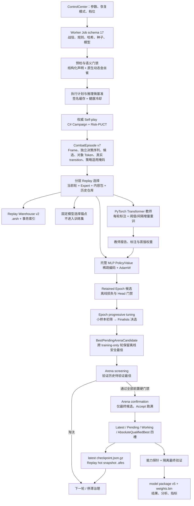

# 独立底模训练器数据流与优化优先级

本文回答四个问题：独立底模训练从哪里开始、各阶段处理什么数据、数据如何跨阶段与跨进程传递、下一轮重训前应先优化和验证什么。本文描述当前工作树中的生产实现，不把尚未取得在线控制权的 Transformer Shadow 路径写成正式 Champion。

## 结论摘要

当前最合适的技术组合是：

- C# 继续负责权威战役模拟、风险敏感 PUCT、种子与公平配对、Replay 治理、检查点和晋级门禁；
- 托管 MLP 继续作为在线策略价值 Champion，状态/动作/隐藏维度为 2048×1024×512，训练、推理和持久化只遍历非零特征；
- PyTorch 继续负责 6 层 Transformer 世界模型教师，复用 CUDA、DataLoader、混合精度和大 Batch 能力；
- Replay 与 checkpoint 使用 C# 自有的有界二进制分片，因为它们既是恢复协议，也是确定性、兼容性和损坏隔离协议；
- RLlib、Arrow/Parquet、SQLite 都可以在边界明确的场景中试点，但现在直接替换整条训练主链会增加跨语言适配、协议迁移和确定性风险，不能自动消除当前最贵的战役搜索工作。

优化顺序应是：先不做无效战役，再减少每个有效决策的计算与分配，然后扩大 GPU 有效 Batch，最后才考虑更换通用数据或分布式框架。

## 性能基线与问题规模

下表是本轮优化前采样到的历史基线，不是协议常量。以后每次重训都应保存同口径的 before/after 报告。

| 观测 | 历史基线 | 含义 |
|---|---:|---|
| 状态逻辑维度 | 1024 | 历史 `partitioned-v3` 基线；当前生产合同已升级为 2048 |
| 状态平均非零数 | 85，约 8.30% | 稠密遍历约做了 12 倍于有效特征数的槽位工作 |
| 动作逻辑维度 | 1024 | 候选动作塔输入合同 |
| 动作平均非零数 | 24，约 2.34% | 稠密遍历约做了 42.7 倍于有效特征数的槽位工作 |
| 独立 Replay 文件 | 约 15,948 个 `.json.gz` | 元数据、open/close、目录枚举和杀毒扫描成本远大于 100 MB 级有效载荷本身 |
| 单文件平均大小 | 约 6.7 KB | 典型“小文件风暴”；同数量按 256 Episodes/Shard 理论上约 63 个满分片，实际还受轮次边界影响 |
| 完整训练墙钟 | 5,174 秒 | 本轮性能归因的总基线；以下阶段数字应按同一次报告比较 |
| Transformer 教师 | 825 秒 | 数据装载、训练、固定 Anchor 评估和标注合计，是 GPU 利用率与增量语料的首要观测点 |
| 独立最终验证 | 802 秒 | 属于必要质量证据，优化方向是减少进入者，而不是删减最终种子 |
| 推理执行计划校准 | 736 秒 | 历史实现代价过高；现在必须由签名缓存、有界微基准和健康冷却控制 |
| Epoch 调优 | 593 秒 | 多候选重复跑战役，适合先离线淘汰再小样本初筛 |
| Arena 初筛 | 690 秒 | 应只产生是否值得确认的证据，不应等价于完整确认 |
| Arena 确认 | 795 秒 | 只允许最终候选进入，并保持完整硬门禁 |
| 能力探针 / Self-play / Replay / MLP | 351 / 174 / 105 / 68 秒 | 不能只盯训练算子；搜索、恢复和数据组织仍各自有独立成本 |
| 三段调优与 Arena 合计 | 2,078 秒，约 34.6 分钟 | 在该次采样中，调优/初筛/确认分别约占 28.5%/33.2%/38.3% |

这些数字说明两个独立问题同时存在：一是“战役根本不该被执行”，二是“必须执行的每一步仍处理了太多零值、对象和小文件”。只提高线程数会同时放大内存、GC 和 I/O 压力，不能替代这两类治理。

## 端到端数据流

图中有三条不同的数据生命线：

1. 权威控制线：规则、种子、搜索结果、Arena 配对和晋级结论，始终由 C# 持有。
2. 训练数据线：`CombatEpisode` 经分层选择后同时供 MLP 和 Transformer 使用；固定锚点被排除在训练集之外。
3. 恢复数据线：完整历史进入 Replay Warehouse，跨进程 checkpoint 只携带热集和恢复元数据，避免每轮复制全部对象图。

进度遥测同时保留两套不可混用的计数：`CompletedCampaigns` 只统计会进入训练、Arena 或验证结论的正式 Campaign；`ExecutedCampaigns` 统计自动调优、权威快检等全部真实执行。控制中心在具有阶段计划时使用 `CurrentPhaseCompletedCampaigns / CurrentPhaseRequestedCampaigns`、`CurrentPhaseCompletedBattles` 和阶段 ETA 驱动进度条，同时把正式训练总量单独展示。自动调优先公布含最多三组 finalists 的上界计划，pilot 结束后只向下收敛到精确计划，避免进度条先到 100% 再倒退。

## 各阶段的输入、输出与传递方式

| 阶段 | 主要输入 | 主要处理 | 主要输出 | 传递与持久化 |
|---|---|---|---|---|
| 0. Job 构建 | 控制中心设置、训练/验证 Campaign、Ruleset、内容集合、初始 Champion | 参数归一化、生成种子分区、绑定规则与内容哈希、选择恢复语义 | `CombatFoundationWorkerJob` schema 17 | Job JSON 交给独立 Worker；路径只传工件位置，不传运行时对象；schema 16 是前代读取边界，schema 13 只走受限修复迁移 |
| 1. 预检 | Job、冻结规则、原生程序包、语义 canary | 协议、哈希、角色准备、规则可构建性和玩家等价信息门禁；结构化动作检查声明/执行一致性，原生脚本通过 `card_10`、`blood_3`、`nocard_2` 等动态 transition 金丝雀验证 | 兼容性诊断、资源计划前提 | 失败立即终止，不生成训练 checkpoint |
| 2. 并发/推理校准 | 硬件键、模型协议、特征版本、张量形状、候选并发档、真实 Replay 样本 | Campaign 并发计划与推理微基准分别签名；64–512 次有界推理样本；运行健康失败时回退 direct 并进入冷却 | `CombatFoundationAutoTuneResult`，Campaign/Inference 两个独立 cache key | `foundation-auto-tune-v12.json`；签名匹配才复用，生产健康窗口成功后才清除失败计数 |
| 3. Self-play | Campaign、Ruleset、当前工作模型、困难种子、执行计划 | C# 权威模拟，Risk-PUCT 搜索；多候选权威教师抽样先实演候选并把 transition 写回决策输入，搜索后复用同一分支评分与审计；普通决策至少对最终选中动作追加一次单步事实写回，不重复 PUCT 搜索 | `CombatCampaignResult`、`CombatEpisode`、案例与困难种子 | 先在内存中进入当前轮 Replay；案例/指标增量写入，完整战斗图不跨最终结果长期保留 |
| 4. Replay 归档与选择 | 当前轮 Episodes、权威内容 Episodes、Expert Replay、历史 Warehouse | 去重、失败/成功/多样性与策略配额采样，建立训练窗口和固定 Anchor | 热 Replay、训练 Replay、历史补样键、选择诊断 | 冷历史写 `.arsh`；跨轮热集写 `.afes`；选择器受 Episode/Frame/估算常驻字节三重上限 |
| 5. 特征编码 | `CombatEpisodeFrame` 状态、候选动作、Token Catalog | `partitioned-v4` 将 2048 维状态按核心/通用/玩家状态/牌区/弃牌耗尽/敌人隔离，并映射为 `int[] tokenIds + float[] values`；动作仍为 1024 维；训练/验证/测试 split 依次编码，单个 split 内保持并行 | `CombatCompactFeatureVector` 与训练稀疏向量 | 内存与 checkpoint 都保存索引/数值列；不再让三个完整 split 的源图和临时编码在同一峰值重叠；状态碰撞目标 3%、硬上限 5%，动作硬上限 6% |
| 6. Transformer 教师 | 选中 Frames、对象 Observation、活跃语料、持久 backlog、固定 Anchor、上一代 `.pt`、已训练/已尝试 identity 水位 | C# 完成稀疏导出后立即释放 Observation、搜索保留区和重复引用，再按运行计划指纹做内存准入；高吞吐 refresh 不满足时，自动尝试单进程 DataLoader、batch/micro-batch ≤64、256-frame shard、关闭 pinned memory、最多 2048 增量帧的低内存 refresh。只有冷启动、最终轮、数据漂移、新 fresh Frames 达阈值，或累计到最大刷新间隔时才重训 | 文件名保持兼容的 `world-model-v2.pt`（内部协议 v4）、独立稳定 Policy/World 教师、候选概率/固定权重蒸馏信号、宿主释放前后内存报告、普通/低内存预测峰值、计划指纹、trained/attempted 水位 | 旧高吞吐峰值只约束相同计划，不污染低内存预测；低内存仍不足才标记可重试资源失败；延后 Frames 留在 backlog。Policy Teacher 连续 3 轮没有新鲜标注则在可恢复 checkpoint 边界熔断 |
| 7. MLP 训练 | 同一有界 Replay、教师蒸馏、训练/验证/测试切分、优化器恢复态 | 稀疏状态/动作编码、Batch 梯度、AdamW、早停、保留候选 | 模型、优化器、Epoch metrics、Top candidates | Epoch checkpoint 进入异步 latest-write pipeline；训练继续时不重复序列化完整 Replay |
| 8. Epoch 调优 | retained epochs 与训练前基线 Head | 每个 epoch 先逐 Head 对比训练前基线，退化候选不进入调优；剩余候选再做离线支配淘汰、小样本 screening 和 finalists 补齐 | 选中 epoch、基线淘汰数、是否全部离线淘汰、执行/节省 Campaign 数 | 全部候选离线失败时只保留一个诊断对象，不运行调优或 Arena |
| 9. Arena | `BestPendingArenaCandidate`、Champion/工作基线、Normal/Advanced 固定种子 | 候选显式经历 `offline-rejected → offline-safe → screening-passed → confirmed-qualified → accepted`；Screening 只表示进入 Confirmation，不能写入合格池。默认 8 + 56 = 64 对/难度，资格所需 pair 数只有 Confirmation 实际完成后才成立 | 成对胜负、深度、行为错误、Wilson/discordant evidence、候选来源 iteration、资格状态 | 前置离线/碰撞/策略门失败时 Arena 为零；旧 checkpoint 中 confirmation 为零的“合格”证据在恢复时降级为 screening；能力探针胜负不一致种子写 `foundation-decision-differences-v1.jsonl`，只作 acceptance diagnostics |
| 10. 轮次边界 | 最新训练模型、离线安全待验证最佳、已验证工作模型、绝对合格模型及证据、Replay 热集、训练调度、Telemetry | 四个模型槽独立写入 checkpoint；training-only 可更新 latest 和 pending，不得覆盖 working/qualified；外部用户恢复与轮次隔离的内部恢复分别写 `ResumeProvenance`；≤40 GiB 主机每个子进程只跑一轮，模型训练并行上限 12 | 可精确续训状态、原始恢复请求/实际来源、内部 segment 号、下一轮位置、不会被后续未验证权重覆盖的候选 | gzip latest + `.bak`、不可变 checkpoint 目录、`.afes` 快照；控制中心按 `NextIteration`/创建时间选择最新可续训项，“模型推荐”只作模型质量标记，不再覆盖更新的训练状态 |
| 11. 最终验收 | 历史 `AbsoluteQualifiedBest`、隔离验证种子、能力探针 | 最终轮验证历史最优且完成 Confirmation 的合格候选，而不是最后一次训练权重；能力探针必须形成可信 `pass` | 正式 Champion 或拒绝；分析、指标、案例、决策差异 | 只有 accepted 候选生成 package；拒绝结果移除所有网络权重与失败遭遇对象图，只保留诊断、指标和独立可恢复 checkpoint |

### 一帧数据如何变成梯度

`CombatEpisodeFrame` 保存状态指纹、独立递增的 `DecisionSequence`、模拟器 `ActionSequence`、稀疏状态特征、对象 Observation、候选列表、实际执行候选、终局信用目标，以及指向“录制流中真实下一决策帧”的 transition。跨回合时允许 ActionSequence 不变，transition 的顺序由 DecisionSequence 证明。Episode 完成时每帧都有显式 terminal-known 标签；survival/finale/bank/transform/growth 分别保存“该策略在本帧是否适用”与“实际动作是否命中”的掩码/目标，阶段分类另走 phase head。每个 `CombatEpisodeCandidate` 保存合法性、搜索访问/价值/风险/分位数及稀疏动作特征。训练选择器先按 Episode 与 Frame 层级做配额和信息价值筛选，再生成三类输入：

- MLP：状态稀疏向量、执行动作与候选稀疏向量、策略访问分布、价值/死亡/剩余生命/剩余回合等监督目标；
- Transformer：完整决策关键对象序列、类型化动作、DecisionSequence 历史顺序、真实相邻下一状态、transition span/跨回合标志/ActionSequence delta、独立 phase、逐策略 applicability + multi-hot 与已知 terminal 标签；
- 治理：策略层覆盖、碰撞率、困难种子、终局一致性和 Arena 公平配对证据。

这三类数据共享来源，但不能互相替代。尤其 Transformer 教师的改善不能绕过 C# 权威 Arena 和最终验证。

## 当前存储协议

| 工件 | 当前格式 | 原子性与完整性 | 恢复语义 |
|---|---|---|---|
| Active checkpoint | `foundation-training-checkpoint-v12.json.gz` | 同目录唯一 temp、流式 gzip、`Flush(true)`、原子 Replace/Move、保留 `.bak`；实际 magic 为 `1F 8B` | 先 v12 主/备，再自动探测兼容的 v11 主/备；显式选择只读指定文件 |
| Episode snapshot | `*.snapshot-*.afes`，storage v5，magic `AURAFES5` | 固定头、记录数、gzip payload、每记录 length + CRC32、payload SHA-256、外部长度/哈希；单记录读写上限对称，记录总数上限 1,000,000 | 任一头、长度、哈希、CRC、计数、上限或尾部不一致都拒绝整份快照；v4 JSONL 仍可读取 |
| Replay Warehouse | 兼容目录 `foundation-replay-warehouse-v1/` 内使用 v2 的 `shards/.../*.arsh` | 每 shard 最多 256 Episodes；`AURARP2S/AURARP2E` 头尾、gzip、记录 CRC；shard 内嵌本 shard 实际 compact token 的 `id → name` 目录及 CRC；一个 Archive 批次只追加一条索引事务 | shard 可独立按 name 重映射到当前进程 canonical token id。v1 批量迁移只在 v2 shard、索引提交和回读验证全部成功后删除小文件，再原子压缩 v1 index，避免后续启动重复解析上万条已迁记录；compact-only v1 缺目录时拒绝迁移并保留原件与索引行 |
| Replay index | `replay-index-v2.jsonl` | 每行是带 SHA-256 checksum 的完整批事务并强制落盘；只截断未终止的损坏尾行 | 中段坏行或旧无 checksum v2 将恢复标为 uncertain：仍保留、读取后续可解析且 shard 自校验的事务，但禁止 orphan GC 和物理删除；不把半条事务当成功 |
| Checkpoint catalog | `foundation-checkpoint-catalog-v1.json`，最多 8 项 | 原子替换并保留 `.bak`；generation + catalog checksum；每项绑定 checkpoint 内容哈希及 `.afes` descriptor/hash | 主文件先做 checksum、语义、固定路径和文件存在性验证，失败才尝试 backup；GC retained set 是所有有效 primary + backup 代的可达集，并额外保留 active checkpoint `.bak` 描述的快照。真正选中恢复时再校验所选 checkpoint 内容哈希并由 `.afes` 读取器校验 snapshot。缺 catalog 但存在历史工件、旧无 checksum 代或双份无效时进入 uncertain 并禁止破坏性 GC；旧代深验后可无 GC 升级 |
| Model anchor | `foundation-model-selection-anchor-v1.jsonl` | 首次形成后固定 | 后续迭代与续训共享，且从训练输入排除 |
| Transformer corpus | `generations-v1/<generation>/` 内的 `world-model-corpus-v4.sparse.jsonl`、`world-model-backlog-v1.sparse.jsonl`、identity index、manifest，以及 `active-generation-v1.json` | active 与 backlog 全部写入 staging；按长度、SHA-256、行数、identity、两区无重叠和策略分布完整校验后原子发布，最后切换 active pointer；完整 Journey run 不拆分，超出 active 容量的行进入 backlog | active 损坏自动回退最近完整代；未训练/已尝试 identity 水位跨 active/backlog 轮换保留；每次刷新优先把尚未训练的 backlog run 轮入活跃窗口，容量只限制单次训练，不再代表永久数据丢弃 |
| Transformer training watermark | `trained-frame-identities-v1.txt` + `attempted-frame-identities-v1.txt` | trained 仅在更新通过且模型/报告提交后推进；attempted 在一次真实训练刷新完成后推进，即使更新被质量门拒绝也记录“已经尝试” | 未通过更新的 pending 数据成为 retry；下一轮同时取 fresh、retry 和旧数据 replay。连续拒绝会提高 replay 比例，避免同一小批新数据反复把教师推离历史分布 |
| Transformer 运行与标注缓存 | `runtime-auto-tune-v4.json`（内部 v6 容量桶协议）+ `transformer-annotation-cache-v1.sqlite` | runtime key 对动作/Object/History 使用向上取整的 2 次幂容量桶；annotation 以稳定教师模型 SHA-256、Frame identity 和候选数校验 | annotation-only 未命中只使用安全默认计划，不跑 backward probe；稳定教师复用固定 Anchor 指标；完全命中时不再执行模型前向标注 |
| Foundation 模型槽 | checkpoint 内 `LatestTrainingModel`、`BestPendingArenaCandidate`、`WorkingChampion`、`AbsoluteQualifiedBestModel` + `AbsoluteQualifiedBestEvidence` | latest 每次训练可推进；pending 只接收离线 Head、策略配额和特征碰撞门均通过的模型，并按固定 Anchor 优先选择；working 只能由 Arena 工作窗口推进；qualified 只能由绝对资格门推进 | training-only 可推进 latest/pending，但不能覆盖 working/qualified；最终 Arena 从 pending 取历史待验证最佳，最终验收从 qualified 取历史合格最佳 |
| 训练结果 | `.live` 边界快照；终态 package v5 JSON + weights v5 binary、能力报告、SQLite、analysis JSON、metrics JSONL、decision-differences JSONL | 轮次边界只原子写模型/节点；终态 SQLite 在临时路径完整提交后原子替换；正式包带协议、哈希与晋级证据 | 只有完整通过最终门禁的包可进入发布路径；拒绝终态仍保留诊断模型、报告和过程库，续训只读取独立 checkpoint |

存储层的目标不是“把 JSON 改成二进制”这么简单，而是同时降低文件数、限制峰值内存、提供崩溃边界，并让恢复结果可验证。压缩比只是次级指标。

## 优化优先级

### P0：先消除无效战役与错误恢复

| 工作 | 当前策略 | 验收指标 |
|---|---|---|
| 禁止正式循环反复完整战役推理调参 | Campaign 与 inference cache 独立签名；推理只做有界微基准；健康失败进入 2 小时起步的指数冷却 | 第二轮签名命中时 `Measurements` 不新增完整 Campaign；缓存失配只重标定受影响的一侧 |
| 缩短 Campaign Auto-Tune | 缓存命中直接复用；同硬件签名变化验证缓存候选/最大并行；普通失配比较最大/半并行；warmup 最多 8 场，pilot 与 confirmation 各一完整波 | `CacheMissReason` 和 `CampaignCalibrationKind` 非空；20 路并行普通冷标定最多 88 场，缓存候选等于最大并行时最多 48 场 |
| Epoch progressive elimination | 每个 epoch 先对训练前基线做全部 Head 非退化门；小样本 screening 后只补齐 finalists | `TuningOfflineRejectedCandidates` 与 `TuningCampaignsSaved > 0`；全部离线失败时 tuning/Arena Campaign 均为零 |
| Arena 两级淘汰 | training-only 先积累 pending；Screening 只能标记 `screening-passed`，完整 Confirmation 后才是 `confirmed-qualified` | 合格证据 pair 数严格等于 screening + confirmation；只完成 8 对 screening 的候选不能进入合格池或最终选择 |
| 恢复与损坏隔离 | checkpoint 主/备、v11 discovery、索引尾修复、坏 shard 可重归档、catalog 不确定时禁 GC | 截断/损坏注入后不返回部分记录、不丢已提交前缀、可继续 Archive 并跨重启读取 |
| Transformer 内存与失败熔断 | 稀疏导出后先释放宿主大对象；普通 refresh 失败时按独立计划指纹尝试低内存 refresh；资源不足可重试，但连续 3 轮无新鲜 Policy Teacher 后 fail-closed | 报告同时记录普通/实际预测峰值、fallback attempted/applied、计划指纹、宿主释放前后 WS/GC heap；约 6 GiB 可用时不再被旧 9.17 GiB 高吞吐峰值直接拒绝；陈旧超限时 checkpoint 可恢复 |
| 高级失败首决策差异 | 只选择能力探针中同种子胜负不一致样本，复跑规则基线和候选并按 battle/decision/state fingerprint 对齐 | 输出首个不同动作、双方搜索值/风险/访问量和分类；固定为 `acceptance-diagnostic`、`TrainingEligible=false`、`AcceptanceSeedRetired=false` |

P0 最优先，因为它同时保护训练语义和节省最多的战役墙钟时间。任何吞吐优化都不得以减少公平配对、改变种子前缀或放松最终质量门禁为代价。

### P1：降低每个有效样本的 CPU、I/O 与 GPU 空转

| 工作 | 当前策略 | 下一轮重点观测 |
|---|---|---|
| 稀疏状态/动作 | Token ID + FP32 value；MLP 状态塔/动作塔只遍历非零桶；动作塔嵌入按线程/模型有界复用 | 平均非零数、乘加削减、每次推理分配字节、字典临时物化次数 |
| Replay/Checkpoint 分片 | `.arsh` 最多 256 Episodes，`.afes` 在快照粒度压缩；latest 写入合并中间请求 | shard 数、每次 Archive fsync 数、checkpoint 秒数、coalesced writes、恢复吞吐 |
| Transformer 吃满 GPU | 正常计划保留 Batch/micro-batch、shard、pinned memory、prefetch 与 AMP；内存门不通过时切换 batch/micro-batch ≤64、256-frame shard、零 DataLoader worker、无 pinned memory 的刷新计划；runtime cache key 包含这些内存参数 | 分开统计 `training-refresh` 与 `training-refresh-low-memory` 的 GPU 利用率、DataLoader wait、平均 Batch、frames/s、进程树工作集和显存峰值；低内存计划不得命中高吞吐调优缓存 |
| 增量教师训练 | 每轮稳定教师标注，默认 GPU 每 3 轮或 fresh ≥2048 才 refresh，最终轮强制 refresh；语料身份去重、按完整 run 选择；通常至少 25% 旧 replay，连续一次/两次拒绝升到 50%/75%，同时按 2/4 倍刷新间隔退避；最多 4096 增量帧；warm start、固定 Anchor | `TrainingRefreshed`、`RefreshReason`、fresh/threshold/interval、`RefreshRejectedUpdateStreak`、`RefreshLastAttemptIteration`、fresh/retry/replay/pending/deferred、`IncrementalReplayEscalationLevel`、Anchor Head 回归与两条水位；稳定复用轮不得启动完整训练 |
| 策略正负定向补数 | 上一轮教师仅在 applicability ≥8 时检查 transform/growth；正样本或负样本少于 4 才向下一轮 Replay 请求对应 class，零适用策略不盲目补数 | `strategy-growth[-negative]` / `strategy-transform[-negative]` 缺口、定向 Campaign 产出与补入 Frames；不得把“有机会但未选择”误算为正样本 |

对象 Token 和动力学完整性是世界教师硬门禁：对象 Token 覆盖率与 terminal-known 必须至少 95%，训练集和固定验证集都必须含真实 transition，且不得出现“声明存在但来源无效”的 transition。策略头只在逐标签 applicability 掩码内计算损失；某一适用策略头必须同时具有正、负监督才通过策略质检，不再要求 95% 的所有帧都强行产生策略标签。决策关键对象不会为满足配置上限而被截断；动作候选已有独立动作塔，因此教师对象序列可排除重复的 ActionCandidate Token。报告固定写 `ObjectTokenAuditAdvisoryOnly=false`。

### P2：优化搜索、批推理和资源相位

- 继续扩大安全的同决策批推理和不可变动作塔复用；不跨决策缓存可变状态、随机数或候选合法性结果。
- PUCT 的状态 Arena、动作语义、节点/边/Outcome/Evidence 只在线程/战役安全边界内复用；下一次搜索前分别把状态/节点高水位收缩到 8,192、边/Outcome 到 32,768、Evidence 到 65,536，并先断开循环对象图；每轮资源边界仍完整清空。
- 搜索预算按规则熵、风险和 Boss/困难教师状态动态分配；节省量必须与胜率、死亡风险和行为门禁一起观察。
- 检查点序列化维持独立 1–2 路，不与 Campaign、MLP 和 Python 线程简单相加。
- 使用阶段增量 CPU、分配率、搜索/秒、推理 Batch fill 和 GPU 指标定位瓶颈，不根据整机平均 CPU 猜并发。

## 本轮开发验证证据

这些是开发机上的小规模门禁与微基准，不是新底模的正式训练结果，也不能替代 5,174 秒历史任务的同配置 before/after 重跑。

| 验证 | 结果 | 能证明什么 |
|---|---|---|
| 共享 Combat AI 行为套件 | Release 零警告，692 条断言通过；共享 `net472` 运行时与 AuraToolsExp 消费者构建通过 | 新增专用实时决策 lane、执行抢占、协作取消/硬截止、单次状态准备、注册表修订发布、v8→v9 样本迁移与无终局 UI 快照回报；既有 Arena、Teacher、恢复和发布合同仍未被绕过 |
| 稀疏推理代表负载 | 输入密度 1.5%，混合路径乘法槽位减少 98.5%；稳态约 155 µs/evaluation、1,040 B/input | 1024 逻辑维度可保留，同时让热路径按非零特征工作；该数字是测试夹具，不是全战役平均值 |
| Replay v2 微基准 | 600 Episodes 写成 3 个 shard，本机复跑约 6,988 Episodes/s；86 条 Worker 存储/损坏恢复/兼容、轻量边界产物与教师安全聚合断言通过 | 额外验证普通计划继承旧 8 GiB 峰值时预测 >9 GiB，而低内存计划不继承不匹配峰值并预测 <4 GiB；active/backlog 轮换与无丢弃合同保持通过 |
| Resident DataLoader 修正 | 同一小规模负载由约 4.52 GiB、2.39 秒、127 frames/s 改为约 2.36 GiB、0.17 秒、3,523 frames/s；续轮观测到约 5,856 frames/s | resident 数据集不再错误复制到多个持久 worker；大语料仍需用 shard 路径单独测量 |
| CUDA 确定性自检 | 两次运行的 policy CE `1.343528838384719`、dynamics MSE `0.2689806265490396`、outcome MAE `0.3610883802175522` 完全一致；稀疏 payload 减少 83.196% | 冷/热 runtime cache 与调优探针不会改变正式训练 RNG；吞吐计时允许正常波动 |
| 故障 signed Seed CUDA 自检 | 本次 `-1465117897` 连续两次运行的 policy CE `1.2543609558589874`、dynamics MSE `0.2808410567896707`、outcome MAE `0.3503987640142441` 完全一致；原正 Seed `1701` 的上述既有基线也逐字段不变 | NumPy 使用 `2829849399` 后不再越界，同时没有把 Python/Torch/划分语义整体改成 unsigned |
| 故障 RunSeed 三轮 CUDA 集成 smoke | 完整 RunSeed `13786276755866915639`，2 epochs，142.1 秒，`campaigns=166/422`、`battles=12,060`，最终 `cacheHit=true`；三个独立 Worker 子进程及 exact checkpoint resume 状态机全通过 | 真实发布 Worker → Python → NumPy → CUDA 链已覆盖原报错值；进程隔离后 Seed、模型、固定 Anchor 与 generation 均可继续恢复 |
| Foundation Worker 发布链 | 发布产物 smoke 通过，`campaigns=248/288`、`battles=10,051`；冷启动段实测选择 `每进程迭代=1`、`模型训练并行=12`，行为测试验证健康段升至 2/20、压力段退回 1/12；Worker、ControlCenter 与 Simulation Viewer 已重新发布 | v17 Job/Progress/Result/Checkpoint、轮次隔离、最新续训、恢复、终态产物与查看器链通过 |
| Worker/ControlCenter 与共享消费者 | 两个 Trainer Release 构建及三个主 Shared 消费者均零警告；发布 Python 与源码 SHA-256 同为 `D54F3687353857FD8C26B844BA094B7FF277723C04ED044AC64D86DC4D170C80`；兼容基线 1721 项、`Aura.Shared.dll` packaging gate 通过 | 当前发布目录的 Worker、ControlCenter、Teacher 脚本及游戏 Mods 内 Shared DLL 已通过发布/打包门禁 |
| 正式模型工件门禁 | 按设计 fail-closed：仓库既有 `foundation-model-package-v5.json` 仍声明 `partitioned-v3`，当前运行时要求 `partitioned-v4`；foundation/combat-ai profile 均只在 training-artifacts 步骤停止 | 本轮没有改写或发布该旧业务模型；当前恢复训练必须产出通过完整 Arena/Validation 的新 v5 包，整体发布档才会变绿 |

正式重训仍应保存完整阶段时间、GPU 利用率、I/O、Campaigns saved 和同种子质量结果；只有这组数据才能回答总墙钟改善了多少。

当前仍有两个非阻断 P2 诊断债：Python 原始 report 与 C# 最终 iteration report 仍共用一个物理路径，同一 iteration 恢复若再次在最终覆盖前崩溃，可能损坏该 standalone 报告，但不会覆盖 persistent 稳定教师；跨子进程最终结果的顶层 `TransformerTeacherReports` 目前只含最终 child，完整逐轮报告仍保存在 `Iterations[i].TransformerTeacher` 与 iteration 文件中。它们不影响训练应用门或本次重训，但后续应分别改为 `.python.json`/C# final 双路径，并从 resume iterations 重建顶层聚合。

### P3：证据驱动的框架或存储替换

只有 P0–P2 稳定后，才做可回滚的旁路实验。P3 不能成为下一次正式重训的前置条件。

## 成熟框架评估

| 候选 | 能解决什么 | 现在不直接迁移的原因 | 采用触发条件 |
|---|---|---|---|
| PyTorch | Transformer、CUDA、DataLoader、多进程预取、AMP、优化器与 `.pt` 工件 | 已在教师边界使用，继续利用即可；把 C# 权威模拟搬进 Python 没有收益 | 保留并加强。依据官方 [DataLoader](https://docs.pytorch.org/docs/stable/data.html)、[AMP](https://docs.pytorch.org/docs/stable/accelerator/amp.html) 和[可复现性说明](https://docs.pytorch.org/docs/stable/notes/randomness.html)做配置与验收 |
| RLlib / Ray | 多节点 EnvRunner、分布式采样、离线 RL、弹性调度 | 当前环境是 C# 权威长战役、动态候选动作、严格同种子配对和自定义晋级；仍需自行实现 external environment/connector，且迁移不减少单次 PUCT 搜索成本。RLlib 的 [environment](https://docs.ray.io/en/latest/rllib/rllib-env.html) 与 [offline data](https://docs.ray.io/en/latest/rllib/rllib-offline.html) 能力不是现有协议的即插即用替代 | 单机 P0–P2 完成后仍需多主机扩展，且先有独立的 C# Env adapter、确定性对拍与收益基准 |
| Apache Arrow / Parquet | 列式扫描、跨语言交换、离线 SQL/分析、批量统计 | `CombatEpisode` 含嵌套可变长对象、候选和恢复状态；热路径需要追加事务、损坏隔离和按 Episode 重放，不只是列式分析。现在替换 `.arsh/.afes` 会重做协议和兼容层 | 先用于只读分析副本或 Transformer 语料旁路；当 JSONL 解析/列选择成为已测瓶颈时按 [Arrow](https://arrow.apache.org/docs/) 与 [Parquet](https://arrow.apache.org/docs/python/parquet.html)做 A/B |
| SQLite | 元数据事务、索引、筛选查询 | 单 Worker 排他写、主体是顺序大 BLOB；把压缩 Episode 放入数据库会引入页写放大、VACUUM/备份和新的损坏域，不能替代模型/Replay 内容校验 | 当目录需要多进程并发查询、按多维条件频繁随机检索时，可只迁 metadata/catalog，不迁 shard payload |
| ONNX Runtime / LibTorch | 统一 CPU/GPU 推理后端 | 当前在线 Champion 是高度稀疏的托管 MLP，Transformer 仍是教师；跨后端会改变数值和打包门禁 | Transformer 获准进入在线 Shadow 性能对比，且批量推理收益覆盖跨边界与部署成本后再评估 |

因此，“利用成熟框架”的答案是选择性复用：训练算子交给 PyTorch，权威环境和恢复协议留在 C#。框架应缩小自研面，而不是夺走已经验证过的权威边界。

## 如何判断下一项优化是否值得做

每项优化至少同时报告四组指标：

1. 工作量：Campaigns executed/saved、搜索 simulations、推理 requests/batches、训练 frames。
2. 吞吐：Campaigns/s、search/s、inference evaluations/s、Transformer frames/s。
3. 资源：阶段 CPU、GPU 利用率/显存、工作集、分配 MB/s、Gen2/s、I/O 次数与字节。
4. 质量：同种子胜率、死亡率、完成深度、Head loss/Brier、行为错误、Arena discordant pairs 和最终硬门禁。

如果只看到总墙钟下降而 Campaign 数、种子前缀、有效配对数或最终证据量也下降，就不能认定为等价优化。若吞吐提高但分配率和尾延迟恶化，应先检查过度并发或 Batch 等待，而不是继续加线程。

## 重新训练前检查清单

### 代码与协议

- [ ] 固定本次训练使用的提交、Worker/ControlCenter 二进制 SHA-256、Python 脚本和配置快照。
- [ ] 确认 Worker schema 17、Episode v8 / feature schema 30、在线样本 v9 / feature schema 11、selection v2、交互契约与 trace v2、Transformer model/report v4、sparse dataset v3、`.afes` v5、Replay Warehouse v2、model package v5 一致；schema 16 只允许进入显式兼容判断，角色被动/搜索/交互语义不一致必须 fresh，schema 13 只允许走既有修复迁移。
- [ ] 明确选择“全新训练”“精确续训”或“模型分支”；不要让旧优化器状态混入新参数语义。
- [ ] 核对 Ruleset、Native Program、ContentSet、OwnerModSet 和 Campaign 哈希均已冻结。
- [ ] 确认 `ReuseAutoTuneCache=true`；旧设置已迁移，UI 开关状态与实际 Job 一致。

### 自动测试

- [ ] 运行 `powershell -NoProfile -ExecutionPolicy Bypass -File tools/Test-AuraCombatAi.ps1 -Configuration Release`。
- [ ] 运行 `powershell -NoProfile -ExecutionPolicy Bypass -File tools/Test-AuraFoundationTrainerStorage.ps1 -Configuration Release`，当前 Worker 聚合基线应通过 70 条断言。
- [ ] 运行 `powershell -NoProfile -ExecutionPolicy Bypass -File tools/Test-AuraFoundationTrainer.ps1 -Configuration Release`，覆盖 Worker、gzip checkpoint、`.afes` 与最终结果 smoke。
- [ ] 构建 `AuraFoundationTrainer.ControlCenter/AuraFoundationTrainer.ControlCenter.csproj` 和 `AuraFoundationTrainer.Worker/AuraFoundationTrainer.Worker.csproj` 的 Release 配置。
- [ ] 对 v11 active checkpoint、损坏 catalog primary + 有效 `.bak`、缺失 catalog + 历史工件、截断 index 尾、中段 checksum 位翻转、compact token 跨进程重映射、缺 token catalog 拒绝迁移、损坏 shard 后重归档各做一次恢复注入测试。

### 数据与容量

- [ ] 备份当前模型包、checkpoint catalog、成功案例库和 Auto-Tune cache；不要只备份 latest 指针。
- [ ] 检查 Replay Warehouse 没有 reparse point，索引尾已修复，所有保留 shard 可完整校验。
- [ ] 记录当前 Replay Episodes/Frames、Normal/Advanced/失败样本占比、策略配额缺口和估算常驻字节。
- [ ] 为 checkpoint、Warehouse、Transformer corpus、临时 shard 和最终包预留磁盘；预留空间不能只按压缩后 corpus 大小计算。
- [ ] GPU 训练前确认 Python、PyTorch、CUDA、NumPy probe 通过，显存预算包含模型、优化器、Batch、prefetch 与 128 MiB 保留线。
- [ ] 用同一 seed 和数据各跑一次 runtime cache 冷启动与命中路径，确认关键 loss 完全一致；用单 Journey run 验证“训练拒绝、仅评估允许”，且不会创建受污染的固定 Anchor。

### 小规模基线

- [ ] 先跑 Preflight 和一轮小规模训练，保存各阶段墙钟、CPU/GPU、分配、I/O、Batch fill 和 Campaigns saved。
- [ ] 连跑第二轮确认 Campaign/Inference cache 各自命中；不得再次执行完整战役式推理标定。
- [ ] 对 fixed seeds 比较 direct 与 sharded-batch 的模型输出、动作排序和 Arena 结果；健康失败切换后 baseline 已重置。
- [ ] 确认 Epoch 初筛确实淘汰非 finalists，Arena 未通过 screening 时 confirmation 为零。
- [ ] 确认进入 confirmation 的 Accept 候选跑满配置 pair 数；Reject 早停只发生在剩余样本也不可能逆转时。
- [ ] 连跑至少 3 个 training-only 轮，确认 `LatestTrainingModel` 可以推进、`BestPendingArenaCandidate` 只在固定 Anchor 更优时替换，下一 Arena 显示正确的候选来源 iteration。

### 正式启动与监控

- [ ] 保存本轮性能基线：85/1024、24/1024、历史文件数与 593/690/795 秒只能作为旧对照，不能混入新测量口径。
- [ ] 设定阶段级告警：checkpoint write failure、index repair、corrupt shard、cache cooldown、inference timeout、GPU OOM、DataLoader starvation。
- [ ] 监控 Transformer `IncrementalPendingFrames` 与 `IncrementalDeferredFrames`；它们应在后续轮次归零，不能因当轮没有新增导出而永久停留。
- [ ] 同时监控 `IncrementalFreshFrames`、`IncrementalRetryFrames`、`IncrementalReplayFrames` 与 replay escalation；教师更新被拒绝后不得继续以几乎全新数据重试。
- [ ] 监控 `TrainingRefreshed/RefreshReason/RefreshFreshPendingFrames`：未到阈值和间隔的轮次必须是稳定教师仅标注，最终轮必须刷新；growth/transform 仅在有 applicability 时产生正负定向缺口。
- [ ] 每个 iteration 边界确认 latest、`.bak`、`.afes`、catalog 和 Warehouse 可恢复后，再允许子进程退出并进入下一轮。
- [ ] 正式 Champion 只从持久化 `AbsoluteQualifiedBest` 的完整最终验证产出；Transformer teacher、latest-training、working-window 和 checkpoint-only 均不得被发布逻辑误标为 Champion。

完成以上清单后再开始新的底模训练，才可以把性能变化归因于本轮实现，而不是协议漂移、缓存失配、损坏恢复或参数变更。
