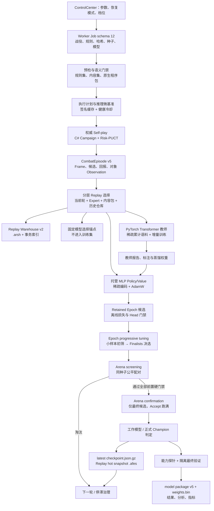

# 独立底模训练器数据流与优化优先级

本文回答四个问题：独立底模训练从哪里开始、各阶段处理什么数据、数据如何跨阶段与跨进程传递、下一轮重训前应先优化和验证什么。本文描述当前工作树中的生产实现，不把尚未取得在线控制权的 Transformer Shadow 路径写成正式 Champion。

## 结论摘要

当前最合适的技术组合是：

- C# 继续负责权威战役模拟、风险敏感 PUCT、种子与公平配对、Replay 治理、检查点和晋级门禁；
- 托管 MLP 继续作为在线策略价值 Champion，逻辑维度仍为 1024，但训练、推理和持久化尽量只遍历非零特征；
- PyTorch 继续负责 6 层 Transformer 世界模型教师，复用 CUDA、DataLoader、混合精度和大 Batch 能力；
- Replay 与 checkpoint 使用 C# 自有的有界二进制分片，因为它们既是恢复协议，也是确定性、兼容性和损坏隔离协议；
- RLlib、Arrow/Parquet、SQLite 都可以在边界明确的场景中试点，但现在直接替换整条训练主链会增加跨语言适配、协议迁移和确定性风险，不能自动消除当前最贵的战役搜索工作。

优化顺序应是：先不做无效战役，再减少每个有效决策的计算与分配，然后扩大 GPU 有效 Batch，最后才考虑更换通用数据或分布式框架。

## 性能基线与问题规模

下表是本轮优化前采样到的历史基线，不是协议常量。以后每次重训都应保存同口径的 before/after 报告。

| 观测 | 历史基线 | 含义 |
|---|---:|---|
| 状态逻辑维度 | 1024 | 模型输入合同，不能仅为性能随意改维度 |
| 状态平均非零数 | 85，约 8.30% | 稠密遍历约做了 12 倍于有效特征数的槽位工作 |
| 动作逻辑维度 | 1024 | 候选动作塔输入合同 |
| 动作平均非零数 | 24，约 2.34% | 稠密遍历约做了 42.7 倍于有效特征数的槽位工作 |
| 独立 Replay 文件 | 约 15,948 个 `.json.gz` | 元数据、open/close、目录枚举和杀毒扫描成本远大于 100 MB 级有效载荷本身 |
| 单文件平均大小 | 约 6.7 KB | 典型“小文件风暴”；同数量按 256 Episodes/Shard 理论上约 63 个满分片，实际还受轮次边界影响 |
| 完整训练墙钟 | 5,174 秒 | 本轮性能归因的总基线；以下阶段数字应按同一次报告比较 |
| Transformer 教师 | 825 秒 | 数据装载、训练、固定 Anchor 评估和标注合计，是 GPU 利用率与增量语料的首要观测点 |
| 独立最终验证 | 802 秒 | 属于必要质量证据，优化方向是减少进入者，而不是删减最终种子 |
| 推理执行计划校准 | 736 秒 | 历史实现代价过高；现在必须由签名缓存、有界微基准和健康冷却控制 |
| Epoch 调优 | 593 秒 | 多候选重复跑战役，适合先离线淘汰再小样本初筛 |
| Arena 初筛 | 690 秒 | 应只产生是否值得确认的证据，不应等价于完整确认 |
| Arena 确认 | 795 秒 | 只允许最终候选进入，并保持完整硬门禁 |
| 能力探针 / Self-play / Replay / MLP | 351 / 174 / 105 / 68 秒 | 不能只盯训练算子；搜索、恢复和数据组织仍各自有独立成本 |
| 三段调优与 Arena 合计 | 2,078 秒，约 34.6 分钟 | 在该次采样中，调优/初筛/确认分别约占 28.5%/33.2%/38.3% |

这些数字说明两个独立问题同时存在：一是“战役根本不该被执行”，二是“必须执行的每一步仍处理了太多零值、对象和小文件”。只提高线程数会同时放大内存、GC 和 I/O 压力，不能替代这两类治理。

## 端到端数据流

图中有三条不同的数据生命线：

1. 权威控制线：规则、种子、搜索结果、Arena 配对和晋级结论，始终由 C# 持有。
2. 训练数据线：`CombatEpisode` 经分层选择后同时供 MLP 和 Transformer 使用；固定锚点被排除在训练集之外。
3. 恢复数据线：完整历史进入 Replay Warehouse，跨进程 checkpoint 只携带热集和恢复元数据，避免每轮复制全部对象图。

## 各阶段的输入、输出与传递方式

| 阶段 | 主要输入 | 主要处理 | 主要输出 | 传递与持久化 |
|---|---|---|---|---|
| 0. Job 构建 | 控制中心设置、训练/验证 Campaign、Ruleset、内容集合、初始 Champion | 参数归一化、生成种子分区、绑定规则与内容哈希、选择恢复语义 | `CombatFoundationWorkerJob` schema 12 | Job JSON 交给独立 Worker；路径只传工件位置，不传运行时对象 |
| 1. 预检 | Job、冻结规则、原生程序包、语义 canary | 协议、哈希、角色准备、规则可构建性和玩家等价信息门禁 | 兼容性诊断、资源计划前提 | 失败立即终止，不生成训练 checkpoint |
| 2. 并发/推理校准 | 硬件键、模型协议、特征版本、张量形状、候选并发档、真实 Replay 样本 | Campaign 并发计划与推理微基准分别签名；64–512 次有界推理样本；运行健康失败时回退 direct 并进入冷却 | `CombatFoundationAutoTuneResult`，Campaign/Inference 两个独立 cache key | `foundation-auto-tune-v12.json`；签名匹配才复用，生产健康窗口成功后才清除失败计数 |
| 3. Self-play | Campaign、Ruleset、当前工作模型、困难种子、执行计划 | C# 权威模拟，Risk-PUCT 搜索，按稳定索引提交并记录选择 | `CombatCampaignResult`、`CombatEpisode`、案例与困难种子 | 先在内存中进入当前轮 Replay；案例/指标增量写入，完整战斗图不跨最终结果长期保留 |
| 4. Replay 归档与选择 | 当前轮 Episodes、权威内容 Episodes、Expert Replay、历史 Warehouse | 去重、失败/成功/多样性与策略配额采样，建立训练窗口和固定 Anchor | 热 Replay、训练 Replay、历史补样键、选择诊断 | 冷历史写 `.arsh`；跨轮热集写 `.afes`；选择器受 Episode/Frame/估算常驻字节三重上限 |
| 5. 特征编码 | `CombatEpisodeFrame` 状态、候选动作、Token Catalog | 逻辑 1024 维映射为 `int[] tokenIds + float[] values`；仅兼容访问时临时物化字典 | `CombatCompactFeatureVector` 与训练稀疏向量 | 内存与 checkpoint 都保存索引/数值列；不再为每帧长期保存 1024 个浮点零值 |
| 6. Transformer 教师 | 选中 Frames、对象 Observation、历史累计语料、固定 Anchor、上一代 `.pt`、已训练 identity 水位 | 只按完整 Journey run 选取；至少两个 run 才训练，固定 Anchor 与训练 run 永不重叠；pending run 优先、确定性有界 Replay 次之；最坏 Token 形状校准，Adam 状态预分配，CUDA OOM 二分降 micro-batch，`auto` 可安全回退 CPU | `world-model-v2.pt`、C# 最终门禁报告、候选概率/蒸馏信号、成功提交后的 identity 水位 | C# 以文件和命令行启动 Python；signed Int32 主 Seed 在 NumPy legacy 边界按二进制补码映射为 uint32，Python/Torch/数据划分仍保留原 Seed；恢复时 checkpoint RunSeed 为权威来源。累计语料以 generation 目录事务发布，≤4096 帧 resident，否则按 512-frame shard；确定性配置、协议或执行边界故障会先写可恢复 checkpoint 再阻断正式底模，不再重复后续轮次 |
| 7. MLP 训练 | 同一有界 Replay、教师蒸馏、训练/验证/测试切分、优化器恢复态 | 稀疏状态/动作编码、Batch 梯度、AdamW、早停、保留候选 | 模型、优化器、Epoch metrics、Top candidates | Epoch checkpoint 进入异步 latest-write pipeline；训练继续时不重复序列化完整 Replay |
| 8. Epoch 调优 | 通过离线损失与输出 Head 门禁的 retained epochs | 所有候选先跑小样本 screening；按稳定得分和 epoch 顺序只保留 finalists，再补齐剩余种子 | 选中 epoch、执行/节省 Campaign 数、失效数 | 只传候选模型与聚合证据；同一候选集合使用固定调优种子区间 |
| 9. Arena | 选中候选、Champion/工作基线、Normal/Advanced 固定种子 | Screening 先做非劣/恢复/离线 Head/碰撞/策略配额门禁；通过者才 Confirmation；两侧公平配对 | 成对胜负、深度、行为错误、Wilson/discordant evidence、晋级结论 | 结果按稳定 pair index 提交；Confirmation 只对不可恢复 Reject 早停，Accept 必须跑满配置证据量 |
| 10. 轮次边界 | Champion、工作模型、Replay 热集、训练调度、Telemetry | 发布 iteration checkpoint，归档完整历史，释放 Observation/高水位对象，独立子进程退出 | 可精确续训状态、下一轮位置 | gzip latest + `.bak`、不可变 checkpoint 目录、`.afes` 快照；下一轮子进程重新测可用内存 |
| 11. 最终验收 | 通过 Arena 的最佳绝对合格候选、隔离验证种子、能力探针 | 与训练种子永久隔离的 Normal/Advanced 验证、完整硬门禁、包完整性检查 | 正式 Champion 或拒绝；分析、指标、案例 | `foundation-model-package-v5.json`、`foundation-model-weights-v5.bin`、结果 JSON、分析 JSON、metrics JSONL |

### 一帧数据如何变成梯度

`CombatEpisodeFrame` 保存状态指纹、稀疏状态特征、对象 Observation、候选列表、实际执行候选和终局信用目标。每个 `CombatEpisodeCandidate` 保存合法性、搜索访问/价值/风险/分位数及稀疏动作特征。训练选择器先按 Episode 与 Frame 层级做配额和信息价值筛选，再生成三类输入：

- MLP：状态稀疏向量、执行动作与候选稀疏向量、策略访问分布、价值/死亡/剩余生命/剩余回合等监督目标；
- Transformer：历史对象序列、类型化动作、下一状态与多任务 Head 标签；
- 治理：策略层覆盖、碰撞率、困难种子、终局一致性和 Arena 公平配对证据。

这三类数据共享来源，但不能互相替代。尤其 Transformer 教师的改善不能绕过 C# 权威 Arena 和最终验证。

## 当前存储协议

| 工件 | 当前格式 | 原子性与完整性 | 恢复语义 |
|---|---|---|---|
| Active checkpoint | `foundation-training-checkpoint-v12.json.gz` | 同目录唯一 temp、流式 gzip、`Flush(true)`、原子 Replace/Move、保留 `.bak`；实际 magic 为 `1F 8B` | 先 v12 主/备，再自动探测兼容的 v11 主/备；显式选择只读指定文件 |
| Episode snapshot | `*.snapshot-*.afes`，storage v5，magic `AURAFES5` | 固定头、记录数、gzip payload、每记录 length + CRC32、payload SHA-256、外部长度/哈希；单记录读写上限对称，记录总数上限 1,000,000 | 任一头、长度、哈希、CRC、计数、上限或尾部不一致都拒绝整份快照；v4 JSONL 仍可读取 |
| Replay Warehouse | 兼容目录 `foundation-replay-warehouse-v1/` 内使用 v2 的 `shards/.../*.arsh` | 每 shard 最多 256 Episodes；`AURARP2S/AURARP2E` 头尾、gzip、记录 CRC；shard 内嵌本 shard 实际 compact token 的 `id → name` 目录及 CRC；一个 Archive 批次只追加一条索引事务 | shard 可独立按 name 重映射到当前进程 canonical token id。v1 批量迁移只在 v2 shard、索引提交和回读验证全部成功后删除小文件，再原子压缩 v1 index，避免后续启动重复解析上万条已迁记录；compact-only v1 缺目录时拒绝迁移并保留原件与索引行 |
| Replay index | `replay-index-v2.jsonl` | 每行是带 SHA-256 checksum 的完整批事务并强制落盘；只截断未终止的损坏尾行 | 中段坏行或旧无 checksum v2 将恢复标为 uncertain：仍保留、读取后续可解析且 shard 自校验的事务，但禁止 orphan GC 和物理删除；不把半条事务当成功 |
| Checkpoint catalog | `foundation-checkpoint-catalog-v1.json`，最多 8 项 | 原子替换并保留 `.bak`；generation + catalog checksum；每项绑定 checkpoint 内容哈希及 `.afes` descriptor/hash | 主文件先做 checksum、语义、固定路径和文件存在性验证，失败才尝试 backup；GC retained set 是所有有效 primary + backup 代的可达集，并额外保留 active checkpoint `.bak` 描述的快照。真正选中恢复时再校验所选 checkpoint 内容哈希并由 `.afes` 读取器校验 snapshot。缺 catalog 但存在历史工件、旧无 checksum 代或双份无效时进入 uncertain 并禁止破坏性 GC；旧代深验后可无 GC 升级 |
| Model anchor | `foundation-model-selection-anchor-v1.jsonl` | 首次形成后固定 | 后续迭代与续训共享，且从训练输入排除 |
| Transformer corpus | `generations-v1/<generation>/` 内的 `world-model-corpus-v4.sparse.jsonl`、identity index、manifest，以及 `active-generation-v1.json` | 新 corpus/index/manifest 全部写入 staging，按长度、SHA-256、行数、identity、策略分布完整校验后原子发布目录，最后切换 active pointer；只保留当前代与最近一份经验证完整代 | active 损坏自动回退最近完整代；无效代不占回滚配额；旧固定三件套一经验证即使本轮零新帧也先迁为 generation；协议、维度、模型不兼容时不得静默复用 |
| Transformer training watermark | `trained-frame-identities-v1.txt` | 仅当本轮 `TrainingRefreshed && UpdateAccepted`，且固定 Anchor、C# 质量门、最终模型与 C# 最终报告均已持久化后原子推进；任一写失败都不在内存中假提交 | 超出本轮 4096 帧上限的完整 run 保持 pending，后续即使没有 fresh export 也优先 catch-up；Anchor run 永不占用 pending 容量；只有 `Applied=true && TeacherGeneration>0` 且 `TeacherCompatibilityKey` 与本轮精确一致的教师可供下一进程 warm start |
| 训练结果 | package v5 JSON + weights v5 binary、analysis JSON、metrics JSONL | 结果原子写；正式包带协议、哈希与晋级证据 | 只有完整通过最终门禁的包可进入发布路径 |

存储层的目标不是“把 JSON 改成二进制”这么简单，而是同时降低文件数、限制峰值内存、提供崩溃边界，并让恢复结果可验证。压缩比只是次级指标。

## 优化优先级

### P0：先消除无效战役与错误恢复

| 工作 | 当前策略 | 验收指标 |
|---|---|---|
| 禁止正式循环反复完整战役推理调参 | Campaign 与 inference cache 独立签名；推理只做有界微基准；健康失败进入 2 小时起步的指数冷却 | 第二轮签名命中时 `Measurements` 不新增完整 Campaign；缓存失配只重标定受影响的一侧 |
| Epoch progressive elimination | 离线 Head/损失先淘汰；小样本 screening 后只补齐 finalists | `TuningCampaignsSaved > 0`；最终选中结果在同种子、同配置下确定 |
| Arena 两级淘汰 | Screening 通过所有前置硬门禁才 Confirmation；确认 Accept 不提前截断证据 | `ArenaConfirmationPairs` 对 Accept 等于配置总量；不可恢复 Reject 才记录 saved pairs |
| 恢复与损坏隔离 | checkpoint 主/备、v11 discovery、索引尾修复、坏 shard 可重归档、catalog 不确定时禁 GC | 截断/损坏注入后不返回部分记录、不丢已提交前缀、可继续 Archive 并跨重启读取 |
| Transformer Seed 与失败熔断 | 保留 signed Int32 训练语义，只在 NumPy legacy RNG 边界映射到 `0..2^32-1`；resume 从 checkpoint RunSeed 重派生；配置、CLI、依赖、报告协议或宿主执行边界故障首轮 fail-closed | 高位 RunSeed 跨 fresh/独立子进程/exact resume 不漂移；确定性故障只调用 Teacher 一次，结果标记 `FormalModelBlocked` 且 `model-training` checkpoint 可恢复；CUDA OOM 等暂态资源故障仍可安全重试 |

P0 最优先，因为它同时保护训练语义和节省最多的战役墙钟时间。任何吞吐优化都不得以减少公平配对、改变种子前缀或放松最终质量门禁为代价。

### P1：降低每个有效样本的 CPU、I/O 与 GPU 空转

| 工作 | 当前策略 | 下一轮重点观测 |
|---|---|---|
| 稀疏状态/动作 | Token ID + FP32 value；MLP 状态塔/动作塔只遍历非零桶；动作塔嵌入按线程/模型有界复用 | 平均非零数、乘加削减、每次推理分配字节、字典临时物化次数 |
| Replay/Checkpoint 分片 | `.arsh` 最多 256 Episodes，`.afes` 在快照粒度压缩；latest 写入合并中间请求 | shard 数、每次 Archive fsync 数、checkpoint 秒数、coalesced writes、恢复吞吐 |
| Transformer 吃满 GPU | 默认 Batch 64、可配 micro-batch；≤4096 frames resident，较大集合 512-frame shards；每个 DataLoader worker 只缓存 1 个 shard；pinned memory、prefetch、AMP | GPU 利用率、DataLoader wait、平均 Batch、frames/s、父进程加 worker 工作集、显存峰值、OOM backoff/CPU fallback 次数 |
| 增量教师训练 | 语料身份去重、1024 帧有界历史 Replay、最多 4096 增量训练帧；超过预算的完整 run 记为 pending，不逐帧切断；warm start、固定 Anchor | pending/deferred/new/replay 帧、导出秒数、warm-start 命中、Anchor Head 回归、训练水位是否只在本轮刷新且更新被接受后推进；合法复用稳定教师不得冒充新消费 |

对象 Token 审计当前是显式的质量告警，不是硬门禁：全空对象时仍允许 state-only 教师工作，但报告必须保留 `ObjectTokenAuditAdvisoryOnly=true`、覆盖率和告警。若以后要把对象理解声明为发布能力，应新增可配置的最小覆盖率门禁，不能悄悄复用当前布尔字段改变晋级语义。

### P2：优化搜索、批推理和资源相位

- 继续扩大安全的同决策批推理和不可变动作塔复用；不跨决策缓存可变状态、随机数或候选合法性结果。
- PUCT 的状态 Arena、节点和转置表只在线程/战役安全边界内复用；每轮资源边界必须清空并收缩高水位。
- 搜索预算按规则熵、风险和 Boss/困难教师状态动态分配；节省量必须与胜率、死亡风险和行为门禁一起观察。
- 检查点序列化维持独立 1–2 路，不与 Campaign、MLP 和 Python 线程简单相加。
- 使用阶段增量 CPU、分配率、搜索/秒、推理 Batch fill 和 GPU 指标定位瓶颈，不根据整机平均 CPU 猜并发。

## 本轮开发验证证据

这些是开发机上的小规模门禁与微基准，不是新底模的正式训练结果，也不能替代 5,174 秒历史任务的同配置 before/after 重跑。

| 验证 | 结果 | 能证明什么 |
|---|---|---|
| 共享 Combat AI 行为套件 | Release 零警告，564 条断言通过 | Epoch/Arena 淘汰边界、缓存与推理健康、稀疏推理、Transformer 应用门、Seed 恢复与确定性故障熔断等行为合同未被绕过 |
| 稀疏推理代表负载 | 输入密度 2.3%，乘法槽位减少 97.7%；稳态约 153 µs/evaluation、1,040 B/input | 1024 逻辑维度可保留，同时让热路径按非零特征工作；该数字是测试夹具，不是全战役平均值 |
| Replay v2 微基准 | 600 Episodes 写成 3 个 shard，本机复跑约 6,400–7,700 Episodes/s；69 条 Worker 存储/损坏恢复/兼容与教师安全聚合断言通过，其中 Transformer 专项 13 条 | 小文件数量、索引事务和 fsync 数已从逐 Episode 降到批次/分片粒度；除存储故障注入外，Seed/CLI/协议/CUDA OOM 分类也验证了永久故障阻断与暂态故障可重试边界 |
| Resident DataLoader 修正 | 同一小规模负载由约 4.52 GiB、2.39 秒、127 frames/s 改为约 2.36 GiB、0.17 秒、3,523 frames/s；续轮观测到约 5,856 frames/s | resident 数据集不再错误复制到多个持久 worker；大语料仍需用 shard 路径单独测量 |
| CUDA 确定性自检 | 两次运行的 policy CE `1.343528838384719`、dynamics MSE `0.2689806265490396`、outcome MAE `0.3610883802175522` 完全一致；稀疏 payload 减少 83.196% | 冷/热 runtime cache 与调优探针不会改变正式训练 RNG；吞吐计时允许正常波动 |
| 故障 signed Seed CUDA 自检 | 本次 `-1465117897` 连续两次运行的 policy CE `1.2543609558589874`、dynamics MSE `0.2808410567896707`、outcome MAE `0.3503987640142441` 完全一致；原正 Seed `1701` 的上述既有基线也逐字段不变 | NumPy 使用 `2829849399` 后不再越界，同时没有把 Python/Torch/划分语义整体改成 unsigned |
| 故障 RunSeed 三轮 CUDA 集成 smoke | 完整 RunSeed `13786276755866915639`，2 epochs，142.1 秒，`campaigns=166/422`、`battles=12,060`，最终 `cacheHit=true`；三个独立 Worker 子进程及 exact checkpoint resume 状态机全通过 | 真实发布 Worker → Python → NumPy → CUDA 链已覆盖原报错值；进程隔离后 Seed、模型、固定 Anchor 与 generation 均可继续恢复 |
| Foundation 发布门禁 | `foundation` profile 71.9 秒全绿；默认 Worker smoke `campaigns=6/280`、`battles=7,069`；checkpoint 写失败为 0、warning 为空 | 训练工件、69 条存储/恢复/教师安全断言、发布与 checkpoint/snapshot/catalog 清理链均通过 |
| Worker/ControlCenter 与共享消费者 | 两个 Trainer Release 构建及三个主 Shared 消费者均零警告；发布 Python 与源码 SHA-256 同为 `BEB032410A92BEDE35D42A44D8953D6A9B2C1801CF501DB7E17BAC9B1692C16C`；`Aura.Shared.dll` packaging gate 通过 | 当前发布目录包含本轮 C# 与 Python 实现；游戏主体、工具和其他 MOD 的 Shared 二进制保持同源 |

正式重训仍应保存完整阶段时间、GPU 利用率、I/O、Campaigns saved 和同种子质量结果；只有这组数据才能回答总墙钟改善了多少。

当前仍有两个非阻断 P2 诊断债：Python 原始 report 与 C# 最终 iteration report 仍共用一个物理路径，同一 iteration 恢复若再次在最终覆盖前崩溃，可能损坏该 standalone 报告，但不会覆盖 persistent 稳定教师；跨子进程最终结果的顶层 `TransformerTeacherReports` 目前只含最终 child，完整逐轮报告仍保存在 `Iterations[i].TransformerTeacher` 与 iteration 文件中。它们不影响训练应用门或本次重训，但后续应分别改为 `.python.json`/C# final 双路径，并从 resume iterations 重建顶层聚合。

### P3：证据驱动的框架或存储替换

只有 P0–P2 稳定后，才做可回滚的旁路实验。P3 不能成为下一次正式重训的前置条件。

## 成熟框架评估

| 候选 | 能解决什么 | 现在不直接迁移的原因 | 采用触发条件 |
|---|---|---|---|
| PyTorch | Transformer、CUDA、DataLoader、多进程预取、AMP、优化器与 `.pt` 工件 | 已在教师边界使用，继续利用即可；把 C# 权威模拟搬进 Python 没有收益 | 保留并加强。依据官方 [DataLoader](https://docs.pytorch.org/docs/stable/data.html)、[AMP](https://docs.pytorch.org/docs/stable/accelerator/amp.html) 和[可复现性说明](https://docs.pytorch.org/docs/stable/notes/randomness.html)做配置与验收 |
| RLlib / Ray | 多节点 EnvRunner、分布式采样、离线 RL、弹性调度 | 当前环境是 C# 权威长战役、动态候选动作、严格同种子配对和自定义晋级；仍需自行实现 external environment/connector，且迁移不减少单次 PUCT 搜索成本。RLlib 的 [environment](https://docs.ray.io/en/latest/rllib/rllib-env.html) 与 [offline data](https://docs.ray.io/en/latest/rllib/rllib-offline.html) 能力不是现有协议的即插即用替代 | 单机 P0–P2 完成后仍需多主机扩展，且先有独立的 C# Env adapter、确定性对拍与收益基准 |
| Apache Arrow / Parquet | 列式扫描、跨语言交换、离线 SQL/分析、批量统计 | `CombatEpisode` 含嵌套可变长对象、候选和恢复状态；热路径需要追加事务、损坏隔离和按 Episode 重放，不只是列式分析。现在替换 `.arsh/.afes` 会重做协议和兼容层 | 先用于只读分析副本或 Transformer 语料旁路；当 JSONL 解析/列选择成为已测瓶颈时按 [Arrow](https://arrow.apache.org/docs/) 与 [Parquet](https://arrow.apache.org/docs/python/parquet.html)做 A/B |
| SQLite | 元数据事务、索引、筛选查询 | 单 Worker 排他写、主体是顺序大 BLOB；把压缩 Episode 放入数据库会引入页写放大、VACUUM/备份和新的损坏域，不能替代模型/Replay 内容校验 | 当目录需要多进程并发查询、按多维条件频繁随机检索时，可只迁 metadata/catalog，不迁 shard payload |
| ONNX Runtime / LibTorch | 统一 CPU/GPU 推理后端 | 当前在线 Champion 是高度稀疏的托管 MLP，Transformer 仍是教师；跨后端会改变数值和打包门禁 | Transformer 获准进入在线 Shadow 性能对比，且批量推理收益覆盖跨边界与部署成本后再评估 |

因此，“利用成熟框架”的答案是选择性复用：训练算子交给 PyTorch，权威环境和恢复协议留在 C#。框架应缩小自研面，而不是夺走已经验证过的权威边界。

## 如何判断下一项优化是否值得做

每项优化至少同时报告四组指标：

1. 工作量：Campaigns executed/saved、搜索 simulations、推理 requests/batches、训练 frames。
2. 吞吐：Campaigns/s、search/s、inference evaluations/s、Transformer frames/s。
3. 资源：阶段 CPU、GPU 利用率/显存、工作集、分配 MB/s、Gen2/s、I/O 次数与字节。
4. 质量：同种子胜率、死亡率、完成深度、Head loss/Brier、行为错误、Arena discordant pairs 和最终硬门禁。

如果只看到总墙钟下降而 Campaign 数、种子前缀、有效配对数或最终证据量也下降，就不能认定为等价优化。若吞吐提高但分配率和尾延迟恶化，应先检查过度并发或 Batch 等待，而不是继续加线程。

## 重新训练前检查清单

### 代码与协议

- [ ] 固定本次训练使用的提交、Worker/ControlCenter 二进制 SHA-256、Python 脚本和配置快照。
- [ ] 确认 Worker schema 12、Episode v5 / feature schema 26、`.afes` v5、Replay Warehouse v2、model package v5 一致。
- [ ] 明确选择“全新训练”“精确续训”或“模型分支”；不要让旧优化器状态混入新参数语义。
- [ ] 核对 Ruleset、Native Program、ContentSet、OwnerModSet 和 Campaign 哈希均已冻结。
- [ ] 确认 `ReuseAutoTuneCache=true`；旧设置已迁移，UI 开关状态与实际 Job 一致。

### 自动测试

- [ ] 运行 `powershell -NoProfile -ExecutionPolicy Bypass -File tools/Test-AuraCombatAi.ps1 -Configuration Release`。
- [ ] 运行 `powershell -NoProfile -ExecutionPolicy Bypass -File tools/Test-AuraFoundationTrainerStorage.ps1 -Configuration Release`，当前聚合基线应通过 69 条断言；`--transformer-only` 专项为 13 条。
- [ ] 运行 `powershell -NoProfile -ExecutionPolicy Bypass -File tools/Test-AuraFoundationTrainer.ps1 -Configuration Release`，覆盖 Worker、gzip checkpoint、`.afes` 与最终结果 smoke。
- [ ] 构建 `AuraFoundationTrainer.ControlCenter/AuraFoundationTrainer.ControlCenter.csproj` 和 `AuraFoundationTrainer.Worker/AuraFoundationTrainer.Worker.csproj` 的 Release 配置。
- [ ] 对 v11 active checkpoint、损坏 catalog primary + 有效 `.bak`、缺失 catalog + 历史工件、截断 index 尾、中段 checksum 位翻转、compact token 跨进程重映射、缺 token catalog 拒绝迁移、损坏 shard 后重归档各做一次恢复注入测试。

### 数据与容量

- [ ] 备份当前模型包、checkpoint catalog、成功案例库和 Auto-Tune cache；不要只备份 latest 指针。
- [ ] 检查 Replay Warehouse 没有 reparse point，索引尾已修复，所有保留 shard 可完整校验。
- [ ] 记录当前 Replay Episodes/Frames、Normal/Advanced/失败样本占比、策略配额缺口和估算常驻字节。
- [ ] 为 checkpoint、Warehouse、Transformer corpus、临时 shard 和最终包预留磁盘；预留空间不能只按压缩后 corpus 大小计算。
- [ ] GPU 训练前确认 Python、PyTorch、CUDA、NumPy probe 通过，显存预算包含模型、优化器、Batch、prefetch 与 128 MiB 保留线。
- [ ] 用同一 seed 和数据各跑一次 runtime cache 冷启动与命中路径，确认关键 loss 完全一致；用单 Journey run 验证“训练拒绝、仅评估允许”，且不会创建受污染的固定 Anchor。

### 小规模基线

- [ ] 先跑 Preflight 和一轮小规模训练，保存各阶段墙钟、CPU/GPU、分配、I/O、Batch fill 和 Campaigns saved。
- [ ] 连跑第二轮确认 Campaign/Inference cache 各自命中；不得再次执行完整战役式推理标定。
- [ ] 对 fixed seeds 比较 direct 与 sharded-batch 的模型输出、动作排序和 Arena 结果；健康失败切换后 baseline 已重置。
- [ ] 确认 Epoch 初筛确实淘汰非 finalists，Arena 未通过 screening 时 confirmation 为零。
- [ ] 确认进入 confirmation 的 Accept 候选跑满配置 pair 数；Reject 早停只发生在剩余样本也不可能逆转时。

### 正式启动与监控

- [ ] 保存本轮性能基线：85/1024、24/1024、历史文件数与 593/690/795 秒只能作为旧对照，不能混入新测量口径。
- [ ] 设定阶段级告警：checkpoint write failure、index repair、corrupt shard、cache cooldown、inference timeout、GPU OOM、DataLoader starvation。
- [ ] 监控 Transformer `IncrementalPendingFrames` 与 `IncrementalDeferredFrames`；它们应在后续轮次归零，不能因当轮没有新增导出而永久停留。
- [ ] 每个 iteration 边界确认 latest、`.bak`、`.afes`、catalog 和 Warehouse 可恢复后，再允许子进程退出并进入下一轮。
- [ ] 正式 Champion 只从完整最终验证产出；Transformer teacher、working-window 和 checkpoint-only 均不得被发布逻辑误标为 Champion。

完成以上清单后再开始新的底模训练，才可以把性能变化归因于本轮实现，而不是协议漂移、缓存失配、损坏恢复或参数变更。
