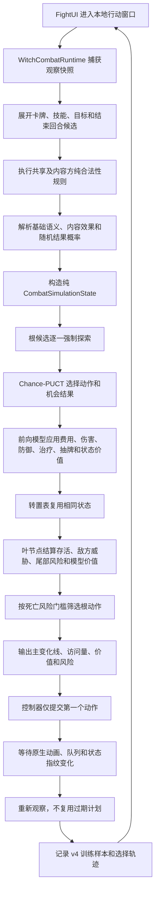

# 阶段 2：风险约束 Chance-PUCT 与搜索引导

> 本节描述实时 FightUI 自动战斗的搜索层。完整的跨回合、牌区和敌方行为模拟
> 已在阶段 3 下沉到 `AuraCombatSimulationShared`；无 UI 运行时由权威模拟引擎
> 结算，Chance-PUCT 只通过观察投影负责选择动作。

## 目标与结论

阶段 2 不再把“增加 Beam 宽度和深度”作为主路线。生产默认方案由四部分组成：

1. 纯 `CombatSimulationState` 前向模型；
2. 显式 `CombatActionModel -> CombatActionOutcome -> CombatEffectOperation` 效果协议；
3. 带机会结果、转置图和死亡风险约束的 `CombatChancePuctPlanner`；
4. 由训练样本生成的有界树集成模型，为搜索提供策略先验、叶价值和风险修正。

旧 Beam Search 仍可通过 `UseChancePuct=false` 用作故障回退和离线对照，但不再是默认算法。

## 完整使用流程



关键点是“规划整条，执行一步”。任何随机结果、敌方死亡、抽牌或动态状态变化都会触发重新观察，避免继续执行已经失效的旧计划。

## 前向模型

`CombatForwardModel` 不持有 Unity、FightUI 或 Witch 运行对象。它复制并维护：

- 玩家生命、防御、能量、手牌数和费用减免；
- 敌方生命、防御和存活状态；
- 按来源绑定的可格挡、不可格挡、持续伤害和发生概率；
- 已使用动作位集、搜索步数、不确定度和持续价值。

路径累计收益由搜索栈单独维护，不写入状态哈希。因此，两条不同动作顺序到达同一物理局面时可以安全复用转置节点，同时各自保留正确的路径收益。

核心效果包括伤害、真实伤害、持续伤害、防御、治疗、抽牌、生成卡牌、回能、减费、增益、减益、净化和持续价值。费用减免按原始费用实际消耗；抽牌与生成受手牌上限约束；敌方死亡后，其来源威胁不再进入叶结算。

内容 MOD 可注册两个纯扩展点：

- `ICombatEffectResolver`：把特殊卡牌或技能解析为一个或多个带概率结果；
- `ICombatSimulationRule`：在模拟状态上补充动态合法性和效果约束。

扩展回调不得修改游戏状态，也不得依赖 AuraToolsExp 内部类型。

## 搜索结构

每次决策首先保证所有合法根动作至少获得一次证据，然后才允许 PUCT 集中预算。这样即使配置预算低于候选数，也不会因为排列顺序永久漏掉根动作。

选择分数由四项组成：

```text
Q(s,a)
+ C_puct * P(s,a) * sqrt(N(s)) / (1 + N(s,a))
- TailRiskPenalty * DeathRisk(s,a)
- UncertaintyPenalty * Uncertainty(s,a)
```

- `Q` 是搜索回传的平均价值；
- `P` 来自规则特征与可选策略树模型；
- `DeathRisk` 来自当前威胁叶结算与可选风险模型；
- 随机动作通过机会结果边按声明概率分配访问；
- 状态哈希命中后复用节点，形成转置图而不是重复树；
- 根节点优先从 `DeathRiskLimit` 内的动作选择；没有安全动作时才在全部动作中做风险调整比较。

搜索输出包含算法名、模拟次数、节点数、转置命中数、根动作访问量、死亡风险和主变化线。训练样本同时保存每个候选的 `PlanScore`。

## 默认预算

| 参数 | 默认值 | 作用 |
| --- | ---: | --- |
| `searchSimulationBudget` | 1536 | 单次决策最多模拟次数 |
| `searchNodeBudget` | 8192 | 转置图节点上限 |
| `searchMaxPly` | 16 | 单条模拟动作深度 |
| `SearchExploration` | 1.15 | PUCT 探索强度 |
| `DeathRiskLimit` | 0.05 | balanced 根动作风险门槛 |
| `TailRiskPenalty` | 35 | 高风险分支惩罚 |
| `UncertaintyPenalty` | 0.75 | 未知语义惩罚 |

原 Beam 的宽度 `8`、深度 `8` 对短且确定的回合足够，但会在目标组合、零费链、随机结果和高分支复合动作中快速丢失候选。新的默认预算不是把 Beam 简单扩大，而是用访问量自适应分配计算：先覆盖所有根动作，再把剩余预算投入更可能优质且安全的分支。

## 搜索引导模型

`CombatSearchGuidanceTrainer` 从现有 v4 状态、候选和选择记录构建三组训练目标：

- 策略：人工选择或实际策略选择的候选；
- 价值：动作后即时奖励和已记录结果；
- 风险：失败、死亡或明显负向结果。

训练结果使用协议 `aura.combat-search.gbdt.v1`，由有界回归树桩集成组成。它是轻量、可审计、无外部运行时依赖的 GBDT 搜索引导，不宣称等同于完整 LambdaMART。模型只调整先验和叶评估，不能恢复非法动作，也不能越过运行时风险门槛。

导入流程会同时处理：

- 原有线性残差候选 `auto-battle-model-candidate-{profile}.json`；
- 搜索引导候选 `auto-battle-search-model-candidate-{profile}.json`。

安装后的搜索模型位于共享配置所有者 `aura.combat-ai.search-model` 下，并按决策风格分别加载。

## 失败与回退

- 没有有效搜索引导模型：使用零修正模型，规则搜索继续工作；
- 搜索没有合法动作：返回结束回合或无动作；
- 所有动作都超过死亡风险门槛：在全部动作中选择风险调整价值最高者；
- 内容随机结果未注册：使用基础语义的确定性期望结果并增加不确定度；
- 动作提交后状态指纹不变：事务继续等待，超时后停止接管，不重复提交；
- 需要紧急诊断：设置 `UseChancePuct=false` 可回到旧 Beam 对照路径。

## 验证边界

自动化测试已覆盖减费消耗、手牌上限、敌方死亡消除威胁、根动作完全覆盖、目标变体单次使用、机会结果归一化、搜索引导训练和输出边界。编译与源契约测试不能代替真实游戏验证；上线前仍必须在游戏内覆盖高分支手牌、随机卡、连续零费链、复合选择 UI、敌方状态变化和长时间自动战斗。
