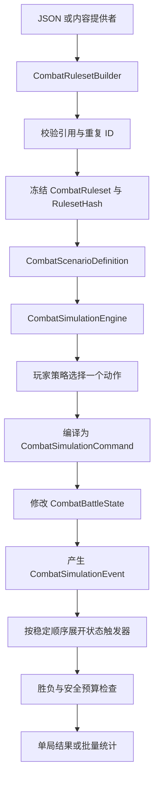

# 阶段 3：无 UI 权威战斗模拟器

## 目标

阶段 3 提供不创建 FightUI、Unity 对象或 Witch 运行脚本的完整战斗模拟。它用于：

- 对指定角色、卡组和敌人运行单局战斗；
- 按连续随机种子批量计算胜率和分布；
- 输出动作、随机选择、状态变化和因果事件；
- 让现有 Chance-PUCT 自动战斗 AI 作为无 UI 玩家策略运行；
- 为内容平衡、模型训练、固定种子回归和真实游戏差分验证提供统一基础。

模拟器不会自动猜测未知脚本。正式场景默认要求所有规则为 `Authoritative`，缺失或不受支持的定义会终止为 `UnsupportedRule`。

## 代码边界

| 目录 | 职责 |
| --- | --- |
| `AuraCombatSimulationShared/` | 权威状态、规则集、命令、事件、RNG、回合引擎、策略接口和批量统计 |
| `AuraCombatAiShared/CombatSimulationAiAdapter.cs` | 将权威状态投影为现有 AI 观察，并把 AI 选择映射回模拟动作 |
| `AuraCombatSimulation.Cli/` | JSON 场景和规则集的无 UI 命令行入口 |
| `tools/Run-AuraCombatSimulation.ps1` | 仓库标准调用脚本 |
| `docs/AuraCombatAI/examples/` | 可直接执行的规则集与场景样例 |

`AuraCombatSimulationShared` 不依赖 Unity、Witch、Terrias 或 AuraToolsExp。内容 MOD 通过 `CombatSimulationRegistry.RegisterProvider` 注册自己拥有的定义；AuraToolsExp 可以创建任务和读取结果，但不能成为内容规则所有者。

## 权威数据流



规则集查找返回防御性副本；运行时引擎使用冻结后的内部定义。规则提供者在构建开始时按优先级、所有者和提供者 ID 排序，战斗过程中不允许修改规则目录。

## 状态与牌区

`CombatBattleState` 保存：

- 回合、阶段、结果和终止原因；
- 玩家、友方和敌方 Actor；
- 生命、防御、能量、状态和当前/上一敌方意图；
- 卡牌实例、费用修正；
- 抽牌堆、手牌、弃牌堆和消耗区；
- 命名随机流计数器；
- 动作、命令和事件序号。

每个卡牌实例必须且只能存在于一个牌区。每次玩家动作后都会验证卡牌总数、牌区唯一性、Actor/Card ID 唯一性、生命范围和非负资源。

## 回合执行

```text
Initialize
BattleStart triggers
TurnStarted triggers
SelectEnemyIntents
RefreshEnergy / Draw
PlayerActionLoop
TurnEnded triggers
DiscardHand
EnemyActionLoop
RoundEnd / StatusDecay
OutcomeCheck
```

玩家策略只能从引擎生成的 `LegalActions` 中返回候选。非法或过期候选会终止为 `IllegalPolicyAction`，不会自动换成另一张牌。每次只执行一个动作，命令和触发链完成后再生成新观察。

## 命令与触发器

当前权威命令覆盖：

- 普通和穿透伤害；
- 防御、治疗、抽牌和回能；
- 随机弃牌与消耗；
- 添加、叠加、移除和回合末衰减状态；
- 创建卡牌及手牌上限回退；
- 修改卡牌实例费用；
- 召唤、离场及召唤数量保护。

触发器监听 `CombatSimulationEventKind`，并按以下稳定顺序执行：

```text
Priority
OwnerModId
StatusId
TriggerId
ActorId
```

触发器只能追加命令，不能递归修改状态。`MaximumCommandsPerAction` 和 `MaximumTriggerWavesPerAction` 会终止无限触发链。

## 确定性随机

模拟器不使用 `System.Random` 或 `UnityEngine.Random`。根种子派生以下独立命名流：

```text
deck.shuffle.initial
deck.shuffle.recycle
enemy.intent:{instanceKey}
effect.proc:{source}:{kind}:{definition}
target.enemy:{source}
hand.discard
hand.exhaust
```

每个流拥有独立计数器。增加敌方意图随机调用不会改变洗牌序列。随机证据包含流 ID、计数器和原始 64 位结果；同一场景、规则集哈希、策略和种子必须产生相同最终状态哈希。

## AI 接入

`CombatSimulationObservationProjector` 从权威状态和冻结规则定义生成：

- 玩家、敌方和牌区观察；
- 当前敌方意图威胁；
- 卡牌及目标候选；
- 由权威效果定义推导的动作语义；
- 权威状态指纹。

`CombatDecisionSimulationPolicy` 禁用实时游戏注册表，因此批量线程不会调用 Unity/内容运行对象。Chance-PUCT 只负责动作选择；最终费用、牌区、效果、触发器和胜负始终由权威模拟引擎结算。

## 运行方式

单局：

```powershell
pwsh -NoProfile -File tools/Run-AuraCombatSimulation.ps1 `
  -Ruleset docs/AuraCombatAI/examples/simulation-ruleset.example.json `
  -Scenario docs/AuraCombatAI/examples/simulation-scenario.example.json `
  -Output artifacts/combat-single.json `
  -Policy chance-puct
```

批量：

```powershell
pwsh -NoProfile -File tools/Run-AuraCombatSimulation.ps1 `
  -Ruleset docs/AuraCombatAI/examples/simulation-ruleset.example.json `
  -Scenario docs/AuraCombatAI/examples/simulation-scenario.example.json `
  -Output artifacts/combat-batch.json `
  -Count 1000 `
  -Parallel 8 `
  -SeedStart 10000 `
  -Policy chance-puct
```

策略可以是 `first`、`greedy` 或 `chance-puct`。批量结果始终按种子顺序合并，因此并行度不会改变输出顺序或每局哈希。

## 结果

单局结果包含胜负、终止原因、规则集哈希、策略、回合、最终生命、语义覆盖率、指标、回合摘要、事件轨迹和最终状态。

批量统计只把语义覆盖率为 100% 且结果有效的对局计入正式样本，并提供：

- 胜、负、平和无效数量；
- 胜率与 95% Wilson 区间；
- 平均、中位、P10 和 P90 回合；
- 平均最终生命；
- 终止原因分布；
- 按种子排序的完整单局结果。

## 验证边界

自动化测试覆盖冻结规则集、不可变快照、完整回合、敌方意图、状态触发器、四牌区不变量、未知规则拒绝、命名随机流隔离、同种子重放、Chance-PUCT 接入，以及串行/并行批量结果一致性。

这套模拟器已经是可执行的无 UI 后端，但“某张真实 Witch/Terrias 卡牌已达到权威精度”仍取决于内容所有者是否提供完整规则定义，并通过真实游戏事件轨迹差分验证。框架不会把尚未注册的游戏脚本伪装成已支持内容。
