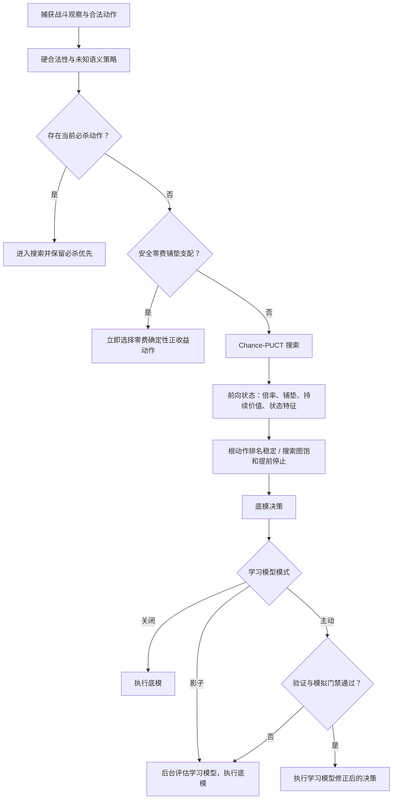

# 阶段 4：底模、训练、性能与模拟评估闭环

## 目标

本阶段针对 2026-07-24 异机测试暴露的四类问题进行一次整体修订：

- 安全的零费铺垫牌被高即时伤害牌压到后面；
- 人工训练高训练集准确率，但缺少可靠的跨战斗验证和终局风险标签；
- 固定 1536 次搜索、影子双搜索和同步日志写入造成主线程开销；
- 无 UI 模拟器没有进入自动战斗设置，也没有成为模型主动应用门禁。

修订后的基本原则是：规则层先表达确定因果，学习模型只学习残差；评估按完整战斗隔离；主动应用必须同时通过验证集和同种子配对模拟。

## 决策流程



“安全零费铺垫”不是卡名白名单。它要求动作零费、确定、无交互、无风险、不会直接攻击敌人，并具有抽牌、回能、Buff、减费、生成牌、持续价值、成长或显式状态变化中的至少一项正收益。当前已有必杀时不抢占必杀。

内容提供者可以通过 `DamageMultiplierGain` 和 `StateChanges` 表达元素层数、伤害倍率等明确因果。前向状态会将这些变化带到后续动作，伤害也会按更新后的倍率重新结算。

## 搜索与性能

默认预算由 1536 次 / 16 层调整为 256 次 / 10 层，并保留以下停止条件：

- 至少完成 128 次模拟；
- 每 64 次检查一次根动作排名；
- 最优根动作和节点数连续稳定两次后停止；
- 所有合法根动作仍必须先获得搜索证据。

自动战斗按 `状态指纹 + 风格 + 搜索预算 + 模型版本` 缓存决策。人工点击与同一状态的预测复用结果。影子学习搜索进入共享后台 CPU 队列，过期状态不再回填；训练样本进入有界队列，由后台线程按批次写入 JSONL。

每累计 32 次决策会记录 `p50Ms`、`p95Ms`、`p99Ms`、最后阶段和最后耗时。性能对照时应关闭重复的 Command/Unity 调试镜像。

## 训练与验证

训练链路作出以下修订：

- 人工样本继续按预测可见性加权：可见预测 `0.5`，隐藏预测 `2.0`；
- 搜索引导和线性残差使用一致的权重规则；
- 战斗结束时，待结算动作记录为 `Completed + terminal`，不再写成 `Cancelled`；
- 风险模型只使用终局样本，并且必须同时存在胜利/非失败和失败两类标签；
- 单一类别不会生成伪风险树，推理风险固定返回 0；
- 搜索训练和运行时叶节点统一使用 `expectedBlockableDamage`、`playerHp` 等同名特征；
- 验证采用 leave-one-battle-session-out，整场战斗不能同时出现在训练和验证中。

候选模型仍允许导入并用于影子评估，但主动应用至少要求：

- 两场独立战斗；
- 跨战斗分组验证准确率不低于 55%；
- 当前模型完成同种子底模对照模拟；
- 权威覆盖率达到设置阈值；
- 学习模型胜率回退不超过设置阈值。

任何一项不满足时，“主动”配置会在运行时自动降级为影子评估。

## 自动战斗界面的模拟评估

自动战斗设置新增“模拟评估”区域：

- 场景选择；
- 对照局数；
- 并行度；
- 是否保留分歧与失败轨迹；
- 开始、取消、输入目录、结果目录；
- 实时进度和最终门禁状态。

场景和规则有两种来源：

1. 内容 MOD 分别注册 `ICombatRulesetProvider` 和 `ICombatScenarioProvider`；
2. 异机文件传递：把 `ruleset.json` 与 `*.scenario.json`（或 `scenario.json`）放入界面打开的输入目录。

界面直接调用共享模拟引擎，不启动 PowerShell 或外部 CLI。每个随机种子先跑底模，再跑学习模型，双方使用同一场景和种子。

## 输出目录

每次运行创建独立目录：

```text
combat-simulation-results/{runId}/
  manifest.json
  status.json
  summary.json
  results.jsonl
  traces/
```

- `manifest.json` 保存场景、规则哈希、模型、策略和运行参数；
- `results.jsonl` 每行只保存一组同种子底模/学习模型紧凑结果；
- `summary.json` 保存胜率、覆盖率、回合、最终生命、分歧和门禁；
- `traces/` 只保存分歧、失败或无效对局的完整轨迹；
- 界面在任务结束后重新读取落盘的 `summary.json` 再显示结果。

每个风格还会维护 `latest-summary-{profile}.json`。只有它的模型 ID 与当前安装模型一致且门禁通过时，模型才允许主动接管。

## CLI

CLI 与界面使用同一个 `CombatRulesetDocument` 校验入口。固定种子脚本已改为使用 PowerShell 的参数存在性判断和 invariant UInt64 字符串，不再读取失效的 `Nullable.Value`。

## 验证范围

自动化覆盖：

- 安全零费铺垫与不确定零费动作的区分；
- 必杀不被零费铺垫抢占；
- 倍率状态影响后续伤害；
- 铺垫与持续价值进入叶节点；
- 搜索训练/推理特征同名；
- 单类风险不训练；
- 跨战斗分组验证；
- 稳定排名提前停止；
- 文档规则集与场景提供者注册；
- 模拟设置边界、流式结果、模型门禁和后台影子路径的结构契约；
- 固定 `SeedStart` 的 PowerShell 实际调用。

游戏内仍需在测试机补充三类证据：真实卡牌语义提供者覆盖、自动战斗设置布局截图、典型敌人配对模拟结果。框架不会把缺失的真实内容规则标记为权威支持。
