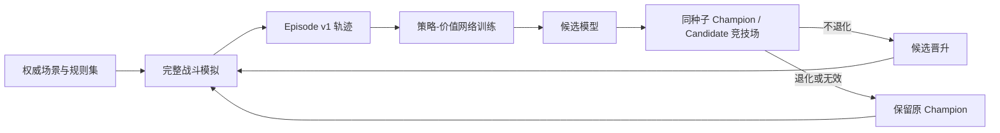

# 阶段 6：长期策略价值网络与自动进化

## 目标

阶段 6 补齐四项此前缺失的能力：

- 用完整战斗而不是单步点击作为训练单元；
- 学习当前状态的跨回合胜负、死亡、剩余生命和剩余回合价值；
- 从搜索访问次数学习动作分布，而不是只拟合一次人工选择；
- 自动生成战斗、训练候选、同种子对照，并只晋升不退化的候选。

合法性、卡牌语义、敌方意图和状态转移仍由权威规则层负责。神经网络只提供
策略先验与长期叶节点价值，不能绕过合法性检查。

## 运行结构

一次决策的策略目标优先使用 Chance-PUCT 根节点访问分布。若最终执行的是
搜索未访问的动作，例如阈值判断后的结束回合，则使用实际执行动作作为监督目标。
价值目标由战斗终局回填，并按剩余回合做 `0.99` 折扣。

## 模型输入与输出

状态编码包含玩家、敌人、能量、手牌、牌堆、威胁、Buff、回合和规则投影特征。
动作编码包含来源卡牌、目标、费用、伤害、防御、抽牌、资源、Buff、Debuff、
不确定性以及知识层补充特征。

网络采用纯托管双塔 MLP：

- 状态塔编码当前战斗状态；
- 动作塔编码每个合法候选；
- 交互头输出每个候选的策略 logit；
- 多任务价值头输出长期回报、胜率、死亡率、终局生命比例和剩余回合。

推理接口同时支持单状态和批量状态。搜索内部按前向状态哈希缓存叶节点预测，
避免转置图反复评估同一状态。

## Episode v1

`aura.combat-ai.episode.v1` 每场保存：

- 场景、种子、规则哈希、策略和决策风格；
- 每个行动窗口的状态特征和状态指纹；
- 全部候选、合法性、搜索先验、访问次数、计划价值和死亡风险；
- 实际执行动作；
- 终局胜负、生命、受伤、回合和语义覆盖率；
- 回填到每个决策的长期价值目标。

只有语义覆盖率为 100% 且模拟未失效的轨迹可进入训练。

## 自动战斗界面

“自动战斗 > 模拟评估”使用“对照评估 / 策略进化”分段视图，只显示当前
任务需要的参数。界面可配置：

- 场景、对照局数、并行度；
- 进化轮数、每轮训练局数、竞技场局数；
- 是否保留分歧轨迹；
- 是否在普通配对模拟中生成长期策略训练轨迹。

“运行对照”运行底模和已安装模型的同种子对照。“开始进化”执行完整闭环。
任务运行时会锁定会改变本次快照的配置。“取消”会通过共享后台任务令牌停止
战斗生成和模型 Epoch；取消请求发出后按钮进入不可重复点击的“取消中”状态。

候选训练、候选导入、配对评估和策略进化共享操作互斥。候选导入的文件读取、
反序列化和验证在后台执行，不阻塞 Unity 主线程。

每次进化运行输出：

- `evolution-summary.json`：每轮候选、胜率、综合分和晋升结果；
- `episodes-v1.jsonl`：可继续复用的完整战斗回放库；
- `status.json`：轻量任务状态；
- `auto-battle-policy-value-candidate-{profile}.json`：通过竞技场后的待导入候选。

候选仍需在模型区域执行“导入候选”。主动应用还需通过分组验证和配对模拟门禁。

界面会从 `latest-summary-{profile}.json` 或
`latest-evolution-{profile}.json` 重新读取最近结果，显示胜率差、平均回合、
平均生命、权威覆盖、无效/分歧局数、晋升轮数和最终门禁状态。该摘要在重启游戏
后仍可恢复；完整轨迹继续保留在结果目录。

## 晋升规则

候选必须同时满足：

- 竞技场没有无效战斗；
- 同种子胜率不超过配置允许的退化范围；
- 综合得分不低于当前 Champion。

综合得分以胜负为主，并加入终局生命、回合数和受伤量作为次级信号。
每轮未晋升的候选不会覆盖 Champion，但其权威轨迹会保留在本次 replay 中。

## 已知边界

- 当前为 CPU 纯托管小型网络，适合游戏内推理和中等规模本地训练，不替代
  GPU 训练平台。
- “自我对战”在 PvE 语境中指策略自行生成轨迹并与上一代策略竞技；敌人仍由
  权威规则和固定意图策略驱动。
- 模拟质量取决于内容 MOD 注册的卡牌、Buff、敌人和敌方组合覆盖率。
- 游戏内真实验证仍必须在目标机器完成，自动化测试只证明协议、训练和模拟闭环可运行。
