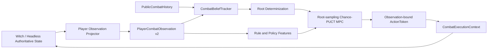

# 玩家等价 AI：信息边界与搜索迁移

> 实现基线：2026-07-27  
> 玩家观察协议：`aura.combat-ai.player-observation.v2`  
> 在线训练样本：`aura.combat-ai.sample.v5`  
> 长期 Episode 特征版本：`9`

## 目标定义

“玩家等价”采用以下可执行定义：

- AI 与专家玩家拥有相同的当前可见信息；
- AI 可以完整记忆已经公开的战斗历史，并了解完整游戏规则；
- AI 不得读取未来抽牌顺序、未公布随机结果、内部 RNG、脚本私有变量或运行时回调队列；
- AI 可以使用更多计算，但搜索必须从公开信息形成的信念状态出发；
- 动作执行可以接触游戏对象，但执行对象不得进入观察、模型特征或训练样本。

这一定义约束的是信息，不是反应速度、记忆力或搜索预算。

## 体系结构



`CombatPlayerObservationBoundary.Normalize` 是共享层的防御性入口。实战适配器和无 UI 模拟器都必须经过该入口；`CombatDecisionEngine` 在决策前还会再次规范化，防止调用方绕开投影器。

## 公开观察

公开观察保留：

- 玩家、友方和敌方的可见生命、防御、名称、公开状态；
- 当前能量、手牌身份、保留标记和显示费用；
- 当前已经公布的敌方意图；
- 玩家已知的牌组多重集合；
- 抽牌堆、弃牌堆和消耗区数量；
- 可由公开规则和公开状态计算的动作语义；
- 战斗内稳定的公开单位与卡牌逻辑 ID。

公开观察不再包含：

- `DrawPileCardIds` 或任何等价的真实抽牌顺序；
- Unity、Witch 或其他运行时对象；
- `StatusManager.dynamicVariables` 的任意批量副本；
- 权威模拟状态哈希；
- 战役金钱等与当前战斗策略无关的状态；
- 尚未在原生 UI 显示的提示候选项。

弃牌和消耗牌身份只有在 UI 可见或可以由公开行动历史准确重建时才允许进入观察。

## 牌库知识与信念

`CombatDeckKnowledge` 记录：

- 当前各牌区数量；
- 玩家已知的完整牌组多重集合；
- 已知顶部和底部牌；
- 洗牌纪元；
- 弃牌与消耗内容是否公开。

`CombatBeliefTracker` 从公开观察中扣除手牌、公开弃牌、公开消耗牌和已知顶部/底部牌，构造未知抽牌多重集合。`CombatRootDeterminizer` 在每次搜索模拟开始时独立洗牌未知集合，同时保持已知顶部和底部约束。

真实牌堆顺序不会写入 `CombatStateObservation`，也不会进入策略网络或训练样本。

## 搜索算法

生产搜索标识为：

```text
root-sampling-chance-puct-mpc
```

它是面向单次真实动作的滚动 MPC：

1. 当前公开观察生成牌库信念；
2. 每次模拟在根节点采样一份可能世界；
3. 所有合法根动作至少获得一次证据；
4. Chance-PUCT 在该决定化状态上处理动作和显式机会结果；
5. 执行真实世界中的第一个动作；
6. 等待 UI 和战斗状态稳定后重新观察、重新建立信念并重新搜索。

抽牌、生成卡牌或打开交互 UI 会终止当前模拟分支，等待新的公开观察。搜索不会用旧根节点动作表虚构刚抽到或刚生成的牌。

转置表只按物理模拟状态复用节点。回传值改为“从当前节点开始的剩余回报”，不再把根路径累计收益写入所有复用节点，从而避免不同前缀路径互相污染。

## 风险策略

根动作先按 `DeathRiskLimit` 做安全集合筛选。存在安全动作时，不允许高价值高死亡率动作跨过该约束；只有安全集合为空时才退回全部动作。

安全集合内部同时考虑：

- 平均搜索回报；
- `TailRiskQuantile` 指定的下尾 CVaR；
- 平均死亡风险；
- 策略先验和探索项。

默认 `TailRiskQuantile=0.1`，表示关注最差 10% 回报，而不是把“平均死亡概率”误称为尾部风险。

## 动作执行边界

`CombatActionObservation` 只携带：

- `ObservationId`；
- 观察内唯一的 `ActionToken`；
- 公开动作、来源、目标、费用和语义。

`CombatExecutionContext` 独立保存：

```text
ObservationId + ActionToken -> SourceHandle + TargetHandle
```

执行前必须同时匹配观察 ID 和 token。下一次捕获生成新观察后，旧 token 自动失效。预测标记和 Terrias 精灵卡合法性检查通过运行时专用接口访问对象，不再把对象放回 AI DTO。

## 特征与训练

特征策略从拒绝列表改为默认拒绝：

- 状态、单位、动作和状态变化分别使用公开特征白名单；
- 内容 MOD 必须通过 `CombatPublicFeatureRegistry` 精确注册额外的玩家可见派生字段；
- 未注册字段不会进入指纹、网络输入或训练样本；
- 非有限值直接丢弃；
- 动作 token、运行时 ID 和对象身份不作为数值模型特征。

这次边界变化会使旧模型失效，因此在线样本升级到 v5、残差和搜索引导特征版本升级到 5、长期 Episode 特征版本升级到 9。旧模型可以留作离线档案，但不能在新协议下主动运行。

## 门禁

模型主动应用由两类门禁分别负责：

- 信息门禁：当前观察必须是 v2、动作 token 必须绑定当前观察；
- 质量门禁：同种子验证、胜率回退、规则覆盖和完整训练评估必须通过。

规则知识不是信息权限。非权威语义会增加不确定度并可能触发保守策略，但不会再用“全部定义必须 Authoritative”这一不可达条件替代信息安全门禁。

## 自动化验收

`AuraCombatAiShared.Tests` 覆盖以下不变量：

- 调换隐藏抽牌顺序不会改变公开观察、指纹、模型特征或决策；
- 修改未注册内部变量不会改变公开观察；
- 公布顶部牌后指纹和决定化约束会变化；
- 无 UI 投影器与实战边界遵守同一隐藏信息规则；
- AI DTO 不包含 `object` 类型运行时句柄；
- 旧观察 token 不能在新观察中执行；
- 提示候选必须在 UI 可见后发布；
- 未注册 MOD 特征默认被拒绝，显式注册后才能通过；
- 根动作覆盖、机会分支、转置复用、长期训练和战役验证继续通过。

自动化测试和 `net472` 编译不能替代游戏内验证。发布前仍需验证实际费用显示、敌方意图更新、洗牌时序、复杂提示 UI、预测标记定位和人工教师捕获。
