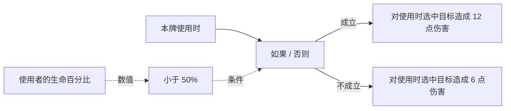
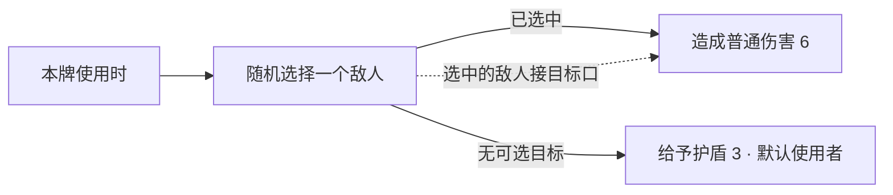

# 自建卡牌：节点与连接指南

适用版本：2026-09-19，作品文档 v4、生成运行库修订 5。全部可添加节点及其逐接口定义见[生产节点目录](custom-card-node-catalog.md)。游戏内顶部“节点指南”提供固定章节导航、搜索和节点索引表；节点参数旁的说明按钮直接打开对应节点。返回编辑保留画布位置、选择和尚未提交的输入。

## 创作范围

一个蓝图对应一张卡牌，只在本牌的**抽到、使用、丢弃**三个原生时点启动一次流程。可以在这些时点读取生命、判断条件、造成伤害或操作牌堆，也可以读取、施加、移除游戏或其他 MOD 已有状态。

“使用时，如果生命低于一半”可用使用入口、生命百分比、小于 50% 和条件分支表达。这里不会持续观察生命；“生命降到一半以下就自动触发”属于持续监听，不由卡牌蓝图提供。抽到与丢弃沿用宿主定义，用牌后的原生弃牌也可能触发丢弃入口。

## 按操作对象寻找按钮

| 区域 | 操作 |
| --- | --- |
| 顶部工具栏 | 作品库、保存、制作、更多中的新建／副本／导入导出／脚本 |
| 当前作品栏 | 名称和保存状态、保存、更多中的另存副本与导出、制作到仓库 |
| 编辑工作区 | 效果蓝图、卡牌属性、卡面；原生预览及本作品的撤销／重做 |
| 画布工具栏 | 节点库、添加节点、整理、适合画布、编辑菜单、参数、蓝图检查 |
| 蓝图编辑菜单 | 复制、粘贴、删除、组合／折叠、在线路中插入节点 |
| 高级功能 | 当前作品“更多”中的生成脚本查看 |

## 状态与 BUFF

五种状态节点共用同一个必选状态参数：单体／群体施加、单体／群体移除，以及读取指定状态层数。在节点本体或右侧参数中点击状态名称，可在同一窗口内搜索、按来源筛选、分页浏览并查看说明。相同名称用来源和标识区分；列表标出当前选择，不再截断到前 80 项。

| 节点 | 必须配置 | 实际行为 |
| --- | --- | --- |
| 施加已有状态（含群体） | 具体状态、目标、层数 | 向目标添加层数；叠加与持续规则由状态决定 |
| 移除已有状态（含群体） | 具体状态、目标 | 移除整个指定状态，不是扣除一层 |
| 读取数值：指定状态层数 | 具体状态、角色 | 读取当前层数，未持有时为 0，不改变状态 |

旧稿的状态标识保持不变。引用未加载的状态时显示缺失信息，检查面板可以定位并直接重新选择；草稿仍可保存，接入运行流程的缺失资源会阻止制作。切换读取属性后隐藏无关状态字段，保留原选择供切回时使用。

折叠组合的参数面板按内部节点分段，暴露状态、目标、数值、读取属性、比较关系和结果名称；“定位此节点”可展开组合并跳转。节点库支持 BUFF 别名和用途搜索，常用组合同样遵守搜索条件。

## 指南、检查与返回

指南依次提供开始制作、连线与执行、数值与百分比、状态、组合、检查与制作、节点索引。索引表列出用途、配置、输入和输出；点击一行查看示例和相关节点。输入错误不妨碍查阅指南，返回后原始输入缓冲仍在。

蓝图检查分开显示“需要修正”和“提示”，标明节点及相关字段。作品库与生成脚本提供“返回编辑”；切换有未保存修改的作品时可选择保存并切换、丢弃并切换或取消。

打开工坊时的初始蓝图只是编辑起点，不会自动加入作品库。首次适合画布、缩放、平移、定位节点及切页属于浏览，不产生未保存修改或新版本。实际修改卡牌、节点布局或卡面后，关闭时保存草稿；点击“保存”也可以主动保留初始蓝图。浏览中的视口位置会随下一次实际保存一起保留。

画布支持标题拖动、框选、多选、滚轮缩放、中键或空格平移。右击画布可添加节点，右击接口可断开连接。窄窗口通过“参数”打开面板；宽窗口可在侧栏查看选中节点。80% 及以上显示完整接口，55%～80% 保留标题与关键摘要，低于 55% 显示标题和结构。放大后编辑参数。

详细编辑页默认铺满游戏窗口，四周留 12px 安全边距。属性页采用表单与原生卡牌预览。正在编辑费用时点击制作，会先校验并提交当前输入。

像素画板左侧为工具与 32 色色板，右侧画布自动适合可用区域。支持右键擦除、中键移动和滚轮缩放；“适合窗口”可恢复完整视野。选中色有描边和色值显示。网格在像素格过小时自动隐藏，放大后恢复。

## 读懂节点

标题是系统功能名，不能用备注替换。比较节点在标题处选择关系；输入靠左、输出靠右，数据输出另起一行，避免与输入框重叠。节点仅保留必要错误，未使用情况在检查面板查看。备注、捕获结果名称和注释正文是不同字段。

| 接口 | 图形与颜色 | 连接规则 |
| --- | --- | --- |
| 执行 | 浅色方向箭形 | 决定执行顺序；每个输入和每个输出最多一条线 |
| 数值 | 蓝色方框 | 数值接数值；未连接时使用输入框显示的数值 |
| 条件 | 紫色菱形 | 条件接条件；不把数值隐式转换为真假 |
| 单个角色 | 金色圆环 | 一个角色，不能直接接集合口 |
| 角色集合 | 绿色成组标记 | 一组角色，不能直接接单角色口 |

空心表示未连接，内部实心表示已连接。必填数据口缺少连接会显示红色；有默认值的口不要求连线。接线后输入位置显示来源标签，可点击定位来源；未接线处保留数值输入与格式选择。悬停接口会显示类型和连接状态。

拖线时青色是同类型候选，悬停后继续检查作用域，底部会解释可连接或拒绝原因。失败不会拆掉原来的有效连接。节点被选中使用金色外框，正在编辑的输入框另有金色描边和提亮背景；错误使用红色问题说明和端口标记；选中错误节点仍能看到错误。

## 重点对象节点

| 节点 | 接收什么 | 输出什么 | 空目标与有效范围 |
| --- | --- | --- | --- |
| 随机选择一个敌人 | 只有执行输入 | 一个随机敌人 | 有候选走“已选中”，否则走“无可选目标”；结果只在成功分支可用 |
| 随机选择一个友方 | 只有执行输入 | 一个随机友方，包含使用者 | 与随机敌人相同 |
| 从集合随机选择一个角色 | 执行、必填的角色集合 | 输入集合中的一个有效角色 | 空集合走“无可选目标”；结果只在成功分支可用 |
| 记住对象 | 执行、必填的单个角色 | 当时得到的对象引用 | 捕获之后的同一流程和内部子流程可用；不会冻结角色属性 |
| 记住数值 | 执行、数值或默认数值 | 捕获时的数值 | 捕获之后读取不重新计算 |
| 使用者 | 无输入 | 本牌使用者 | 固定语义，没有对象选择器 |
| 使用时选中目标 | 无输入 | 本次使用选中的目标 | 仅限需要目标的卡牌的使用流程 |
| 所有敌人／所有友方／所有角色 | 无输入 | 对应集合 | 需要数据时读取；所有友方包含使用者 |

**“随机选择一个敌人”没有对象输入，不能接入“使用者”。**“记住对象”可以接使用者，因为它的职责就是保存指定对象。通用伤害节点可以作用于使用者，自伤属于合法效果，与随机敌人的固定范围没有冲突。

随机节点每执行一次抽样一次；多个后续数据线复用同一结果。在重复体内，每轮重新抽样。实战使用原生合法对象集合和 `ScriptExecutor.DefaultDice`，不引入独立随机权威。选择之后对象仍可能失效；效果会跳过失效对象，直接读取其属性会报错，可先用“对象存在”保护读取。不会自动换另一个目标补执行。

## 执行和作用域

1. 数据线只提供参数，不会让“记住”或随机选择节点自行执行；这些节点还必须接入执行流程。
2. 数据输出可以复用，但禁止跨入口共享节点；需要在抽到和使用时各执行的逻辑，应复制相应片段。
3. 条件只执行一个分支，然后从“完成后”继续。分支内创建的临时结果不能在另一个分支或完成出口外读取。
4. 随机选择没有通用完成出口。继续操作应接到对应的成功或空目标分支；成功结果不能流入空目标分支。
5. 有限重复为 0～64 的整数次数，零次直接完成。逐个对象执行在入口时确定集合，空集合直接完成；“当前对象”只在对应执行体内有效。
6. 执行与数据都禁止任意回环。“结束本次流程”结束整个入口，“结束使用者回合”也终止本次入口。
7. 未使用的数据节点不执行，检查面板会提示；错误连线，以及实际流程中的必填输入缺失、越界变量和非法参数会阻止制作。

数值运算默认按需读取。生命百分比以 `%` 显示，严格低于一半应比较 `< 50%`，恰好 50% 不成立。百分比框填写 0.5 表示 0.5%，比例小数框填写 0.5 表示 50%。普通数值与比例不能直接比较；整数来源仍允许与小数阈值比较。效果数量非负并向下取整；除数为零、上下限颠倒、非法动态数量会停止流程并定位错误。与／或采用短路求值。

能量、抽牌、弃牌、焚毁手牌、选牌、重洗和结束回合固定属于使用者。玩家能量、牌堆数量和本牌基础费用读取也不提供任意角色入口。其他效果提供明确的单体或群体版本，群体版本接受集合。

已有状态必须从已加载资源中选择。目标没有此状态时层数为 0，状态资源缺失时会阻止制作。移除状态表示移除整个指定状态。选牌完成后才继续；取消或返回空选择会结束本次流程。抽牌按原生入手完成时点继续。

## 数值格式与输入

- 数值框可输入整数或小数；比例可显示为百分比或小数。50% 与比例小数 0.5 表示同一数值。
- 只有空白输入跟随连接来源；已有输入不会因接线而自动改变含义。
- 普通数值乘比例可表达“100 × 50% = 50”。“百分比转数值”明确将 50% 转为 50；“比例转小数”将 50% 转为普通数值 0.5。
- 严格等于不按显示位数四舍五入。约等于需要填写容差，容差与两侧使用相同含义。
- 聚焦时输入框提亮并显示金色描边、光标和选区。单行输入可提交，Esc 恢复编辑前的值；无效输入显示红色提示并阻止制作。
- 旧稿的生命百分比路径通过明确转换保留原先 0～100 的计算结果，已有成品效果不因编辑器升级而改变。

## 两个例子

“使用时，低于一半生命则造成 12 点伤害，否则造成 6 点”：

“使用时随机攻击敌人，没有敌人则给自己护盾”：

蓝图库包含上述例子、从友方集合随机给予护盾及基础控制流程。模板是复制到当前作品的独立蓝图，不依赖外部模板持续运行。

## 注释与检查

注释没有任何接口，不参与编译或运行预算。可从节点库和右键菜单添加，在参数中编辑多行文字，通过尺寸输入或右下角拖动调整大小，也可移动、组合、复制、撤销和随作品保存。

“检查连通”列出问题并可定位节点；非法旧连接可以在问题面板中删除。通过检查后才可制作。草稿允许保存尚未完成的语义，以便稍后继续编辑。

## 旧稿迁移

v1、v2、v3 文档读取时单向迁移到 v4，分别保存原文到 `LegacyBackup` 与 `BlueprintV2Backup`；首次覆盖旧库条目前另存整库备份。节点版本为 2。文档版本与原生成品卡面标记独立，本轮原生标记仍为 2，兼容既有 1／2 成品，不重写已制作卡牌。

普通范围内的旧版布局会按原相对位置扩大间距，以容纳新版节点，首次打开重新适配视野。原始布局也保留在备份中；布局变化不改变执行顺序。

| v2 旧情况 | 迁移结果 |
| --- | --- |
| 名为随机敌人但连着外部对象 | 按实际行为转为“记住对象”，保留那条对象线；不会悄悄变成随机敌人 |
| 真正使用随机默认值、没有对象线 | 转为固定随机节点，原后续流程接到“已选中”；提示检查新增的空目标分支，确认前禁止制作 |
| 通用捕获使用默认对象 | 添加明确的对象来源连接 |
| 使用者专属能力连着明确的使用者来源 | 移除多余入口连线，保留行为 |
| 使用者专属能力连着其他来源 | 保留错误连接和修订提示，不自动改成使用者 |
| 持续监听旧规则 | 保留不可执行的待修订内容和原稿，须明确重写或删除 |

迁移提示不是自动通过的占位项，应核对空目标、异步顺序及旧对象线的实际含义。未知较新版本拒绝猜测读取，原文件保持不变。

## 已制作卡牌的 XLua 修复

运行库修订 4 修正旧生成代码访问整数索引集合的方式。已有自建成品在原生读取、重置或预编译时自动修复，并清除受影响的脚本缓存；不需要删除或重新制作来修复这一个问题。原始 `RawData` 会先备份到 AuraShared 所有者存储的 `CustomCards/ScriptRepairs` 下，再更新内存与可持久化的原始数据，随游戏正常存档保存。

修复只处理有自建卡牌标记、已知生成器标题和已知错误访问片段的脚本。名字、能量费用、卡面、其他状态以及非本工具的卡牌保持原样；未知版本和任意手写脚本不猜测改写。合法的字符串字典访问 `get_Item`／`set_Item` 被保留。此修复不把旧持续监听内容重新变为可创作功能。
