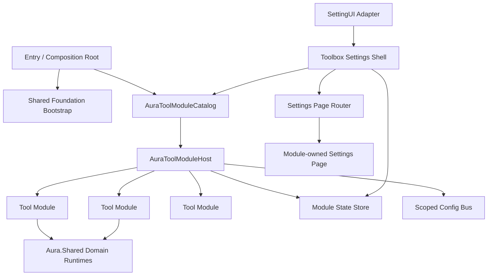

# AuraToolsExp 工具箱设置与模块架构详细设计

## 1. 文档目的

本文定义 AuraToolsExp 从“中央设置脚本管理全部功能”迁移到“注册式工具箱”的目标架构。

设计同时解决四类问题：

- 一级“妙妙工具”页面只承担功能发现、总开关、状态摘要和设置入口。
- 各功能的具体参数由功能自己的二级设置页或运行时界面管理。
- UI 状态变化不得因为列表重建而丢失滚动位置、焦点或当前选择。
- 新增工具功能不再要求同时修改 `Entry.cs`、根配置模型和中央设置页面。

本文是详细设计，不要求第一轮迁移立即拆分程序集，也不改变 AuraToolsExp 与内容 MOD、Aura 共享层之间的既有依赖方向。

## 当前实施状态

> 一级页面的视觉改版、原生内容隔离和新控件方案见
> [toolbox-ui-redesign-proposal.md](toolbox-ui-redesign-proposal.md)。

- 阶段 0 已完成：稳定 ID、滚动锚点、焦点恢复、差量列表和高风险刷新保护已进入生产代码。
- 阶段 1 已完成：模块契约、Catalog、Host、StateStore 和分类式一级工具箱已经接管初始化与一级展示。
- 阶段 2 已完成：音频、自定义开局、战斗回放、文件日志、自动战斗和策略模型实验室均由所属 Feature 提供设置页；`AuraToolsSettingsRuntime` 已收缩为原生 `SettingUI` 注入适配器。
- 阶段 3 已完成：20 个可持久化模块使用独立配置文档和模块级变更总线；旧聚合配置作为首次迁移回退并继续双写兼容，Root 隐藏开关不再参与运行时有效状态。
- 基础工具扩展已完成：妙妙方案库、MOD 健康检查、大厅状态面板和冒险历程已进入内置目录；实现边界见 [foundation-modules.md](foundation-modules.md)。
- 阶段 4 已完成：`AuraTooling.Shared` v1 提供 owner-qualified 第三方工具注册协议、revision 快照、注销句柄和兼容校验；AuraToolsExp 可动态投影、更新和移除扩展工具，不要求第三方引用 `AuraToolsExp.Dll`。
- 一级 UI 改版已完成：妙妙工具页会租借并隐藏原生设置内容，使用不透明工作区、左侧分类栏、紧凑 TMP 模块行、图标按钮与 Switch；二级 Overlay 的标题和关闭入口也已统一。
- HTML + Playwright 快速预览已接入：多分辨率、长文本、异常、空结果、扩展模块与交互路径可在不启动游戏的情况下生成截图和断言报告。
- 独立 Unity UI Preview Player 已接入：完整设置窗口、五张页面、UGUI 响应式布局、射线归属、底层探针和十二张 Player 离屏截图均可脱离游戏验证。

## 2. 设计结论

本轮设计固定以下决策：

1. AuraToolsExp 继续发布为一个 `Entry.dll`，暂不按功能拆 DLL。
2. 内置工具模块使用显式注册，不使用程序集反射扫描。
3. `Entry` 只初始化共享基础设施、模块目录和模块宿主，不再逐个了解具体功能。
4. 一级页面不提供功能参数编辑，只显示总开关、用户价值、状态和入口。
5. 每个功能拥有自己的配置、运行时适配器、状态投影和设置页。
6. 配置事件按模块分发，逐步淘汰无差别的全局 `Changed` 通知。
7. 列表更新默认采用稳定 ID 差量更新；必须重建时使用统一的滚动和焦点事务。
8. 通用滚动、焦点、差量列表和 UI 安全能力进入 `AuraUiShared`；功能语义留在 AuraToolsExp。
9. 内容 MOD 继续通过共享领域注册表声明资源和规则，不依赖 `AuraToolsExp.Dll`。

## 3. 目标边界

### 3.1 AuraToolsExp 负责

- 工具模块注册、启停和状态汇总。
- 一级工具箱页面、搜索、分类和二级设置页路由。
- 玩家本地配置、导入、导出、预览、诊断和覆盖。
- 工具自有资源、模型、规则和正式游戏扩展。
- 对共享注册声明的读取与本地有效状态覆盖。

### 3.2 Aura 共享层负责

- Owner-qualified 注册、配置存储、资源包、日志和 RPC 权威。
- CG、Audio、Skin、StarterDeck、Journey、Mode、Online、CombatAI 等领域协议。
- 通用 UI 组件、模态层、滚动状态、焦点恢复、差量列表和射线安全。
- 不包含“自定义开局”“一键美餐”“战斗策略”等 AuraToolsExp 功能语义。

### 3.3 内容 MOD 负责

- 自有内容、资源、触发语义和默认声明。
- 通过共享协议注册资源和机器可读元数据。
- 不引用 AuraToolsExp 的模块接口、设置页或运行时类。

## 4. 目标架构



依赖方向固定为：

```text
Entry -> ModuleHost -> Module contract
SettingsShell -> Module catalog/state/page contract
Concrete module -> Config + Infrastructure + Shared domain runtime
Concrete module settings page -> AuraUiShared
Shared runtime -X-> AuraToolsExp concrete module
Content mod -X-> AuraToolsExp concrete module
```

## 5. 目录设计

建议新增以下目录：

```text
AuraToolsExp-Dev/
├─ Modules/
│  ├─ Contracts/
│  │  ├─ IAuraToolModule.cs
│  │  ├─ IAuraToolSettingsPage.cs
│  │  ├─ AuraToolModuleDescriptor.cs
│  │  ├─ AuraToolModuleState.cs
│  │  └─ AuraToolOperationResult.cs
│  ├─ AuraToolModuleCatalog.cs
│  ├─ AuraToolModuleHost.cs
│  ├─ AuraToolModuleStateStore.cs
│  └─ AuraToolsBuiltInModules.cs
├─ Config/
│  ├─ AuraToolConfigStore.cs
│  ├─ AuraToolConfigChangeBus.cs
│  └─ Migration/
├─ Features/
│  └─ <Feature>/
│     ├─ <Feature>Module.cs
│     ├─ <Feature>SettingsPage.cs
│     ├─ Runtime/
│     ├─ Presentation/
│     └─ Storage/
└─ Features/Settings/
   ├─ AuraToolsSettingsRuntime.cs
   ├─ ToolboxSettingsShell.cs
   ├─ ToolboxCategoryNavigation.cs
   ├─ ToolboxModuleList.cs
   ├─ ToolboxModuleRow.cs
   └─ ToolboxSettingsPageRouter.cs
```

现有功能不需要为了满足目录形式而一次性移动。第一阶段允许 `<Feature>Module.cs` 作为现有静态 Runtime 的薄适配器。

## 6. 模块契约

### 6.1 模块描述

描述符只保存稳定元数据，不保存 Unity 对象或临时状态。

```csharp
public sealed class AuraToolModuleDescriptor
{
    public string ModuleId { get; init; } = "";
    public string CategoryId { get; init; } = "";
    public int Order { get; init; }
    public string DisplayName { get; init; } = "";
    public string Description { get; init; } = "";
    public string IconKey { get; init; } = "";
    public IReadOnlyList<string> SearchTerms { get; init; } = Array.Empty<string>();
    public bool HasSettingsPage { get; init; }
    public bool Experimental { get; init; }
    public bool RequiresRestartWhenChanged { get; init; }
}
```

约束：

- `ModuleId` 永不使用显示文本，发布后不得复用给其他语义。
- `CategoryId` 只影响导航，不参与配置路径或资源身份。
- `Description` 从用户收益出发，不描述实现、协议或文件路径。
- 动态数量、故障和当前模式不写进描述符，由状态对象提供。

### 6.2 模块接口

```csharp
public interface IAuraToolModule
{
    AuraToolModuleDescriptor Descriptor { get; }
    void Initialize(AuraToolModuleContext context);
    AuraToolModuleState SnapshotState();
    AuraToolOperationResult SetEnabled(bool enabled);
    void ApplyCurrentConfiguration();
    IAuraToolSettingsPage? CreateSettingsPage();
}
```

内置模块由 ModuleHost 持有唯一 activation lease。`SetEnabled(false)` 的含义是：

- 立即停止功能行为和展示。
- 释放支持释放的 Hook、订阅、协程和临时 UI。
- 保留持久化数据、资源注册和再次启用所需的轻量基础设施。
- 不删除用户数据，不修改外部 MOD 的注册源。

`Initialize`只建立冷基础设施与注册定义；`ApplyCurrentConfiguration`负责创建或释放
activation lease。配置 ChangeBus 会进入同一 reconciliation 路径，不能只刷新模块行。
Hook lease、领域 Router订阅、Provider、Driver、临时UI与后台 generation都归 activation
所有。共享 Registry声明可以保留，但关闭模块后不得继续执行逐帧业务。

### 6.3 模块状态

```csharp
public enum AuraToolModuleAvailability
{
    Ready,
    Disabled,
    Unavailable,
    Degraded,
    Busy,
    RestartRequired
}

public sealed class AuraToolModuleState
{
    public string ModuleId { get; init; } = "";
    public long Revision { get; init; }
    public bool ConfiguredEnabled { get; init; }
    public bool EffectiveEnabled { get; init; }
    public AuraToolModuleAvailability Availability { get; init; }
    public string Summary { get; init; } = "";
    public string? Attention { get; init; }
    public int? ItemCount { get; init; }
}
```

`ConfiguredEnabled` 是用户配置；`EffectiveEnabled` 还考虑根级兼容门、运行环境、多人权限、资源可用性和安全降级。一级界面必须展示两者不一致的原因。

### 6.4 设置页接口

```csharp
public interface IAuraToolSettingsPage
{
    string ModuleId { get; }
    void Build(AuraToolSettingsPageContext context);
    void Activate();
    void Deactivate();
    void Dispose();
}
```

设置页自己拥有：

- 参数控件和验证。
- 导入、导出、扫描、预览等操作。
- 页面内状态刷新。
- 自己的滚动锚点和局部列表协调器。

设置壳层不允许引用 `AuraToolsAudioRoleEditor`、`AuraToolsFeastRuntime` 等具体功能类。

## 7. 模块注册与初始化

### 7.1 显式注册

```csharp
public static class AuraToolsBuiltInModules
{
    public static IReadOnlyList<IAuraToolModule> Create()
    {
        return new IAuraToolModule[]
        {
            new SkinToolModule(),
            new BattleBgmToolModule(),
            new CardUseAudioToolModule(),
            new StarterDeckToolModule(),
            // 其余模块
        };
    }
}
```

选择显式注册的原因：

- 初始化顺序可读、可测试。
- 不依赖运行时反射和程序集枚举。
- 重复 ID、缺少分类和依赖环可在启动前一次校验。
- 仍然只修改一个“模块清单”，而不是修改 Entry、配置根和 UI 三个中央点。

### 7.2 模块宿主

`AuraToolModuleHost` 负责：

- 校验模块 ID 唯一性、分类和顺序。
- 使用 `AuraSharedHooks.RunStep` 隔离每个模块初始化。
- 保存模块实例和状态 revision。
- 接收模块状态变化并发布 `ModuleStateChanged(moduleId, revision)`。
- 防止重复初始化和重复注册 Hook。
- 汇总启动诊断，但不包含具体功能策略。

初始化顺序分为三段：

1. Foundation：Shared Core、GameData、Journey、Mode、RPC、Config、Resource、UI Guard。
2. Modules：创建目录并逐模块初始化。
3. Shell：注入 SettingUI，并只订阅 Catalog 与 StateStore。

## 8. 一级信息架构

### 8.1 分类

建议使用以下稳定分类：

| CategoryId | 显示名 | 模块 |
|---|---|---|
| `gameplay` | 游戏体验 | 自定义开局、卡牌刷新、一键美餐、随身保险箱 |
| `presentation` | 表现与资源 | 角色皮肤、战斗 BGM、出牌音效、像素表情、角色 CG、卡牌 CG、事件 CG |
| `records` | 对局与记录 | DPT 统计、战斗回放、冒险历程 |
| `multiplayer` | 联机工具 | MOD 配置同步、大厅状态面板 |
| `intelligence` | 智能战斗 | 自动战斗、策略模型实验室 |
| `system` | 系统与数据 | 文件日志、妙妙方案库、MOD 健康检查、数据目录 |

一级页面采用分类导航，不再把所有模块放进一个无限增长的长滚动区。默认进入“全部”或最近使用分类；搜索结果可以跨分类显示。

### 8.2 模块粒度

模块粒度以“用户能否独立启停”为判断标准：

- 战斗 BGM 与出牌音效保持两个模块。
- CG 以触发主体拆为角色 CG、卡牌 CG 和事件 CG。角色 CG 统一管理技能、美餐与低生命触发；事件 CG 统一管理特殊开场、特殊胜利、失败和冒险结算。
- DPT 统计与战斗回放拆成两个独立模块。
- 对局资料库是管理入口，不作为必须启用的父开关。
- 数据目录是系统动作，不伪装成可启停模块。

这样用户可以只开启 DPT，不必同时开启回放；也可以保留历史资料库，但停止新记录。

### 8.3 一级模块行

每个模块行只包含：

```text
[图标] 功能名称                         [总开关]
       一句话用户收益
       当前状态或需要处理的问题          [设置]
```

约束：

- 高度稳定，不因状态文本或开关变化改变整体布局。
- 状态最多两行；详细错误进入二级页或日志。
- 行本身不作为 Button，避免父 Button 内嵌 Toggle 的 Selectable 冲突。
- 总开关、设置按钮和可选的修复按钮是互相独立的交互目标。
- 没有设置页的简单功能不显示空的“设置”按钮。
- 关闭模块不会从列表移除，也不会收起导致页面跳动。

### 8.4 一级状态投影

各模块推荐状态摘要：

| 模块 | 一级摘要 |
|---|---|
| 角色皮肤 | `已启用 3 个候选皮肤` / `资源缺失` |
| 战斗 BGM | `通用音频` / `按角色配置 4 个` |
| 出牌音效 | `通用音效` / `按角色配置 2 个` |
| 自定义开局 | `全局 · 卡牌 7/15 · 遗物 2/6` / `按角色覆盖 3 个` |
| 卡牌刷新 | `战斗奖励可刷新` |
| 像素表情 | `作品 12 · 收藏 5` |
| 一键美餐 | `单次最多处理 64 份食物` |
| 随身保险箱 | `冒险顶部栏显示入口` |
| MOD 配置同步 | `仅房主可发起同步` / `当前不在联机大厅` |
| DPT 统计 | `本场 · 全部阵营 · 表格` |
| 战斗回放 | `自动保存上限 20` |
| 冒险历程 | 记录状态或不可用原因 |
| 大厅状态面板 | `大厅玩家 3` / `等待进入联机大厅` |
| 角色 CG | `角色资源 6 个 · 原生濒危判定 · 联机同步开启` |
| 卡牌 CG | `已启用 4/7 个注册项` |
| 事件 CG | `事件 4/4 · 特殊战斗 2 条` |
| 自动战斗 | 模型不可用、加载中或隔离原因 |
| 策略模型实验室 | 高级工具入口，无独立启用开关 |
| 文件日志 | `Info 及以上` / `写入失败` |
| 妙妙方案库 | `本地方案 6 个` |
| MOD 健康检查 | `正常` / `警告 · 问题 2` |

## 9. 二级设置页归属

| 模块 | 二级设置页负责 |
|---|---|
| 角色皮肤 | 候选管理、当前选择、联机同步、角色选择入口、资源目录 |
| 战斗 BGM | 通用/角色模式、路径、优先级、文件选择、角色覆盖 |
| 出牌音效 | 通用/角色模式、增益、文件选择、角色覆盖、联机行为说明 |
| 自定义开局 | 全局/角色模式、卡牌与遗物编辑、当前配置导入导出 |
| 像素表情 | 工坊、作品库、收藏、联机展示设置 |
| 一键美餐 | 仅保留游戏体验主开关；自动处理数量沿用内部安全上限 |
| DPT 统计 | 展示模式、范围、阵营和历史统计入口 |
| 战斗回放 | 自动记录、保存上限、视频导出、兼容性和资料库 |
| 角色 CG | 顶部角色选择器；技能/美餐/低生命标签；当前上下文的唯一资源选择、预览、导入、恢复默认和同步；美餐自动触发仍依赖一键美餐 |
| 卡牌 CG | 卡牌使用信号的注册项启停、Owner、资源目录和本地覆盖 |
| 事件 CG | 胜利原因/战斗开场/战斗失败/冒险结算标签；独立默认与本地覆盖、队伍场景、配置/预览切换、时长和淡入淡出 |
| 自动战斗 | 战斗模型、运行方式、策略风格、角色、使魔和奖励卡包 |
| 策略模型实验室 | 模型库、兼容性导入、质量标记、训练、评估、实机验证和诊断 |
| 文件日志 | 总开关、等级、Unity/命令镜像、Unity 类型、堆栈、队列、Flush 和文件保留；模块配置为唯一权威源，旧聚合文件只作一次迁移 |
| 妙妙方案库 | 当前配置保存、导入、兼容预检、差异、Codec 审计和事务应用 |
| MOD 健康检查 | 原生加载状态、依赖、入口 DLL、游戏表 CSV 与资源引用诊断 |
| 大厅状态面板 | 玩家、角色、准备状态、游戏版本、MOD 差异和本机健康摘要 |
| 冒险历程 | 地图/事件/选择时间线、收藏变化、状态快照、战斗关联和保留策略 |

二级设置页可以继续使用 Overlay，但由 `ToolboxSettingsPageRouter` 统一管理打开、返回、销毁、焦点恢复和页面标题。

所有固定高度设置行必须通过统一行组件创建，水平布局必须显式声明纵向是否扩展；普通设置行固定为不扩展。复选框和图标按钮的可视层使用独立居中正方形，不依赖父布局维持长宽比。真实页面验收至少覆盖 922×838 与 1280×720，可滚动内容不得靠拉伸控件填充剩余高度。

## 10. 配置设计

### 10.1 配置路径

目标路径：

```text
ModsData/AuraShared/Config/Owners/AuraToolsExp/AuraTools/
└─ 旧聚合配置（迁移兼容）

ModsData/AuraShared/Config/Owners/AuraToolsExp/AuraTools.Modules/
├─ presentation.skin.json
├─ presentation.battle-bgm.json
├─ presentation.card-use-audio.json
├─ gameplay.starter-deck.json
├─ records.damage-statistics.json
├─ records.battle-replay.json
└─ ...
```

工具箱分类、搜索和滚动位置当前只保存在进程会话中，不写入模块配置；将来如需跨进程保存，应使用独立 `shell.json`，不得混入功能开关。

模块配置继续通过 `AuraSharedConfigStore` 读写，保留 owner、system、revision 和 schemaVersion 语义。

### 10.2 泛型配置存储

```csharp
public interface IAuraToolConfigStore<T>
{
    AuraToolConfigSnapshot<T> Read();
    AuraToolConfigWriteResult Write(T value, long expectedRevision);
    event Action<AuraToolConfigSnapshot<T>> Changed;
}
```

模块只订阅自己的配置 Store。共享配置变化通过模块状态 revision 投影到一级页面，而不是触发整个设置页重建。

### 10.3 保存流程

```text
用户切换控件
-> SettingsPage/Module 校验输入
-> 写入模块 ConfigStore
-> 模块 ApplyCurrentConfiguration
-> ModuleStateStore 更新该 moduleId
-> 一级行原地刷新状态
```

禁止以下流程：

```text
用户切换控件
-> 全局 Changed
-> 所有功能重新配置
-> 清空并重建设置页面
```

### 10.4 旧配置迁移

迁移使用读旧、写新、保留旧的兼容策略：

1. 新模块文件不存在时，从当前 `AudioSettings.json`、`MatchExperienceSettings.json` 等读取。
2. Normalize 后写入新的模块文件，并记录 `migratedFromSchema`。
3. 至少两个发布周期继续支持读取旧配置作为 fallback。
4. 迁移不删除旧文件，不重写内容 MOD 注册源。
5. 新旧配置同时存在时，以新模块配置为准。

特殊迁移：

- `matchRecords.statistics` -> `records.damage-statistics`。
- `matchRecords.replay` -> `records.battle-replay`。
- 原 `matchRecords.enabled` 只作为首次迁移时两个模块的父级门，不保留为长期用户开关。
- 原根级 `ModuleFileConfig.Enabled` 在迁移后只用于兼容读取，不继续成为不可见的第二层总开关。

## 11. 滚动与焦点设计

### 11.1 问题模型

`ClearChildren()` 会在同一帧把旧元素隐藏，导致 Content 高度暂时缩小。`ScrollRect` 随后把位置钳制到合法范围，通常是顶部。新元素加入后，只恢复了内容高度，没有恢复用户的视觉锚点。

只保存 `verticalNormalizedPosition` 不足以处理：

- 列表前方增加或删除元素。
- 行高变化。
- 分类、筛选结果变化。
- 当前焦点元素被替换。

### 11.2 共享稳定 ID

在 `AuraUiShared` 增加：

```csharp
public sealed class AuraUiStableId : MonoBehaviour
{
    public string Value { get; private set; } = "";
    public void Set(string value) => Value = value ?? "";
}
```

模块行使用 `moduleId`；候选资源使用 owner-qualified ID；角色行使用稳定 roleId；不得使用显示名或 sibling index。

### 11.3 视图状态快照

```csharp
public sealed class AuraUiViewStateSnapshot
{
    public string? FocusedId { get; init; }
    public string? AnchorId { get; init; }
    public float AnchorOffsetY { get; init; }
    public float NormalizedFallback { get; init; }
}
```

捕获规则：

1. 优先记录 `EventSystem.current.currentSelectedGameObject` 最近的 `AuraUiStableId`。
2. 记录视口顶部第一个仍可见的稳定元素及其相对 Y。
3. 保存 normalized position 作为找不到锚点时的 fallback。

恢复规则：

1. 停止 ScrollRect 惯性。
2. 完成差量更新并在下一帧执行布局。
3. 找到原锚点，恢复相同的视口内相对 Y。
4. 恢复仍存在且可交互的焦点控件。
5. 焦点元素消失时，选择同模块的设置按钮、邻近行或分类导航。
6. 最后才使用 normalized fallback。

### 11.4 差量列表

在 `AuraUiShared` 增加 `AuraUiKeyedListReconciler<TKey, TModel, TView>`，职责为：

- 按稳定 Key 复用现有行。
- 只创建新增项、销毁移除项、更新变化项。
- 保持排序后的 sibling index。
- 在一次 `AuraUiViewMutation` 中自动捕获和恢复视图状态。

复选框切换只调用对应行的 `Update(model)`，不得刷新整个列表。

### 11.5 Toggle 规范

- 初始化一律使用 `SetIsOnWithoutNotify`。
- Toggle 回调不得调用页面级 `Show()` 或 `ClearChildren()`。
- Toggle 与整行 Button 不嵌套。
- 保存失败时恢复原值并显示模块内错误，不改变滚动位置。
- 需要重启的设置显示“重启后生效”，但仍原地更新配置状态。

## 12. 设置壳层状态

`ToolboxSettingsShellState` 保存：

```csharp
public sealed class ToolboxSettingsShellState
{
    public string CategoryId { get; set; } = "all";
    public string SearchText { get; set; } = "";
    public Dictionary<string, AuraUiViewStateSnapshot> ScrollByCategory { get; } = new();
    public string? ActiveModuleId { get; set; }
}
```

生命周期：

- 同一个 SettingUI 实例关闭再打开时恢复分类和滚动位置。
- SettingUI 销毁时释放 Unity 引用，但可保留纯数据的会话状态。
- 进入回放前释放当前二级页和所有 Owned Overlay。
- 从回放恢复时重新注入壳层，不复用已经销毁的 Transform。

## 13. 状态刷新与性能

### 13.1 事件优先

模块状态由事件驱动更新。只有确实没有事件来源的运行进度才允许轮询。

轮询规则：

- 由页面级单一协调器轮询，不为每一行挂一个 `Update()`。
- 仅轮询当前可见分类和当前打开的二级页。
- 普通状态频率不超过 4Hz；进度动画可单独提高。
- 状态文本变化不得触发结构重建。

### 13.2 构建预算

- SettingUI 注入只创建壳层和当前分类。
- 模块行按当前分类分帧创建，单帧预算由共享 FrameScheduler 管理。
- 一级开关操作不得调用 `Canvas.ForceUpdateCanvases()` 或同步重建整个 Content。
- 模型扫描、数据库查询、文件哈希和媒体检查不得在模块行的渲染函数中执行。

### 13.3 状态缓存

`AuraToolModuleStateStore` 保存最后状态和 revision。壳层只在 revision 变化时更新目标行，避免每次打开页面重新扫描模型、资源和数据库。

## 14. 内置模块清单

建议稳定 ID：

```text
gameplay.starter-deck
gameplay.card-refresh
gameplay.feast
presentation.feast-cg
gameplay.safe-box
presentation.skin
presentation.battle-bgm
presentation.card-use-audio
presentation.pixel-emoji
presentation.skill-cg
presentation.card-use-cg
records.damage-statistics
records.battle-replay
records.adventure-archive
multiplayer.mod-sync
multiplayer.lobby-status
intelligence.auto-battle
system.file-logging
system.preset-library
system.mod-health
```

系统动作：

```text
system.open-data-directory
system.open-log-directory
system.reload-tool-config
```

系统动作不实现 `IAuraToolModule`，由系统页以明确命令按钮呈现。

## 15. 跨 MOD 扩展策略

### 15.1 当前阶段

其他 MOD 注册的皮肤、CG、音频等内容继续出现在对应模块的二级管理页，不自动变成新的一级工具模块。自定义开局不接受内容 MOD Profile 注册，只读取游戏已经注册的卡牌与遗物定义。

这可以避免“每个资源包都占一个工具卡片”，也保持内容与工具的边界。

### 15.2 第四阶段公共扩展协议

第三方工具 MOD 通过共享层 owner-qualified 的 `AuraTooling.Shared` 协议加入 AuraToolsExp 一级壳层，不得引用 `AuraToolsExp.Dll`。

未来协议至少需要：

- `ownerModId + moduleId` 身份。
- 协议版本和兼容范围。
- 描述符与状态 Provider。
- 设置页 Provider 或受限的声明式设置模型。
- 注销句柄、重复注册保护和故障隔离。
- 不允许注册者获得 AuraToolsExp 私有配置或任意修改其他模块。

当前 v1 采用精简的进程内 Provider 协议，不持久化第三方状态，也不授予网络权威。完整契约见 `docs/aura-tooling-shared-contract.md`。

## 16. 测试设计

### 16.1 纯行为测试

- 模块 ID 唯一、分类有效、顺序稳定。
- 一个模块初始化失败不影响后续模块。
- `SetEnabled` 幂等，保存失败可回滚。
- ConfigStore 只通知对应模块。
- 旧配置向新模块配置迁移正确。
- DPT 和回放可以独立启停。
- 状态 revision 只在可见状态实际变化时增加。

### 16.2 UI 状态测试

- 切换模块总开关不会改变分类、搜索文本和滚动锚点。
- 切换列表中间项后，该项仍位于原来的视口相对位置。
- 删除当前焦点项时，焦点移动到合理邻近项。
- 分类切换后分别恢复各自滚动位置。
- 打开并关闭二级页后，焦点返回原模块的设置按钮。
- SettingUI 销毁后不保留 Unity 对象引用。

### 16.3 架构门禁

建议增加以下声明式规则：

- `ToolboxSettingsShell` 不得引用具体 `Features.*` 命名空间。
- 具体模块不得直接写其他模块的配置文件。
- Toggle 回调附近禁止页面级 `ClearChildren`，具体行为由测试覆盖。
- AuraToolsExp 继续禁止引用 Terrias 实现和内容语义。
- Shared 层继续禁止引用 AuraToolsExp 产品语义。
- 所有功能 Hook 继续通过 `AuraToolsHookRegistry` 或共享路由注册。

### 16.4 手工验证

1. 在一级页面滚动到中部，连续切换十个模块，不得跳到顶部。
2. 打开每个分类、二级页并返回，确认分类、滚动和焦点恢复。
3. 使用鼠标、键盘和手柄分别操作总开关与设置按钮。
4. 在模型扫描、训练、回放导出和联机状态变化时保持一级页面稳定。
5. 反复打开/关闭 SettingUI 和进入/退出回放，确认没有残留 Overlay 或射线阻塞。
6. 在 16:9、16:10、窗口化和低分辨率下确认模块行文本不溢出。

## 17. 当前迁移状态

以下迁移已经完成，旧运行路径不再保留：

- ModuleHost、Catalog、StateStore、模块 ConfigStore 与模块级 ChangeBus成为唯一工具壳路径。
- 内置模块通过 activation lease启停Hook、领域订阅、Provider、Driver、UI和后台任务。
- Aura Shared Hook只保留owner-qualified、generation-safe routed subscription。
- Lobby原生输入只由`AuraOnlineShared.AuraLobbySnapshotRuntime`解析一次并发布差量快照。
- 自动战斗主动决策、预测和教师建议均在后台worker执行；主线程只生成快照和应用结果。
- 回放音频 Hook 只登记游戏本体稳定资源 ID；不采样 `AudioClip`，也不读取 Aura 音频仲裁或自定义音频设置。缺失原生音频时静音继续。
- 准备大厅只保留一个 `AuraToolsPreparationDock`，且停靠区只展示“大厅状态”。MOD 配置入口收进大厅状态面板；DPT 只保留战斗/大厅中的悬浮入口，不再注册第二个停靠按钮。
- 文本按钮统一使用 `Ready / Busy / Unavailable` 三态。鼠标悬停只改变高亮，不改变可用性；后台任务取消、失败和被新任务替代时必须进入终态并恢复按钮。不可用按钮必须给出玩家可读原因，不能只显示灰色。
- 模型目录扫描完成后同时失效并重建模型库 UI 快照；扫描期间到达的资源发现/手动刷新请求合并为一次后续刷新，不允许丢失，也不允许永久停留在 Busy。
- 设置页不再保留属性Hook；AuraTools产品代码没有direct native Hook路径。

## 18. 文件级改造落点

实际改造主要落在：

```text
AuraToolsExp-Dev/Entry.cs
AuraToolsExp-Dev/Config/AuraToolsConfigService.cs
AuraToolsExp-Dev/Config/AuraToolModuleConfig.cs
AuraToolsExp-Dev/Features/Settings/AuraToolsSettingsRuntime.cs
AuraToolsExp-Dev/Features/Settings/AuraToolsUi.cs
AuraToolsExp-Dev/Features/Settings/AuraToolsPanelBuildState.cs
AuraToolsExp-Dev/Features/*/*SettingsPage.cs
AuraToolsExp-Dev/Modules/**
AuraUiShared/AuraUiStandardRenderer.cs
AuraUiShared/AuraUiViewState.cs
AuraToolingShared/**
AuraToolsExp-Dev.Tests/**
AuraToolingShared.Tests/**
tools/architecture-boundary-rules.json
tools/shared-release-matrix.json
```

本次迁移没有改动具体玩法逻辑、模型格式、回放协议、资源身份或多人 RPC 协议。

## 19. 完成标准

架构迁移完成需要同时满足：

- 新增内置工具只需新增模块实现并加入内置模块目录。
- 一级设置壳层不引用任何具体功能 Runtime 或 Editor。
- 一级页面没有可编辑的功能细节参数。
- 所有总开关都能原地更新状态，不改变滚动和焦点。
- 列表刷新不再依赖无保护的 `ClearChildren()` 全量重建。
- 模块配置事件不会唤醒无关模块。
- DPT 与回放可以独立启停。
- 旧用户配置可无损迁移，外部 MOD 注册源不被改写。
- AuraToolsExp 与 Terrias 继续保持兄弟消费者关系。
- 构建、AuraToolsExp 行为测试、共享兼容测试、架构门禁和手工 UI 清单全部通过。

## 20. 实施轮次记录

1. 第一轮完成滚动与焦点保护、模块契约、Catalog、Host、StateStore 和分类式一级工具箱。
2. 第二轮将复杂设置页与动态状态视图迁回各自 Feature，并把中央 Settings Runtime 收缩为原生注入适配器。
3. 第三轮完成并扩展至 20 个模块独立配置、旧聚合配置迁移与双写兼容、模块级通知和隐藏 Root 门禁退役。
4. 第四轮发布 `AuraTooling.Shared` v1，并完成第三方扩展的动态注册、状态刷新、设置路由、注销和发布门禁。

剩余验收项是实际游戏进程中的首次旧配置迁移，以及鼠标、键盘、手柄和不同分辨率下的完整 UI 手工清单。
