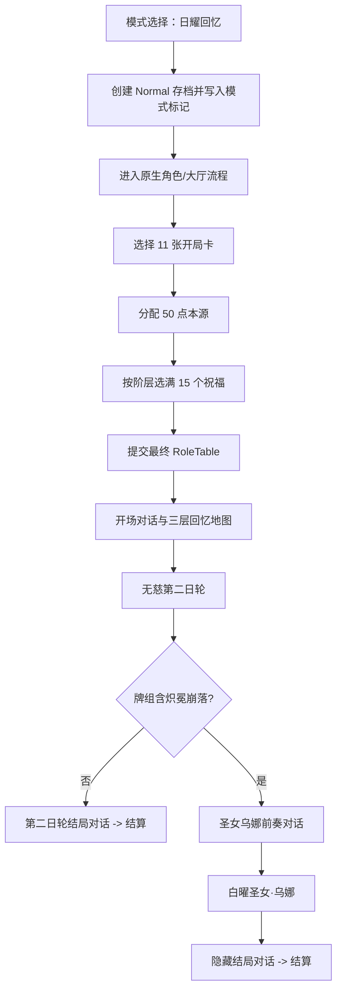

# 日耀回忆模式

> 模块范围：模式入口、存档创建、玩家整备、Aura Journey 注册、三层地图、固定剧情、Boss 分支、结算、旧存档与联机角色提交。

## 1. 模式定位与边界

日耀回忆是 SunExp 的角色专属大型模式，但当前实现没有创建一套独立的宿主 `IModeManager`。它创建 `modeType = Normal` 的标准存档，并用 `SunExp_SolarMemoryMode = 1` 标识专属路线，再在普通模式地图、战斗和结算流程上做受控改写。

这条边界很重要：

- 宿主仍负责角色、卡牌、地图 UI、战斗与存档基本生命周期；
- SunExp 负责整备状态机、专属内容隔离、固定节点、Boss 分支和异常修复；
- Aura Journey 保存可共享的路线定义和活动模式投影，不替代宿主地图对象；
- 当前终局直接进入 `GameExitUI`，不再生成旧设计中的额外终章地图层。

## 2. 用户可见流程



## 3. 内容与配置入口

### 3.1 六段回忆

事件全部使用 `Sub_` id，避免进入宿主普通随机事件池：

| 层 | 固定位置 | EventList | 显示名 |
| --- | --- | --- | --- |
| 1 | 开端 | `Sub_solar_memory_black_sun_after` | 黑日之后 |
| 1 | 第四节点 | `Sub_solar_memory_second_sun` | 第二日轮 |
| 2 | 开端 | `Sub_solar_memory_saint_daily` | 圣女的日常 |
| 2 | 第四节点 | `Sub_solar_memory_polluted_light` | 被污染的光 |
| 3 | 开端 | `Sub_solar_memory_grief_struggle` | 心哀与挣扎 |
| 3 | 第四节点 | `Sub_solar_memory_above_sacred_wheel` | 圣轮之上 |

每个事件提供“继续回忆”和“查看卡牌”。CSV 入口只调用 `EventScripts`，再由 `SolarMemoryFlowApi` 进入模式逻辑，避免 Scripting 直接依赖 Hooks。

### 3.2 固定首领

| Map id | Level id | 位置 |
| --- | --- | --- |
| `solar_memory_boss_orbit_mirror_array` | `SunExp_sunexp_level_orbit_mirror_array` | 第二层固定首领 |
| `solar_memory_boss_second_sun_last_day` | `SunExp_sunexp_level_second_sun_last_day` | 第三层倒数第二槽 |
| `solar_memory_boss_saint_wuna` | `SunExp_sunexp_level_saint_wuna` | 隐藏终局 |

这些 Map 行的 `Rarity=7` 只是数据标记，真正隔离还依靠 `SunExpIds` 判定、模式节点工厂和非日耀模式清洗器。

## 4. 初始化与模式入口

`Entry.Initialize` 先调用 `SolarMemoryJourneyApi.Initialize` 注册共享 Journey，`RuntimeHooks` 再初始化模式入口、地图、战斗、奖励、内容隔离、起始卡组和地图表现。

`SolarMemoryModeEntryRuntime` 通过 `ModeChoiceEntryRegistry` 增加独立模式按钮，并复用原生模式项的结构和布局。它不会占用或冒充 `StoryMode` 等原生槽位。

点击后 `SolarMemoryRunLauncher`：

1. 创建标准 `SaveInfo`，`modeType` 为 `Normal`；
2. 写入模式、选中卡包、整备步骤、剧情和 Hard 状态；
3. 初始化 50 点本源、空祝福列表和未完成的卡组状态；
4. 发布 Aura Journey 活动模式；
5. 选择存档并进入原生 `GameEntryUI`；
6. 联机时只有主机可以启动。

## 5. 整备状态机

`SolarMemoryPreparationRuntime` 使用显式步骤：

```text
DeckSelection -> OriginAllocation -> BlessingSelection -> Complete
```

状态存放在玩家自己的 `RoleTable.SpecialVarMap`。单机可从旧全局 GameVar 推断和迁移，联机不会把旧全局准备值错误地分配给其他玩家。

### 5.1 开局卡组

`SolarMemoryDeckIsolationRuntime` 负责初始/当前卡包选择、CardPackCheck 过滤、事件卡识别、角色牌组清洗、备用池清空和原生牌组窗口入口。`SolarMemoryStarterDeckRuntime` 使用该边界提供的卡包与分类结果建立候选，要求最终正好 11 张，并通过 StarterDeck Arbiter 声明 `SunExp.SolarMemory` 所有权，防止其他模式或 MOD 同时覆盖开局牌组。

应用时会：

- 过滤不存在或不适用于当前大厅的卡牌；
- 写入角色卡组并清除保留池；
- 清理事件卡，避免专属事件实体混入战斗牌组；
- 标记 deck configured/applied；
- 保持中间编辑状态为玩家私有，不进行半成品角色同步。

卡包选择优先读取玩家自己的 `RoleTable.SpecialVarMap`；只有单机才读取旧全局存档值。没有有效选择时回退到宿主启用卡包，再回退到前六个未锁定可见卡包。在线专属卡包仍受当前大厅兼容检查约束。

### 5.2 本源分配

玩家分配最多 50 点到 `Strength`、`Lucky`、`Perceive`、`Wisdom`。实际可分配总量受角色主属性、次属性和其他属性动态上限限制；确认前必须把当前可分配点用完。

### 5.3 祝福选择

祝福来自宿主 Bless 表，经卡包过滤、锁定检查和技术祝福排除后按稀有度分池。固定配额为：

| 阶层 | 数量 |
| --- | ---: |
| 4 阶 | 2 |
| 3 阶 | 3 |
| 2 阶 | 5 |
| 1 阶 | 5 |

共 15 个祝福。只有各阶层都满足配额才能确认，确认后通过 `PlayerApi.AddBless` 发放。

### 5.4 最终角色提交

整备完成后才调用 `SolarMemoryRoleCommitApi.CommitFinal`。提交包含一次性 token：

- 单机/主机在服务端本地应用；
- 客户端通过 `RpcSolarMemoryRoleCommit` 提交；
- 服务端校验真实 sender、房间成员、`role.Id == sender.PlayerId`、模式标记和完成状态；
- token 去重，提交失败会撤销完成标记并允许重试。

## 6. Aura Journey 路线

`SolarMemoryJourneyApi` 以 owner `SunExp` 注册 Journey `SunExp:SunExp.SolarMemory`，包含 preparation、route 和 boss 三类节点。路线图共三层：每层宿主长度 6，默认段长度 6、可选段长度 8。

Journey 声明的是跨 MOD 可查询的路线契约；真正写入 `MapTree` 的仍是 `SolarMemoryMapNodePoolFactory` 和 `SolarMemoryMapNodePoolApplier`。

## 7. 地图生成与固定槽

宿主反编译确认 `NormalMapManager.GeneratrMap` 会过滤 `Sub` 事件、调用 `RandomGenerate` 并追加原生固定事件/首领；`MapItemInit` 每 6 层建立 6 个地图槽，并调用 `SendNode` 和 `ReadyToSelect`。

SunExp 的接入顺序是：

1. `RandomGenerate` 前记录事件历史长度；
2. `GeneratrMap` 后生成当前层专属池并覆盖固定槽；
3. 必要时裁掉宿主生成过程中错误追加的事件历史；
4. `MapItemInit` 后重设固定节点表现和锁定；
5. `MapSelectUI.ShowMap` 后再次修复客户端显示；
6. 对每个自建或恢复节点保证确定性的 `NodeDice`。

固定布局：

- 第一层：槽 0 和槽 5 为两段剧情；
- 第二层：槽 0、槽 3 为剧情，槽 5 为白曜镜阵；
- 第三层：槽 0、槽 3 为剧情，槽 4 为无慈第二日轮，槽 5 预留隐藏首领路径。

地图运行采用四段边界：`SolarMemoryMapLifecycleCoordinator` 负责地图生成、选择数组修复、客户端 `currentNode` 恢复和固定槽重投影时序；`SolarMemoryMapVisualRuntime` 只注册 DataUpdate、MapItemInit 和 ShowMap 表现 Hook；`SolarMemoryMapProjectionRuntime` 创建或复用固定槽 `MapItem`、链条、标题与地图卡纹理；`SolarMemoryModeRuntime` 仅保留模式组合初始化、整备窗口入口和模式状态查询。地图卡声明继续来自 `VisualRegistry`，资源读取经过 `SunExpResourceCache`。

## 8. 内容隔离与地图同步

`SolarMemoryContentIsolationRuntime` 在非日耀模式下扫描生成树、选择参数和当前节点，把误入的专属 Map/Event 替换为同类型普通节点。同步数组的检测、替换和安全结果校验委派给 `SolarMemoryContentIsolationService`；Runtime 只负责从宿主配置中解析候选回退。它不会直接改写全局 Map 配置行。

日耀模式联机同时维护三份结构：

- 权威 `MapTree`；
- `MapManager.mapList`；
- `MapManager.mapData`。

在 `CmdSelectMap`、带 sender 的兼容入口、`TargetUpdateMap`、`RpcUpdateMap` 和 `RpcNextMap` 前后修复数组和 currentNode。只修树而不修数组会导致客户端 `ShowMap` 按旧 id 重建错误节点。

固定槽由 `SolarMemoryFixedNodeCatalog` 唯一定义，`SolarMemoryMapSyncRepairService` 按相同规格修复 `mapList`/`mapData`。两者都是不依赖 Unity 或宿主对象的 Mechanics 规则，并通过纯行为测试覆盖三层布局、错位专属节点、数组长度不一致和幂等修复。

## 9. 战斗与奖励

`SolarMemoryCombatRuntime` 在敌人初始化后将当前生命和最大生命乘以 3，并用动态变量标记防止重复放大；随后刷新 `FightManager.statusData` 中的网络传输快照。

`SolarMemoryRewardRuntime` 通过共享 `BattleRewardAdjustmentService` 追加一个随机遗物奖励。它是普通奖励的增量规则，不像无尽之海那样独占替换整套奖励计划。

## 10. Boss、剧情与结算

### 10.1 无慈第二日轮

`SolarMemoryBossTransitionCoordinator` 在 `Fight_Win.ResetStates` 后读取 `FightManager.level`：

- 牌组没有 `炽冕崩落`：播放第二日轮结局对话，然后直接结算；
- 牌组含该卡：播放圣女乌娜前奏，并由主机创建白曜圣女节点。

隐藏路线判断检查完整 id 与短 id，不使用旧设计中的名字资源计数。

### 10.2 白曜圣女·乌娜

`SolarMemoryFlowApi` 将前奏完成回调交还 `SolarMemoryBossTransitionCoordinator`，由其设置 pending 标记。主机在地图运行时可用时：

1. 创建带 `NodeDice` 的固定 Boss 节点及终止子节点；
2. 更新 `MapTree.currentNode` 和存档；
3. 修复 `mapList/mapData` 的终点槽；
4. 关闭对话、战斗奖励和地图临时 UI；
5. 调用 `MapManager.CmdNextMap` 进入战斗。

胜利后由同一协调器播放隐藏结局，并把最终结算交给 `SolarMemorySettlementCoordinator`。对话期间的 settlement pending 也由 Boss 协调器持有，结算协调器会读取该状态，防止地图 Hook 提前进入结算。

### 10.3 结算与失败

宿主 `NormalMapManager.ReadyToChangeMap` 在 Level >= 32 时显示 `GameExitUI`。`SolarMemorySettlementCoordinator` 在第三层完成后把 Level 路由到 32，并由 `SolarMemorySettlementPresenter` 关闭地图/事件 UI 后打开原生结算。

旧存档若已落在旧终章等级 30 以上，结算协调器会在 `MapItemInit` 前将其恢复到当前终点层并直接打开结算。逃跑和失败由 `SolarMemoryBattleExitCoordinator` 统一处理：在 `Fight_Escape.ResetStates` 前后修复 currentNode，在 `Fight_Loss.Init` 清理独立失败分支，并关闭整备临时 UI、清除隐藏 Boss pending，但不伪造胜利结算。

## 11. 分层职责

| 层 | 主要职责 |
| --- | --- |
| Scripting | `EventScripts` 提供 CSV 可调用的继续、开牌组和节点初始化入口 |
| GameApi | `SolarMemoryFlowApi`、Journey API、RoleCommit API 封装流程和共享/网络边界 |
| Mechanics | 固定节点规格、路线节点池、节点应用、同步数组修复、内容隔离策略、剧情门控、终局状态 |
| Hooks/UI | 模式入口、牌组隔离、整备窗口、地图 Hook、地图投影、退出战斗协调、Boss 转场协调、结算协调、战斗与奖励 |
| Network | 最终角色提交；地图仍结合宿主 Map RPC 修复 |

## 12. 宿主映射

| 宿主类型/方法 | SunExp 接入 | 证据 |
| --- | --- | --- |
| `ModeChoiceUI` | 注册独立模式项并启动存档 | 反编译确认 UI 入口；代码确认注入 |
| `GameConfigManager.CardPackCheck` | `SolarMemoryDeckIsolationRuntime` 在宿主构建候选前移除事件卡 | 代码和反编译确认 |
| `NormalMapManager.RandomGenerate/GeneratrMap` | `SolarMemoryMapLifecycleCoordinator` 捕获并改写地图池 | 反编译确认原生生成顺序 |
| `NormalMapManager.MapItemInit` | 固定 6 槽及视觉锁 | 反编译确认节点、SendNode、ReadyToSelect 顺序 |
| `MapSelectUI.ReadyToSelect/SendNode/ShowMap` | 地图生命周期协调器修复可选牌、数组发送和客户端重建 | 反编译确认 |
| `MapManager.CmdSelectMap/TargetUpdateMap/RpcUpdateMap/RpcNextMap` | 地图生命周期协调器修复权威数组和 `currentNode` | 反编译确认网络入口 |
| `Fight_Win.ResetStates` | `SolarMemoryBossTransitionCoordinator` 执行 Boss 胜利分支、剧情 pending 和隐藏 Boss 转场 | 代码和反编译确认 |
| `Fight_Escape.ResetStates`、`Fight_Loss.Init` | `SolarMemoryBattleExitCoordinator` 执行异常退出清理和 currentNode 修复 | 代码和反编译确认 |
| `NormalMapManager.ReadyToChangeMap` | `SolarMemorySettlementCoordinator` 在第三层完成后转原生结算 | 反编译确认 Level >= 32 行为 |
| `GameExitUI` | 最终结算界面 | 反编译确认类型，代码确认调用 |

## 13. 性能、兼容与已知限制

- 固定节点规格由不可变的按层目录复用，配置表查询走 `SunExpConfigIndex`。
- 地图卡纹理通过 `VisualRegistry` 和 `SunExpResourceCache` 解析；重复 ShowMap 会复用带 `FixedSlotVisualState` 的 MapItem。
- 固定槽 `ObjectGroup.blocksRaycasts` 保持关闭，视觉对象不阻断地图交互。
- 地图重写只在模式标记开启时运行，非本模式只执行专属内容清洗。
- UI 使用 ModalHost、UI Safety、对象池和下一帧调度，异常退出会关闭射线。
- 当前日耀回忆基于 Normal 宿主模式；若游戏重构 `MapItemInit` 的 6 槽契约，需要同步重做节点应用器。
- 反编译版本提供行为证据，当前编译签名仍以 `Managed/` 为准。
- 旧 `Sub_solar_finale_*` 终章链不是当前活跃结算路径。

## 14. 源码与验证

主要入口：`SolarMemoryRunLauncher.cs`、`SolarMemoryDeckIsolationRuntime.cs`、`SolarMemoryPreparationRuntime.cs`、`SolarMemorySetupFlowRuntime.cs`、`SolarMemoryStarterDeckRuntime.cs`、`SolarMemoryBlessingPickerRuntime.cs`、`SolarMemoryModeRuntime.cs`、`SolarMemoryMapLifecycleCoordinator.cs`、`SolarMemoryMapVisualRuntime.cs`、`SolarMemoryMapProjectionRuntime.cs`、`SolarMemoryBattleExitCoordinator.cs`、`SolarMemoryBossTransitionCoordinator.cs`、`SolarMemorySettlementCoordinator.cs`、`SolarMemorySettlementPresenter.cs`、`SolarMemoryFixedNodeSpec.cs`、`SolarMemoryMapSyncRepairService.cs`、`SolarMemoryContentIsolationService.cs`、`SolarMemoryMapNodePoolFactory.cs`、`SolarMemoryContentIsolationRuntime.cs`、`SolarMemoryFlowApi.cs`、`RpcSolarMemoryRoleCommit.cs`。

数据入口：`SunExp/Data/EventList/sunexp.csv`、`Text/EventList/sunexp.csv`、`Data/Map/sunexp.csv`、`Text/Map/sunexp.csv`、Enemy/Level/Dialogue 对应行。

重点回归：四步整备恢复、双人分别提交、六段剧情固定槽、地图数组修复、第二日轮两条分支、隐藏 Boss 重连、逃跑/失败、旧等级结算和非日耀模式内容隔离。
