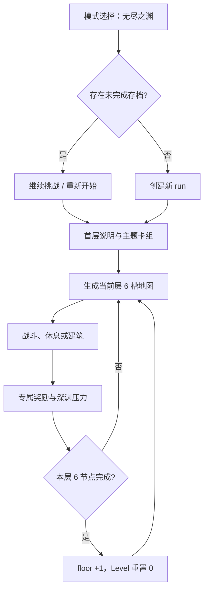

# 无尽之海模式与地图循环

> 模块范围：无尽之海入口、存档续玩、主题开局卡组、楼层状态、六槽地图、节点池、战斗成长、专属奖励、卡牌焚毁和联机楼层快照。深渊震荡、注视、诅咒与里程碑详见[无尽深渊压力与奖励体系](07-无尽深渊压力与奖励体系.md)。

## 1. 模式定位

代码中的历史类名是 `EndlessSea*`，当前玩家可见标题统一为“无尽之渊”。它和日耀回忆一样复用宿主 `NormalMapManager`，但没有固定终点：1 至 6 层为潜行阶段，第 7 层起进入无尽阶段。

`SaveInfo.modeType` 始终修复为宿主 `Normal`，真实模式身份由 `SunExp_EndlessSeaMode = 1` 和 run id 决定。旧 `SunExpEndlessSea` modeType 只用于迁移识别，不是当前地图管理器类型。

## 2. 用户流程



## 3. 启动、续玩与运行阶段

`EndlessSeaModeEntryRuntime` 通过 `ModeChoiceEntryRegistry` 注入独立入口。`EndlessSeaRunLauncher` 先查询最近的未完成 run：

- 继续：修复旧字段并选择原存档；
- 重新开始：删除未完成 run，并清理模式选择和原生 Normal 存档缓存；
- 新建：生成 seed、run id、第一层和空楼层计划。

运行阶段保存在 GameVar：

```text
Intro -> MapPlanning -> InBattle -> Reward -> BetweenFloors -> MapPlanning
                                                        -> Ended
```

`EndlessSeaRunStateStore` 负责创建、修复、更新时间、查找和删除；不能仅根据存档名字判断模式。

## 4. 首层说明与主题卡组

第一层首次打开地图时，`EndlessSeaIntroBoardRuntime` 展示规则与主题卡包。开局卡组固定 15 张：

- 11 张官方基础卡；
- 当前主题提供 4 张主题卡。

“学院必修”始终可选，其他主题根据当前启用的官方卡包显示。主题目录在 `EndlessSeaStarterDeckCatalog` 中校验牌数和卡牌 id；应用结果通过 StarterDeck Arbiter 声明所有权。

开局卡组被标记为 baseline，避免无尽模式的自动焚毁规则污染初始牌；之后通过奖励、商店、仓库或脚本新获得的卡才自动附着焚毁。

## 5. 六槽地图模型

每层有 6 个可视槽：

| 槽位 | 规则 |
| --- | --- |
| 0 | 固定当前层普通战斗，锁定 |
| 1-4 | 玩家从 8 张可选节点牌中配置 |
| 5 | 固定 Boss；第 7 层起标为 EndlessBoss |

`EndlessSeaFloorPlan` 只持久化固定槽 0 和 5。中间槽来自每层可选节点牌：固定包含 1 个休息、1 个建筑，其余为普通或精英；第 3 层起加入精英，第 7 层起包含 2 个精英候选。

### 5.1 为什么原生 DefaultNode 不是六个固定节点

宿主反编译确认 `NormalMapManager.MapItemInit` 默认只从 `DefaultNode` 取起点和终点，并通过 `MapSelectUI.ReadyToSelect` 从 `SelectNode` 取 8 张节点牌。因此 SunExp 构造一个兼容投影：

- `DefaultNode[0]` 放安全的休息节点，满足宿主启动假设；
- `DefaultNode[1]` 放本层 Boss；
- UI 应用阶段再把可视槽 0 替换为计划中的普通战斗；
- `SelectNode` 保存 8 张中间节点牌。

这样既保持宿主 `MapItemInit` 不崩溃，也得到 SunExp 的六槽语义。

## 6. 节点池与确定性

`EndlessSeaNodePoolService` 从当前游戏 Map 表动态筛选：

- 排除锁定、隐藏、`Rarity=7`、专属 Breaks 和普通事件行；
- 按 `Type/Note/Level` 区分普通、精英、建筑、休息和 Boss；
- 楼层每 3 层提高可使用的 Map 等级上限；
- 建筑按排序后的列表随楼层轮换；
- Boss 1-4 层优先普通池，5-6 层优先特殊池，7 层以后扩展候选。

每个节点写入 floor、slot、kind、pool source 和 locked 元数据，并生成 `NodeDice`。主池为空时使用同类 fallback；休息最终可退回 `28/Breaks`，战斗退回 `map_0`。

## 7. 楼层推进

宿主 `NormalMapManager.ReadyToChangeMap` 每 6 个 Level 重新生成地图，Level >= 32 则结算。无尽模式在该方法前拦截完成层：

1. 主机将 phase 设为 BetweenFloors；
2. floor 加一，generated floor 清零；
3. 第 7 层确保注视等级至少达到配置下限 5；
4. 通过 `MapManager.SetLevel(0)` 重置原生层内进度；
5. 强制重建下一层计划；
6. 广播权威快照。

因此“无尽”来自反复重置宿主 Level 并独立增加 floor，而不是让原生 Level 无限增长。

## 8. 战斗成长与本源奖励

`EndlessSeaCombatRuntime` 在敌人初始化后缩放生命：

```text
倍率 = 1 + (floor - 1) * 0.12
     + max(0, floor - 10) * 0.03
     + max(0, gaze - 1) * hpGrowthPerGaze
上限 20 倍
```

当前配置的每级注视生命成长为 0.08。缩放以“已应用楼层”动态变量去重，并刷新 `FightManager.statusData`。

当某项本源达到 50：

| 本源 | 战斗效果 |
| --- | --- |
| Strength | 开战获得 2 张附焚毁/碎片化的“不稳定思绪” |
| Lucky | 最大魔能 +3 |
| Perceive | 战斗结束恢复满生命和理智 |
| Wisdom | 骰值与 Bonus +50；达到 150 时再增加 2 次触发 |

本源上限会被修复到至少 50。

## 9. 专属战斗奖励

宿主 `BattleRewardsUI.ModeSetReward` 会调用 `MapManager.SetReward` 生成原生奖励。无尽模式在其后通过独占规则替换为楼层计划，并下一帧复核，防止其他追加规则再次污染结果。

| 楼层 | 节点 | 卡牌选择 | 祝福 | 遗物组 |
| --- | --- | ---: | ---: | --- |
| 1-2 | 任意战斗 | 2 | 1 | 1 阶一组 |
| 3-4 | 任意战斗 | 2 | 1 | 2 阶一组 |
| 5-6 | 普通 | 3 | 1 | 两组 1-3 阶 |
| 5-6 | Boss | 5 | 1 | 一组 3-4 阶 |
| 7+ | 普通 | 5 | 0 | 两组高覆盖遗物 |
| 7+ | Boss | 5 | 1 | 一组 3-4 阶 |

`BattleRewardsUI.Entry` 反编译确认最终会调用 `MapManager.TryChange`。SunExp 在 Entry 后排入深渊震荡并结算本源战后效果。

## 10. 自动焚毁

`EndlessSeaCardAffixRuntime` 监听奖励选择、CardItem 初始化、脚本抽牌、PlayerInfo 加卡、商店、卡包、仓库和保险箱等入口。`EndlessSeaCardAffixService` 使用 run-permanent attachment 给非 baseline 卡附着焚毁，并同步 DataConfig 与 CardItem。

战斗区域扫描使用 Aura 共享的 `AuraCombatCardZoneSnapshot`，覆盖 FightUI 活跃牌、等待区、执行器手牌和等待区。里程碑可以明确移除某一张牌的焚毁。

## 11. 地图同步与权威快照

地图仍使用宿主 `MapManager.CmdSelectMap/TargetUpdateMap/RpcUpdateMap/RpcNextMap`。SunExp 同时增加协议版本 3 的 `EndlessSeaStateSnapshot`，同步：

- host session 与 generation；
- floor、generated floor、run id、phase、ended；
- 起始牌组完成状态；
- 注视等级和待处理震荡；
- floor plan hash，以及必要时的完整 JSON。

`AuraAuthoritativeSyncDomain` 提供请求节流和 token 去重。客户端只接受新 generation；host session 改变时清空旧计划缓存。修复请求仅接受房间成员，计划 payload 受共享软大小上限约束。

地图 UI 出现后，客户端把 pending snapshot 投影到标题和固定槽；快照不是新的 Map 权威源，而是宿主 Map RPC 缺失或乱序时的修复层。

协议版本 3 额外同步主动撤离 token、原因、楼层、结算深度和发起时间。客户端只能应用房主发布的撤离结果，不能自行写入共享结束状态。

## 12. 主动撤离

主题卡组选定并进入地图后，所有楼层都会在 TopBar 显示“撤离”按钮。单机玩家或联机房主可以发起撤离；普通联机成员点击时只会收到房主权限提示，不产生请求或投票。

撤离仅允许从稳定的 `MapPlanning` 阶段发起。战斗、事件、对话、战斗奖励、里程碑奖励和待处理深渊震荡都会阻止撤离，避免跳过已触发结算。

确认撤离后，运行阶段先从 `MapPlanning` 进入 `Evacuating`。结算深度按 `(floor - 1) * 6 + Level` 计算并投影到宿主 `GameExitUI`，撤离以 `loss = false` 进入成功结算并计为模式通关。玩家完成结算并返回菜单前，阶段才写为 `Ended`；若结算前退出，下一次进入会恢复同一份撤离结算而不是返回地图。

联机撤离由房主绑定的 RPC sender 授权。房主从已持久化的 token 重新捕获权威撤离结果并广播，客户端使用 `runId + token` 去重，再以同一结算深度显示本地结算。

## 13. 宿主映射

| 宿主类型/方法 | SunExp 行为 | 证据 |
| --- | --- | --- |
| `ModeChoiceUI` | 注入模式入口与续玩提示 | 代码确认 |
| `MapManager.MapUIStart`、`MapSelectUI.Start` | 首层说明和主题卡组 | 代码确认 |
| `NormalMapManager.MapItemInit` | 构建楼层并覆盖六个可视槽 | 反编译确认原生布局 |
| `MapSelectUI.ReadyToSelect` | 生成 8 张可选节点牌 | 反编译确认 |
| `MapSelectUI.SendNode/ShowMap` | 发送数组和客户端重建 | 反编译确认 |
| `NormalMapManager.ReadyToChangeMap` | 每 6 节点推进 floor 并重置 Level | 反编译确认宿主边界 |
| `Enemy.Init` / 状态生命周期 | 生命缩放与深渊敌人修饰 | 代码确认 |
| `FightManager.Init` | 第 7 层后追加敌人 | 代码确认 |
| `BattleRewardsUI.ModeSetReward` | 独占替换奖励 | 反编译确认原生生成入口 |
| `BattleRewardsUI.Entry` | 战后压力并继续地图 | 反编译确认 Entry 调用 TryChange |
| `TopBarUI.Awake/Start` | 注入主动撤离按钮 | 代码确认 |
| `GameExitUI.ReturnAsync`、`GameApp.ReturnToMenu` | 完成撤离结算后持久化 Ended | 反编译与代码确认 |

## 14. 兼容与限制

- 代码历史名“EndlessSea”和当前显示名“无尽之渊”并存，重命名时不能直接改存档 key。
- 当前 run 没有自然胜利终点；主动撤离是玩家结束挑战并进入成功结算的正式路径。
- 海域主题轮换尚未实施。
- 节点池依赖宿主 Map/Level/Enemy 内容，新增官方内容可能进入候选池，需重新检查筛选规则。
- 只有主机推进楼层和发布快照，客户端不得本地 floor +1。
- 旧存档先迁移再判定，不能仅清理旧 modeType。

## 15. 源码与验证

主要入口：`EndlessSeaRunLauncher.cs`、`EndlessSeaRunStateStore.cs`、`EndlessSeaIntroBoardRuntime.cs`、`EndlessSeaStarterDeckCatalog.cs`、`EndlessSeaFloorPlanner.cs`、`EndlessSeaMapBuilder.cs`、`EndlessSeaNodePoolService.cs`、`EndlessSeaModeRuntime.cs`、`EndlessSeaCombatRuntime.cs`、`EndlessSeaRewardRuntime.cs`、`EndlessSeaCardAffixRuntime.cs`、`EndlessAbyssEvacuationRuntime.cs`、`EndlessAbyssEvacuationService.cs`、`RpcEndlessAbyssEvacuation.cs`、`EndlessSeaNetworkSync.cs`。

重点回归：新建/续玩/重开、15 张主题卡组、六槽与八张节点牌、楼层 6->7、Boss 池、原生 Level 重置、奖励独占、baseline 不焚毁、新卡自动焚毁、全楼层主动撤离、待处理结算拦截、撤离结算恢复、客户端晚加入与快照修复。
