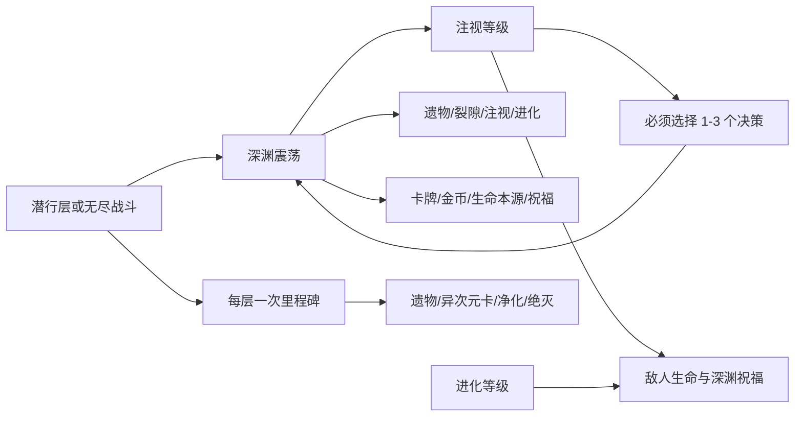

# 无尽深渊压力与奖励体系

> 模块范围：注视等级、深渊震荡、运行账本、诅咒卡、裂隙、进化、敌人祝福/意图/增援、里程碑奖励和联机结算。它是[无尽之海模式与地图循环](06-无尽之海模式与地图循环.md)的压力子系统，不是独立启动模式。

## 1. 模块定位

无尽深渊把每层/每战斗的选择代价转化为持续 run 状态。核心闭环是：

模块的共享 run 状态由主机权威维护；里程碑账本虽然按 player scope 设计，但当前多人 UI 提交链仍有下文所述的实现缺口。

## 2. 配置入口

`SunExp/endless_abyss.config.json` 当前关键值：

| 配置 | 值 |
| --- | ---: |
| 初始注视 | 1 |
| 每增加多少注视多选一个震荡决策 | 3 |
| 最大必选决策数 | 3 |
| 无尽阶段最低注视 | 5 |
| 无尽战斗后被动注视增长 | 1 |
| 每级注视敌人生命增长 | 0.08 |
| 裂隙卡数量 | 2 |
| 裂隙奖励金币 | 300 |
| 献祭奖励卡牌数 | 2 |
| 注视奖励最大生命 | 20 |
| 注视奖励随机本源 | 2 |
| 里程碑起始层 | 2 |

进化特征池由 `endless_abyss.evolution_traits.registry.json` 声明，当前包含原生高级 SpecialBuff 和 SunExp 镜阵特性。配置加载失败时使用内置规范化 fallback。

## 3. 注视等级与选择数量

`EndlessAbyssGazeService` 将注视保存在 `SunExp_EndlessAbyssGazeLevel`。震荡必选数量依据 `choiceStep=3` 增长并钳制到 1-3；进入第 7 层时最低提升到 5。

注视影响：

- 无尽之海敌人生命倍率；
- 每个敌人开战获得等量“深渊祝福”；
- 深渊震荡需要同时承担的决策数；
- 无尽阶段每次震荡结算后再被动 +1。

`EndlessAbyssBlessingService` 在敌人回合开始时按层数逐次随机获得坚韧、锐刃、活力、重生或超凡等增益，并用动态变量防止开战重复附加。

## 4. 深渊震荡

### 4.1 触发频率

- 1-6 层潜行阶段：每层地图打开时排入一次；
- 7 层起无尽阶段：每场战斗奖励入口排入一次；
- ledger key 包含阶段、floor、slot 和 node，保证同一次触发只结算一次。

地图 UI 先处理 pending shock，再打开里程碑面板。客户端只请求主机快照，不自行创建震荡。

### 4.2 四个决策

| id | 代价 | 回报 |
| --- | --- | --- |
| `sacrifice` | 随机摧毁 1 件已装备遗物；无遗物时注视 +1 | 随机获得 2 张卡 |
| `crack-cards` | 随机给 2 张牌添加裂隙；无目标时注视 +1 | 300 金币 |
| `increase-gaze` | 注视 +1 | 最大生命 +20，随机本源 +2 |
| `evolution` | 进化等级 +1 | 随机祝福 1 个 |

选项去重后必须恰好满足当前 required choices。结算完成后写 ledger、清 pending、显示当前注视，并由主机广播结果。

## 5. 运行账本

`EndlessAbyssRunLedger` 把已触发震荡、里程碑和结果 key 序列化到 GameVar。它提供 `Contains`、前缀查询和原子式 `TryClaim`，避免 UI 重开、RPC 重放或地图重建重复领奖。

合并远端账本时保留本地玩家里程碑：共享 run 进度可以接受主机版本，但不能抹掉某个客户端已经记录的个人领取结果。

## 6. 裂隙与绝灭

裂隙通过原生 Tag 写入随机卡牌。`EndlessAbyssCrackService` 记录每个卡牌实例的打出次数；达到当前阈值 3 后，移除裂隙并在本场临时改为碎片化。战斗结束时移除临时碎片化、恢复裂隙并把计数清零。

绝灭使用宿主 `enchtag_2` 并记录在 `RoleTable.enchasedDict`。里程碑可给指定卡增加绝灭。裂隙和绝灭都修改真实卡牌实例，而不是只改 UI 标签。

## 7. 诅咒卡

SunExp 自有两张诅咒：

| 卡牌 | 抽到 | 丢弃 |
| --- | --- | --- |
| 生机窃取 | 玩家失去最大生命 3% 的当前生命；全体敌人最大/当前生命 +5% | 玩家再失去最大生命 2% 的当前生命 |
| 亏空 | 魔能 -1 | 无 |

扣血最低保留 1 点当前生命。随机诅咒池还会扫描所有公开的 Curse 类型/标签卡；扫描失败才退回这两张。

战斗临时诅咒带 `SunExpTemporaryAbyssCurse` marker，加入抽牌堆后随机插入，并在战斗边界清理。永久诅咒通过 `PlayerApi.TryAddCardToDeck` 写入角色牌组。添加诅咒时抑制注视的“获得卡牌”计数，防止诅咒自身递归制造更多压力。

## 8. Hard 标签“深渊凝视”

这一战斗内压力与 run 级注视不是同一个概念。Hard 标签启用后，玩家每获得一张新卡积累对应凝视 Buff，并按难度等级触发：

| 阈值 | 条件 | 结果 |
| --- | --- | --- |
| 10 | 任意凝视难度 | 向本场抽牌堆加入 1 张临时随机诅咒 |
| 15 | Hard 等级 >=2 | 再加入诅咒；下一张牌费用 +1 |
| 20 | Hard 等级 >=3 | 下一帧强制结束玩家回合 |

费用 +1 有拖拽预览、取消恢复、Action 观察和 ActionAfter 清理。每个玩家状态按 owner 隔离，每回合重置阈值与已见卡牌集合。

## 9. 进化、敌人意图与增援

进化等级保存在 GameVar。敌人初始化时，`EndlessAbyssRewardService.ApplyEvolutionTraits` 按当前等级从加权 registry 选择并附加特性，记录已应用层数避免重复。

同一敌人初始化链还会：

- 按注视添加深渊祝福；
- 在符合楼层/节点条件时从深渊意图池增加额外意图；
- 第 7 层起由 `FightManager.Init` 后置服务按普通/Boss 节点计划追加敌人。

这些处理发生在无尽之海敌人生命缩放之后的同一业务链，最终刷新宿主状态传输数据。

## 10. 里程碑奖励

从第 2 层起，里程碑按“玩家 + 楼层”生成领取 key，并提供四选一：

1. 从当前可用、未锁定的 1/2/3 阶遗物中任选一件；
2. 从配置的“更多次元”卡池随机获得一张卡；
3. 选择一张带焚毁的牌并清除焚毁；
4. 选择一张尚无绝灭的牌并添加绝灭。

异次元奖励池优先从配置的卡包动态生成；为空时退回 `polymorph`、`witch_projection`、`heart_change`。获得的牌随后仍经过无尽之海自动焚毁规范化。

个人里程碑 key 包含 player id/role id、floor 和结果，目标是避免多人共享一个领取位。网络 resolution 结构同时携带卡牌实例 id 和基础 id：先精确匹配实例，找不到时才按基础 id 或第一个候选回退。

但当前实际 UI 路径需要单独标记：客户端在地图面板入口只请求主机快照后返回，里程碑面板由主机打开；面板调用的 `GrantRelic`、`GrantRandomOtherDimensionCard`、`RemoveBurnout`、`AddExtinction` 都以 `broadcast: false` 进入服务。也就是说，虽然 `RpcEndlessAbyssMilestoneResolution` 和广播代码已经存在，当前面板没有走到它，不能声称远端玩家已经能独立选择或稳定收到里程碑结果。

## 11. 联机权威与 RPC

主机结算深渊震荡后会广播：

- 具体 resolution；
- 唯一 token；
- 同时刻的 `EndlessSeaStateSnapshot`。

客户端先按 token 去重应用震荡结果，再接受主机快照。震荡 token 缓存有 128 个上限；状态快照由 Aura 权威同步域限制 generation、请求频率和 payload。

两个 resolution RPC 都按主机到客户端广播的方向定义，不接受客户端自报决策作为权威结果。其中震荡 RPC 已被当前结算路径调用；里程碑 RPC 目前只是已实现但未由面板启用的路径。真正的主机身份和房间成员校验发生在状态发布/请求及 SunExp 网络发送边界。

## 12. 分层职责

| 层 | 职责 |
| --- | --- |
| Scripting | 诅咒卡经 `CardScripts` 转发到 CurseService；深渊祝福经 BuffScripts handler |
| GameApi | 卡牌、遗物、祝福、本源、生命和宿主奖励操作 |
| Mechanics | gaze、ledger、shock、curse、crack、evolution、enemy、milestone |
| Hooks/UI | 地图面板、震荡选择、里程碑选择、战斗/卡牌生命周期接入 |
| Network | 震荡/里程碑 resolution 和无尽之海权威快照 |

## 13. 宿主映射

| 宿主锚点 | 接入内容 | 证据 |
| --- | --- | --- |
| `MapSelectUI.ShowMap` | 排入震荡和里程碑 UI | 反编译确认地图重建时点 |
| `BattleRewardsUI.Entry` | 无尽阶段每战斗震荡 | 反编译确认奖励退出入口 |
| `Enemy.Init` / Status 生命周期 | 祝福、进化特性和额外意图 | 代码确认 |
| `FightManager.Init` | 无尽阶段追加敌人 | 代码确认 |
| CardItem 拖拽/TrueUse/Action | 凝视费用预览与提交、裂隙触发 | 代码确认 |
| `FightPlayer.TurnInit` / 回合路由 | 重置本回合凝视状态 | 代码确认 |
| `RoleTable.cardList/enchasedDict/relicList` | 永久卡牌、绝灭和遗物代价 | 当前签名与代码确认 |

## 14. 兼容、风险与验证

- run 级“注视等级”和 Hard 标签战斗内“深渊凝视 Buff”必须分开命名。
- 震荡随机代价使用稳定 seed 组合，但诅咒池个别选择仍混入 `Environment.TickCount`，不能宣称完全可重放确定性。
- 里程碑虽按本地玩家 scope 记账，但当前主机面板以 `broadcast: false` 提交；要实现真正的多人分别领取，需要增加 server-bound 请求、sender 校验并启用权威广播，不能只把现有广播 RPC 接到客户端按钮。
- 进化 registry 引用宿主 Buff id，游戏版本变化后需验证 id 仍存在。
- 临时诅咒、费用覆写和裂隙临时变化必须在取消、回合和战斗边界恢复。

主要入口：`endless_abyss.config.json`、`endless_abyss.evolution_traits.registry.json`、`EndlessAbyssRunLedger.cs`、`EndlessAbyssShockService.cs`、`EndlessAbyssCurseService.cs`、`EndlessAbyssGazePressureService.cs`、`EndlessAbyssRewardService.cs`、`EndlessAbyssMilestoneRewardService.cs`、`EndlessAbyssEnemy*Service.cs`、两个 UI Panel 和两个 resolution RPC。

重点回归：潜行/无尽触发频率、注视 1/3/最大选择数、四种震荡组合、无遗物/无卡 fallback、重复打开面板、10/15/20 凝视阈值、临时诅咒清理、每玩家里程碑、进化重复应用和客户端重放去重。
