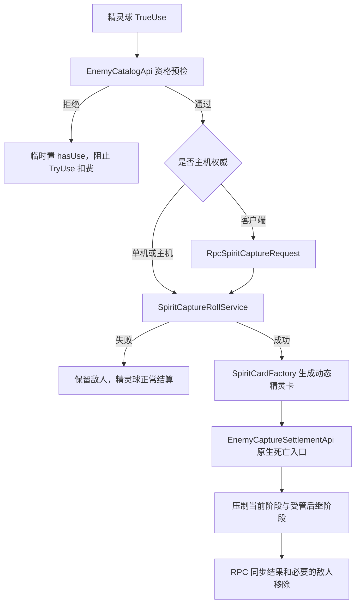

# 精灵球捕获与精灵召唤

> 实现基线：2026-07-13  
> 作用域：当前冒险、战斗内捕获、动态卡持久化、投影位召唤、单机与联机同步

## 1. 模块定位

精灵系统由三个彼此解耦的对象组成：

1. `精灵球` 是公开卡牌，只负责选中敌人、进行捕获检定并发起捕获结算。
2. `精灵卡` 是捕获成功后生成的动态 DataConfig，保存敌人身份、文本和动画快照，可进入保险箱。
3. `精灵` 是精灵卡在战斗中召唤出的行动实体。它与精灵球没有运行时引用，与精灵卡也只存在一次召唤输入关系。

这一区分保证捕获、卡牌持久化和战斗召唤可以独立演化，不把敌人对象、卡牌实例和召唤物生命周期绑在一起。

## 2. 当前规则

| 规则 | 当前实现 |
| --- | --- |
| 精灵球 | 1 费、稀有度 3、`Retain,Annihilation` |
| 精灵球卡面 | 保留 `CardSource512/MoreDimension/spirit_ball.png` 作为 512×512 源图；运行时 `MoreDimension/spirit_ball.png` 缩放为 256×256 |
| 精灵卡 | 0 费动态衍生牌、`Retain,Burnout` |
| 可捕获对象 | 只要目标是存活敌人、图鉴未锁定、存在 `Animation/Dict` 且存在 `Animation/Idle` |
| 敌人类型 | 首领、剧情敌人、召唤物和其他 MOD 敌人不按类别排除 |
| 捕获概率 | `10% + 已损失生命百分比 * 0.8`，最高 90% |
| 捕获失败 | 精灵球正常消耗，敌人不变 |
| 捕获成功 | 先生成精灵卡，再执行敌人正常死亡/败退入口，最后保证当前阶段离场 |
| 多阶段敌人 | 捕获当前阶段；同步生成的下一阶段按捕获结算配置压制，不继续进入后续阶段 |
| 召唤位置 | 与投影共用同一位置；任一存在时，另一方不可召唤 |
| 精灵意图 | 按敌人 profile 使用独立意图池；未配置对象回退到投影通用意图池 |
| 存续范围 | 精灵卡在本场冒险中存在，可借助原生保险箱保存动态 `RawData`；召唤实体只存在于当前战斗 |

## 3. 捕获资格

`EnemyCatalogApi.Inspect` 是唯一资格判定入口。当前判定顺序为：

1. `fatherObject` 必须是 `Enemy`，且当前生命大于 0、状态不是 `Dead`。
2. 读取当前敌人 DataConfig 的 `Id` 与 `Animation`。
3. 通过 `GameRuntimeData.IsLocked(enemyId)` 对齐图鉴敌人页的可见条件。
4. 使用 `ResourceLoader.LoadAll<Sprite>(Animation + "/Dict")` 验证图鉴图片。
5. 使用 `ResourceLoader.LoadAll<Sprite>(Animation + "/Idle")` 验证召唤所需待机动画。

因此“图鉴中出现”在实现中严格表示“图鉴未锁定并且具备图鉴图”；仅有敌人数据但 `/Idle` 缺失时仍然不可捕获。

对应宿主证据：

- `DictionaryUI.TotalCreateItem` 从 `DataType.Enemy` 取行，并过滤 `!GameRuntimeData.IsLocked(x["Id"])`。
- `EnemyManager.AddEnemy(string)` 从 `DataType.Enemy` 构造敌人。
- `EnemyItem` 与战斗表现分别依赖敌人动画目录中的图鉴图和动作图。

## 4. 捕获事务



### 4.1 概率与确定性

`SpiritCaptureRollService` 使用基点计算，避免浮点边界差异：

```text
missingHpBasisPoints = 10000 - currentHp / maxHp * 10000
chanceBasisPoints = clamp(1000 + missingHpBasisPoints * 0.8, 1000, 9000)
```

随机值由战斗 epoch、目标状态 id、卡牌或网络 token 组成种子，再通过稳定 FNV 混合生成。联机客户端不自行决定结果，主机产生唯一结果并广播。

### 4.2 原生死亡与阶段终止

`EnemyCaptureSettlementApi` 将捕获解析上下文限制在同步调用栈内，然后：

1. 将目标生命设为 0，并优先调用 `StatusManager.CheckDead(true)`。
2. 保留 `BeforeDead`、`Dead`、`OnEnemyDead`、`Enemy.DeadEffect` 和游戏胜利检查链。
3. 若复活、剧情脚本或兼容差异让目标仍在敌人列表中，则执行受控移除。
4. Hook `EnemyManager.AddEnemy`，识别死亡调用栈内新增的下一阶段。
5. `AdaptedTerminal` 对首领级 profile 终止同步后继；`GuardedTerminal` 在单敌替换场景终止后继。
6. 联机时通过 `RpcSpiritEnemySuppressed` 让客户端移除同一后继敌人。

宿主 `StatusManager.EnemyDead` 的顺序是：从 `enemyList` 移除、触发 `OnEnemyDead`、执行 `Enemy.DeadEffect`、在敌人数为 0 时尝试 `TrySpawnNextWheelEnemy`，最后进入 `FightUI.CanWin`。捕获结算按这个顺序插入阶段压制，而不是跳过整条死亡链。

## 5. 动态精灵卡与保险箱

`SpiritCardFactory` 从隐藏模板 `*spirit_card_template` 克隆可写 DataConfig，并写入：

- 动态名称和描述；
- 敌人的 `Dict` 卡面、`Idle` 动画路径；
- 原敌人 id、variant id、来源 MOD id；
- 捕获时间、捕获来源、唯一 spirit uid；
- 原敌人卡表快照和 profile 版本；
- 精灵卡运行标记 `SunExpSpiritCard`。

写入后，同一个动态 DataConfig 会同时进入当前战斗的手牌系统和 `RoleTable.cardList` 冒险卡组。完整 data 会序列化为 JSON、GZip 压缩并放入 `Vars["RawData"]`。这与宿主 `DataConfig.Restore/ReSetVars` 的恢复路径一致，所以卡牌能够跨战斗留在当前冒险，并在进入保险箱、再回到冒险时恢复动态名称、文本、卡面路径和召唤身份，而不是退化成同一张空白模板。

`SpiritCardFaceRuntime` 通过统一的 `SunExpCardPresentationRouter` 在战斗卡牌、图鉴式展示和保险箱展示中尝试加载敌人 `Dict` 精灵图。资源失效时保留 `spirit_ball.png` 作为可见回退；这只是卡面 fallback，不会把精灵卡重新绑定到精灵球的捕获逻辑。

## 6. 精灵召唤与共享投影位

`CompanionPositionOwnershipService` 同时查询 `ProjectionStateStore` 和 `SpiritStateStore`。投影与精灵不占用原生友方角色槽，也不进入 `RoleStatusMap`，但同一玩家只能拥有一个附着实体。

召唤链为：

1. `SpiritSummonService.CanSummon` 检查战斗状态、动态快照、`Idle` 资源和共享位置。
2. 从 `Model/player` 创建与投影相同结构的表现宿主。
3. `SpiritOtherObj` 建立内部 `StatusManager`、行动卡和 `CompanionBattleState`。
4. `SpiritAttachmentPresenter` 复用 `ProjectionVisualProxy`，把敌人待机图挂到玩家的投影位置。
5. `ProjectionTurnCoordinator` 把投影和精灵合并进同一友方附着单位行动序列。
6. 战斗结束、逃跑、胜利、失败或实体死亡时，由 `SpiritStateStore` 清理状态、UI 记录和 Unity 对象。

精灵不是原生正式友方目标。它的内部状态用于脚本、自身资源和意图结算，敌方威胁仍经 `CompanionThreatService` 映射到所属玩家。

## 7. 独立意图池

`SunExp/spirit.intent.registry.json` 当前生成 59 个显式 profile，覆盖参考基线中的 56 个本体敌人和 SunExp 的 3 个首领。每个 profile 保存原敌人 `CardList`，并选择一组经过适配的投影意图：

| 精灵意图 | 适配来源示例 |
| --- | --- |
| `staff_tap` | 所有敌人的基础攻击兜底 |
| `staff_combo` | 多段、武器、火焰和强攻击类原意图 |
| `magic_interference` | 虚弱、易伤、中毒、偷窃、干扰类原意图 |
| `shield_blessing` | 所有敌人的基础防御兜底 |
| `charge` | 蓄力、狂暴、超凡和无畏类原意图 |
| `holy_heal` | 治疗、恢复和再生类原意图 |
| `you_are_enhanced` | 观察、见证、祝福和支援类原意图 |

`CompanionIntentResolver` 根据 `CompanionBattleState.EntityKind` 分派到投影注册表或精灵注册表。自定义 profile 不存在、列表为空或其他 MOD 敌人没有配置时，`SpiritIntentRegistry` 回退到投影的 `roleId: "*"` 通用池。

配置通过 `tools/Generate-SpiritRegistries.ps1` 从敌人 CSV 再生成。新增敌人时可以先用生成器取得基础适配，再手工调整 JSON 中该敌人的攻击、防御倾向、权重和属性倍率。

## 8. 联机协议

| RPC | 方向 | 用途 |
| --- | --- | --- |
| `RpcSpiritCaptureRequest` | 客户端到主机 | 提交 owner、目标和去重 token，不提交客户端随机结果 |
| `RpcSpiritCaptureState` | 主机到客户端 | 返回概率、检定结果和捕获快照；只有所属客户端生成精灵卡 |
| `RpcSpiritEnemySuppressed` | 主机到客户端 | 同步受控移除的阶段后继 |
| `RpcSpiritSummonRequest` | 客户端到主机 | 请求使用动态快照召唤精灵 |
| `RpcSpiritCompanionState` | 主机到客户端 | 同步精灵身份、意图、魔力、威胁和回合 revision |

服务器请求使用 `ISunExpServerBoundRpcCommand` 绑定真实 sender，并校验房间成员、owner 状态、战斗 epoch、协议版本和注册表 hash。图鉴解锁由使用卡牌的客户端预检，主机重新验证目标类型、存活状态、`Dict` 与 `Idle` 资源，避免用主机个人图鉴进度错误拒绝另一名玩家。请求 token 在每场战斗开始时清空，场内重复请求只解析一次。

## 9. 性能热点记录

当前阶段只记录耗时，不改变同步事务、资源加载和回合执行模型。`SunExpPerfCounters` 启用时，所有测量进入十秒聚合摘要；每个测量点的首个样本输出 `[PerfHotspot]`，超过 8ms 的后续样本继续以警告输出。

| 记录名 | 覆盖节点 |
| --- | --- |
| `Spirit.Catalog.Inspect` | 一次完整捕获资格检查 |
| `Spirit.Catalog.DictProbe` / `IdleProbe` | 图鉴图和待机动画资源探测 |
| `Spirit.CardFace.Load` | 动态精灵卡首次加载敌人 `Dict` 卡面 |
| `Spirit.Card.GrantToHand` | 动态 DataConfig、RawData 和入手/入冒险卡组 |
| `Spirit.Capture.Settlement` | 原生死亡链、阶段压制和兼容移除 |
| `Spirit.Summon.CanSummon` / `IdleProbe` | 召唤资格与来源动画检查 |
| `Spirit.Summon.Spawn` | 模型实例化、精灵初始化和状态注册 |
| `Spirit.Intent.Plan` | 精灵独立意图的选择、目标解析和效果锁定 |

日志中的 `elapsedMs`、enemy/status/path、成功状态和来源用于实机定位首次资源加载、反复校验、召唤构造或结算链中的真实热点。取得实测样本前，不据此提前引入分帧或后台任务。

## 10. 文件归属

| 层 | 主要文件 |
| --- | --- |
| 内容数据与卡面 | `SunExp/Data/Card/sunexp.csv`、`SunExp/Text/Card/sunexp.csv`、`SunExp/ModResource/Images/Card/MoreDimension/spirit_ball.png` |
| 配置 | `SunExp/spirit.intent.registry.json`、`SunExp/spirit.capture.registry.json` |
| 脚本入口 | `Scripting/CardScripts.cs` |
| 宿主适配 | `GameApi/EnemyCatalogApi.cs`、`GameApi/EnemyCaptureSettlementApi.cs` |
| 捕获业务 | `SpiritCaptureService`、`SpiritCaptureRollService`、`SpiritCardFactory`、`SpiritCaptureRegistry` |
| 召唤业务 | `SpiritSummonService`、`SpiritOtherObj`、`SpiritStateStore`、`CompanionPositionOwnershipService` |
| 意图业务 | `SpiritIntentRegistry`、`CompanionIntentResolver`、通用 Companion intent 执行链 |
| Hook/表现 | `SpiritRuntime`、`SpiritAttachmentPresenter`、`SpiritCardFaceRuntime` |
| 网络 | `RpcSpiritCapture.cs`、`RpcSpiritCompanion.cs`、`RpcSpiritEnemySuppressed.cs` |

## 11. 验证重点

- 资格边界：图鉴锁定、`Dict` 缺失、`Idle` 缺失、死亡敌人均拒绝且不扣费。
- 概率边界：满血 10%，半血 50%，空血附近 90%，不超过上下限。
- 事务顺序：精灵卡创建失败时不移除敌人；捕获失败不产生卡。
- 阶段边界：单敌轮换和首领后继不继续，普通死亡事件仍执行。
- 持久化：精灵卡放入保险箱再取出后，名称、卡面、敌人 id 和召唤能力保持。
- 位置互斥：先有投影时精灵卡不可用，先有精灵时投影不可召唤。
- 联机：客户端不自行检定，重复 token 不重复捕获，主机和客户端的精灵意图一致。
