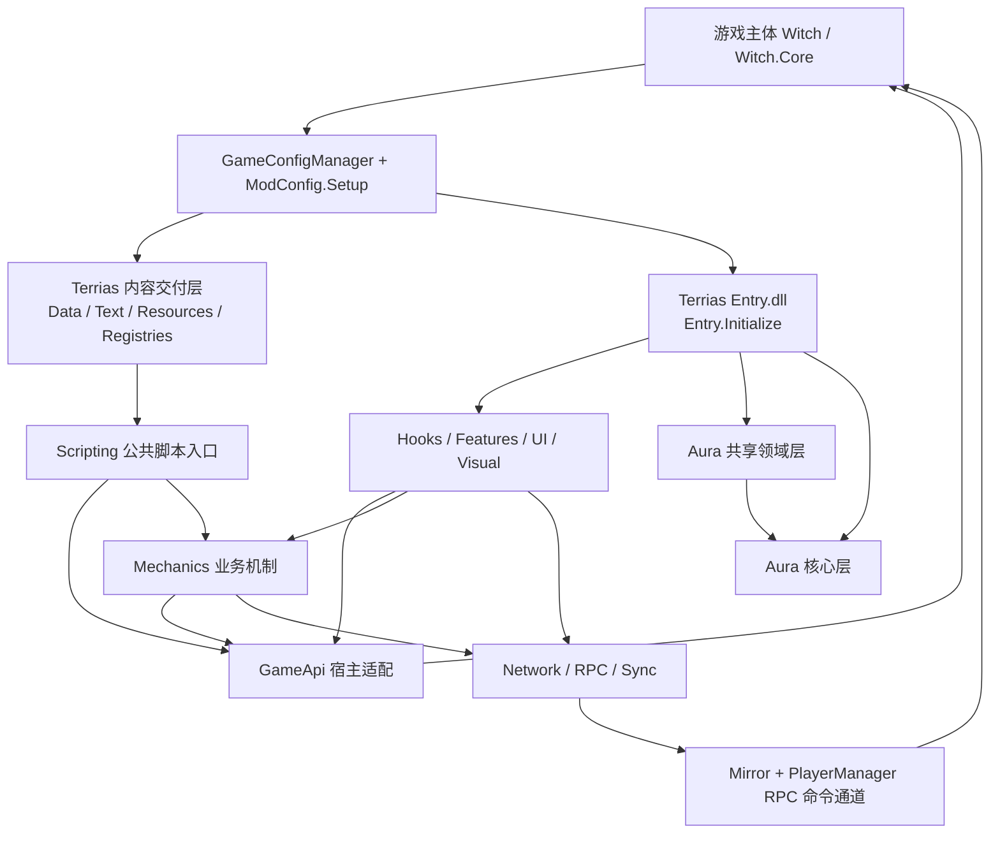
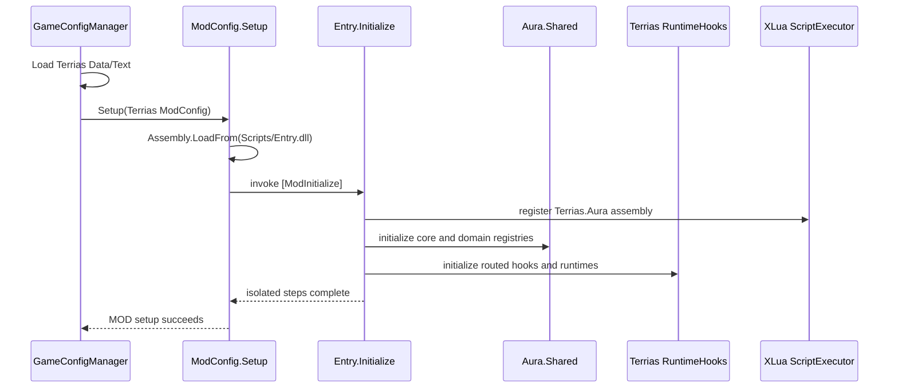

# Terrias 整体架构与运行全景

> 文档基线：2026-07-21
> 适用版本：Terrias `0.5.0`，游戏反编译参考 `v1.0.23816797`

## 1. 系统定位

Terrias 不是单一“卡包脚本”，而是同时包含静态内容、角色、战斗机制、独立模式、表现运行时、共享资源和联机协议的综合内容 MOD。

它采用两套交付程序集：

- `Terrias/Scripts/Entry.dll`，程序集名 `Terrias.Aura`，包含 Terrias 自有实现；
- `Terrias/Scripts/Aura.Shared.dll`，包含 Aura 核心与共享领域组件。

`Terrias-Dev/Terrias.Dll.csproj` 引用 `AuraSharedRuntime-Dev/Aura.Shared.csproj`，构建后将两个 DLL 一并复制到 MOD 的 `Scripts/` 目录。因此，源码目录的分层和游戏最终看到的程序集边界并不完全相同：多个共享源码项目最终合并为一个 `Aura.Shared.dll`。

## 2. 系统上下文



这里存在三类“进入游戏”的路径：

1. **内容路径**：CSV 行被宿主加载，脚本列通过 XLua 调用 `CS.Terrias.Dll.Scripting.*`。
2. **运行时路径**：`Entry.Initialize` 注册 Hook、事件监听、UI、资源和共享组件，在宿主生命周期中响应。
3. **网络路径**：Terrias 的 `RpcCommandBase` 派生命令进入游戏的 `PlayerManager`/Mirror RPC 命令通道。

## 3. 启动主链

### 3.1 游戏加载阶段

**反编译确认**，`Witch/GameConfigManager.Init` 的顺序为：

1. 初始化 `ScriptExecutor` 和 `VisualScriptExecutor`。
2. 加载官方 Addressables Data/Text。
3. 枚举 Mods 目录并读取 `ModConfig.json`。
4. 按 `ModId` 去重，检查 Enabled、依赖缺失和循环依赖。
5. 按依赖拓扑顺序加载每个 MOD 的 `Data/`、`Text/`。
6. 调用 `ModConfig.Setup()`。
7. 合并关键词、预编译脚本并初始化 DialogueManager。

**反编译确认**，`Witch.Mod.ModConfig.Setup` 会先准备 LuaEnv 和 MOD 私有 LuaTable，然后：

- 存在 `Scripts/Entry.lua` 时执行 Lua Setup；
- 存在 `Scripts/Entry.dll` 时通过 `Assembly.LoadFrom` 加载程序集；
- 扫描带 `[ModInitialize]` 的静态方法并传入当前 `ModConfig`；
- 扫描带 `ModHookAttribute` 的方法并注册 before/after Hook。

Terrias 当前不提供 `Entry.lua`，生产实现完全由 C# DLL 承担。LuaEnv 仍然存在，是因为游戏的数据脚本执行器和 `CS.*` 桥接依赖 XLua；它不是 Terrias 的第二套业务实现。

### 3.2 Terrias 初始化阶段

**代码确认**，`Terrias-Dev/Entry.cs` 中的 `[ModInitialize] Entry.Initialize` 使用隔离的 `RunStep` 依次完成：

1. 将 `Terrias.Aura` 程序集加入 XLua translator 的程序集列表，并验证主要脚本类型可导入。
2. 初始化 Aura 核心。
3. 注册 Terrias 共享功能默认值。
4. 初始化 Terrias RPC sender authority。
5. 安装共享资源包并注册共享资源清单。
6. 加载视觉、无尽深渊配置、进化特征、卡牌皮肤和视觉效果注册表。
7. 注册 CG、Skill CG、起始卡组、皮肤包、Journey 和音频运行时。
8. 初始化 UI transition guard 和 Terrias 帧调度器。
9. 初始化 Gameplay Hooks。
10. 注册特殊标签 Hook。



`Entry.RunStep` 委托给 `AuraSharedHooks.RunStep`。单个初始化步骤抛出异常时会记录步骤名并返回失败，但不会自动中止后续独立步骤。这是 Terrias 的降级初始化策略，不代表所有功能可以在任意前置步骤失败后正常工作；具体模块仍需声明自己的必要依赖。

## 4. 运行时主路径

### 4.1 数据脚本路径

以卡牌为代表：

```text
Terrias/Data/Card/*.csv 的 InitScript/UseScript
-> XLua 解析 CS.Terrias.Dll.Scripting.CardScripts.*
-> CardScripts handler registry 按内容 id 分派
-> GameApi 操作 ScriptExecutor、Card、Buff、Damage、Status
-> Mechanics 执行可复用 Terrias 规则
-> 游戏对象和 EventCenter 产生后续生命周期
```

Scripting 是稳定的公开边界，不承担大段宿主反射、UI 构造或共享协议实现。

### 4.2 Hook 路径

Terrias 大部分运行时 Hook 通过 `AuraSharedHooks` 注册到游戏 `ModConfig.AddMethodHookBefore/After`。游戏主体由 Rougamo `Modifiable` 切面在方法进入和成功返回时查询 `Witch.Core.ModHookRegistry` 并调用注册回调。

```text
RuntimeHooks.Initialize
-> 某 Terrias Runtime.Initialize
-> TerriasHookRegistry / AuraSharedHooks
-> ModConfig.AddMethodHookBefore/After("Type.Method")
-> ModHookRegistry
-> 游戏方法的 Modifiable.OnEntry/OnSuccess
-> Terrias callback
```

共享 routed hook 会让多个订阅者共用一个宿主注册回调，再由 Aura 侧分发，减少同一目标的重复注册。Terrias 自有 `TerriasHookRegistry` 默认使用 safe invoke，使单个回调异常不会越过 Hook 边界。

### 4.3 共享注册路径

共享资源和领域声明遵循 owner-qualified 模型：

```text
Terrias manifest / package
-> 内容 MOD 以 owner=Terrias 安装并注册
-> AuraSharedCore 保存资源、来源和变更记录
-> Aura 领域组件校验协议、优先级和冲突
-> Terrias 或工具 MOD 按协议读取
```

Terrias 是内容所有者，AuraToolsExp 是兄弟消费者/工具 MOD。AuraToolsExp 可以读取注册表和维护自己的本地覆盖，但不能把 Terrias 私有目录当作公共 API，也不能改写 Terrias 的注册源。

### 4.4 网络路径

Terrias 网络命令继承游戏的 `Network.Command.RpcCommandBase`。游戏 `PlayerManager.SendRpcCommand` 将命令发到服务器，服务器调用 `CmdExecute`，再广播并在客户端调用 `RpcExecute`。

Terrias 在宿主通道之上增加 `TerriasRpcAuthorityRuntime` 和 server-bound command 接口。需要改变权威状态的命令必须从服务器接收上下文绑定真实 sender，不能相信 payload 自报身份。纯表现命令也必须处理 session、去重和生命周期清理。

## 5. 分层职责

| 层 | 主要职责 | 不应承担 |
| --- | --- | --- |
| `Scripting` | CSV 可调用的稳定静态入口、id handler 分派 | UI 构造、裸 Hook 注册、复杂兼容反射 |
| `GameApi` | 宿主对象操作、反射兼容、流程 facade、确定性 fallback | 内容 id 的大规模业务分派 |
| `Mechanics` | Terrias 业务规则、状态模型、服务、注册表、规划器 | 作为其他 MOD 的公共框架 |
| `Features` | 非 CSV 的独立功能运行时 | 取代 Gameplay Hook 总入口 |
| `Hooks` | 生命周期接入、运行时路由、UI 和视觉变更 | 成为 CSV 直接调用面 |
| `Network` | RPC 命令、sender authority、快照和同步 | 从 payload 自行认定权限 |
| `Infrastructure` | id、日志、字典、性能设置、计数和低层调度 | 业务模式策略 |
| Aura 共享领域层 | 跨 MOD 的领域协议、仲裁、冲突和 fallback | Terrias 卡牌、剧情和奖励语义 |
| Aura 核心层 | 注册、包、存储、Hook、调度、资源和通用同步基础 | Journey、CG、卡牌等具体领域含义 |

实际源码存在少量协调型反向引用，例如 `SolarMemoryFlowApi` 从 GameApi facade 路由到 Hook-owned 模式流程，以及部分 Mechanics 调用 Network 广播。这些是当前实现事实。正式模块文档会把它们标为流程边界，而不是把整体架构虚构成完全无环的纯分层。

## 6. 状态与所有权

Terrias 中至少存在五类状态，不能混为一个“全局变量”：

| 状态类别 | 示例 | 权威/生命周期原则 |
| --- | --- | --- |
| 配置与注册状态 | visual registry、CG、skin、feature defaults | 初始化注册，owner-qualified |
| Run 状态 | 日耀回忆路线、无尽之海楼层、深渊 ledger | 通常 host/server 权威，跨战斗存在 |
| Fight 状态 | 场地、星谱、伙伴意图、投影 | 战斗边界初始化并清理 |
| Player-scoped 状态 | 日耀回忆准备选择、个人奖励 | 按玩家隔离，最终提交时验证 sender |
| Presentation 状态 | HUD、CG、临时窗口、动画 | 不等同于进度，必须可关闭、去重和清理 |

静态 CSV 是配置模板，不应被用于持久化本局战斗或 run 状态。运行态应进入明确的 store、ledger、game var、combat var 或同步快照。

## 7. 兼容与失败边界

- `Managed/` 是当前签名契约；反编译快照解释行为，不替代编译验证。
- 签名可能漂移的方法集中在 `GameApi` 反射包装中，并提供当前/旧签名选择和确定性 fallback。
- 初始化和 RuntimeHooks 按命名步骤隔离，错误日志包含功能名。
- Hook 回调通过 safe invoke 或专用路由隔离异常。
- 共享核心使用持久化 `AuraShared.Global` 对象，并校验 protocol、minimum protocol、build id 和必要方法；不兼容时禁用共享服务，而不是让无关游戏初始化崩溃。
- 临时 UI 必须关闭 raycast、清理 GraphicRegistry 并在战斗/UI 边界销毁。
- 共享 DLL 变化需要重新构建所有消费者，不能只让 Terrias 本地编译通过。

## 8. 关键源码导航

| 主题 | 当前入口 |
| --- | --- |
| MOD 元数据 | `Terrias/ModConfig.json` |
| C# 启动 | `Terrias-Dev/Entry.cs` |
| 构建与交付 | `Terrias-Dev/Terrias.Dll.csproj`、`tools/Build-TerriasDll.ps1` |
| 内容脚本 | `Terrias-Dev/Scripting/` |
| 宿主适配 | `Terrias-Dev/GameApi/` |
| 业务机制 | `Terrias-Dev/Mechanics/` |
| Hook 总入口 | `Terrias-Dev/Hooks/RuntimeHooks.cs` |
| Hook 适配 | `Terrias-Dev/Hooks/TerriasHookRegistry.cs`、`TerriasHookTargets.cs` |
| 网络 | `Terrias-Dev/Network/` |
| Aura 统一程序集 | `AuraSharedRuntime-Dev/Aura.Shared.csproj` |
| Aura 核心 | `AuraSharedCore/` |
| 游戏 MOD 加载参考 | 反编译 `Witch/GameConfigManager.cs`、`Witch/Mod/ModConfig.cs` |
| 游戏 Hook 参考 | 反编译 `Witch.Core/Modifiable.cs`、`Witch.Core/Witch/Core/ModHookRegistry.cs` |

## 9. 本文边界

本文只给出系统全景，不逐项解释 56 张卡牌、各大型模式或视觉/网络协议字段。功能细节由后续模块文档负责；具体的 Terrias -> 宿主类/方法映射由接入映射表负责。
