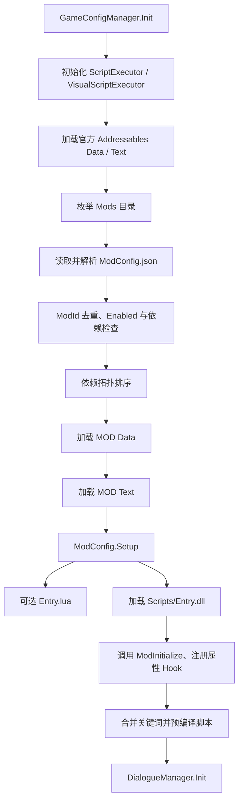
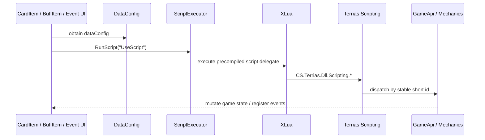

# Terrias MOD 内容数据与加载链

> 证据范围：当前 `Terrias/`、`Terrias-Dev/Entry.cs`、反编译 `Witch.GameConfigManager`、`Witch.Mod.ModConfig`、`ExcelTableReader`、`GameConfigData`

## 1. 交付目录

游戏直接消费的是 `Terrias/`，不是 `Terrias-Dev/`：

```text
Terrias/
  ModConfig.json
  Data/                 结构化配置与脚本列
  Text/                 本地化文本表
  ModResource/          图片、动画、音频、VisualBundle 等 MOD 私有资源
  SharedResources/      通过 Aura 共享包安装和注册的资源
  Scripts/
    Entry.dll           Terrias.Aura
    Aura.Shared.dll     Aura 统一共享运行时
  *.registry.json       音频、视觉、卡组、使魔、伙伴意图等声明
  *.config.json         模式或机制配置
```

`Terrias-Dev/` 是默认实现面；修改 C# 源码后，只有重新构建并刷新 `Terrias/Scripts/Entry.dll` 才会改变游戏行为。

## 2. MOD 身份与加载条件

当前 `ModConfig.json` 声明：

- `ModName = Terrias`；
- `ModAuthor = Aura`；
- `ModVersion = 0.5.2`；
- `Enabled = true`；
- `Dependencies = []`；
- `MustSame = true`。

**反编译确认**，游戏侧 `ModConfig.ModId` 返回 `ModName + "." + ModAuthor`，所以游戏依赖图和联机 MOD 清单中的身份是 `Terrias.Aura`。

`MustSame` 还会在 MOD 加载器发现 Data 表，或 MOD 修改带 `Script` 后缀的字段时被置为 true。这表达“数据/脚本会影响一致性”，不是 Aura 共享注册 owner id。Aura 共享层当前以 `Terrias` 作为内容所有者标识。

## 3. 游戏加载顺序



**反编译确认**，依赖不存在、依赖未启用或依赖图不可解析时，相关 MOD 不进入正常加载队列。Terrias 当前没有游戏侧 Dependencies，但运行时仍需要随包交付 `Aura.Shared.dll`，这是程序集依赖，不等同于 `ModConfig.Dependencies` 中的另一个 MOD。

## 4. Data/Text 表的发现与合并

### 4.1 支持的表目录

`GameConfigManager.LoadResource` 按固定目录名查找各 DataType。Terrias 当前提供：

| Data 目录 | 内容职责 | 常见脚本列 |
| --- | --- | --- |
| `Card` | 卡牌和内部模板卡 | Init/Draw/Use/DropScript |
| `Buff` | Buff、能力、特性和场地 | Init/Apply/ClearScript |
| `Relic` | 遗物 | Own/FightScript |
| `CardPack` | 卡包归属和入口 | 无业务脚本 |
| `Career` | 职业、技能、动画和语音入口 | SkillScript |
| `RoleData` | 角色立绘与展示数据 | 无业务脚本 |
| `Enemy`、`EnemyCard` | Boss/敌人与意图卡 | Init/Target/UseScript |
| `Partner`、`PartnerCard` | 伙伴与伙伴意图 | Init/Target/UseScript |
| `Blessing` | 祝福 | Own/FightScript |
| `Hard` | 难度词条 | Use/FightScript |
| `EnchTag` | 火漆/附魔标签 | Load/Draw/Drop/PreUse/Use/UnloadScript |
| `EventList`、`Map` | 事件选项和地图节点 | 选项/Init/EntryScript |
| `Dialogue` | 原生对话行 | Base/End/ChoiceScript |
| `Level` | 敌人组合、层级和 BGM | 无业务脚本 |

`Text/` 以相同 DataType 目录提供显示名、描述、选项文本和本地化字段。Data 与 Text 最终合入对应的游戏表；因此新内容若模板两侧都有定义，必须同步维护。

### 4.2 ID 前缀规则

**反编译确认**，`ExcelTableReader.ReadByFolder` 对 Mods 路径使用 `BuildPrefix(folderPath, filePath)`：

- 如果表目录的父目录是 `Data` 或 `Text`，前缀取 MOD 根目录名加文件名；
- `Terrias/Data/Card/terrias.csv` 因而得到前缀 `Terrias_terrias`；
- 原始行 id `solar_ignition` 最终成为 `Terrias_terrias_solar_ignition`；
- `Terrias/Data/Card/wuna.csv` 的前缀为 `Terrias_wuna`。

`GameConfigData` 把前缀写入字典 key，也写回行的 `Id` 字段。代码中跨表引用 Terrias 内容时应使用完整 id，不能假设运行时仍保留 CSV 中的短 id。

原始 id 含 `*` 时，`GameConfigData` 会移除星号并把完整 id 加入 `LockedIds`。因此 `*` 是加载期锁定标记，不是最终运行时 id 的字符组成。

### 4.3 表合并与所有者记录

每个目录由 `ExcelTableReader` 读取为 `GameConfigData`，随后通过 `GameConfigData.Concat` 合并到官方表。`GameConfigManager.RecordModDataConfigOwners` 会把包含任意 `*Script` 字段的行记录为该 MOD 所有。

所有者记录用于脚本归属和运行时上下文。其 key 会移除 `*`，与最终 DataConfig id 对齐。

## 5. CSV 到 C# 的脚本桥

Terrias 的脚本列保持为短调用，例如：

```text
CS.Terrias.Dll.Scripting.CardScripts.Init(self, "solar_ignition");
CS.Terrias.Dll.Scripting.CardScripts.Use(self, "solar_ignition");
```

调用链为：



### 5.1 程序集可见性

`ModConfig.Setup` 加载 `Entry.dll` 后调用 `[ModInitialize]`。Terrias 的 `RegisterLuaVisibleAssembly`：

1. 获取 `ScriptExecutor.luaEnv`；
2. 反射访问 XLua translator 的程序集列表；
3. 确保 `Terrias.Aura` 已加入列表；
4. 用 `xlua.import_type` 验证主要 `Scripting` 类型可见。

LuaEnv 缺失或 translator 结构变化时，该步骤只记录错误。此时依赖 `CS.Terrias...` 的内容脚本将不可用，因此这属于关键降级，而非“仍然完整工作”。

### 5.2 宿主脚本时机

**反编译确认**的代表性时机包括：

- `CommonCardItem`/`AttackCardItem` 在抽取、预使用和实际使用时运行 Draw/PreUse/UseScript；
- `BuffItem` 设置 Self/Object 后运行 ApplyScript，清除时运行 ClearScript；
- `BlessingRelic` 在战斗入口运行 FightScript；
- `EnemyManager` 创建敌人后运行 Enemy InitScript；
- `DialogueBox` 运行 StartScript；
- `GameConfigManager.PreCompileScripts` 在 MOD 表合并完成后预编译脚本。

正式功能文档会针对每个 DataType 追踪准确的宿主方法，而不是把所有脚本列视为同一生命周期。

### 5.3 Dialogue 例外

当前架构门禁明确要求 `Terrias/Data/Dialogue/terrias.csv` 不直接包含 `CS.Terrias.Dll.Scripting`。Terrias 的受管对话扩展由 `DialogueFlowRuntime` 和相关机制服务接入 `DialogueUI.ChooseOption` 等宿主流程，避免把 C# 调用塞入原生 Dialogue 脚本列。

## 6. Entry.dll 加载与初始化

Terrias 当前 `Scripts/` 只交付两个 DLL，不存在 `Entry.lua`。**反编译确认**，`ModConfig.Setup` 使用 `Assembly.LoadFrom(Scripts/Entry.dll)`，枚举其中所有类型的方法，并：

- 调用带 `ModInitializeAttribute` 的静态方法；
- 将带 `ModHookAttribute` 的静态方法转为 `Action<ModHookContext>` 并注册。

游戏加载器仍具备属性Hook扫描能力，但Terrias当前只使用
`Entry.Initialize -> RuntimeHooks.Initialize`后的owner-qualified routed Hook与类型化
Router。这样模式、UI、网络和性能运行时可以按步骤初始化，共享同一宿主dispatcher，并在
生命周期结束时释放订阅；产品层属性Hook与直接原生注册由架构门禁禁止。

## 7. JSON 注册表与资源

JSON 文件不是由 `GameConfigManager.LoadResource` 的 DataType 表机制自动处理，而是由 Terrias/Aura 运行时主动加载：

| 文件/目录 | 当前消费者 |
| --- | --- |
| `visual.registry.json` | `VisualRegistry`、Terrias 必需视觉运行时 |
| `SharedResources/aura.discovery.json` | AuraToolsExp 已载入 MOD 发现入口；绑定 `.modproj` 来源身份 |
| `SharedResources/aura.registration.json` | Terrias 语音/CG 的 v4 资源包声明，由发现链注册 |
| `SharedResources/audio.registry.json` | Terrias 角色语音 Provider 声明 |
| `SharedResources/cg.registry.json` | Terrias 技能、卡牌使用和美餐 CG 声明 |
| `familiar.blessing.registry.json` | 使魔祝福注册表 |
| `companion.intent.registry.json` | 伙伴意图注册表 |
| `endless_abyss.config.json` | 无尽深渊配置 store |
| `endless_abyss.evolution_traits.registry.json` | 深渊进化特征注册表 |
| `polymorph.role-crops.json` | 百变角色裁切注册表 |

资源路径分为 MOD 私有路径和共享资源路径。Terrias 自有语音/CG 位于

`SharedResources`，但不由 Terrias `Entry` 主动注册；AuraToolsExp 只读取固定
发现入口并通过共享协议注册。替换皮肤、卡框和动态效果仍由 AuraToolsExp
持有。任何一方都不得扫描对方私有目录。

开局卡牌与遗物的玩家配置由 AuraToolsExp 本地“自定义开局”管理并通过导入导出文件交换；内容 MOD 不再注册 AuraTools 开局 Profile。

## 8. 构建与交付链

```text
Terrias-Dev/**/*.cs
  + AuraSharedRuntime-Dev/Aura.Shared.csproj
  + Managed/*.dll compile contract
-> dotnet build -c Release
-> Terrias-Dev/bin/Release/net472/Terrias.Aura.dll
-> copy to Terrias/Scripts/Entry.dll
-> copy Aura.Shared.dll to Terrias/Scripts/Aura.Shared.dll
```

`tools/Build-TerriasDll.ps1` 默认使用仓库 `Managed/`，也可通过 `ManagedPath` 或游戏目录选择编译契约。项目目标框架为 `net472`，直接引用 Witch、Witch.Core、Mirror、Unity、DOTween、ZLinq、MemoryPack 等宿主程序集。

共享源码变化后，仅运行 Terrias 构建不足以证明发布正确；还需要重新构建共享消费者并验证所有打包的 `Aura.Shared.dll` 哈希一致。

## 9. 内容修改检查

- Data 与 Text 是否同时存在并保持相同完整 id。
- CSV 脚本是否只调用 `CS.Terrias.Dll.Scripting.*`。
- 新公共脚本方法是否已被 XLua 稳定导入，参数是否足够小且稳定。
- 引用是否使用运行时完整 id，而不是 CSV 短 id。
- `*` 锁定标记是否只用于需要锁定的内容。
- JSON 注册表是否由 Entry 或对应 Runtime 加载。
- 私有资源和共享资源是否放在正确所有权边界。
- C# 修改后是否已刷新 `Entry.dll`。
- 共享修改后是否已刷新并验证所有 `Aura.Shared.dll`。
