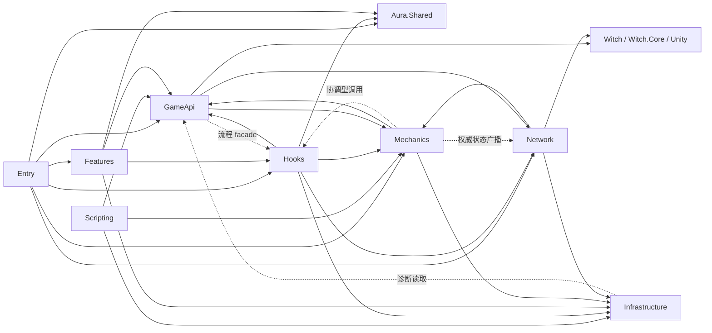

# Terrias C# 分层与依赖规则

> 本文描述当前实现，而不是理想化的纯分层模型。文件规模以 2026-07-13 工作区为准。

## 1. 分层规模

| 层 | 生产 C# 文件数 | 角色 |
| --- | ---: | --- |
| `Entry.cs` | 1 | Composition Root 与初始化编排 |
| `Scripting` | 13 | CSV 可调用公共入口 |
| `GameApi` | 46 | 游戏主体适配、兼容和流程 facade |
| `Mechanics` | 131 | Terrias 业务服务、状态、规则、注册表和规划器 |
| `Features` | 1 | 非 CSV 的独立功能运行时，目前为 Skill CG |
| `Hooks` | 125 | 生命周期、路由、模式、UI 和视觉接入 |
| `Network` | 11 | RPC、authority 和同步 |
| `Infrastructure` | 13 | id、日志、性能、调度和低层工具 |

文件数量用于判断维护规模，不代表层级优先级。`Hooks` 与 `Mechanics` 文件较多，是因为大型模式和表现运行时也在同一 Terrias 程序集中。

## 2. 依赖总览



主方向仍是 `Scripting/Hook -> GameApi/Mechanics -> 宿主`。虚线和回边表示当前实现中有意保留的协调边界，不应把图理解为严格无环包结构。

## 3. Entry：组合根

`Entry.Initialize(ModConfig)` 是唯一的主初始化编排点。它负责：

- 让 Terrias 程序集对 XLua 可见；
- 初始化 Aura 核心和领域共享组件；
- 加载 Terrias 注册表和配置；
- 初始化网络 authority；
- 启动 Hook、UI、性能和特殊标签运行时；
- 用具名步骤隔离失败。

Entry 不实现卡牌效果、地图算法或 UI 细节。新增独立运行时应由 Entry 或 RuntimeHooks 具名注册，而不是依赖某张卡牌偶然触发全局初始化。

## 4. Scripting：稳定脚本边界

### 4.1 职责

`Scripting/*Scripts.cs` 暴露游戏 CSV 可调用的 public static 方法。当前主要入口包括：

- `CardScripts.Init/Use/Draw/Drop`；
- `BuffScripts.Apply/Clear`；
- `RelicScripts.Fight`；
- `BossScripts.InitEnemy/ApplyTrait/ClearTrait/InitCard/Target/UseCard`；
- `WunaScripts`、`LoneerScripts` 的职业和专属卡入口；
- `ProjectionScripts` 的召唤入口；心变由 `HeartChangeControlRuntime` 改写原生 Enemy 目标，不再提供代理意图脚本；
- `EventScripts` 的日耀回忆事件 facade；
- `FamiliarGrowthScripts` 的面板和经验入口；
- `DuskPartnerScripts`、`StarClayDollScripts` 的伙伴特性入口。

### 4.2 Handler Registry

卡牌、Buff 和遗物使用 id -> delegate 字典分派：

- `CardScripts.InitHandlers`、`UseHandlers`；
- `BuffScripts.ApplyHandlers`、`ClearHandlers`；
- `RelicScripts.FightHandlers`。

这种结构把公共方法保持稳定，同时让新增内容只增加 handler 记录和私有实现，避免恢复顶层巨型 `switch (id)`。

### 4.3 强制边界

当前架构测试保证：

- 所有 CSV `CS.Terrias.Dll.*` 调用必须以 `Scripting.` 开头；
- Scripting 不得 `using Terrias.Dll.Hooks`；
- Scripting 不得直接使用 hook-owned `TerriasFrameScheduler`；
- Scripting 不得裸调用 `AddEvent`/`AddTempEvent`，应经 `ScriptEventApi` 或 `ExecutorApi`；
- Dialogue CSV 不得直接调用 Terrias C#。

Scripting 方法应保持小参数面。需要模式流程时调用 GameApi facade，需要复杂规则时调用 Mechanics。

## 5. GameApi：宿主防腐层

GameApi 把易变的游戏对象、反射签名和空值处理隔离在集中位置。

### 5.1 主要类别

| 类别 | 代表类型 | 责任 |
| --- | --- | --- |
| 脚本上下文 | `ScriptVarApi`、`CombatVarApi`、`TargetApi`、`ScriptEventApi` | Vars、战斗变量、目标和事件注册 |
| 内容操作 | `CardApi`、`BuffApi`、`DamageApi`、`StatusApi`、`EnemyApi` | 对游戏内容对象做 nil-safe 操作 |
| 配置访问 | `CardConfigApi`、`GameCompatibilityApi`、`TerriasResourceCache` | DataConfig、签名漂移、资源缓存 |
| 流程适配 | `SolarMemoryFlowApi`、`SolarMemoryJourneyApi`、`BattleRewardApi` | 把脚本/机制接到宿主流程 |
| 表现适配 | `CardVisualSkinApi`、`FightUiCardLayoutApi`、`DialogueUiApi` | UI/视觉宿主对象操作 |
| 网络/提交 | `SolarMemoryRoleCommitApi` | 最终权威提交 facade |

`ExecutorApi` 保留为兼容 facade，将实现委托给更聚焦的 GameApi 类型。新能力优先进入聚焦包装类，只有既有脚本需要时才通过 ExecutorApi 暴露便利方法。

### 5.2 兼容策略

反射只应集中在 GameApi 包装中：

1. 优先查找当前签名；
2. 必要时查找受支持的旧签名；
3. 对缺失成员给出确定性 fallback；
4. 记录诊断，而不是让反射异常穿透内容脚本。

例如 `GameCompatibilityApi` 同时处理 `GameConfigManager.GetItemsByPack` 的当前三参数和旧两参数形态；`FightUiCardLayoutApi` 解析 `FightUI.UpdateCardItemPos` 的不同参数形态。

### 5.3 当前协调型反向边

当前 GameApi 并非完全不引用 Hooks：

- `SolarMemoryFlowApi` 把 CSV 事件操作路由到模式运行时；
- `WunaVisualApi`、`FamiliarGrowthApi` 连接 hook-owned 表现/窗口；
- `PolymorphUiApi`、`ProjectionUiApi` 连接 Hooks/Ui 请求模型。

这些类型是刻意的流程 facade。规则是 Scripting 不直接认识 Hooks，而不是强行让所有 GameApi 都与运行时实现隔绝。新增反向边需要有明确 facade 语义，不能让普通宿主包装随意依赖 UI 或模式类。

## 6. Mechanics：Terrias 业务层

Mechanics 是当前最大的目录，采用以清晰类型名为主的扁平布局。包含：

- 卡牌变异、授予事务、视觉规则和刷新队列；
- 场地、Hard 标签、日耀/晨星数值机制；
- 伙伴/使魔状态、意图规划、选择和执行；
- 百变、投影、心变的状态与服务；
- 日耀回忆地图池、剧情 gate 和结局状态；
- 无尽之海楼层规划、地图构建、奖励与运行状态；
- 无尽深渊诅咒、压力、奖励、冲击、里程碑与 ledger；
- 对话流程、地图卡面、视觉 registry 等模型和规则。

Mechanics 可以调用 GameApi 获取宿主能力，也可在权威行为完成后调用 Network 广播。部分协调服务直接引用 Hooks 或 Network，这是当前事实，但应保持事务化和局部化。

Mechanics 不能成为 AuraToolsExp 的隐式开发框架。如果其他 MOD 也需要某个无业务语义的 Hook、UI、缓存、池或同步能力，应把无语义部分提升到 Aura 共享层。

## 7. Features：独立功能运行时

`Features/SkillCg/TerriasSkillCgRuntime` 是当前唯一 Feature。它由 Entry 初始化，不是 CSV 公共入口，负责把 Terrias 内容触发转换为共享 Skill CG 请求。

Feature 可以依赖共享协议、GameApi、Mechanics、Infrastructure 和必要的表现 helper，但不应复制 shared domain 已经拥有的注册、网络 relay 或去重逻辑。

## 8. Hooks：生命周期和 Unity 接入

### 8.1 RuntimeHooks

`RuntimeHooks.Initialize` 是 Gameplay Runtime 的组合根。它以 `RunHookStep` 分别初始化：

- 战斗、卡牌、行动、状态路由；
- 场地、卡牌表现、奖励和对象池；
- 对话、使魔、伙伴和角色运行时；
- 日耀回忆、无尽之海/深渊；
- 内容隔离、起始卡组、Hard 标签；
- 资源预载、动态图标、地图卡面；
- 百变、投影、心变；
- 乌娜动画、轨道火、星谱 HUD、洛奈尔运行时。

单个步骤失败不会自动阻断后续步骤，日志必须保留步骤名。

### 8.2 通用 Hook 适配

- `TerriasHookTargets` 集中保存高频宿主目标字符串；
- `TerriasHookRegistry` 包装 `AuraSharedHooks` 并默认 safe invoke；
- Aura routed hooks 让同一宿主目标共享一个注册分发器；
- `SpecialTagRuntime` 展示属性式 `[HookBefore]/[HookAfter]` 入口。

新增高频目标应进入 `TerriasHookTargets`。一次性、强局部目标可以保留在对应 Runtime，但仍需进入宿主映射表。

### 8.3 UI 与 Visual 子层

`Hooks/Ui` 负责 Unity UI 对象创建、Modal host、raycast 安全、pool、sprite cache、HUD 和 tooltip。`Hooks/Visual` 负责 AssetBundle、Shader/Material、卡面/卡框附着和动画对象修改。

规则匹配和 registry 放在 Mechanics；Unity 对象变更放在 Hooks/Ui 或 Hooks/Visual。Scripting 不创建 Unity UI。

## 9. Network：宿主 RPC 上的权限层

Network 包含：

- `TerriasNetworkRuntime`，发送和本地/联机通道路由；
- `TerriasRpcAuthorityRuntime`，绑定服务器接收上下文中的真实 sender；
- 场地、无尽之海状态同步；
- 日耀回忆角色提交；
- 投影、心变、百变、冒险状态和深渊表现命令。

改变共享进度或权威状态的命令实现 `ITerriasServerBoundRpcCommand`。payload 中的 role/player/reporter 字段只能作为待验证声明，不能作为权限来源。

## 10. Infrastructure：低层稳定面

当前基础设施包括：

- `TerriasIds`、`TerriasFieldId`、`TerriasHardTagIds`；
- `TerriasLog`；
- `TerriasPerformanceSettings`、`TerriasPerformanceCounters`；
- `TerriasFrameDispatcher`、`TerriasFrameStepRunner`、`TerriasLifecycleStepRunner`；
- `TerriasDirtyState`、字典辅助和 UI 诊断。

Infrastructure 可以包装 Aura 核心设施，但不应包含卡牌、剧情、模式奖励等业务策略。当前 `TerriasCombatCardUiDiagnostics` 读取 GameApi 是一个诊断型例外，新基础工具不应据此普遍反向依赖业务适配层。

## 11. 架构门禁

`tools/Test-TerriasArchitecture.ps1` 既检查文件存在，也检查关键依赖规则和实现锚点，包括：

- handler registry 不退化；
- Scripting 不直连 Hooks 或裸事件；
- ResourceLoader 读取集中到 `TerriasResourceCache`；
- Hook/Mechanics 表扫描集中到 `TerriasConfigIndex`；
- 模式启动、准备、UI teardown、pool、缓存和性能设置保持在指定边界；
- CSV C# 目标只进入 Scripting；
- Dialogue CSV 不直连 C#。

`tools/Test-TerriasCSharp.ps1` 使用聚焦测试工程编译选定源码和 stubs，验证关键业务与兼容行为。它不是完整游戏集成测试，因此仍需正式构建和内容验证。

## 12. 新代码放置决策

```text
CSV 需要直接调用？ -> Scripting 公共入口
需要包装 Witch/Unity API 或兼容签名？ -> GameApi
是 Terrias 可复用业务规则/状态？ -> Mechanics
是 Entry 初始化的非 CSV 功能？ -> Features
需要挂入方法、事件、UI 或 Unity 对象生命周期？ -> Hooks
需要 RPC、sender authority 或快照？ -> Network
是 id、日志、性能或无业务低层工具？ -> Infrastructure
被多个 MOD 需要且可移除 Terrias 语义？ -> Aura 共享候选
```

放置完成后还要检查依赖方向。目录名正确但通过反向引用绕开 facade，仍然是架构漂移。
