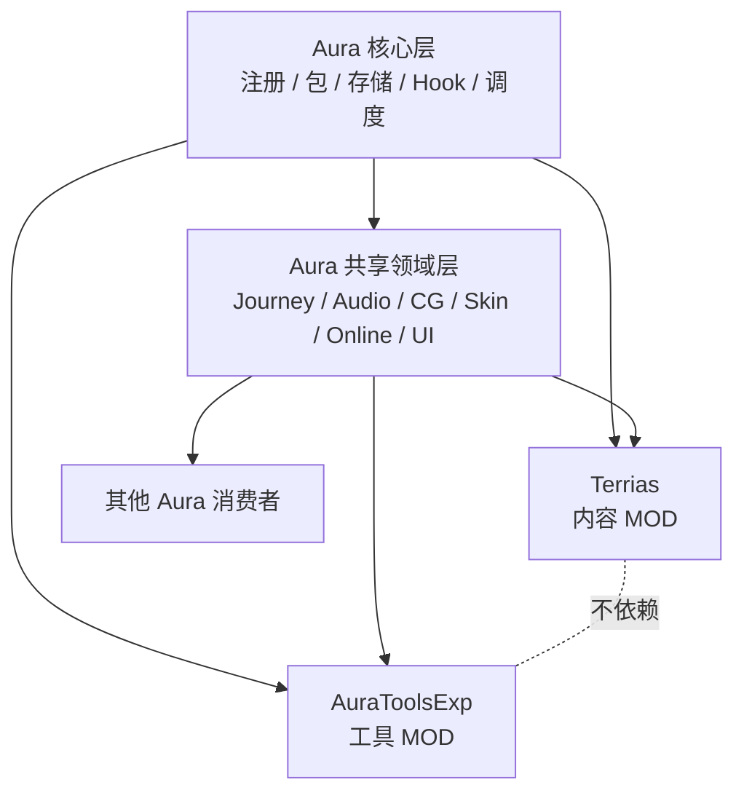
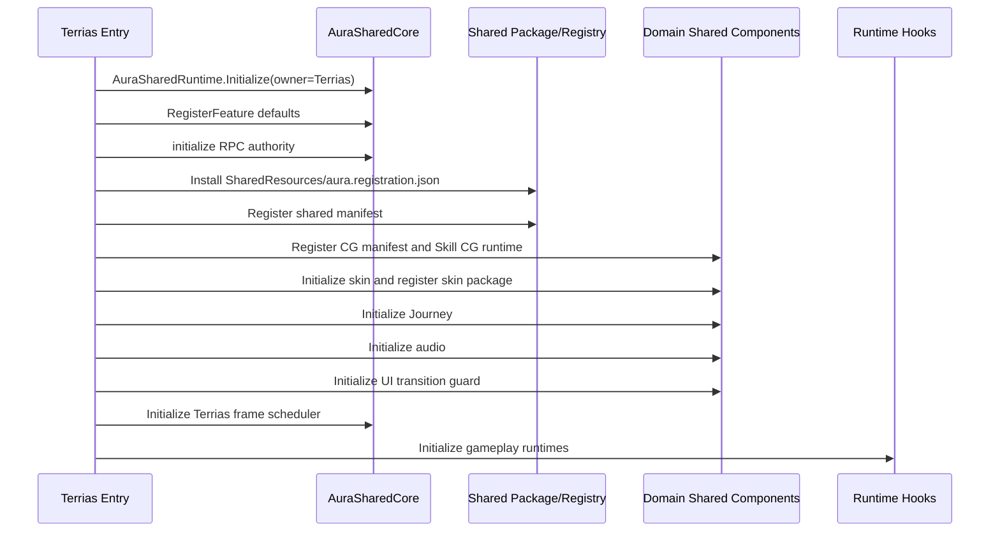

# Terrias 对 Aura 共享层与核心层的接入

> 本文中的“核心层”专指 AuraSharedCore；游戏自身的 `Witch.Core` 称为游戏主体核心 API。

## 1. 为什么存在 Aura.Shared

Terrias 需要 Journey、音频、CG、皮肤、在线同步、UI 安全、包安装、Hook 路由和帧调度等能力。AuraToolsExp 和其他 Aura MOD 也可能需要同类能力。

如果这些能力留在 Terrias 内部，会产生两个问题：

1. 工具 MOD 必须依赖内容 MOD，形成错误的所有权方向；
2. 每个 MOD 各自实现 Hook、资源、网络和 UI 协议，出现重复注册、冲突和版本漂移。

因此当前结构是兄弟消费者模型：



Terrias 注册自己拥有的内容和资源；AuraToolsExp 读取共享声明、管理工具侧有效配置或注册工具自有扩展。二者不互相依赖内部实现。

## 2. 物理程序集与逻辑组件

`AuraSharedRuntime-Dev/Aura.Shared.csproj` 把多个源码根编入一个 `Aura.Shared.dll`：

| 逻辑组件 | 类型 | 当前职责 |
| --- | --- | --- |
| `AuraSharedCore` | Aura 核心层 | 路径、存储、注册、包、Hook、调度、日志、通用同步和权限基础 |
| `AuraJourneyShared` | 共享领域层 | Journey 定义、route graph、状态 reducer、地图投影和同步投影 |
| `AuraCombatAiShared` | 共享领域层 | Actor 自动回合、候选屏蔽、失败/超时终止、卡牌状态快照和自动化能力注册 |
| `AuraAudioShared` | 共享领域适配 | 音频共享运行时初始化 |
| `AudioArbiterShared` | 共享领域层 | 音频 provider、匹配、优先级、原音抑制和表现 RPC |
| `BattleBgmArbiterShared` | 共享领域层 | 冒险/战斗 BGM provider 与切换仲裁 |
| `AuraCgShared` | 共享领域层 | CG 注册、激活、播放请求、网络 relay、去重和 session |
| `AuraCardUseFxShared` | 共享领域层 | 卡牌使用特效注册、本地成功出牌提交、观察者中央副本捕获、源位置快照、表现范围解析与触发去重 |
| `AuraSkinShared` | 共享领域层 | 皮肤包、注册、选择存储、资源重定向和 UI Hook |
| `StarterDeckArbiterShared` | 共享领域层 | 起始卡组 profile、校验和 resolution policy |
| `AuraOnlineShared` | 共享领域层 | 在线聊天、MOD 快照和主机同步 session 基础 |
| `AuraLogShared` | 共享基础 | 共享日志入口 |
| `AuraUiShared` | 共享基础 | 通用 UI 组件和 Modal host |
| `UiRaycastSafetyShared` | 共享基础 | 临时 UI 隐藏、销毁和 GraphicRegistry 清理 |
| `UiTransitionGuardShared` | 共享基础 | 原生 UI 切换后的交互恢复 |

这些是逻辑边界，不是独立发布 DLL。修改任一源码根都会改变 `Aura.Shared.dll`，必须检查所有消费者。

## 3. Aura 核心层

### 3.1 全局核心对象

`AuraSharedRuntime.Initialize(modConfig, ownerModId)` 首先初始化共享路径，然后确保场景中存在名为 `AuraShared.Global` 的持久化 GameObject。

核心组件的完整类型名固定为 `AuraShared.Core.AuraSharedRuntime+AuraSharedComponent`。如果对象已存在，运行时不会盲目再建一份，而是检查：

- protocol version；
- minimum supported protocol version；
- build id；
- 注册、存储、包和变更查询所需的公共方法。

兼容时复用现有核心并追加 owner；不兼容时记录错误并让该消费者的共享系统不可用。不同 build id 但 protocol 兼容时允许复用，同时记录警告。

### 3.2 核心职责

| 能力 | 主要实现 | 语义边界 |
| --- | --- | --- |
| 路径 | `AuraSharedPaths` | 共享根目录和标准子目录 |
| 注册表 | `AuraSharedRegistry`、core component resources | 记录 system、resource id、owner、路径、优先级 |
| 包安装 | `AuraSharedPackageEngine/Coordinator` | 事务安装、恢复和安装索引 |
| 存储 | `AuraSharedStorage/Coordinator` | 有作用域、revision 和变更记录的读写 |
| Hook | `AuraSharedHooks`、`AuraHookRegistry` | before/after、安全调用、routed subscription |
| 主线程调度 | `AuraSharedFrameScheduler` | Unity/Witch 可触碰工作的分帧执行 |
| 后台工作 | `AuraSharedBackgroundWorkScheduler` | 仅纯 CPU、不可变快照和文件工作 |
| 生命周期 | Battle/Card/Combat routers、step runner、ledger | 订阅、去重、session 和清理 |
| 网络基础 | authority、sender、payload budget、secure envelope | 不携带 Terrias 业务策略 |
| 资源缓存/池 | resource cache、object pool、zone snapshot | 无业务语义的性能基础 |

Aura 核心层只理解稳定 identity、协议、资源、事务和生命周期，不理解“日耀回忆”“白曜”“无尽深渊奖励”等业务含义。

`AuraBattleLifecycleStateRuntime` 是战斗阶段的唯一只读状态：只有 `Active` 接受新的
战斗表现；`OutcomeEntering` 起关闭生产者，`BattleSettling`/`BattleEnded` 清理，
`BattleFinalized` 在全部结束订阅者完成后供记录器封存终局。Terrias 的抽牌统一经过
`CombatCardApi`，对象池终局清理同时关闭 `FightUI.createCardQueue`，不得只销毁当前
卡牌而让异步生产队列重新补牌。

## 4. Terrias 启动时的共享接入

`Entry.Initialize` 当前共享相关步骤为：



共享核心先于资源和领域组件初始化，RPC authority 先于 Terrias server-bound 命令应用。每个步骤通过 `RunStep` 独立记录。

## 5. 共享资源和注册表

### 5.1 安装与注册不是同一件事

- **安装**：`AuraSharedPackageEngine.InstallManifest` 把声明的共享资源事务性安装到共享路径，并维护来源和安装索引。
- **注册**：`AuraSharedResourceProtocol.RegisterManifest` 把 owner、module、scope、feature、resource 等声明写入 v4 分层目录；消费者通过 Catalog API 枚举当前会话的活跃注册。
- **领域解析**：CG、Skin、Audio 等领域组件读取自己的协议字段，执行校验、匹配、优先级和 fallback。

只复制文件不等于完成注册，只写注册表也不保证目标资源已经安装。

### 5.2 资源冲突

Aura 核心使用资源的 owner-qualified unique key。相同 key 的来源可以合并，但不同 owner 提交不一致资源时会拒绝冲突注册。核心只判断 identity 和资源一致性；具体“哪个 CG/音频/卡组胜出”由领域组件处理。

### 5.3 Terrias 所有权

Terrias 负责：

- 安装 `Terrias/SharedResources/aura.registration.json`；
- 注册 Terrias 的 CG、皮肤、音频、Journey、starter deck 等声明；
- 提交 Terrias 内容触发产生的共享表现请求；
- 为注册项提供稳定的 `ownerModId` 和 domain id。

工具 MOD 可以读取和覆盖自己的有效配置，但不能修改 Terrias 的注册源或把复制后的资源重新声明为自己所有。

## 6. 共享领域组件

### 6.1 Journey

`AuraJourneyShared` 提供通用 route graph、node definition、condition、state event、reducer、commit result、地图投影和同步投影。Terrias 的日耀回忆负责具体路线、故事节点、Boss 和奖励语义。

Journey 共享层不应知道 `SolarMemory` 的专有剧情判断；它只执行 owner-qualified 定义和状态转换。

### 6.2 Starter Deck

`StarterDeckArbiterRuntime` 接受多个 profile，执行校验和 resolution policy。Terrias 注册日耀回忆的 profile，模式准备流程消费最终解析结果。仲裁器负责冲突规则，不负责构造 Terrias 的准备 UI。

### 6.3 Audio 与 BGM

`AudioArbiterRuntime` 和 `BattleBgmArbiterRuntime` 负责 provider、信号/阶段匹配、优先级、fallback 和必要的表现同步。Terrias 携带角色语音声明，AuraToolsExp 发现注册并应用玩家覆盖；通用卡牌音效仍由 AuraToolsExp 持有。Terrias 不初始化媒体 provider。请求使用 `Kind + Stage` 锚定选人提交、卡牌表现提交、低血量阈值穿越和战斗完成等稳定时点。

### 6.4 CG

`AuraCgRegistryRuntime` 注册 manifest，`SkillCgArbiterRuntime` 负责播放、session、黑键/闪屏、网络事件和去重。Terrias 在 `SharedResources` 携带自己的可选 CG 资源与 manifest；AuraToolsExp 按 `.modproj` 发现、注册并配置它们。Terrias 不保留第二条 CG 运行时或资源回退路径。

### 6.5 Skin

`AuraSkinRuntime` 负责包注册、skin registry、选择存储、资源重定向和 UI Hook。全部替换皮肤由 AuraToolsExp 的工具皮肤包提供；旧 Terrias qualified selection 会一次性迁移到 AuraToolsExp owner。共享层还提供 owner-qualified、非持久化并带释放句柄的 scoped selection，供 v11 原生回放在创建角色前恢复录制皮肤；作用域释放后立即回到玩家当前持久选择，不改写配置文件。

### 6.6 卡牌使用特效

`AuraCardUseFxShared` 的 v2 manifest 使用 `presentationScope` 区分 `ownerLocal`、`observers` 和 `all`。本地通道在真实卡牌 `TrueUse` 前捕获屏幕位置，并以 `FightUI.CallActionAnimation` 作为成功提交点；观察者通道继续消费 `FightUI.DoCardUseAnimation` 的中央卡牌副本。表现消费者必须使用源位置快照，不能依赖随后可能被焚毁或移入弃牌堆的卡牌对象。

通用卡牌展示生命周期由 `AuraCardPresentationRuntime` 统一路由。AuraToolsExp 在此基础上应用逐卡白名单卡框和动态效果；Terrias 只订阅必要的内容表现。完整边界见[内容与工具资源边界](12-内容与工具资源边界.md)。

### 6.7 UI 安全

`AuraUiShared` 提供无业务语义的 UI 构造能力；Terrias 的 `TerriasUiComponents` 在此之上提供本 MOD 风格。`UiRaycastSafetyShared` 与 `UiTransitionGuardShared` 解决临时 Overlay 关闭后原生 UI 仍被射线或 GraphicRegistry 阻塞的问题。关闭中的 UI 只能临时租借并恢复原有 `GraphicRaycaster` 状态，不能把原生画布永久禁用；过渡结束后由共享 guard 分帧刷新 `UpperCanvasController`、`EventSystem`、输入模块与 GraphicRegistry，并在终态日志中校验主画布射线所有权。

## 7. Hook 与性能共享

### 7.1 Routed Hook

`AuraSharedHooks.RegisterBeforeRouted/RegisterAfterRouted` 为同一 `Type.Method` 保留一个宿主回调，并维护订阅快照。`AuraBattleLifecycleRouter` 以原生方法边界和 EventCenter 信号推导 `BattleInitializing/Materialized/Opening`、`FightStartSignaled/Ready`、玩家回合及 outcome 三阶段，并由 session phase ledger 保证一次性阶段 exactly-once；`AuraCardActionTransactionRouter` 与 `AuraSkillActionTransactionRouter` 分别统一卡牌和技能事务。Terrias 的 Buff/status/other-object 路由只保留内容侧语义分发。

`AuraBattleLeaseLedger` 让持久卡牌、遗物、祝福和职业 executor 在每个 battle session 重新注册，同时避免把 battle-only hook/token 写入 DataConfig Vars。好处是减少重复宿主注册、统一异常边界并允许订阅释放；业务过滤和 Buff 依赖仍属于 Terrias，不能塞进通用 dispatcher。

### 7.2 帧调度

`AuraSharedFrameScheduler` 是主线程调度器。任务可以触碰 Unity、Witch、Mirror 和 UI，但必须遵守 phase、预算、优先级和分片约束。

普通与键控任务都必须携带 `OwnerId`。共享调度器通过 `GetStats()` 暴露 backlog、owner 分布、历史峰值和泵耗时；`SoftPendingActionLimit` 只告警不丢任务，`MaxPromotionsPerFrame` 则限制单帧队列晋升成本。出现越线时应先定位高产 owner，再把重复任务改为 keyed merge 或 cooperative slice，而不是简单提高水位。

`AuraSharedBackgroundWorkScheduler` 只接受纯 CPU/文件工作和不可变快照。结果回主线程前必须检查 generation，不能把 Unity 对象操作移到 worker 线程。

Terrias 的 `TerriasFrameScheduler` 是内容侧适配和配置入口，不应重新实现一套通用调度器。

### 7.3 资源缓存生命周期

`TerriasResourceCache` 负责给共享 LRU 加上 Terrias owner 和 category。效果纹理与卡面 Sprite 不再维护第二份强引用字典；帧数组、运行时创建的九宫格 Sprite、私有 AssetBundle 等确有派生状态的本地缓存必须提供 `Clear()`。进入 `GameEntryUI.Init` 时，先关闭瞬态 UI，再销毁派生 Sprite、释放 bundle handle，并按 `visual.*` / `ui.sprite-source` 类别清除共享引用。

共享统计中的 `EstimatedBytes` 只用于发现异常增长，可能因 Sprite 共享纹理而重复估算，不能当作精确显存值。实际保留行为仍由 entry/reference LRU 与上述内容侧生命周期共同约束。

## 8. 配置优先级

共享功能要区分“注册源”和“有效配置”：

```text
内容注册默认值
-> 工具随包默认值
-> 工具本地持久化覆盖
```

Terrias 单独使用时，其内容声明默认应可用。AuraToolsExp 存在时，可以根据工具本地设置决定工具侧有效行为，但不得回写或夺取 Terrias 的 owner-qualified 注册项。

当前 Entry 注册的共享功能默认值包括：

- `Terrias / Battle.StartTraitBuffs = true`；
- `Terrias / SolarMemory = true`。

这些是注册默认值，不等于所有玩家机器上的最终工具覆盖值。

## 9. 多人状态分类

共享协议在设计 RPC 前先分类状态：

| 类型 | 示例 | 原则 |
| --- | --- | --- |
| 共享进度 | route、地图、run counter、共享奖励 | host/server 权威，客户端请求，主机验证和广播 |
| 玩家私有选择 | 准备阶段角色/卡组/祝福、个人奖励 | 玩家隔离，最终提交验证 sender |
| 表现事件 | CG、音频、Overlay、动画 | 不写进度，但仍要 session、去重、清理 |

server-bound RPC 必须从服务器接收上下文绑定 sender。payload budget 在 Mirror 序列化前检查；大 payload 使用有校验、过期和缓冲上限的分块传输，而不是无限放大单条 JSON 命令。

## 10. 兼容与发布门禁

### 10.1 运行时兼容

- 全局核心校验 protocol/min protocol/必要方法。
- domain provider identity 或网络协议变化时需要 build/protocol 版本处理。
- 不兼容的共享组件应禁用对应服务并记录原因，不应中止无关 Terrias 初始化。

### 10.2 DLL 一致性

所有消费者打包的 `Aura.Shared.dll` 必须 hash-identical。共享源码修改后应：

1. 构建共享运行时和受影响消费者；
2. 刷新各 MOD 的已打包 DLL；
3. 运行共享架构、核心、RPC authority 和发布门禁；
4. 运行 `Test-SharedDllPackaging.ps1` 检查哈希。

顶层验证入口是 `tools/Test-SharedReleaseGate.ps1`，但必须按影响显式选择
`-Profile`、`-Tag` 或 `-StepId`；只有正式发布候选才选择
`-Profile full-release`。只验证 `Terrias.Aura.dll` 能编译，不能证明共享发布完成。

## 11. 判断能力应放在哪里

| 问题 | 归属 |
| --- | --- |
| 只有 Terrias 内容知道的规则？ | Terrias Mechanics/Runtime |
| 对 Witch API 的兼容包装？ | Terrias GameApi 或共享组件自己的 adapter |
| 多个 MOD 都需要且可移除业务语义？ | Aura 核心或共享领域候选 |
| 注册、存储、包、通用 Hook/调度？ | Aura 核心层 |
| Journey/Audio/CG/Skin 的冲突策略？ | 对应 Aura 共享领域层 |
| 工具 UI、预览、导入导出、本地覆盖？ | AuraToolsExp |
| Terrias 资源、剧情、卡牌、角色、奖励？ | Terrias |

共享不是“把代码挪到公共目录”。只有 identity、ownership、protocol、兼容和多消费者发布链都成立时，才算形成共享组件。
