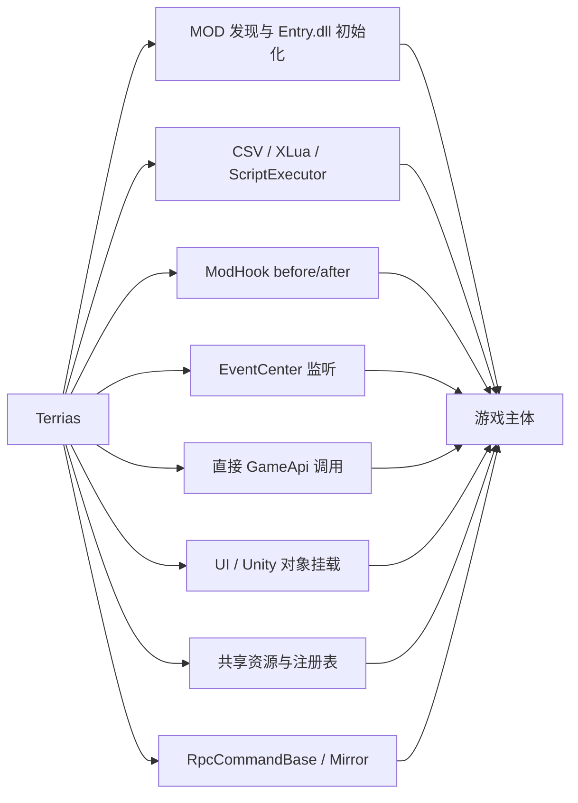

# Terrias 游戏主体接入机制

> 反编译基线：`开发参考资料/反编译文件夹v1.0.23816797`  
> 编译契约：仓库 `Managed/`  
> 本文解释接入方式；逐功能的完整类/方法映射将在后续参考表中维护。

## 1. 宿主程序集分工

| 程序集/目录 | Terrias 主要使用面 |
| --- | --- |
| `Witch` | MOD 加载、ScriptExecutor、DataConfig、战斗、卡牌、Buff、地图、UI、PlayerManager、RpcCommandBase |
| `Witch.Core` | GameConfigData、ExcelTableReader、EventCenter、IScriptExecutor、ModHookRegistry、Modifiable 切面 |
| `Mirror` | NetworkConnection、Command/RPC 传输和序列化基础 |
| `UnityEngine.*` | GameObject、生命周期、资源、Canvas/UI、音频、AssetBundle、Shader/Material |
| `AllScripts` | 官方脚本范式和宿主脚本使用参考 |
| `Assembly-CSharp` | 少量非主干运行时；只有实际命中时使用 |

不要根据“Assembly-CSharp 是 Unity 默认程序集”就假定游戏主逻辑都在那里。本反编译快照的主要游戏代码集中在 `Witch` 和 `Witch.Core`。

## 2. 接入方式总览



同一功能可能组合多种方式。例如日耀回忆通过 MOD 初始化注册 Journey，通过 ModeChoice Hook 提供入口，通过地图 Hook 改写节点，通过 UI 创建准备窗口，并通过 RPC 提交最终角色。

## 3. MOD 发现与 DLL 初始化

### 3.1 游戏主体流程

**反编译确认**：

- `Witch.GameConfigManager.Init` 枚举 `Globals.ModsPath`；
- 读取每个目录的 `ModConfig.json`；
- 通过 `ModConfig.ModId` 去重并做依赖拓扑排序；
- 加载 Data/Text 后调用 `ModConfig.Setup`；
- `ModConfig.Setup` 使用 `Assembly.LoadFrom(Scripts/Entry.dll)`；
- 扫描并调用 `[ModInitialize]` 静态方法；
- 扫描 `[ModHook]` 静态方法并注册到当前 ModConfig。

### 3.2 Terrias 入口

`Terrias.Dll.Entry.Initialize(ModConfig)` 是 Terrias 的 `[ModInitialize]` 方法。它不由 Terrias 自己主动调用，而是由游戏 `ModConfig.Setup` 反射调用。

接入失败的主要边界：

- `Entry.dll` 不存在时，游戏仍可能加载 Data/Text，但 C# 脚本不可用；
- Assembly.LoadFrom 或初始化方法抛出未处理异常时，`ModConfig.Setup` 返回失败；
- Terrias 内部具名 RunStep 会吞下单步异常并继续，因此日志是判断降级模块的必要证据。

## 4. Data 表与运行时 ID

### 4.1 宿主模块

| 反编译类型 | 程序集 | 作用 |
| --- | --- | --- |
| `GameConfigManager` | Witch | 查找 DataType 目录、合并官方/MOD 表、记录脚本所有者 |
| `ExcelTableReader` | Witch.Core | 从 Addressables、Resources、Mods 或 Raw 路径读取 CSV/XLSX |
| `GameConfigData` | Witch.Core | 给 id 加前缀、维护 dataDic 和 LockedIds、合并表 |
| `DataConfig` | Witch | 把行实例化为带 Vars 和 ScriptExecutor 的运行对象 |

### 4.2 Terrias 接入

`GameConfigManager.LoadResource("Mods/.../Data/")` 逐一读取 Card、Buff、Map、Event、Career 等固定目录。`ExcelTableReader.BuildPrefix` 使用 MOD 根目录和文件名生成前缀；`GameConfigData` 把短 id 转为完整 id。

因此 Terrias 不是在 C# 初始化时“手动注册每张卡”。大部分内容先作为标准游戏 DataConfig 进入官方表，C# 只通过脚本列和运行时 Hook扩展其行为。

## 5. XLua 与 ScriptExecutor

### 5.1 宿主执行模型

`DataConfig` 为数据行创建 `IScriptExecutor`。卡牌、Buff、遗物、敌人、事件等宿主对象在各自生命周期调用 `RunScript("字段名")`。

代表性反编译链：

```text
CommonCardItem.TrueUse
-> CardItem.RunScript("PreUseScript")
-> CardItem.RunScript("UseScript")
-> DataConfig.scriptExecutor.RunScript
-> 预编译 XLua delegate
-> CS.Terrias.Dll.Scripting.*
```

`BuffItem` 在初始化时设置 `Self`、`Object` 和 status，再运行 ApplyScript；移除时运行 ClearScript。`BlessingRelic` 运行 FightScript，`EnemyManager` 运行 Enemy InitScript。

### 5.2 Terrias 桥接

Terrias 的 `Entry.RegisterLuaVisibleAssembly` 把 `Terrias.Aura` 加入 XLua translator assembly list，然后 `xlua.import_type` 校验主要 Scripting 类型。

这里的 `self` 是游戏 `ScriptExecutor`，包含：

- `dataConfig` 和 Vars；
- `Self`，通常是执行者状态；
- `Target`；
- `Object` 目标集合；
- status、手牌/牌堆和事件注册能力。

Terrias 不把这些裸对象操作散布到 CSV，而是由 Scripting 把请求交给 GameApi。

## 6. ModHook before/after

### 6.1 宿主 Hook 原理

**反编译确认**，游戏使用 Rougamo `Modifiable` 切面：

1. 方法进入时，`Modifiable.OnEntry` 根据 `DeclaringType.Name + "." + Method.Name` 生成 key；
2. 从 `Witch.Core.ModHookRegistry.GetBefore(key)` 读取回调；
3. 方法成功返回时从 GetAfter 读取回调；
4. 每个回调接收只包含 Target 和 Arguments 的 `ModHookContext`；
5. 单个回调异常由宿主捕获并写日志；
6. 同一 hook key 的重入会被阻止，总调用深度上限为 64。

这解释了 Terrias Hook 字符串为什么通常是 `Type.Method`，而不是程序集限定名或完整签名。

### 6.2 Terrias 注册路径

```text
Runtime.Initialize(modConfig)
-> TerriasHookRegistry 或 AuraSharedHooks
-> modConfig.AddMethodHookBefore/After("Type.Method", callback)
-> ModHookRegistry.AddBefore/AddAfter
-> Modifiable.OnEntry/OnSuccess
```

`AuraSharedHooks` 增加参数检查、日志、安全调用和 routed subscription。`TerriasHookRegistry` 再增加 owner 前缀。

### 6.3 属性 Hook兼容能力

`ModConfig.Setup`仍会扫描Entry.dll中的`HookBeforeAttribute`和
`HookAfterAttribute`，但当前一方产品代码不再使用属性Hook。所有目标必须经
owner-qualified routed Hook或类型化Router接入，以获得唯一原生dispatcher、稳定处理器身份、
generation-safe lease和运行期释放能力。架构门禁禁止属性Hook与产品直接
`AddMethodHookBefore/After`重新出现。

### 6.4 Hook 能与不能做什么

当前 `ModHookContext` 不提供可依赖的强类型返回值修改契约，主要暴露 Target 和 Arguments。Terrias 的 Hook 应以观察、预处理参数关联状态、补充流程和成功后的同步/表现为主，不能假设任意 before hook 都能取消原方法或替换返回值。

## 7. EventCenter 与脚本事件

游戏 `Witch.Core.EventCenter` 提供按字符串事件名注册和触发的生命周期通道。`ScriptExecutor.AddEvent/AddTempEvent` 也建立在游戏事件系统之上。

Terrias 通过 `ScriptEventApi` 集中处理：

- `ScriptExecutor.AddEvent`；
- `ScriptExecutor.AddTempEvent`；
- `EventCenter.AddEventListener`；
- owner 和 `EventDispose` 生命周期；
- 异常与上下文日志。

这条通道适合 FightStart、StartRound、Action、EndRound、Win、Escape 和自定义 Buff level change 等事件。它与方法 Hook 不同：Hook 绑定具体宿主方法，EventCenter 绑定游戏已经发布的语义事件。

## 8. 直接 GameApi 调用

并非所有功能都需要 Hook。大量行为通过当前 `ScriptExecutor` 和游戏 singleton 直接调用：

- Card/Buff/Damage/Status/Player 操作；
- `GameConfigManager.GetOne/GetItemsByPack`；
- `FightUI` 布局和动作表现；
- `DialogueUI`、`BattleRewardsUI`、`MapItem` 数据访问；
- ResourceLoader 或 Unity 资源加载。

这些访问集中在 GameApi，原因是：

- 游戏对象可能为空或处于错误生命周期；
- 方法签名可能随版本变化；
- 反射异常需要局部 fallback；
- Scripting 和 Mechanics 不应重复理解宿主内部字段。

直接调用前仍以 `Managed/` 为签名真相。反编译方法体只能说明当前参考版本的内部流程。

## 9. UI 与 Unity 对象

### 9.1 宿主 UI 接入

Terrias 既会附着到原生 UI，也会创建独立临时 UI：

- ModeChoiceUI 上注册和布局自定义模式入口；
- FightUI 上挂载 Star Score、Field Buff HUD；
- CardItem/ChoiceItem 上附着卡框、卡面和动画；
- 独立 ScreenSpaceOverlay Canvas 上创建 Modal/CG/临时面板。

高价值宿主边界包括：`UIManager.CloseUI`、`UIBase.Close`、`GameEntryUI.Init` 和 Fight Win/Loss/Escape。`TerriasUiLifecycleRuntime` 在这些边界关闭临时 UI。

### 9.2 射线与清理

游戏原生 upper canvas 会把残留子对象视为活动 UI。Terrias/Aura 的安全策略是：

- 视觉 Overlay 不挂 GraphicRaycaster；
- graphics 设置 `raycastTarget=false`；
- CanvasGroup 禁止 blocksRaycasts/interactable；
- 关闭时先禁用和隐藏，再清子对象和 GraphicRegistry；
- 延迟若干帧完成销毁和恢复检查。

因此 UI 接入不仅是“把 GameObject 加到 Canvas”，还必须与宿主输入和窗口栈保持一致。

## 10. 资源加载与表现接入

Terrias 私有资源通常通过游戏 ResourceLoader/Unity 资源 API 解析，重复读取统一经过 `TerriasResourceCache`。VisualBundle、Shader 和 Material 由 `Hooks/Visual` 的缓存与加载器管理。

共享 CG、Skin 和 Audio 资源先由 Aura 包安装和注册，再由领域运行时按 `Shared:` 或注册 identity 解析。工具消费者读取协议声明，不直接扫描 Terrias 私有路径。

资源接入的宿主模块包括：

- Unity `Resources`、`AssetBundle`、`AudioClip`、`Sprite`、`Shader`、`Material`；
- Witch `ResourceLoader`；
- Card/Fight/Map/UI 对象上的 Image、Renderer、Animator 和 AudioSource。

## 11. RpcCommandBase 与 Mirror

### 11.1 游戏主体传输

**反编译确认**：

- `Network.Command.RpcCommandBase` 定义 `CmdExecute()` 和抽象 `RpcExecute()`；
- `RpcCommandBaseSerializer` 用 Newtonsoft JSON 和 `TypeNameHandling.All` 序列化派生命令；
- `PlayerManager.SendRpcCommand` 调用 `CmdReceiveRpcCommand`；
- 服务器执行 `command.CmdExecute()` 后通过 ClientRpc 广播；
- 客户端收到后调用 `command.RpcExecute()`。

这使 Entry.dll 中的 Terrias 派生命令可以走游戏已有多态命令通道。

### 11.2 Terrias 权限补强

宿主 `CmdExecute()` 本身不替 Terrias 判定“谁有权改变某个 Terrias 状态”。Terrias 使用 `TerriasRpcAuthorityRuntime`：

- 在服务器接收上下文绑定真实 `NetworkConnectionToClient`/角色；
- server-bound 命令从绑定上下文获取 sender；
- 验证 sender 是否在 lobby、是否拥有提交角色/状态；
- 主机本地直达路径使用相同 sender 模型；
- 缺失或不匹配时拒绝应用。

因此“继承 RpcCommandBase”只解决传输与派发，不等于完成 authority、payload budget、顺序、去重和清理。

## 12. 代表性宿主映射

| Terrias 接入面 | 游戏程序集 | 反编译类型/方法 | 方式 | 证据状态 |
| --- | --- | --- | --- | --- |
| MOD 枚举和依赖 | Witch | `GameConfigManager.Init/LoadModWithDependencies` | 原生加载 | 反编译确认 |
| Data/Text 表 | Witch + Witch.Core | `GameConfigManager.LoadResource*`、`ExcelTableReader.ReadByFolder`、`GameConfigData` ctor | 原生加载 | 反编译确认 |
| Entry.dll | Witch | `ModConfig.Setup` | Assembly.LoadFrom + attribute scan | 反编译确认 |
| CSV C# 调用 | Witch | `DataConfig`、`ScriptExecutor.RunScript` | XLua `CS.*` | 反编译确认 |
| 卡牌使用 | Witch | `CommonCardItem.TrueUse`、`AttackCardItem.TrueUse`、`CardItem.RunScript` | Script + Hook | 反编译确认 |
| Buff 生命周期 | Witch | `BuffItem.Init/Clear`、Apply/ClearScript | Script + Event | 反编译确认 |
| 方法 Hook | Witch.Core | `Modifiable.OnEntry/OnSuccess`、`ModHookRegistry` | before/after registry | 反编译确认 |
| 地图模式 | Witch | `ModeChoiceUI`、`NormalMapManager`、`MapManager`、`MapSelectUI` | dynamic Hook + direct API | 当前 Hook 已确认，逐方法正文待模块核验 |
| 对话 | Witch | `DialogueBox`、`DialogueUI.ChooseOption` | 原生脚本 + after Hook | 当前 Hook 已确认 |
| UI 清理 | Witch + Unity | `UIManager.CloseUI`、`UIBase.Close` | before Hook + Unity cleanup | 当前 Hook 已确认 |
| RPC 命令 | Witch + Mirror | `RpcCommandBase`、serializer、`PlayerManager` send/cmd/rpc | JSON 多态命令 | 反编译确认 |

## 13. 版本漂移处理

每次新增宿主接入点按以下步骤处理：

1. 在当前源码找到调用或 Hook 需求。
2. 在 `Managed/` 确认类型和可编译签名。
3. 在当前版本反编译目录定位方法体及上下游。
4. 判断是否需要 current/legacy 反射分派。
5. 把分派放入 GameApi，不散落到 Scripting/Mechanics。
6. 提供成员缺失时的确定性 fallback。
7. 把目标加入宿主映射表和架构/兼容测试。

若只在反编译中看到方法，但 `Managed/` 不存在对应签名，不应直接绑定。若 `Managed/` 有签名但反编译快照缺失，则可以作为当前编译契约使用，同时把内部行为标记为尚未反编译确认。

## 14. 排查入口

| 症状 | 优先检查 |
| --- | --- |
| CSV 提示 `CS.Terrias...` 不存在 | Entry.dll 是否加载、XLua assembly registration 日志、Scripting 类型名 |
| 数据存在但找不到 id | `ExcelTableReader.BuildPrefix`、完整 id、文件名和 `*` 锁定处理 |
| Hook 没触发 | `Type.Method` 是否与宿主 DeclaringType.Name/Method.Name 一致、目标是否成功返回、是否重入 |
| Hook 触发多次 | routed hook、重复 Initialize、订阅释放和生命周期 |
| UI 关闭后无法点击 | GraphicRaycaster、raycastTarget、CanvasGroup、GraphicRegistry 清理 |
| 单机正常联机不同步 | 状态分类、sender authority、Cmd/Rpc 方向、session/sequence/去重 |
| 新版本反射失败 | Managed 签名、反编译版本、GameApi current/legacy fallback |
