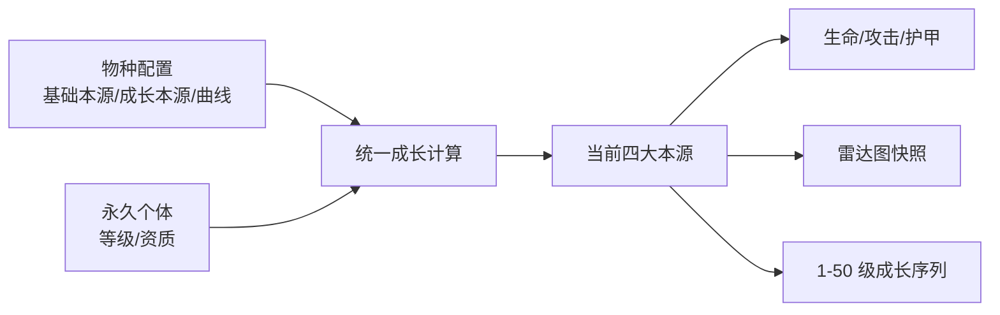

# 精灵种族值、成长曲线与雷达图数据规范

> 文档状态：当前实现说明 + 下一阶段数据化设计
> 基线日期：2026-08-10
> 当前配置：`Terrias/spirit.growth.registry.json`，schema 1
> 目标配置：schema 2，尚未进入运行时代码

## 1. 文档目的

本文专门定义精灵的种族值、等级成长、资质修正和可视化数据边界，并作为后续雷达图、成长曲线图、对比界面和数值校验工具的共同依据。

核心目标：

- 每个物种拥有独立、可审查的四大本源种族值。
- 物种数据、个体数据和战斗派生数据彼此分离。
- 种族值与成长曲线通过 JSON 配置，而不是分散在 UI 或战斗脚本中。
- 同一个计算服务同时服务战斗、仓库详情、雷达图和开发校验。
- 雷达图显示可比较的绝对强度和成长潜力，不通过自适应缩放夸大弱项。
- 配置升级具有明确 schema、默认值、校验规则和迁移边界。

## 2. 三层数值模型

精灵数值必须分成三层，不能把最终战斗数值直接写回物种配置或个体档案。

| 层级 | 典型字段 | 生命周期 | 数据所有者 |
| --- | --- | --- | --- |
| 物种层 | `speciesId`、形态档案、阶级、基础本源、成长本源、曲线 id | 随 MOD 配置发布 | `spirit.growth.registry.json` |
| 个体层 | UID、`speciesId`、`profileId`、等级、当前经验、固定资质 | 跨冒险永久保存 | `SpiritCollectionDocument` |
| 派生层 | 当前四大本源、生命、攻击、护甲、雷达归一化值 | 查询时计算 | `SpiritGrowthService` / 未来查询服务 |



约束：

- 个体档案不复制 `BaseOrigins` 和 `GrowthOrigins`。
- 个体保存捕获时解析出的 `speciesId` 与 `profileId`；数值仍从当前注册表重新计算。
- 雷达图不自行读取 JSON 并重复实现公式。
- 战斗不保存雷达归一化结果。
- 平衡补丁修改物种配置后，已有个体按新配置重新计算；当前版本不锁定历史种族值版本。

## 3. 四大本源定义

| 键 | 中文名 | 主要战斗倾向 | 当前派生权重 |
| --- | --- | --- | --- |
| `magic` | 魔力本源 | 攻击、意图能量 | 攻击主权重 |
| `spirit` | 精神本源 | 生命、护甲 | 生命主权重 |
| `luck` | 幸运本源 | 生命、攻击、护甲 | 多属性副权重 |
| `perception` | 感知本源 | 护甲、攻击、意图能量 | 护甲主权重 |

四大本源对精灵没有玩家式本源上限。精灵的等级、资质和物种成长共同决定本源值，战斗难度和玩家本源不会修改它们。

## 4. 当前 schema 1

当前配置位于：

```text
Terrias/spirit.growth.registry.json
```

当前结构：

```json
{
  "schemaVersion": 1,
  "profiles": [
    {
      "enemyId": "boss_saint_wuna",
      "variantId": "*",
      "tier": "FinalBoss",
      "baseOrigins": {
        "magic": 18,
        "spirit": 18,
        "luck": 8,
        "perception": 10
      },
      "growthOrigins": {
        "magic": 38,
        "spirit": 38,
        "luck": 18,
        "perception": 26
      }
    }
  ]
}
```

字段语义：

| 字段 | 必填 | 含义 |
| --- | --- | --- |
| `enemyId` | 是 | 稳定敌人 id，不写运行时前缀 |
| `variantId` | 是 | 变体 id；`*` 表示该物种的默认成长档案 |
| `tier` | 是 | `Normal`、`Elite`、`Boss`、`FinalBoss` |
| `baseOrigins` | 是 | 1 级时的四大本源 |
| `growthOrigins` | 是 | 从 1 级成长到 50 级时，各本源可获得的成长预算 |

当前完成度：

- 物种基础值与成长预算已经数据化。
- 最终首领可以通过配置覆盖宿主只有 1–3 的稀有度体系。
- 未配置物种会得到确定性后备档案。
- 等级函数、资质函数、经验函数和雷达尺度尚未数据化，仍由 C# 固定。

因此 schema 1 是可用基线，但不是最终的完整配置模型。

## 5. 物种身份与匹配顺序

捕获快照必须保留运行时原始敌人 id，以继续读取敌人数据和动画；成长注册表使用稳定 id，避免绑定宿主或 MOD 前缀。

解析顺序：

1. `enemyId + variantId` 精确匹配。
2. 已知运行时别名的精确匹配。
3. `enemyId + *` 物种默认匹配。
4. 已知别名的 `enemyId + *` 匹配。
5. 生成确定性后备档案。

同一个物种的多个捕获个体共享 `speciesId`，但可以命中不同形态档案，并各自拥有独立等级、经验和资质。

已确认采用“同一物种、不同形态档案”模型。schema 2 同时提供稳定 `speciesId` 和 `profileId`，把收藏身份、数值形态和宿主匹配条件分开：

```json
{
  "speciesId": "base-game.demon-king",
  "profileId": "base-game.demon-king.phase-2",
  "formKey": "phase-2",
  "formOrder": 2,
  "match": {
    "enemyId": "10051",
    "variantId": "*"
  }
}
```

字段责任：

- `speciesId`：仓库分组、图鉴统计和“同种精灵”判断。
- `profileId`：具体形态的种族值、曲线引用、缓存和存档诊断。
- `formKey/formOrder`：形态标签与稳定展示顺序；不参与宿主匹配。
- `match`：只负责把捕获来源映射到档案。

同一 `speciesId` 下允许不同 `profileId` 使用不同阶级。例如卡洛琳第一、第二阶段是首领档案，完全天使形态是最终首领档案。阶级因此属于形态档案，不属于物种分组。

游戏主体最终首领范围已确认：`10027`、`10048`、`10051`、`10052`、`10055`、`10058` 六个形态档案，归属于永夜化身、魔王、神圣审判机关和卡洛琳四个物种。`10049/10050` 魔王剑仍为精英，`10053` 永夜派生形态与 `10056/10057` 卡洛琳前置形态仍为首领。

已确认捕获形态永久固定：

- 捕获结算时解析并写入 `speciesId` 与 `profileId`。
- 个体后续升级、获得经验或进入新冒险时，不重新选择同物种下的其他档案。
- 平衡更新可以修改该 `profileId` 的数值，但不能把已有个体映射到另一个 `profileId`。
- 仓库可以按 `speciesId` 聚合展示；形态资料切换只用于查看，不改变个体。
- 当前版本不提供形态转换。未来若开放，必须作为独立培养机制定义解锁条件、资源消耗和迁移规则。

这个约束可以防止低阶段个体无成本切换到最终首领档案，也使战斗开始冻结、雷达查询和联机快照都能使用稳定的形态身份。

## 6. 阶级预算

当前阶级预算基线：

| 阶级 | 基础总值范围 | 成长总值范围 | 默认基础 | 默认成长 |
| --- | ---: | ---: | ---: | ---: |
| 普通 `Normal` | 24–32 | 56–72 | 28 | 64 |
| 精英 `Elite` | 32–40 | 72–88 | 36 | 80 |
| 首领 `Boss` | 40–48 | 88–108 | 44 | 100 |
| 最终首领 `FinalBoss` | 48–60 | 108–132 | 54 | 120 |

分配约束：

- 每项本源至少占本组总值的 10%。
- 每项本源最多占本组总值的 45%。
- 四项必须是非负整数。
- 四项之和必须落在对应阶级范围。
- 基础本源和成长本源分别校验，不能只校验合计。

10% 下限防止出现没有任何培养意义的废轴；45% 上限防止单轴完全支配战斗换算和雷达形状。

### 6.1 后备物种档案

当前未显式配置的物种根据捕获快照生成固定后备档案：

- 攻击影响魔力权重。
- 生命影响精神权重。
- 护甲影响感知权重。
- 物种稳定哈希影响幸运权重。
- 总预算由敌人稀有度映射到普通、精英或首领。
- 四轴仍强制满足 10%–45% 分配范围。

后备机制主要用于基础游戏和外部 MOD 兼容。Terrias 自有敌人应当显式配置；发布校验应把“Terrias 自有物种进入后备”视为错误，把“外部 MOD 物种进入后备”记录为诊断。

## 7. 等级成长曲线

当前等级归一化：

```text
x = (level - 1) / 49
```

其中等级被限制在 1–50：

- 1 级：`x = 0`，只获得基础本源。
- 50 级：`x = 1`，获得完整成长预算，再乘资质修正。

当前曲线是线性等级进度。它保证数值易于预测，但经验需求本身逐级上升，因此实际游玩时间上的成长速度仍然前快后慢。

## 8. 资质成长曲线

设资质 `A` 范围为 0–100：

```text
q = A / 100
smooth(q) = 3q² - 2q³
m(A) = 0.8 + 0.4 × smooth(q)
```

资质乘数范围为 0.8–1.2，只影响成长预算，不影响 1 级基础本源。

| 资质 | 资质乘数 |
| ---: | ---: |
| 0 | 0.8000 |
| 20 | 0.8416 |
| 40 | 0.9408 |
| 60 | 1.0592 |
| 80 | 1.1584 |
| 100 | 1.2000 |

采用平滑阶跃而不是线性乘数的原因：

- 中段资质仍有清晰差异。
- 极低和极高资质附近变化更平缓。
- 不会让 99 与 100、0 与 1 形成过高的边际价值。

## 9. 当前本源计算

每项本源独立计算：

```text
Origin_i = Base_i + round(Growth_i × x × m(A))
```

完整计算顺序必须固定为：

1. 限制等级到 1–50。
2. 限制资质到 0–100。
3. 计算等级进度 `x`。
4. 计算资质乘数 `m(A)`。
5. 对每项成长结果分别四舍五入。
6. 与对应基础本源相加。

不能先合计成长总值再按比例拆分，否则会让单项四舍五入和配置结果不一致。

### 9.1 资质 60 的成长采样

| 等级 | 等级进度 `x` | 实际成长预算比例 `x × m(60)` | 升到该级累计经验 |
| ---: | ---: | ---: | ---: |
| 1 | 0.0000 | 0.0000 | 0 |
| 10 | 0.1837 | 0.1945 | 258 |
| 20 | 0.3878 | 0.4107 | 805 |
| 30 | 0.5918 | 0.6268 | 1706 |
| 40 | 0.7959 | 0.8430 | 3045 |
| 50 | 1.0000 | 1.0592 | 4904 |

资质 60 在 50 级时会获得成长预算的约 105.92%，这是当前模型的中位个体基线，不是异常溢出。

## 10. 经验曲线

当前升级需求：

```text
NextXP(L) = 20 + 2 × (L - 1) + floor((L - 1)² / 24)
```

等级上限为 50，从 1 级升至 50 级累计需要 4904 经验。

经验曲线和本源曲线是两个独立概念：

- 本源曲线决定“达到某等级时有多少属性”。
- 经验曲线决定“达到该等级需要多少战斗投入”。

后续数据化时，两者必须使用独立曲线 id，不能用一个 `curveId` 同时表示经验和属性。

## 11. 战斗属性换算

当前四大本源换算为战斗基础值：

```text
生命 = round(20 + 2.40 × 精神 + 0.80 × 幸运)
攻击 = round(3 + 0.80 × 魔力 + 0.25 × 感知 + 0.15 × 幸运)
护甲 = round(1 + 0.55 × 感知 + 0.20 × 精神 + 0.10 × 幸运)
意图能量 = round(3 + 0.15 × 魔力 + 0.10 × 感知)
```

生命、攻击、护甲还可能被精灵意图 profile 的倍率调整。雷达图默认展示倍率调整前的四大本源；最终战斗值单独列在属性栏，避免把意图平衡参数伪装成种族值。

## 12. 当前显式物种示例

当前 Terrias 三个敌人物种均有显式配置：

| 物种 | 阶级 | 基础本源 M/S/L/P | 成长本源 M/S/L/P |
| --- | --- | --- | --- |
| 白曜镜阵 | 首领 | 13 / 13 / 8 / 10 | 28 / 30 / 18 / 24 |
| 无慈第二日轮 | 最终首领 | 17 / 16 / 9 / 12 | 36 / 35 / 20 / 29 |
| 白曜圣女·乌娜 | 最终首领 | 18 / 18 / 8 / 10 | 38 / 38 / 18 / 26 |

以 50 级、资质 60 计算：

| 物种 | 当前本源 M/S/L/P | 生命 | 攻击 | 护甲 |
| --- | --- | ---: | ---: | ---: |
| 白曜镜阵 | 43 / 45 / 27 / 35 | 150 | 50 | 32 |
| 无慈第二日轮 | 55 / 53 / 30 / 43 | 171 | 62 | 38 |
| 白曜圣女·乌娜 | 58 / 58 / 27 / 38 | 181 | 63 | 36 |

表中战斗值未应用意图 profile 的额外倍率。

## 13. 目标 schema 2

schema 2 的目标是把物种值、等级曲线、资质曲线、经验曲线和雷达尺度统一纳入有类型配置。

建议结构：

```json
{
  "schemaVersion": 2,
  "defaults": {
    "maxLevel": 50,
    "levelCurveId": "level-linear-1-50",
    "aptitudeCurveId": "aptitude-smoothstep-080-120",
    "experienceCurveId": "xp-standard-1-50",
    "radarScaleId": "origins-global-v1"
  },
  "levelCurves": [
    {
      "id": "level-linear-1-50",
      "type": "normalizedLinear",
      "minLevel": 1,
      "maxLevel": 50
    }
  ],
  "aptitudeCurves": [
    {
      "id": "aptitude-smoothstep-080-120",
      "type": "smoothstep",
      "inputMin": 0,
      "inputMax": 100,
      "outputMin": 0.8,
      "outputMax": 1.2
    }
  ],
  "experienceCurves": [
    {
      "id": "xp-standard-1-50",
      "type": "quadraticStep",
      "base": 20,
      "linear": 2,
      "quadraticDivisor": 24
    }
  ],
  "radarScaleSets": [
    {
      "id": "origins-global-v1",
      "mode": "absoluteCaps",
      "axes": [
        { "key": "magic", "cap": 80 },
        { "key": "perception", "cap": 80 },
        { "key": "spirit", "cap": 80 },
        { "key": "luck", "cap": 80 }
      ]
    }
  ],
  "profiles": [
    {
      "speciesId": "terrias.saint_wuna",
      "profileId": "terrias.saint_wuna",
      "formKey": "default",
      "formOrder": 0,
      "match": {
        "enemyId": "boss_saint_wuna",
        "variantId": "*"
      },
      "tier": "FinalBoss",
      "baseOrigins": {
        "magic": 18,
        "spirit": 18,
        "luck": 8,
        "perception": 10
      },
      "growthOrigins": {
        "magic": 38,
        "spirit": 38,
        "luck": 18,
        "perception": 26
      },
      "levelCurveId": "level-linear-1-50",
      "aptitudeCurveId": "aptitude-smoothstep-080-120",
      "experienceCurveId": "xp-standard-1-50",
      "radarScaleId": "origins-global-v1"
    }
  ]
}
```

### 13.1 曲线类型约束

配置只能引用白名单曲线类型：

- `normalizedLinear`
- `smoothstep`
- `quadraticStep`
- 后续可增加 `piecewiseLinear`

不允许在 JSON 中保存 C#、Lua、JavaScript 或任意表达式字符串。这样可以保证：

- MOD 配置不能执行任意代码。
- 单机和联机使用同一确定性算法。
- 校验工具可以完整检查边界、单调性和总经验。
- UI 可以安全预计算 1–50 级曲线。

## 14. 雷达图数据规范

### 14.1 默认图层

雷达图建议同时支持两条序列：

| 序列 | 值 | 表现用途 |
| --- | --- | --- |
| 当前值 | 当前等级、当前资质的四大本源 | 实心或高亮区域 |
| 当前资质满级潜力 | 50 级、当前固定资质的四大本源 | 轮廓线或低透明区域 |

“资质 60 标准个体”和“资质 100 理论上限”适合放在详情切换或比较模式，不建议默认叠加第三、第四层，避免图面不可读。

### 14.2 轴顺序

推荐顺时针顺序：

1. 顶部：魔力 `magic`
2. 右侧：感知 `perception`
3. 底部：精神 `spirit`
4. 左侧：幸运 `luck`

轴顺序必须由 `radarScaleSets.axes` 决定，UI 不应自行排序。

### 14.3 归一化

默认采用固定绝对上限：

```text
Radar_i = clamp(CurrentOrigin_i / AxisCap_i, 0, 1)
```

不采用以下方案：

- 不按该精灵自身最大轴归一化，否则弱精灵也会画满雷达图。
- 不按四项总和归一化，否则无法比较不同阶级的绝对强度。
- 不在每次打开 UI 时扫描当前收藏动态决定上限，否则同一精灵的图形会随仓库内容变化。

`AxisCap` 应由开发工具根据全部显式物种在 50 级、资质 100 下的最大值生成建议，再人工向上取整并写入带版本的 `radarScaleId`。发布校验要求所有显式物种的理论值不超过对应 cap；确需扩容时创建 `origins-global-v2`，避免无记录地改变旧图表语义。

### 14.4 雷达查询快照

未来 UI 不直接消费 `SpiritInstance`，而应消费统一查询结果：

```text
SpiritGrowthViewSnapshot
  SpeciesId
  ProfileId
  FormKey
  Tier
  Level
  Aptitude
  CurrentOrigins
  MaxLevelOriginsAtCurrentAptitude
  StandardOriginsAtLevel50Aptitude60
  BattleStats
  RadarScaleId
  RadarAxes[]
    Key
    RawCurrent
    RawPotential
    Cap
    NormalizedCurrent
    NormalizedPotential
```

同一快照可供仓库详情、冒险背包、雷达图、对比窗口和调试导出使用。

## 15. 后续查看功能

### 15.1 精灵详情页

建议保留三类互补信息：

- 雷达图：查看四大本源形状和当前/满级潜力。
- 原始数值表：显示精确整数，避免只能凭图形估读。
- 战斗属性区：显示生命、攻击、护甲，不混进本源雷达。

### 15.2 成长曲线页

横轴为等级 1–50，纵轴可切换：

- 四大本源单项；
- 本源总值；
- 生命、攻击、护甲；
- 累计经验。

默认显示当前个体固定资质；对比模式可以加入资质 60 标准曲线和资质 100 上限曲线。

### 15.3 物种与个体对比

需要明确区分：

- 物种差异：来自基础本源、成长本源和物种曲线。
- 个体差异：来自等级和固定资质。

同种个体对比时应使用相同雷达上限；跨阶级对比也继续使用全局上限，另以阶级标签解释预算差异。

## 16. 查询服务与缓存边界

建议新增只读查询服务，而不是让 UI 调用多个底层服务拼装数据：

```text
SpiritGrowthQueryService
  BuildView(instance)
  BuildRadar(instance, scaleId)
  BuildLevelSeries(instance, fromLevel, toLevel)
  Compare(leftInstance, rightInstance)
```

缓存建议：

- 物种满级标准值：按 `registryHash + profileId + aptitude` 缓存。
- 1–50 级曲线：按 `registryHash + profileId + aptitude + curveIds` 缓存。
- 个体当前值：等级或资质变化时重算，不需要每帧计算。
- UI 只缓存展示快照，不持久化归一化数组。

注册表加载后应生成稳定 hash。联机战斗快照继续传输冻结后的原始本源，不依赖客户端临时重算雷达值。

## 17. 配置校验

schema 2 最少需要以下校验：

1. `speciesId` 非空，`profileId` 全局唯一。
2. 同一 `speciesId` 下的 `formKey` 和 `formOrder` 分别唯一。
3. `enemyId + variantId` 匹配规则不重复。
4. 所有曲线引用存在。
5. 曲线类型在白名单中。
6. 等级曲线在 1–50 范围单调不减，起点为 0，终点为 1。
7. 资质曲线输入覆盖 0–100，输出为正数且单调不减。
8. 经验曲线每级需求为正整数，累计经验不溢出。
9. 四大本源满足阶级预算和 10%–45% 约束。
10. 雷达轴恰好覆盖四大本源，不重复、不遗漏。
11. 雷达 cap 为正，且不低于所有显式物种的理论上限。
12. Terrias 自有可捕获敌人必须拥有显式档案。
13. 外部物种使用后备时输出诊断，但不阻断游戏。

验证工具应输出物种汇总表、1/10/20/30/40/50 级采样、资质 0/60/100 对比，以及雷达 cap 占用率。

## 18. 版本与平衡策略

建议采用以下策略：

- schema 版本负责结构兼容，不承担平衡版本号。
- 注册表 hash 标识当前完整数值配置。
- 平衡更新默认追溯影响已有个体，不把旧种族值复制进存档。
- 修改曲线或种族值时提供自动生成的前后对比报告。
- 雷达尺度语义变化时创建新的 `radarScaleId`。
- 如果未来出现赛季锁定需求，再为个体增加 `growthProfileRevision`，当前版本不提前承担该复杂度。

## 19. 当前实现文件

| 责任 | 文件 |
| --- | --- |
| schema 1 配置 | `Terrias/spirit.growth.registry.json` |
| 数据模型 | `Terrias-Dev/Mechanics/SpiritGrowthModels.cs` |
| 配置加载与后备档案 | `Terrias-Dev/Mechanics/SpiritGrowthRegistry.cs` |
| 等级、资质、本源和战斗换算 | `Terrias-Dev/Mechanics/SpiritGrowthService.cs` |
| 个体永久存储 | `Terrias-Dev/Mechanics/SpiritCollectionService.cs` |
| 当前详情 UI | `Terrias-Dev/Hooks/Ui/SpiritManagementPanel.cs` |
| 内容校验 | `tools/Test-SpiritCapture.ps1` |

## 20. 下一阶段开发顺序

1. 将 schema 1 升级到 schema 2，并保持 schema 1 自动迁移加载。
2. 把等级、资质和经验函数移动到有类型曲线配置。
3. 增加注册表 hash、完整诊断和曲线采样测试。
4. 建立 `SpiritGrowthQueryService` 与 `SpiritGrowthViewSnapshot`。
5. 在精灵详情页加入四轴雷达图和原始数值表。
6. 增加 1–50 级成长曲线视图和双个体对比。
7. 用实际物种全集生成雷达 cap 建议和数值平衡报告。

本阶段不应先在 UI 中手写雷达计算。先完成 schema 2 与统一查询服务，再接图形表现，才能保证战斗、文本详情和可视化使用同一套数值事实。
