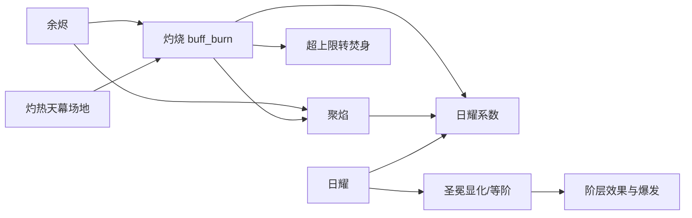

# 卡牌、Buff、遗物与卡包

> 模块范围：Terrias 基础内容实体、CSV 脚本分派和日耀战斗机制。晨星、乌娜、洛奈尔、百变、投影、心变和无尽深渊的专有规则在各自模块继续展开。

## 1. 模块定位

这一模块是 Terrias 的内容骨架：卡包决定内容归属，卡牌发起一次性动作，Buff 保存持续状态或注册事件，遗物在战斗入口挂接长期监听。它们首先是游戏标准 DataConfig，不是 Terrias 自建的一套平行卡牌系统。

当前内容基线：

| 内容 | 数量 | 数据入口 |
| --- | ---: | --- |
| 卡牌 | 86 | `Terrias/Data/Card/*.csv` |
| Buff | 57 | `Terrias/Data/Buff/*.csv` |
| 遗物 | 18 | `Terrias/Data/Relic/terrias.csv` |
| 卡包 | 5 | `Terrias/Data/CardPack/terrias.csv` |

卡牌数量按2026-09-06仓库 inventory 脚本统计：66 张归属于五个主题卡包，20 张没有卡包归属。数量不包含 CSV 的 schema 与说明行。

## 2. 五个卡包

| 运行时完整 id | 显示名 | 机制定位 |
| --- | --- | --- |
| `Terrias_terrias_cardpack_solar_ember_crown_canopy` | 日耀：烬冠天幕 | 整合日耀、聚焰、烬衣、圣冕、场地、自身灼烧管理与敌方灼烧扩散 |
| `Terrias_terrias_cardpack_morning_star_overture` | 晨星：序曲 | 星谱、伏谱、谱句、复奏和启明星 |
| `Terrias_terrias_cardpack_more_dimensions` | 更多的次元 | 百变、投影、心变与精灵球入口 |
| `Terrias_terrias_cardpack_false_gold_dream` | 虚假的黄金梦 | 伪金、债务、黄金梦与黄金之资 |
| `Terrias_terrias_cardpack_moon_homecoming` | 归家的月亮 | 月之领域、生命成长、引力涟漪与手牌中的伴月纪闻 |

卡包表本身只声明 id、Type 和 Icon。卡牌/遗物通过 `PackBelong` 使用完整卡包 id 归属。游戏 `GameConfigManager.GetItemsByPack` 和 Terrias 的 `GameCompatibilityApi` 负责按包查询。

旧的三个日耀卡包勾选会在运行时迁移为合并卡包。可选卡框由 AuraToolsExp 的 Terrias 主题管理：主题首次加载时把卡包预设展开为显式逐卡映射，之后不覆盖用户修改。

## 3. 卡牌分类

### 3.1 日耀主卡

`Card/terrias.csv` 中前 30 张为日耀与基础扩展卡，围绕以下状态形成闭环：



代表性的规则族：

- **直接施加/触发灼烧**：星火、日耀：引燃、蚀天之咒、燃灾等。
- **灼烧转聚炎**：引炎、灼流回收、凝烬成塔。
- **聚炎消费**：聚炎护盾、燃冠誓言、炽冕崩落。
- **天幕场地**：灼热天幕、天幕再临、启辉誓言、日蚀。
- **日耀/圣冕**：太阳圣祷、日耀：授冕、圣冕显化及等阶效果。
- **手牌事务**：被珍藏的名字弃牌、被燃尽的名字焚毁手牌。
- **阳炣火漆**：耀焰斩、太阳圣祷、炎轮再临、浴火打出后，按实际费用+1获得聚焰。

### 3.2 晨星卡

15 张公开晨星卡由 `CardScripts` 转交 `MorningStarCardScripts`。原有 8 张为星图、空白星谱、星律重订、星律锚定、星轨换位、休止符、晨星：星台、晨星：复奏；新增 7 张为逆转术式、晨星：回光、恶兆转移、众生相、众生愿、众生渡和晨星：悲歌。

新增系列通过精确 `Curse` 标签把主体、Terrias 与其他启用 MOD 的诅咒统一视为资源：`MorningStarCurseCatalog` 负责识别、缓存随机池和反转配方，`MorningStarCurseCardApi` 负责手牌/等待区/抽牌堆/弃牌堆快照与标准焚毁事件，`MorningStarCurseService` 负责愿力、星辉、抽牌和目标减益结算。

4 张星辰序曲和“魔女的星谱”是带 `*` 的锁定内部卡。它们仍然是标准 DataConfig，但不作为普通可解锁卡进入公开池。

### 3.3 更多次元和内部模板

- `polymorph`、`witch_projection`、`heart_change`、`spirit_ball` 是公开入口卡；
- `polymorph_role_template`、`projection_role_template`、`projection_basic_action`、`spirit_card_template` 是锁定模板/运行时保障卡；
- 它们的业务由百变、投影、心变和精灵服务承担，CardScripts 只提供入口。

#### 百变会话与冷却

百变选中目标后获得 1 层【百变】Buff，并同时切换角色形象、`RoleTable.Career`、职业脚本和技能栏。Buff 按自身 `ReducePerTurn` 正常衰减；清除时恢复变身前的角色、职业运行时和技能冷却快照。

- 原角色的职业脚本与技能冷却在整个百变会话中冻结；
- 目标角色首次进入时沿用其职业脚本初始化出的冷却，不强制重置为 0；
- 会话内再次进入同一目标角色时，恢复该形态离开时保存的冷却；
- 同一回合已经使用过另一形态的职业技能时，新形态技能至少显示 1 回合入场冷却，避免跨形态连续释放；
- 切换目标只更新当前 Buff 对应的形态，不覆盖最初保存的原角色快照；Buff 结束始终回到会话开始前的角色。

### 3.4 无尽深渊诅咒

`Card/cursecard.csv` 声明“生机窃取”和“亏空”。`CardScripts` 在普通 handler 之前调用 `EndlessAbyssCurseService.IsCurseCard`，并把 Init/Draw/Drop 交给深渊服务。

### 3.5 归家的月亮

十张公开牌通过 `MoonHomecomingScripts` 接入，包含三张不可打出且保留的稀有纪闻；纪闻既进入奖励池，也可由努昂诺塔生成进弃牌堆。霜月月髓和纪闻其二的生命成长持续整个冒险，纪闻其一的魔能上限只持续本场战斗。组合判定、供奉、资源与验收详见[归家的月亮模块](12-归家的月亮与哥伦比娅主题卡包.md)。

## 4. 卡牌脚本分派

奥莉米娅的内部职业技能【点金】由 `OlimyaScripts` 接入，黄金化为单层负面状态。两条职业被动与金币所有权规则详见[奥莉米娅模块](13-奥莉米娅角色与织梦黄金体系.md)。

### 4.1 CSV 入口

卡牌行统一调用：

```text
InitScript -> CS.Terrias.Dll.Scripting.CardScripts.Init(self, shortId)
DrawScript -> CardScripts.Draw(self, shortId)
UseScript -> CardScripts.Use(self, shortId)
DropScript -> CardScripts.Drop(self, shortId)
```

### 4.2 分派优先级

`CardScripts.Init` 的实际顺序是：

1. 规范化短 id，移除 `*`。
2. 无尽深渊诅咒交给 `EndlessAbyssCurseService`。
3. 星辰序曲/魔女星谱交给 `StarScoreService`。
4. 晨星公开卡交给 `MorningStarCardScripts`。
5. 命中 `InitHandlers` 时调用日耀/更多次元 handler。
6. 未命中时退回 `CommonCardItem` 基础脚本。

`Use` 使用相同的领域优先级。日耀与更多次元 handler 保存在 `InitHandlers`/`UseHandlers`，避免顶层 switch。乌娜、洛奈尔的职业技能卡使用各自的 `WunaScripts`、`LoneerScripts`。

### 4.3 基础卡类型和描述值

Init handler 通过 `ExecutorApi.SetBaseScript` 选择 `CommonCardItem` 或 `AttackCardItem`，并将动态伤害、护盾和数值写入 DataConfig 描述变量。比如日耀伤害由 `SolarCombatApi`/`DamageApi` 根据当前日耀、聚炎、目标灼烧和圣冕等阶计算。

卡牌初始化末尾把一个按规范化 id 缓存的 delegate 写回 `self.ScriptDict["InitScript"]`。这减少同一 DataConfig 后续 InitScript 经 XLua 重复解析的成本，同时保留统一异常和诊断入口。

## 5. 日耀状态模型

| Buff | 类型 | 实现职责 |
| --- | --- | --- |
| 日耀 | 正面 | 行动触发超凡；也是日耀系数和圣冕等阶输入 |
| 日耀系数 | 能力 | 动态计算值，不独立注册 handler |
| 聚焰 | 正面 | 回合开始产生灼烧和超凡 |
| 灼热天幕 | 场地 | 实体 Buff 作为显示/载体，权威场地状态由 FieldApi 管理 |
| 焚身 | 负面 | 回合开始造成真伤后移除 |
| 余烬 | 能力 | 提高伤害并在灼烧结算前抵消灼烧 |
| 烬衣 | 能力 | 清除灼烧/焚身，并在下一回合再次保护后移除 |
| 圣冕显化 | 能力 | 根据授冕时日耀决定等阶，改变系数并触发阶层效果 |
| 圣冕等阶 | 能力 | 保存当前阶层 |
| 源核：日耀 | 能力 | 每回合第一次获得日耀时追加一层 |
| 轮转：聚焰 | 能力 | 监听自身灼烧增加并转换聚炎 |
| 残光病兆 | 能力 | 回合开始把敌方灼烧的一半转为易伤 |

### 5.1 Apply/Clear 对称性

`BuffScripts.ApplyHandlers` 和 `ClearHandlers` 成对注册。持续型 Buff 在 Apply 时：

- 生成 hook token；
- 通过 `ScriptEventApi.BeginFightScope` 注册 battle-lease EventCenter/ScriptExecutor 事件；
- 初始化 Vars 中的 last/done/pending 等状态。

Clear 时使 C# battle lease generation 失效，不再把 hook/token 标记写入持久 Vars。这样 Buff 被移除后旧回调立即成为 no-op，同场重新获得或进入下一场战斗时仍可重新注册。

### 5.2 圣冕

授冕时根据日耀层数计算 1 到 5 阶。`SolarRadianceService.HandleSolarCardUsed` 判断是否已持有圣冕：

- 无圣冕时，按实际费用获得日耀；
- 有圣冕时，触发当前阶层的累积效果。

阶层效果从负面转灼烧、抽牌、回能、灼烧转聚炎，到敌方全体灼烧/触发逐级累积。圣冕结束时再按等阶消耗日耀。

### 5.3 灼热天幕

天幕不是简单地把同一 Buff 加到每个单位。`FieldApi` 保存一个战斗共享的 active field、stacks、epoch 和 round lock；单位上的 `scorching_canopy` Buff 只是配置与显示载体。详细权威和同步模型见“战斗事件、场地与特殊标签”。

## 6. 遗物运行方式

18 件遗物全部由 `RelicScripts.Fight` 的 `FightHandlers` 分派。**反编译确认**，游戏 `BlessingRelic` 在进入战斗时为遗物 DataConfig 设置 Self/Object 并运行 `FightScript`。

遗物 handler 不在 FightScript 当场执行所有效果，而是注册到语义事件：

| 事件 | 代表遗物 |
| --- | --- |
| `FightStart` | 晨辉碎片、环日镜初始化、日心棱镜初始化、洛奈尔的星石袋 |
| `StartRound` | 烬衣衬布、太阳瓶、日相刻盘、小型日轮、灰烬护符、日晷、风带、黯淡星石 |
| `Action` | 环日镜计数、授冕圣座/棱镜状态检查、无刻时钟 |
| `AddBuff` | 狐女的竖琴统计玩家向敌方施加负面 Buff 的次数 |
| Buff level change | 聚炎护符、授冕圣座、日心棱镜 |
| `StartRoundEnd` | 黑日十字在基础抽牌后统计手牌诅咒并增加愿力 |
| `EndRound` | 灰烬护符、黑日十字恢复等结算 |

所有事件通过 `ExecutorApi.TryAddEvent/TryAddTempEvent` 进入 `ScriptEventApi`，而不是在 Scripting 中裸调用宿主 AddEvent。

“炽冠圣心”的开场效果被拆成两部分：日耀和圣冕由 `RelicOpeningEffectService` 幂等地恢复到重建后的战斗状态；2 层灼热天幕作为遗物场地 grant 注册给 `FieldStartCoordinator`。协调器在 `FightOpening` 按“难度池、祝福、遗物、其他”的顺序折叠所有来源，同类叠加、异类替换，并只提交一次最终场地。

## 7. 卡牌修改与临时附着

Terrias 会在战斗中创建或修改卡牌副本，例如：

- 乌娜技能生成 0 费授冕牌并附着 Burnout/Froze；
- 白曜圣祷给友方手牌临时附着 Burnout 和白曜；
- 洛奈尔生成带运行时 marker 的指引牌副本；
- 百变/投影从模板生成角色牌。

这些操作经过：

- `CardGrantRequest` 和 `CardApi.GrantCardToHand` 的事务式授予；
- `CardMutationService` 修改 runtime tags/special tags；
- `RuntimeCardAttachmentService` 保存附着声明、请求联机同步和清理；
- `TerriasBuffMutationRouter` 统一采集 Add/Remove/level/CheckAllBuff 事务；55 个自有 Buff 与 Terrias 直接使用的原生 Buff 均由 `TerriasBuffPresentationDependencyCatalog` 显式声明影响，并通过 `TerriasFightPresentationInvalidationService` 与 `TerriasCardInvalidationService` 合并为一次 dirty-field 提交。未知第三方 Buff 保留原生全量回退。

不能把战斗临时标签写回 `Terrias/Data/Card/*.csv` 的共享行，也不能只改 DataConfig Vars 而忘记 FightCardManager 的 tag cache 和 UI 表现。

## 8. 游戏主体接入

| Terrias 环节 | 反编译宿主模块 | 接入点 | 证据 |
| --- | --- | --- | --- |
| 卡牌实例 | `Witch.DataConfig`、`CardItem` | 创建 ScriptExecutor、InitScript | 反编译确认 |
| 普通卡使用 | `CommonCardItem.TrueUse` | PreUseScript、UseScript、动作表现 | 反编译确认 |
| 攻击卡使用 | `AttackCardItem.TrueUse` | Target、PreUseScript、UseScript、动作表现 | 反编译确认 |
| 抽取/丢弃 | `CommonCardItem`、`AttackCardItem`、`CardItem` | DrawScript、DropScript | 反编译确认 |
| Buff 应用/清理 | `BuffItem.Init/Clear` | ApplyScript、ClearScript、level change 事件 | 反编译确认 |
| 遗物开战 | `BlessingRelic.Apply` | FightScript | 反编译确认 |
| 标签缓存 | `FightCardManager.CardTagCheck/RefreshTag` | 合并 Vars.Tag 和 SpecialTag | 反编译确认 |
| 内容查询 | `GameConfigManager` | GetOne、GetItemsByPack、CardPackCheck | 签名与反编译确认 |

## 9. 生命周期和状态

- Data/Text 行是静态模板。
- DataConfig Vars 保存卡牌/Buff executor 的实例态。
- battle lease 在 Buff 清除时失效，并在下一 battle session 自动允许持久卡牌、遗物与祝福重新注册。
- `CombatVarApi` 保存火轮使用次数、场地等战斗共享状态。
- 运行时卡牌 attachment 在 Fight_Start 和战斗结束边界清理。
- 星谱、洛奈尔、百变等复杂状态使用 owner-keyed store，不写回 CSV。

## 10. 联机边界

普通卡牌和 Buff 依赖游戏自身的战斗同步，但 Terrias 自建的共享场地、运行时附着、角色状态和模式进度需要额外协议：

- 场地由主机权威，客户端请求并接收 snapshot；
- runtime hand attachment 使用 Terrias RPC 同步声明而不是传输 Unity 对象；
- 玩家私有角色状态按 owner status/player id 隔离；
- 众生相仅由本地使用者随机并写入自己的 `RoleTable.blessingConfigs`，联机时沿用主体 `CmdSyncRoleTable` 提交；
- 纯视觉刷新不反向写权威进度。

“本地卡牌脚本成功执行”不自动证明其他客户端拥有相同 Terrias 扩展状态。

## 11. 性能与诊断

- `CardScripts.Init` 记录 `Manual.CardScripts.Init` 片段耗时并缓存 direct delegate。
- 卡区重复扫描使用 `AuraCombatCardZoneSnapshot` 或集中 API，而不是每个机制遍历所有列表。
- 费用和表现更新通过 dirty state/refresh queue 合并。
- 资源读取集中到 `TerriasResourceCache`。
- Event 注册使用 token 和 handler registry，避免每次行动重复挂监听。

## 12. 验证

相关修改至少运行：

```powershell
tools\Build-TerriasDll.ps1
tools\Test-TerriasArchitecture.ps1
tools\Test-TerriasCSharp.ps1
tools\Test-TerriasContent.ps1
```

检查 Data/Text 对齐、完整 id、handler 覆盖、动态描述、临时标签清理和联机状态同步。视觉 registry 或 bundle 同时变化时再运行视觉构建与验证。
