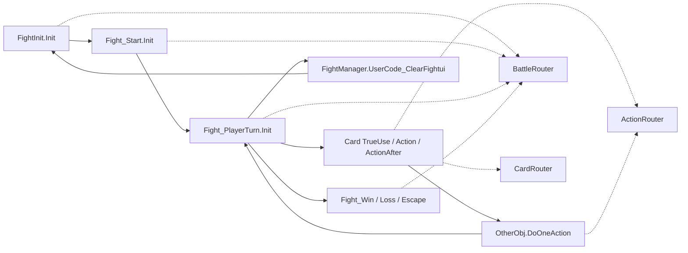
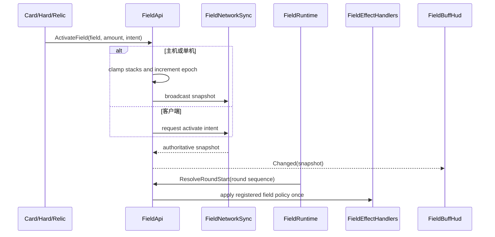
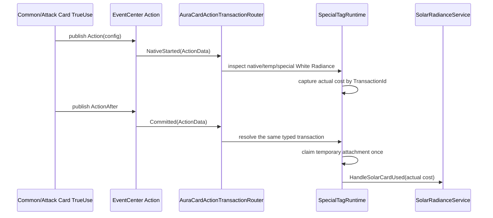

# 战斗事件、场地与特殊标签

> 模块范围：共享战斗生命周期、场地、Hard 难度词条、白曜/启明星标签，以及它们对游戏主体方法和 EventCenter 的接入。

## 1. 模块定位

Terrias 的持续战斗机制不能只依赖某张卡的 UseScript。它们需要感知战斗开始、回合开始、卡牌使用、敌人行动、Buff 变化和战斗结束，并在多人游戏中区分权威写入和客户端表现。

当前结构由四类路由器承载高频生命周期：

| 路由器 | 主要宿主目标 | 消费者示例 |
| --- | --- | --- |
| `TerriasBattleLifecycleRouter` | GameEntry、FightInit、Fight_Start、Fight_PlayerTurn、ClearFightui、Win/Loss/Escape | 场地、Hard、角色、模式、UI |
| `TerriasCardLifecycleRouter` | CardItem/AttackCardItem 使用、初始化、DataUpdate、获得卡牌和各显示项 | 星谱、Hard、视觉和表现刷新 |
| `TerriasCombatActionRouter` | `OtherObj.DoOneAction`、`FightUI.CallActionAnimation` | Hard、乌娜动画、伙伴和轨道火 |
| `TerriasStatusLifecycleRouter` | Add/Remove Buff、Level、Hit、HP、Enemy.Init、Animator/Sprite | 场地策略、Hard、乌娜视觉和复生 |

Battle/Card 路由器复用 Aura 核心的共享路由；CombatAction/Status 由 Terrias routed hook 统一分发。订阅按 id 保存快照，单个 handler 异常不会阻断其他模块。

## 2. 宿主生命周期



**反编译确认**，宿主方法经 Rougamo `Modifiable.OnEntry/OnSuccess` 查询 `ModHookRegistry`。Terrias 的 routed hook 只是把同一宿主回调再次分发给自己的多个订阅者，不改变宿主 Hook 协议。

## 3. 场地模型

### 3.1 当前场地注册表

`FieldEffectRegistry` 当前注册两个场地：

| 场地 | slug | Buff id | 上限 | policy |
| --- | --- | --- | --- | --- |
| 灼热天幕 | `scorching_canopy` | `Terrias_terrias_scorching_canopy` | 9 | RoundStart、BuffAdded、BurnOverflow |
| 轮回花庭 | `samsara_garden` | `Terrias_terrias_samsara_garden` | 5 | RoundStart |

启动时 registry 从 Buff DataConfig 读取实际 UpperBound、名称和描述；64x64 HUD 图标由场地定义独立注册，Buff.Icon 保持为空。轮回花庭的实际第 5 层沿用第 4 档视觉，但 HUD 数字和效果仍按 5 层处理。

### 3.2 权威状态

`FieldApi` 不把“场地是否存在”建立在某个角色身上的 Buff 实例上，而是在 `CombatVarApi` 中保存：

```text
TerriasField_ActiveId
TerriasField_ActiveStacks
TerriasField_ActiveEpoch
TerriasField_LastRoundStart
TerriasField_TriggerLock
```

`FieldBuffSnapshot` 对外提供 Field、slug、buff id、stacks、max stacks 和 epoch。epoch 在场地变化时递增，用于拒绝旧 snapshot 和校验延迟行为。

### 3.3 激活和结算



`LastRoundStart` 和 `TriggerLock` 防止同一回合重复结算或重入。`FieldRuntime` 在 `Fight_PlayerTurn.Init` 增加 round sequence 并调用 ResolveRoundStart。`FieldRoundStartContext` 在一次目标扫描中建立双方全体单位快照，各场地处理器通过 `ApplyToAllCombatants` 复用目标遍历和单目标异常隔离。

### 3.4 开场来源

`FieldStartCoordinator` 在 `FightOpening` 按固定顺序统一求值：

1. 难度场地池；
2. 祝福场地；
3. 遗物场地；
4. 其他开场来源。

难度场地池由所选 Hard 动态派生，主机每场战斗按不同场地类型等概率抽取一种；Hard 层数决定候选场地层数。同类来源叠加，异类来源替换，协调器最终只调用一次 `FieldApi.CommitOpeningField`。`AuraLifecycleOperationLedger.TryClaimBattleOperation` 防止 FightInit/FightStart 重放时重复提交。

遗物和祝福只能向协调器提供场地 grant，不能在各自开场脚本中直接改写场地。炽冠圣心的日耀/圣冕由幂等的 `RelicOpeningEffectService` 在重建后的战斗状态上恢复，2 层灼热天幕则由遗物场地 provider 提供；两个步骤相互隔离，非场地效果失败不会阻断最终场地提交。

## 4. 场地多人同步

`FieldNetworkSync` 使用 `AuraAuthoritativeSyncDomain`，domain id 为 `FieldState`。快照包含：

- protocol version；
- field id、stacks、max stacks、epoch；
- battle serial 和 battle session id。

客户端激活场地时只提交受限 intent、field、amount、owner status 和 token。服务器验证 sender、战斗 session、协议、token 和允许的 intent，再执行权威变更。客户端只应用不旧于当前 epoch 的 snapshot。

战斗边界会重置 sync session、场地 CombatVar 和 HUD。客户端进入战斗但没有权威状态时请求 snapshot，而不是自行结算场地效果。

## 5. 十个 Hard 词条

Hard CSV 的脚本列当前为空。行为不是由 `FightScript` 执行，而是由 `TerriasHardTagRuntime` 从 `GameRuntimeData.HardTags` 读取所选词条及 DynamicValue 后统一接管。

| Hard | 实现行为 | 关键接入 |
| --- | --- | --- |
| 焦枯世界 | 战斗开始时铺上所选层数的灼热天幕 | DifficultyFieldPoolService、FightOpening |
| 永恒花园 | 战斗开始时铺上所选层数的轮回花庭；场地5层时每回合额外给存活单位30层重生 | DifficultyFieldPoolService、FieldEffectHandlers |
| 黑日之灾 | 玩家每 5 个回合从牌堆/手牌/弃牌堆随机湮灭一张 | StartRound listener、卡区 API |
| 白曜圣庭 | 每名敌人行动前为该敌人增加 1 层日耀 | `OtherObj.DoOneAction` before |
| 落日远征 | 开战按已经历战斗数扣当前生命百分比，最多 50%，保留 1 HP | BattleMaterialized |
| 重生 | 每个敌人初始化后获得 50 层原生重生 | `Enemy.Init` after |
| 深渊震荡 | 每跨 6 层触发裂化卡、敌方 HP 增幅或摧毁遗物之一 | Enemy.Init/层级边界、服务器权威 |
| 深渊凝视 | 本回合获得卡牌时累积凝视，按层级触发诅咒、加费或强制结束回合 | Card lifecycle、Action/ActionAfter、EndRound |
| 晨星晦暗 | 魔能上限 +1，所有战斗卡费用 +1，并持续刷新新卡 | FightInit、Card lifecycle、回合刷新 |
| 异次元-迟滞之水 | 技能成功使用后的冷却增量翻倍 | `SkillItem.TrueUse` before/after |

### 5.1 Hard 初始化步骤

`OnFightInitialized` 在 `BattleMaterialized` 通过 `TerriasLifecycleStepRunner.RunBattleOnce` 分步执行落日远征、晨星晦暗、凝视 reset/Action router/EndRound listener、黑日 listener。步骤被送入 GameplayMutation 帧阶段，单步失败不阻断其余 Hard 初始化。

### 5.2 卡牌生命周期按需注册

只有存在 Terrias Hard 时才调用 `EnsureCardLifecycleRegistered`，把 Hard 订阅加入 `TerriasCardLifecycleRouter`。之后新建、抽取、随机获得、DataUpdate 和使用前后的卡都能收到晨星晦暗/凝视修正。

### 5.3 权威边界

敌方 HP、遗物摧毁、重生和白曜圣庭等改变共享战斗状态的行为检查服务器权威。客户端可以更新费用表现和 HUD，但不应独立决定深渊震荡结果。

## 6. 白曜标签

### 6.1 静态标签

日耀卡的 Data.Tag 中可直接包含“白曜”。`FightCardManager.CardTagCheck` 把 `Vars["Tag"]` 和 `Vars["SpecialTag"]` 分隔后加入每个 DataConfig 的 tag cache。

`EnchTag/terrias.csv` 还声明 `solar_keyword`，显示名“白曜”。该 EnchTag 当前脚本列为空，主要提供原生附魔内容和说明；Terrias 的白曜触发语义由 Runtime 判断卡牌 tags/special tags。

### 6.2 临时标签

乌娜等机制会通过 `RuntimeCardAttachmentService` 给具体战斗卡实例附着白曜。临时白曜必须与原生白曜、特殊白曜区分，并用 claim 标志保证只结算一次。

### 6.3 触发流程



`blazing_crown_collapse` 虽有原生白曜，但被 SpecialTagRuntime 排除，因为该卡在 CardScripts 中显式调用 `SolarRadianceService.HandleSolarCardUsed`，避免重复触发。

共享事务以 battle session、owner、sequence 和 payload 卡牌身份配对嵌套 Action/ActionAfter；异常、错配或缺失的 ActionAfter 会产生 Aborted，不把旧事务留给下一张牌。

## 7. 启明星标签

`morning_star_seal` 的显示名为“启明星”：附着卡使用后，按实际支付费用获得等量星辰祝福。

与白曜类似，它的 EnchTag CSV 脚本为空，具体行为由 `StarScoreRuntime`：

- 在卡牌使用前识别启明星和当前费用；
- 处理星辰祝福的费用减半预览/实际覆盖；
- 在 Action/ActionAfter 后按实际支付费用结算附着收益；
- 在拖拽、选敌、取消和销毁边界恢复费用显示。

详细的星谱、费用覆盖和 HUD 状态见洛奈尔模块。

## 8. EventCenter 与 Action 路由

Terrias 使用两层事件：

1. 游戏 `EventCenter`/`ScriptExecutor.AddEvent` 提供 FightStart、StartRound、Action、ActionAfter、EndRound 等语义事件。
2. `AuraCardActionTransactionRouter` 为本地玩家建立一次类型化 Action/ActionAfter 事务，并向白曜、星谱、深渊凝视、CG、音频和卡牌特效分发明确阶段；Buff、遗物和职业的普通行动被动统一进入 `TerriasActionPassiveRegistry`，不再各自注册原生 Action listener。

这样避免每个机制都为同一玩家重复注册 Action listener。事务以共享 battle session 为边界，并在重开、结束和下一帧异常收敛时清理。

## 9. 清理与幂等

- Battle router 在 `BattleInitializing/Materialized/Opening/Ready`、`BattleRestarting/Restarted` 与 `OutcomeEntering/BattleSettling/BattleEnded` 划分初始化、真实开战信号、异常重建与正常结算；异常重建只清理战斗态，不伪造胜负结算。
- Hard runtime 在 `BattleInitializing` 清 EventOwner、status id 和技能冷却捕获表。
- 词条临时裂化和临时诅咒在 `OutcomeEntering` 或 `BattleSettling` 恢复/清理。
- Buff、遗物、祝福和职业监听使用 C# battle lease；清除时 generation 失效，新 session 自动重新注册，不再把 hook 标记写入持久 Vars。
- RuntimeCardAttachment 在 Fight_Start 清除旧战斗附着。
- 场地 round sequence 和 sync session 在战斗边界归零。
- `RunBattleOnce`、operation ledger、epoch 和 request token 分别处理本地重复初始化、一次性操作、旧快照和重复 RPC。

## 10. 游戏主体接入

| 功能 | 宿主类型/方法 | 接入方式 | 状态 |
| --- | --- | --- | --- |
| 战斗初始化 | `FightInit.Init`、`Fight_Start.Init` | Aura battle lifecycle Hook | 当前 Hook 与反编译确认 |
| 玩家回合 | `Fight_PlayerTurn.Init` | routed after Hook/Event | 当前 Hook 确认 |
| 卡牌使用 | `CommonCardItem.TrueUse`、`AttackCardItem.TrueUse` | before/after + Action Event | 反编译确认 |
| 卡牌标签 | `FightCardManager.CardTagCheck/RefreshTag` | direct API + lifecycle refresh | 反编译确认 |
| 敌人行动 | `OtherObj.DoOneAction` | routed before/after | 当前 Hook 确认 |
| Buff 变化 | `StatusManager.AddBuff/RemoveBuff`、`BuffItemConfig.set_Level` | status routed Hook | 当前 Hook 确认 |
| 新敌人 | `Enemy.Init` | status after Hook | 当前 Hook 确认 |
| 技能使用 | `SkillItem.TrueUse` | before/after，比较冷却前后 | 反编译确认 |
| 原生附魔 | `CardEnchUI`、`EnchCardItem`、`CardItem.enchScriptExecutor` | DataType.EnchTag | 反编译确认 |

## 11. 性能边界

- 高频宿主目标只注册一个 routed hook。
- handler 订阅使用缓存快照，注册变化时才重建。
- 场地配置启动时 warmup，不在每回合反复扫描 Buff 表。
- Hard 的卡生命周期订阅按需启用。
- 黑日湮灭和卡区检查通过集中卡区 API，不保留旧的多列表重复扫描。
- UI 更新由 dirty/refresh 请求合并，不在每个 Buff level change 立即重建全部 HUD。

## 12. 验证

```powershell
tools\Build-TerriasDll.ps1
tools\Test-TerriasArchitecture.ps1
tools\Test-TerriasCSharp.ps1
tools\Test-SharedReleaseGate.ps1 -Profile network
.codex\skills\terrias-mod-dev\scripts\validate-terrias.ps1
```

Hard 文案、DynamicValue 上限、运行时 id、宿主 Hook 名、单机/主机/纯客户端路径都需要一起验证。
