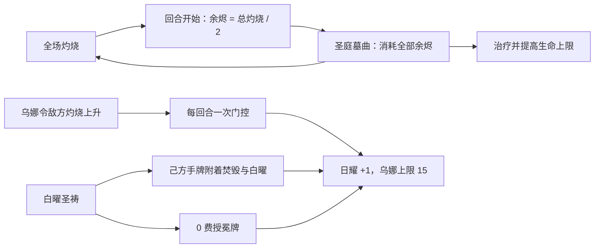

# 乌娜角色与白曜体系

> 模块范围：乌娜职业注册、白曜圣祷、圣庭墓曲、日耀被动、余烬跨战斗保存、动作动画与轨道火表现。日耀通用卡牌和圣冕阶层详见[卡牌、Buff、遗物与卡包](01-卡牌BUFF遗物与卡包.md)。

## 1. 模块定位

乌娜不是一套脱离游戏职业系统的自定义角色。`Career/wuna.csv` 声明标准 Career，游戏创建职业技能时执行 `SkillScript`，再由 `WunaScripts` 把职业被动和两个技能接入 Terrias 的战斗生命周期。

她的机制由三条相互连接的状态链组成：



其中“白曜”是卡牌特殊标签，“日耀”和“余烬”是 Buff。它们属于不同数据域，不应在代码或文档中混作同一个状态。

## 2. 内容与资源入口

| 内容 | 当前声明 |
| --- | --- |
| Career 本地 id | `wuna` |
| 运行时完整 id | `Terrias_wuna_wuna` |
| 理智上限 | 70 |
| 职业脚本 | `CS.Terrias.Dll.Scripting.WunaScripts.InitCareer(self);` |
| 技能 1 | `Terrias_wuna_wuna_white_sun_prayer`，白曜圣祷，CD 5 |
| 技能 2 | `Terrias_wuna_wuna_grave_song`，圣庭墓曲，CD 4 |
| 职业技能卡 | `*wuna_white_sun_prayer`、`*wuna_grave_song` |
| 内部授冕牌 | `*wuna_coronation_token` |
| 动画库 | `Mods/Terrias/ModResource/AnimationLib/WuNa` |

共享资源层还注册了白曜圣祷和“美餐”CG；音频注册表为职业选择、低血量、两个主动技能和战斗胜利提供 Wuna 音频。乌娜轨道火的 Shader、材质和视觉资源由 `visual.registry.json` 声明，而不是在 C# 中硬编码二进制资源。

## 3. 接入游戏职业主体

### 3.1 宿主调用链

反编译参考中的 `FightInit.ApplyBlessingRelic` 会清理 Career 的脚本执行器，把 `Self` 和 `Object` 指向当前 `FightPlayer`，随后运行 Career 的 `SkillScript`。乌娜因此从以下链路进入：

```text
FightInit.ApplyBlessingRelic
  -> Career.SkillScript
  -> WunaScripts.InitCareer(self)
  -> 注册 FightStart / StartRound / Action / Win / Escape
  -> 初始化技能冷却、日耀回合门控和表现对象
```

主动技能仍走原生 `SkillItem.TrueUse`。反编译确认该方法先执行可用性检查，再设置 Target、运行 `UseScript`，随后处理语音、`InitScript`、数据刷新、Buff 刷新和 `FightUI` 行动动画。Terrias 没有绕开这条技能使用主链。

### 3.2 脚本入口分工

- `WunaScripts.InitCareer`：一次性注册职业生命周期监听。
- `WunaScripts.Init`：初始化三张内部职业卡的数据行为。
- `WunaScripts.TryUse`：在宿主实际执行技能前给出技能条件。
- `WunaScripts.Use`：根据卡 id 分派白曜圣祷、圣庭墓曲或授冕牌效果。

职业入口只做分派和编排，卡牌授予、Buff 读写、持久状态及视觉挂接分别下沉到 Mechanics、GameApi 和 Hooks。

## 4. 战斗初始化与生命周期

`InitCareer` 写入乌娜激活标记并将两个技能冷却设为 0，然后以可注销 token 注册：

| 时点 | 行为 |
| --- | --- |
| FightStart | 重置日耀回合状态；为敌方灼烧变化注册监听；挂接轨道火 |
| StartRound | 推进回合标识；非百变压制时递减技能冷却；重置“本回合已获日耀”；按全场灼烧总层数的一半获得余烬 |
| Action | 参与技能与表现所需的行动阶段处理 |
| Win / Escape | 保存余烬并释放职业监听和表现状态 |

监听使用 Terrias 生命周期路由与 `EventDispose.OnFightEnd` 清理，避免职业切换或下一场战斗继续收到旧事件。

百变状态是明确的职业压制边界：角色被百变替换时，乌娜技能和职业回合逻辑不会假装仍然有效；离开百变后再按当前角色状态恢复。

## 5. 白曜圣祷

### 5.1 使用条件

`UseWhiteSunPrayer` 要求：

- 当前职业能力未被百变压制；
- 技能自己的 CD 与共享技能门控均允许使用；
- 宿主已通过原生技能使用流程。

成功后冷却设为 5，并请求技能音频与 CG/轨道火表现。

### 5.2 授冕牌事务

`WunaCardGrantService.GrantCoronationTokenToHand` 使用统一卡牌授予事务创建 `*wuna_coronation_token`：

- 费用改为 0；
- 附着焚毁和凝滞；
- 记录运行时附件，便于卡牌复制、刷新和离场时正确清理；
- 任一步骤失败时返回失败阶段和原因，而不是留下半完成卡牌。

随后 `TerriasCardTagService.RequestBurnoutAndWhiteRadianceForFriendlyHands` 为己方全体当前手牌添加焚毁和白曜，并做去重。白曜的实际结算不在 CSV 的 `CardScript` 中，而由 `SpecialTagRuntime` 在真实行动前后识别。

### 5.3 白曜到日耀

`SpecialTagRuntime` 在 `CommonCardItem.TrueUse`、`AttackCardItem.TrueUse` 与行动路由之间建立 pending 记录，使用实际支付费用调用 `SolarRadianceService.HandleSolarCardUsed`。临时白曜还带一次性 claim 锁，防止复制或重复回调多次结算。

若圣冕已显化，服务优先触发圣冕对应逻辑；否则按费用获得日耀。`炽冕崩落` 有独立结算，运行时显式排除它，避免双触发。

## 6. 圣庭墓曲与余烬

### 6.1 技能结算

圣庭墓曲仅在余烬严格大于 30 时可用。结算顺序为：

1. 读取并消耗当前全部余烬；
2. 通知 `BuffApi.OnEmberConsumed`；
3. 全体战斗单位获得 `余烬 / 2` 层灼烧；
4. 乌娜获得 1 层烬衣；
5. 立即触发一次全体灼烧；
6. 技能进入 4 回合冷却。

消费通知是共享机制扩展点。乌娜本体据此恢复按消费层数百分比计算的生命，并提高等量生命上限；使魔祝福等模块也可监听同一事件，但不能反向拥有乌娜技能流程。

### 6.2 余烬获得与上限

回合开始时，脚本汇总全体战斗单位的灼烧层数并取整数除二作为余烬增量。余烬最终钳制在 0 到 99，变更后同步其伤害增益；归零时清除增益和 Buff，避免显示层数与实际增伤脱节。

### 6.3 冒险级持久化

余烬不是只存在于单场战斗的临时 Buff。`EmberAdventureStateService` 将它写入按玩家/Status 所有者隔离的 GameVar，并生成含序号的快照：

```text
本地余烬变化
  -> CommitLocal(owner, level)
  -> 写入 owner-scoped GameVar
  -> 联机时发送 RpcEmberAdventureStateCommit
  -> 下一场 Fight_Start.Init 后恢复到本地角色 Buff
```

`EmberAdventureStateRuntime` 在 `Fight_Start.Init` 后恢复本地玩家余烬。快照按 owner key 和 sequence 去重，旧快照不会覆盖新值。

## 7. 每回合一次的日耀被动

乌娜在战斗开始时为敌方的 `BurnOnLevelChange + targetId` 事件注册监听。Buff 变化可能在同一帧产生多个回调，因此处理被投递到下一帧并再次读取状态。

`WunaRoundRadianceState` 以所有者为键记录“当前回合是否已触发”。它优先读取宿主 `FightManager` 的回合标识，无法取得时才使用 Terrias 的局部回合计数。当前实现满足以下条件时获得 1 日耀：

- 变化对象是敌方；
- 灼烧确实上升；
- 当前回合尚未触发。

该被动以当前代码的总量判定为准，不做施加者过滤。只要乌娜职业处于激活状态，任何来源使敌方灼烧总层数净增加，都可以触发本回合的第一次日耀获取；多人战斗中的队友来源同样有效。玩家可见职业文本已同步为“当敌方灼烧总层数增加时”，不再把它限定为乌娜亲自施加。

监听回调会延迟到下一帧并比较前后总量，因此精确语义是采样结算时的净增长，而不是逐条记录每一次灼烧施加事件。该实现不依赖 Buff 来源归因，也不应在维护文档中重新描述成来源过滤。

`ExecutorApi.PrepareSolarRadianceUpperBound` 与后置修正为乌娜把日耀上限扩展到 15，同时保持其他角色的默认上限规则。

## 8. 动画、轨道火与共享资源

### 8.1 动作动画兼容

`WunaActionAnimationRuntime` 在 `FightUI.CallActionAnimation` 前后规范化全体目标和主目标，并临时修正效果对象命名，调用完成后恢复原值。它解决的是乌娜动作资源与宿主目标布局之间的适配，不改变伤害或 Buff 结算。

### 8.2 轨道火

`WunaOrbitFireRuntime` 在 `StatusManager.InitAnimator`、`SetSprite`、`FightUI.FadeIn` 和行动动画之后尝试挂接表现。只有当前角色确认为乌娜时，控制器才会附着到角色身体的 `SpriteRenderer`。

该效果受性能设置 `TerriasWunaOrbitFireEnabled` 控制，默认关闭；启用后仍对几何刷新节流。视觉缺失或性能模式关闭不得影响职业机制。

### 8.3 Aura 共享依赖

| 共享组件 | 用途 |
| --- | --- |
| AuraAudioShared / AudioArbiter | 职业语音资源解析和播放仲裁 |
| AuraCgShared | 白曜圣祷与剧情 CG 注册、请求和去重 |
| AuraSkinShared | 乌娜皮肤包及目标 Career 绑定 |
| AuraSharedFrameScheduler | 灼烧监听去重、下一帧恢复和表现挂接 |
| AuraShared hooks / lifecycle | 宿主方法前后置接入与战斗清理 |

共享层只提供协议和调度，不理解“白曜圣祷”“余烬”或“日耀被动”的业务语义。

## 9. 联机所有权与安全边界

余烬快照是乌娜模块中明确的自定义联机状态：

- 客户端提交走 server-bound RPC；
- 服务端校验真实 sender、房间成员身份以及快照 owner；
- owner 不匹配时拒绝应用，不信任 payload 自报身份；
- sequence 防止重复包和乱序包回滚状态；
- 只有本地 owner 才把恢复值投影到本地 `FightPlayer.Status`。

技能卡、Buff 和伤害继续使用游戏主体既有战斗同步。轨道火、动画规范化和 CG 属于表现状态，不应成为权威游戏状态。

## 10. 宿主与反编译映射

| Terrias 功能 | 游戏主体锚点 | 对应关系 |
| --- | --- | --- |
| Career 初始化 | `FightInit.ApplyBlessingRelic` | 宿主运行 `Career.SkillScript`，进入 `WunaScripts.InitCareer` |
| 主动技能 | `SkillItem.TrueUse` | 原生 TryUse/UseScript/动画链承载两个技能 |
| 白曜卡使用 | `CommonCardItem.TrueUse`、`AttackCardItem.TrueUse` | Hook 捕获将要使用的卡，行动后按实际费用结算 |
| Buff 变化 | `StatusManager` / Buff 事件 | 敌方灼烧上升触发每回合一次日耀判断 |
| 战斗开始 | `Fight_Start.Init` | 恢复余烬、重建职业监听与表现 |
| 动作表现 | `FightUI.CallActionAnimation` | 临时规范化目标与效果对象，完成后恢复 |
| 角色表现 | `StatusManager.InitAnimator`、`SetSprite`、`FightUI.FadeIn` | 重新寻找角色渲染器并挂接轨道火 |

反编译方法体用于确认宿主流程；可编译签名仍以当前 `Managed/` 为准。

## 11. 兼容性、性能与已知边界

- 所有角色状态以玩家/Status owner 为键，不能使用单个全局布尔值代替。
- 灼烧回调经过下一帧合并和每回合门控，避免一次批量加 Buff 重复获得日耀。
- 授冕牌及临时白曜使用事务、marker 和 claim 锁，不能只改显示 Tags。
- 余烬写入采用序号去重；旧存档仅有兼容 key 时会读取并迁移到当前 owner-scoped key。
- 轨道火是可关闭的表现功能，默认配置不会把高频几何更新强加给所有用户。
- 百变与职业切换必须走清理路径，否则会残留职业事件监听。

## 12. 代码与验证入口

主要证据位置：

- 数据：`Terrias/Data/Career/wuna.csv`、`Data/Card/wuna.csv`、`Text/Career/wuna.csv`。
- 脚本：`Terrias-Dev/Scripting/WunaScripts.cs`。
- 机制：`SolarRadianceService.cs`、`WunaRoundRadianceState.cs`、`EmberAdventureStateService.cs`、`CardGrantRecipes.cs`。
- Hook：`SpecialTagRuntime.cs`、`EmberAdventureStateRuntime.cs`、`WunaActionAnimationRuntime.cs`、`WunaOrbitFireRuntime.cs`。
- 网络：`RpcEmberAdventureStateCommit.cs` 与 `TerriasNetworkRuntime`。
- 资源：`Terrias/audio.registry.json`、`visual.registry.json`、`SharedResources/cg.registry.json`、`SharedResources/aura.registration.json`。
- 反编译：`Witch/FightInit`、`Witch/SkillItem`、卡牌和 FightUI 相关类型。

修改本模块后至少运行架构门禁，并重点回归：两技能原生可用性、白曜实际费用、灼烧批量变化的单回合门控、余烬跨战斗/联机恢复、百变压制以及轨道火关闭时的纯机制流程。
