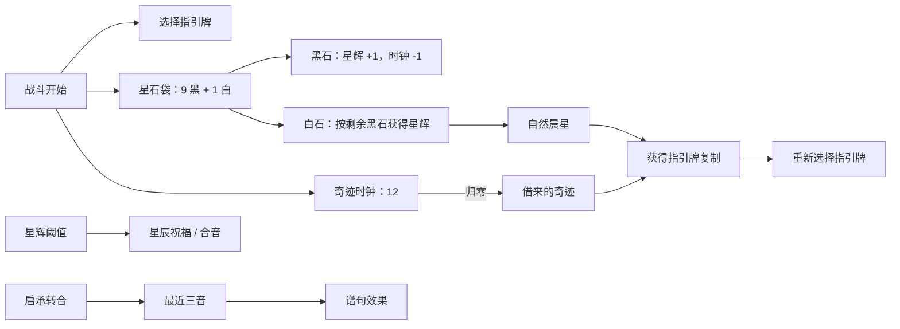

# 洛奈尔角色与晨星星谱体系

> 模块范围：洛奈尔职业、星石袋、奇迹时钟、指引牌、自然晨星/借来的奇迹、晨星祈愿、星辰序曲、星谱句式、星辰祝福、余音和星谱 HUD。

## 1. 模块定位

洛奈尔把“随机抽石的倒计时”和“按顺序演奏卡牌的谱句”组合为一套职业系统。前者决定何时复制指引牌并重置资源，后者把启、承、转、合三音序列解释成战斗效果。



## 2. 内容入口

| 内容 | 当前声明 |
| --- | --- |
| Career 本地 id | `loneer` |
| 运行时完整 id | `Terrias_loneer_loneer` |
| 理智上限 | 72 |
| 职业脚本 | `CS.Terrias.Dll.Scripting.LoneerScripts.InitCareer(self);` |
| 主动技能 | `Terrias_loneer_loneer_morning_star_prayer`，晨星祈愿，CD 2 |
| 职业技能卡 | `*loneer_morning_star_prayer` |
| 动画库 | `Mods/Terrias/ModResource/AnimationLib/Loneer` |
| 公开晨星卡 | 星图、空白星谱、星律重订、星律锚定、星轨换位、休止符、晨星：星台、晨星：复奏 |
| 内部星谱卡 | `*stellar_overture_start/sustain/turn/close`、`*witch_star_score` |

核心 Buff 包括星石袋、奇迹时钟、星辉、星辰祝福、星谱、余音和星台。人傀相关 Buff 与伙伴机制虽使用洛奈尔美术资源，但不属于本篇职业主链。

洛奈尔目前有晨星祈愿和“美餐”共享 CG；星谱 HUD 的 Shader 与点亮槽材质由 `visual.registry.json` 注册。当前音频注册表没有独立的洛奈尔职业语音提供者，文档不能把 CG 注册误写成音频注册。

## 3. 职业接入链

`LoneerScripts.InitCareer` 只做异常边界与转交，真正注册由 `LoneerMiracleService.RegisterCareer` 完成：

```text
FightInit.ApplyBlessingRelic
  -> Career.SkillScript
  -> LoneerScripts.InitCareer
  -> LoneerMiracleService.RegisterCareer
  -> FightStart / StartRound / Win / Escape
  -> StarStonePouch.Drawn 订阅
```

与乌娜相同，主动技能走反编译确认的 `SkillItem.TrueUse` 原生链：宿主检查 TryUse，运行 UseScript，再刷新数据、Buff 和行动动画。`LoneerRuntime` 在该方法前后捕获原生门控结果，用于诊断拒绝原因和修复冷却显示不同步，不替代宿主的最终判定。

## 4. 玩家级战斗状态

`LoneerCombatStateStore` 按 owner 保存 `LoneerCombatState`，主要字段包括：

| 状态 | 含义 |
| --- | --- |
| `GuidanceCardId` / `PreparedGuidance` | 当前指引牌及已准备的复制模板 |
| `ClockValue` / `ClockMax` | 奇迹时钟当前值与本场上限 |
| `PrayerCooldown` / `PrayerUseCount` | 晨星祈愿冷却和使用次数 |
| `ActionResolving` | 是否正在处理宿主行动，防止重入 |
| selection pending/version/scheduled | 指引选择请求、版本和延迟调度状态 |

战斗开始时会清空旧星谱、临时费用覆写和 pending 状态，初始化星石袋与时钟，再从抽牌堆和弃牌堆请求指引牌。若两处都没有候选，则使用隐藏的 `*witch_star_score`，保证后续奇迹总有合法复制目标。

战斗胜利或逃跑时释放订阅、pending 队列、HUD 与 owner 状态，避免跨战斗继承谱句或选择窗口。

## 5. 星石袋与奇迹时钟

### 5.1 袋子组成和抽取

初始星石袋含 9 枚黑石和 1 枚白石，并在袋内打乱。`StarStonePouchService` 通过 Buff Apply 注册 `ActionAfter` 抽取：

- 抽到黑石：获得 1 星辉，并令奇迹时钟减少 1；
- 抽到白石：按袋中剩余黑石数量获得星辉，并通过星石定轨触发自然晨星；
- 自然晨星结算时：按当前黑石上限重新放入黑石，再放入 1 白石并洗袋。

抽取结果通过 `StarStonePouchService.Drawn` 发布。洛奈尔服务先批量收集同一行动产生的结果，再在下一帧处理，避免宿主一次行动中的多次 Buff/抽卡回调递归打开选择 UI。

遗物给予的【备用星石袋】使用独立 channel，不发布给星石定轨，也不受自然晨星或晨星祈愿减容影响。若战斗开始时拥有者是洛奈尔，备用袋抽空后立即重装；其他角色抽空后直接移除该 Buff。百变化身离开洛奈尔形态时，职业袋冻结而不是继续抽取。

### 5.2 奇迹时钟

时钟初始最大值和当前值均为 12。每次黑石使当前值减 1；归零时安排“借来的奇迹”。时钟最大值有独立下限 6，只有借来的奇迹会逐次降低该上限。

自然晨星与借来的奇迹都重置时钟并按最大值获得星辉，但代价不同：

| 奇迹 | 触发 | 额外变化 |
| --- | --- | --- |
| 自然晨星 | 白石或晨星祈愿 | 不降低时钟上限 |
| 借来的奇迹 | 时钟归零 | 时钟上限 -1，最低 6 |

二者都会授予当前指引牌的复制，并在结算后重新请求指引牌。

### 5.3 UI 忙碌保护

若卡牌选择或其他宿主 UI 正在占用交互，奇迹与重新选牌会延迟而不是强行叠加窗口。调度 key 带 owner 和流程名，并通过版本号淘汰过期选择，防止旧请求覆盖新指引。

## 6. 晨星祈愿

`LoneerMiracleService.UseMorningStarPrayer` 检查职业激活、百变压制、共享技能门控、冷却和指引状态。成功后：

1. 触发一次自然晨星，并先按旧上限重置职业星石袋；
2. 本场晨星祈愿使用次数加一；
3. 重置后令职业星石袋黑石上限减少 2，最低 1；
4. 技能进入 2 回合冷却。

黑石上限与奇迹时钟上限是两套不同参数：技能降低前者以提高白石出现频率；借来的奇迹降低后者以缩短下一次强制奇迹倒计时。

## 7. 星辰序曲与星谱

### 7.1 四种音符

四张锁定内部卡代表：

| 代码 | 名称 | 单卡效果 |
| --- | --- | --- |
| S | 启 | 抽 2 张牌 |
| U | 承 | 获得 10 护盾，己方正面 Buff +1 |
| T | 转 | 目标易伤 +2 |
| C | 合 | 造成 `10 + 自身 Buff 种类数 + 目标 Buff 种类数` 伤害 |

`StarScoreService` 保存最近三音。第三音完成后先记录谱句并应用效果，然后保留最后一个音作为下一段谱句的起点，因此谱句是连续乐句而不是每三张完全清空。

### 7.2 谱句效果

| 三音模式 | 谱句 | 效果摘要 |
| --- | --- | --- |
| SSS | 急板 | 己方余音 +1，抽 2 |
| UUU | 长音 | 己方护盾翻倍，正面 Buff +2 |
| TTT | 失谐 | 全体敌方负面 Buff 层数翻倍 |
| CCC | 终止式 | 对全体敌人造成基于双方 Buff 种类乘积的伤害 |
| SUT | 调律 | 自身和己方获得余音 |
| UTC | 合奏 | 自身获得按己方 Buff 种类汇总的超凡类收益 |
| TUS | 回旋 | 己方获得 30 重生 |
| 其他 | 三声和弦 | 己方抽 1 |

完成谱句还会通知使魔祝福扩展点。谱句的业务归属仍在 Terrias Mechanics，共享层只承担事件和调度。

### 7.3 晨星公开卡

8 张公开晨星卡由 `CardScripts` 转交 `MorningStarCardScripts`。它们围绕谱句编辑与复现：增补序曲、清空或重订星谱、锚定谱句、换位、休止、星台和复奏。CSV 只保留统一脚本入口，具体效果由晨星脚本和 `StarScoreService` 完成。

## 8. 星辉、星辰祝福与余音

### 8.1 星辉阈值

星辉达到 10、20、30 时分别授予星辰祝福；达到 30 还会获得一张“合”序曲并移除星辉，开始下一轮积累。阈值处理必须基于跨越情况，不能只在恰好等于某值时触发。

### 8.2 星辰祝福

星辰祝福使下一张非序曲卡费用减半。`StarScoreRuntime` 在拖拽/指针阶段建立费用预览，真正使用前保存覆写，行动成功后消费；取消拖拽、对象销毁或行动未发生时回滚，避免永久改坏 DataConfig。

行动完成后，已消费的星辰祝福还会随机生成一张启、承或转序曲。生成发生在 `ActionAfter`，防止新牌干扰当前正在解析的卡。

### 8.3 余音

余音在使用需要消耗魔能的牌时，优先消耗等量层数来代替等量魔能；余音不足时只抵扣现有层数。星辰祝福仍拥有更高优先级，同一次出牌由星辰祝福减费时不会再消费余音。运行时还在玩家行动期间为一次实际新增的正面或负面 Buff 提供 +1 并消费余音。

费用替代由 `ResonanceCostTransactionStore` 建立独立事务。before-use 阶段记录支付所有者、实际支付层数和本事务写入的 `OnceExCost` 增量，然后扣除余音；只有观察到同一张牌的 `Action` 才提交。after-use 未观察到 Action、选择链取消或卡牌对象销毁时，事务只撤销自己写入的费用增量，并向原支付者退还实际扣除的余音，避免覆盖其他临时费用修改或重复退款。

事务状态只能结束一次。正常提交会消费该牌全部一次性费用状态；取消按当前 `OnceExCost` 反向应用事务增量，因此在事务建立后追加的其他费用修改仍会保留。战斗初始化会清除遗留事务和费用增量，但不会把上一场战斗的临时 Buff 带入新战斗。

## 9. 晨星封印与实际费用

`morning_star_seal` 在 EnchTag CSV 中没有脚本体。`StarScoreRuntime` 与行动路由在卡牌真正执行后，按实际支付费用获得等量星辰祝福。

实际费用可能受到星辰祝福、余音、宿主其他减费和卡牌临时覆写影响，因此不能在拖拽开始时用原始 Cost 直接结算。星辰祝福使用预览覆写，余音只在 before-use 建立支付事务；两者分别通过卡牌 DataConfig 实例关联 Action/after，并在取消与销毁路径清理。晨星封印仍以真正进入 Action 的实际费用为准。

## 10. 星谱 HUD 与视觉资源

`StarScoreHudRuntime` 订阅 `StarScoreService.Changed`，只为本地 owner 展示最近音符和谱句状态。HUD 通过共享 Battle HUD host 挂载，并在战斗边界、UI 关闭和 owner 切换时注销。

HUD 创建失败时使用下一帧有限重试，不在 `Update` 中无限查找。槽位点亮效果来自 `visual.registry.json` 中的 `terrias.star_score_hud` Shader 与 `terrias.star_score_hud.lit_slot` 材质。

晨星祈愿 CG 通过 AuraCgShared 注册；视觉缺失只降低表现，不能阻断星石、时钟、指引或谱句结算。

## 11. 游戏主体与反编译映射

| Terrias 功能 | 游戏主体锚点 | 对应关系 |
| --- | --- | --- |
| Career 初始化 | `FightInit.ApplyBlessingRelic` | 运行 Career SkillScript，注册洛奈尔服务 |
| 主动技能 | `SkillItem.TrueUse` | 原生门控和 UseScript；LoneerRuntime 前后诊断 |
| 指引牌来源 | FightPlayer 抽牌堆/弃牌堆、宿主卡牌选择 UI | 生成候选并等待玩家选择 |
| 星辰祝福预览 | `CommonCardItem.OnBeginDrag/OnEndDrag`、攻击卡指针流程 | 临时费用覆写及取消回滚 |
| 卡牌实际使用 | `CommonCardItem.TrueUse`、`AttackCardItem.TrueUse`、Action/ActionAfter | 提交祝福/余音支付和晨星封印收益 |
| 卡牌取消/销毁 | CardItem 取消和对象销毁流程 | 清除 pending 与费用覆写 |
| 星石抽取 | Buff Apply 后注册的 ActionAfter | 每个已完成行动抽取并批量解析结果 |
| HUD | 战斗 UI 生命周期 | 挂接本地星谱显示并随战斗清理 |

反编译用于说明调用顺序；具体签名兼容仍以 `Managed/` 和 GameApi 的确定性回退为准。

## 12. 所有权、联机与状态一致性

洛奈尔没有另建一套职业专用权威 RPC。当前边界是：

- `LoneerCombatStateStore`、pending 队列和 HUD 以玩家 owner 为键；
- 卡牌、Buff、伤害和抽弃牌堆变化依赖游戏主体既有战斗同步；
- HUD、拖拽预览、选择窗口和 CG 属于本地表现；
- 代码不能据此推断远端玩家一定拥有相同 UI/pending 状态；
- 任何未来需要跨端保持的星石随机结果或指引选择，都应先明确权威端，再增加专用快照协议，不能只广播 UI 结果。

这比笼统声称“晨星体系已由自定义网络层完整同步”更符合当前源码证据。

## 13. 性能与兼容策略

- 星石抽取结果按行动批处理，并投递下一帧，避免回调重入。
- UI 忙碌时延迟选择；同 owner 的 `RunOnce` key 和版本号抑制重复任务。
- 星谱 HUD 仅更新本地 owner，并基于 dirty/changed 事件刷新。
- 卡牌费用覆写保存原值，使用、取消、销毁和战斗结束均有回滚路径。
- 谱句、选择和冷却均按 owner 存储，不能用全局静态单例状态替换。
- 百变压制时拒绝职业技能并清理不应继续运行的职业流程。
- 随机序曲与星石顺序必须从当前战斗流程产生，不应由表现层再次随机。

## 14. 代码与验证入口

主要证据位置：

- 数据：`Terrias/Data/Career/loneer.csv`、`Data/Card/loneer.csv`、`Data/Card/terrias.csv`、`Data/Buff/terrias.csv`。
- 脚本：`LoneerScripts.cs`、`MorningStarCardScripts.cs`。
- 机制：`LoneerMiracleService.cs`、`LoneerCombatState.cs`、`StarStonePouchService.cs`、`MiracleClockService.cs`、`StarScoreService.cs`。
- Hook/UI：`LoneerRuntime.cs`、`StarScoreRuntime.cs`、`StarScoreHudRuntime.cs`。
- 资源：`Terrias/visual.registry.json`、`SharedResources/cg.registry.json`、`SharedResources/aura.registration.json`。
- 反编译：`Witch/FightInit`、`Witch/SkillItem`、`CommonCardItem`、`AttackCardItem`、CardItem 取消/销毁和战斗 UI 类型。

修改本模块后至少回归：无候选指引牌、连续多次抽石、白石与时钟同时到达边界、UI 忙碌延迟、晨星祈愿黑石下限、时钟上限 6、全部谱句、星辉跨阈值、费用取消退款、战斗结束清理和百变压制。
