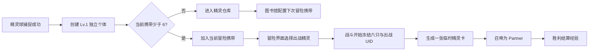

# 精灵收集、培养与出战系统

> 实现基线：2026-08-10
> 作用域：跨冒险持久化、重复个体、六只携带、仓库、成长、战斗出战和联机捕获

## 1. 系统定位

精灵不再是保存在冒险卡组里的动态卡牌。当前系统由四类对象组成：

1. `精灵球`：战斗卡牌，只负责捕获检定和敌人离场结算。
2. `SpiritInstance`：永久精灵个体，拥有唯一 UID、等级、经验和固定资质。
3. `SpiritAdventureParty`：当前冒险携带快照，固定六个槽位和一个出战 UID。
4. `SpiritOtherObj`：战斗内 Partner 实体，仅由本场冻结的出战精灵卡召唤。

同种精灵可以重复捕捉。每次成功捕捉都会创建独立 UID，不按物种合并等级、经验或资质。

## 2. 玩家流程



新捕捉个体固定为 1 级、0 经验。若当前携带有空位，它进入第一个空位；否则只进入仓库。捕捉不会自动修改当前出战精灵。

捕捉发生在战斗开始快照之后，因此新个体不能在当前战斗出战，也不参与当前战斗经验结算。

## 3. 持久化模型

永久档案写入 AuraShared 所有者数据目录：

```text
AuraShared/Data/Owners/Terrias/SpiritCollectionProfiles/{owner}.json
```

`SpiritCollectionDocument` 保存：

- 全部 `SpiritInstance`；
- 下次冒险的六个默认携带槽；
- 默认出战 UID；
- 旧精灵卡迁移版本；
- 最近捕获 token 与战斗经验 token，用于幂等结算。

文件使用 `.tmp` 写入和 `.bak` 替换，避免半写入破坏主档。存档按玩家 id，缺失时按游戏存档名，最后回退到 `local` 隔离。

当前冒险携带不直接覆盖永久默认队伍，而是序列化到游戏变量 `Terrias_SpiritAdventureParty`。冒险开始时从默认队伍生成新的运行快照；冒险中切换“出战”只影响当前冒险。

捕捉到的新精灵若进入当前携带，也会尝试填充永久默认队伍的第一个空位，保证新玩家下一次冒险仍能看到它；已配置满的默认队伍不会被替换。

## 4. 捕获事务

捕获资格仍由 `EnemyCatalogApi.Inspect` 统一判断：目标必须是存活敌人、图鉴可见，并具备 `Animation/Dict` 与 `Animation/Idle` 资源。

捕获概率使用基点计算：

```text
chance = clamp(10% + 已损失生命百分比 * 0.8, 10%, 90%)
```

单机或主机本地捕获的事务顺序为：

1. 完成权威捕获检定。
2. 生成唯一精灵 UID和固定资质。
3. 原子写入永久精灵档案。
4. 更新当前冒险携带快照。
5. 调用原生死亡入口和阶段压制完成敌人离场。

档案写入失败时不结算敌人离场，避免出现“敌人消失但精灵丢失”。

联机客户端只提交 owner、目标和操作 token。主机决定检定并广播捕获快照；所属客户端使用同一 token 幂等写入自己的永久档案。主机当前不能直接写远端玩家的本地所有者文件，因此远端捕获仍存在“主机已结算离场、所属客户端随后持久化”的宿主边界，失败时会明确提示档案同步失败。

## 5. 资质分布

资质范围为 0 到 100，捕获时一次确定，当前版本没有提升资质的培养资源。

分布采用截断正态分布：

```text
N(μ=60, σ=15), 仅接受 0..100 的样本
```

实现使用确定性 Box-Muller 采样和拒绝重采样，不把越界值直接夹到 0 或 100，因此不会在边界产生异常堆积。种子由捕获 token 与精灵 UID 组成；同一权威操作在重放时得到相同结果。

旧精灵卡迁移个体的资质固定为 60。

## 6. 等级与经验

等级上限为 50。升到下一等级所需经验为：

```text
NextXP(L) = 20 + 2 * (L - 1) + floor((L - 1)^2 / 24)
```

从 1 级升到 50 级累计需要 4904 经验。满级后经验归零且不再累积。

战斗基础经验：

| 战斗最高敌人阶级 | 基础经验 |
| --- | ---: |
| 普通 | 20 |
| 精英 | 40 |
| 首领 | 80 |
| 最终首领 | 80 |

胜利时，本场开始快照中的精灵按以下比例获得经验：

- 出战精灵：100%；
- 其他五个携带槽：25%，使用整数除法并至少获得 1 点；
- 仓库精灵：0；
- 本场战斗中刚捕获的精灵：0。

战斗 token 写入永久档案，重复胜利回调不会二次发放经验。

## 7. 四大本源与种族值

每个物种由 `Terrias/spirit.growth.registry.json` 配置：

- 阶级 `Normal / Elite / Boss / FinalBoss`；
- 1 级四大本源 `BaseOrigins`；
- 1 到 50 级的四大本源成长预算 `GrowthOrigins`。

四大本源是魔力、精神、幸运、感知。精灵不受玩家本源上限限制，也不读取玩家当前本源或深渊难度倍率。

阶级预算基线：

| 阶级 | 基础总值范围 | 成长总值范围 | 默认基础/成长 |
| --- | ---: | ---: | ---: |
| 普通 | 24–32 | 56–72 | 28 / 64 |
| 精英 | 32–40 | 72–88 | 36 / 80 |
| 首领 | 40–48 | 88–108 | 44 / 100 |
| 最终首领 | 48–60 | 108–132 | 54 / 120 |

单项本源推荐占总预算的 10% 到 45%。注册表没有显式物种时，系统根据来源敌人的生命、攻击、护甲和稳定物种哈希生成固定后备种族值；同一物种的所有个体共享后备种族值，但等级和资质仍各自独立。

当前明确将白曜镜阵设为首领阶级，将无慈第二日轮与白曜圣女·乌娜设为最终首领阶级。游戏主体只提供稀有度 1 到 3，因此最终首领必须显式配置，不能从 `Rarity` 自动推导。

## 8. 成长公式

设：

```text
q = aptitude / 100
m = 0.8 + 0.4 * (3q^2 - 2q^3)
x = (level - 1) / 49
Origin_i = Base_i + round(Growth_i * x * m)
```

资质只影响成长部分，不影响 1 级种族基础值。平滑函数使中段资质差异可读，同时避免高低端呈线性爆炸。

战斗基础数值换算：

```text
生命 = round(20 + 2.40 * 精神 + 0.80 * 幸运)
攻击 = round(3 + 0.80 * 魔力 + 0.25 * 感知 + 0.15 * 幸运)
护甲 = round(1 + 0.55 * 感知 + 0.20 * 精神 + 0.10 * 幸运)
```

护甲在精灵生成时写入原生 `Defend` 护盾，并继续作为防御意图的缩放来源，不是百分比减伤。

精灵意图系统仍有内部行动资源。其默认上限为：

```text
意图能量 = round(3 + 0.15 * 魔力 + 0.10 * 感知)
```

该值可以继续被意图 profile 的 `MagicMultiplier` 调整，但不在培养界面作为第五种本源展示。

## 9. 冒险背包

冒险地图顶部与【状态】【卡组】同组新增【精灵】按钮。按钮只在冒险地图且非战斗状态显示。

界面包含：

- 当前六只携带精灵列表；
- 当前选择精灵的动态 `Idle` 立绘；
- 等级、经验、资质、阶级和唯一 UID；
- 四大本源与换算后的生命、攻击、护甲；
- 【出战】按钮。

冒险中不能修改六只携带构成，只能查看和切换出战精灵。出战选择在每场战斗初始化时冻结；战斗开始后修改档案不会影响当前战斗。

动态预览直接读取 `IdlePath` 帧并在 UI `Image` 上播放，不实例化 `SpiritOtherObj`，不注册 `StatusManager`，也不进入 Partner 队列。

## 10. 图书馆精灵仓库

图书馆子菜单新增【精灵仓库】。仓库界面提供：

- 全部、携带、仓库三种筛选；
- 按等级或资质排序；
- 重复物种的独立 UID 尾号；
- 动态立绘和完整属性详情；
- 六个下次冒险默认携带槽；
- 点击槽位放入所选精灵、移出携带和设置默认出战。

同一个 UID 不能重复占用两个槽。把已携带精灵放入另一槽时交换原槽内容。`Favorite` 和 `Locked` 已进入持久化模型，为后续批量管理保留稳定字段；当前版本不提供删除、放生或资质提升操作。

## 11. 战斗出战

战斗初始化时冻结：

- 六个携带 UID；
- 出战 UID；
- 出战个体的等级、资质和四大本源；
- 当前战斗经验档位；
- 一次性 deployment token。

存在有效出战精灵时，系统向玩家手牌生成一张 0 费、`Retain,Burnout` 的临时精灵卡。该卡不会进入 `RoleTable.cardList`，初始化时也被标记为冒险结束移除。

卡牌携带冻结后的等级、资质、本源和 deployment token。使用时必须满足：

1. 卡牌属于本场出战快照；
2. UID 与本场出战 UID 一致；
3. 当前拥有者本场尚未成功召唤精灵；
4. `IdlePath` 资源仍可用。

成功召唤后，本场该拥有者的出战机会被消费。精灵死亡后不能替换，复制精灵卡也不能绕过限制。旧版“召唤新精灵、撤回旧精灵、回手并增加费用”的交换协议不再用于正常出战流程。

战斗实体仍是 `SpiritOtherObj : Partner`：

- 行动归入原生 Partner 阶段；
- 保留独立意图池、冷却、威胁和行动资源；
- 固定附着在拥有者右上角，不占投影横向单位槽；
- 右侧显示竖向生命条；
- 不常驻显示 Buff，鼠标悬停时使用宿主 hover 面板。

## 12. 旧精灵卡迁移

冒险开始时扫描 `RoleTable.cardList` 与 `RoleTable.UnCardList`：

1. 识别 `TerriasSpiritCard` 运行标记。
2. 按 `SpiritUid` 去重；同一卡在装备区和备用区不会生成两次。
3. 转换为 1 级、0 经验、资质 60 的永久个体。
4. 前六只填入默认携带，其余留在仓库。
5. 从两个冒险卡牌列表删除旧精灵卡。
6. 写入迁移版本，后续加载保持幂等。

旧卡 UID 缺失时使用卡牌实例 id 作为去重依据，并为永久个体补发 UID。

## 13. 配置与代码归属

| 责任 | 文件 |
| --- | --- |
| 物种种族值 | `Terrias/spirit.growth.registry.json` |
| 卡牌文本 | `Terrias/Text/Card/terrias.csv` |
| 永久模型与成长 | `SpiritGrowthModels.cs`、`SpiritGrowthService.cs` |
| 物种注册表 | `SpiritGrowthRegistry.cs` |
| 收藏、队伍与幂等 | `SpiritCollectionService.cs` |
| 所有者文件与冒险变量 | `GameApi/SpiritCollectionApi.cs` |
| 战斗冻结 | `SpiritBattleDeploymentService.cs` |
| 捕获事务 | `SpiritCaptureService.cs` |
| 临时出战卡 | `SpiritCardFactory.cs` |
| 召唤与 Partner 实体 | `SpiritSummonService.cs`、`SpiritOtherObj.cs` |
| 冒险与仓库 UI | `SpiritAdventureButtonRuntime.cs`、`SpiritManagementPanel.cs` |
| 生命周期接线 | `SpiritRuntime.cs` |

## 14. 验证基线

`Terrias-Dev.SpiritTests` 当前覆盖：

- 捕获概率边界和确定性；
- 1 到 50 级累计经验 4904；
- 截断资质的确定性、范围和分布中心；
- 本源成长与生命、攻击、护甲换算；
- 同种七次捕捉保留七个独立个体；
- 携带最多六只；
- 捕获 token 幂等；
- 出战 100%、其他携带 25% 的经验结算；
- 战斗经验 token 幂等。

仍需游戏内重点回归：图书馆按钮布局、不同分辨率下窗口尺寸、基础游戏和外部 MOD 敌人的动态帧顺序、联机远端所有者持久化失败提示，以及战斗初始化时临时卡进入手牌的宿主时序。
