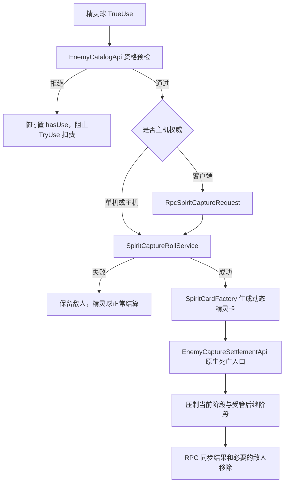

# 精灵球捕获与精灵召唤

> 实现基线：2026-07-13  
> 作用域：当前冒险、战斗内捕获、动态卡持久化、投影位召唤、单机与联机同步

## 1. 模块定位

精灵系统由三个彼此解耦的对象组成：

1. `精灵球` 是公开卡牌，只负责选中敌人、进行捕获检定并发起捕获结算。
2. `精灵卡` 是捕获成功后生成的动态 DataConfig，保存敌人身份、文本和动画快照，可进入保险箱。
3. `精灵` 是精灵卡在战斗中召唤出的行动实体。它与精灵球没有运行时引用；被另一只精灵换下时，仅通过身份快照重新生成对应的战斗内精灵卡。

这一区分保证捕获、卡牌持久化和战斗召唤可以独立演化，不把敌人对象、卡牌实例和召唤物生命周期绑在一起。

## 2. 当前规则

| 规则 | 当前实现 |
| --- | --- |
| 精灵球 | 1 费、稀有度 3、`Retain,Annihilation`；初始化时写入 `Vars["NeedRemove"]="True"`，打出后无论捕获成功或失败都移出本场冒险 |
| 精灵球卡面 | 保留 `CardSource512/MoreDimension/spirit_ball.png` 作为 512×512 源图；运行时 `MoreDimension/spirit_ball.png` 缩放为 256×256 |
| 精灵卡 | 0 费动态衍生牌、`Retain,Burnout`；每次被换下后，其战斗内回手卡耗费+1 |
| 可捕获对象 | 只要目标是存活敌人、图鉴未锁定、存在 `Animation/Dict` 且存在 `Animation/Idle` |
| 敌人类型 | 首领、剧情敌人、召唤物和其他 MOD 敌人不按类别排除 |
| 捕获概率 | `10% + 已损失生命百分比 * 0.8`，最高 90% |
| 捕获失败 | 精灵球正常消耗，敌人不变 |
| 捕获成功 | 先生成精灵卡，再执行敌人正常死亡/败退入口，最后保证当前阶段离场 |
| 多阶段敌人 | 捕获当前阶段；同步生成的下一阶段按捕获结算配置压制，不继续进入后续阶段 |
| 召唤位置 | 与投影共用同一位置；投影存在时精灵不可召唤，精灵存在时可被另一只精灵替换 |
| 精灵意图 | 按敌人 profile 使用独立意图池；未配置对象回退到投影通用意图池 |
| 存续范围 | 精灵卡在本场冒险中存在，可借助原生保险箱保存动态 `RawData`；召唤实体只存在于当前战斗 |

## 3. 捕获资格

`EnemyCatalogApi.Inspect` 是唯一资格判定入口。当前判定顺序为：

1. `fatherObject` 必须是 `Enemy`，且当前生命大于 0、状态不是 `Dead`。
2. 读取当前敌人 DataConfig 的 `Id` 与 `Animation`。
3. 通过 `GameRuntimeData.IsLocked(enemyId)` 对齐图鉴敌人页的可见条件。
4. 使用 `ResourceLoader.LoadAll<Sprite>(Animation + "/Dict")` 验证图鉴图片。
5. 使用 `ResourceLoader.LoadAll<Sprite>(Animation + "/Idle")` 验证召唤所需待机动画。

因此“图鉴中出现”在实现中严格表示“图鉴未锁定并且具备图鉴图”；仅有敌人数据但 `/Idle` 缺失时仍然不可捕获。

对应宿主证据：

- `DictionaryUI.TotalCreateItem` 从 `DataType.Enemy` 取行，并过滤 `!GameRuntimeData.IsLocked(x["Id"])`。
- `EnemyManager.AddEnemy(string)` 从 `DataType.Enemy` 构造敌人。
- `EnemyItem` 与战斗表现分别依赖敌人动画目录中的图鉴图和动作图。

## 4. 捕获事务



### 4.1 概率与确定性

`SpiritCaptureRollService` 使用基点计算，避免浮点边界差异：

```text
missingHpBasisPoints = 10000 - currentHp / maxHp * 10000
chanceBasisPoints = clamp(1000 + missingHpBasisPoints * 0.8, 1000, 9000)
```

随机值由战斗 epoch、目标状态 id、卡牌或网络 token 组成种子，再通过稳定 FNV 混合生成。联机客户端不自行决定结果，主机产生唯一结果并广播。

### 4.2 原生死亡与阶段终止

`EnemyCaptureSettlementApi` 将捕获解析上下文限制在同步调用栈内，然后：

1. 将目标生命设为 0，并优先调用 `StatusManager.CheckDead(true)`。
2. 保留 `BeforeDead`、`Dead`、`OnEnemyDead`、`Enemy.DeadEffect` 和游戏胜利检查链。
3. 若复活、剧情脚本或兼容差异让目标仍在敌人列表中，则执行受控移除。
4. Hook `EnemyManager.AddEnemy`，识别死亡调用栈内新增的下一阶段。
5. `AdaptedTerminal` 对首领级 profile 终止同步后继；`GuardedTerminal` 在单敌替换场景终止后继。
6. 联机时通过 `RpcSpiritEnemySuppressed` 让客户端移除同一后继敌人。

宿主 `StatusManager.EnemyDead` 的顺序是：从 `enemyList` 移除、触发 `OnEnemyDead`、执行 `Enemy.DeadEffect`、在敌人数为 0 时尝试 `TrySpawnNextWheelEnemy`，最后进入 `FightUI.CanWin`。捕获结算按这个顺序插入阶段压制，而不是跳过整条死亡链。

## 5. 动态精灵卡与保险箱

`SpiritCardFactory` 从隐藏模板 `*spirit_card_template` 创建运行时 DataConfig。宿主 `DataConfig.data` 是只读基础配置；工厂把下列动态覆盖写入可写的 `Vars`：

- 动态名称 `精灵·{敌人名}` 和描述 `召唤一只{敌人名}`；
- 敌人的 `Dict` 卡面、`Idle` 动画路径；
- 原敌人 id、variant id、来源 MOD id；
- 捕获时间、捕获来源、唯一 spirit uid；
- 原敌人卡表快照和 profile 版本；
- 精灵卡运行标记 `TerriasSpiritCard`。
- 战斗内轮换次数 `TerriasSpiritExchangeCount`，并以同值写入回手卡的 `TotalExCost`。
- 精灵意图回合 `TerriasSpiritIntentTurnIndex` 和意图冷却表 `TerriasSpiritIntentReadyOnTurn`；被换下后随回手卡保存在 `Vars`，再次召唤时恢复。

创建流程先形成运行时展示快照，再由 `CardGrantRequest.WithRuntimePresentation` 将名称、描述和图标合成进最终新建的只读 `DataConfig`；它不会修改任何已经存在的 `data` 字典。相同展示值及其余身份字段仍写入 `Vars`，因此原生卡牌界面、提示和使用记录可以立即读取动态文本，自定义召唤逻辑也继续以 `Vars` 为运行时数据源。

捕获成功时，同一个动态 DataConfig 会同时进入当前战斗的手牌系统和 `RoleTable.cardList` 冒险卡组。精灵被换下时则调用独立的战斗内回手入口，只写入当前战斗手牌，绝不重复写入 `RoleTable.cardList`。持久化时先复制最终只读 `data`，再叠加 `Vars` 中的动态覆盖；合并结果序列化为 JSON、GZip 压缩并放入 `Vars["RawData"]`。读取精灵身份和轮换次数时优先读取 `Vars`，缺失时回退到 `data`。

`SpiritCardFaceRuntime` 通过统一的 `TerriasCardPresentationRouter` 在战斗卡牌、图鉴式展示和保险箱展示中尝试加载敌人 `Dict` 精灵图。资源失效时保留 `spirit_ball.png` 作为可见回退；这只是卡面 fallback，不会把精灵卡重新绑定到精灵球的捕获逻辑。

## 6. 精灵召唤与共享投影位

`CompanionPositionOwnershipService` 同时查询 `ProjectionStateStore` 和 `SpiritStateStore`。投影与精灵不占用原生友方角色槽，也不进入 `RoleStatusMap`，但同一玩家只能拥有一个附着实体。投影占位仍为硬阻塞；精灵占位由 `SpiritSummonService` 解释为可轮换状态。

召唤链为：

1. `SpiritSummonService.CanSummon` 检查战斗状态、动态快照、`Idle` 资源和共享位置。
2. 从 `Model/player` 创建与投影相同结构的表现宿主。
3. `SpiritOtherObj` 建立内部 `StatusManager`、行动卡和 `CompanionBattleState`。
4. `SpiritAttachmentPresenter` 复用 `ProjectionVisualProxy`，把敌人待机图挂到玩家的投影位置。
5. `ProjectionTurnCoordinator` 把投影和精灵合并进同一友方附着单位行动序列。
6. 若已有精灵，权威端生成新精灵后通过 `SpiritStateStore.Withdraw` 将旧精灵非死亡式换下，并只向所属玩家发放耗费+1的战斗内精灵卡。
7. 战斗结束、逃跑、胜利、失败或实体死亡时，由 `SpiritStateStore` 清理状态、UI 记录和 Unity 对象。

精灵不是原生正式友方目标。它的内部状态用于脚本、自身资源和意图结算，敌方威胁仍经 `CompanionThreatService` 映射到所属玩家。

## 7. 独立意图池

`Terrias/spirit.intent.registry.json` 已升级为 schema 3，当前生成 59 个显式 profile、54 个 PvE 复合意图和 12 个 PvP 预留意图，共覆盖 68 张来源敌人卡，没有未分类来源。每张可适配的原敌人卡只对应一个 PvE 意图；原卡中的伤害、护盾、治疗和多个安全 Buff 作为该意图的 `effects` 顺序锁定、展示并执行。

### 7.1 统一身份解析

敌人运行时 DataConfig 的 `Id` 与注册表使用的稳定 id 并不总是相同。例如游戏主体编号 `10026` 在战斗对象上会表现为 `enemy_10026`，日耀敌人的完整运行时 id 则可能表现为 `Terrias_terrias_boss_orbit_mirror_array`。精灵卡必须保存运行时原始 id，才能继续完成敌人数据、动画资源、旧卡和联机快照的读取；注册表则需要使用稳定 id，避免配置绑定到宿主生成前缀。

`SpiritProfileIdentityResolver` 因而只在 profile 查找边界做身份解析，不改写 `CapturedEnemySnapshot.EnemyId`、`VariantId`、`RawData` 或 RPC 数据。捕获注册表与意图注册表共用以下固定顺序：

1. 原始敌人 id 与原始 variant 精确匹配；
2. 对已知运行时前缀生成安全别名，再尝试精确匹配；
3. 原始敌人 id 匹配 `variantId="*"`；
4. 已知别名匹配 `variantId="*"`；
5. 最后才使用 `*#*` 全局兼容 profile。

当前只识别两个明确前缀：游戏主体的 `enemy_` 与日耀的 `Terrias_terrias_`。不会对未知 MOD id 做任意下划线截断或后缀猜测，防止两个 MOD 的同名敌人错误共享 profile。如果配置未来显式加入完整原始 id，它会优先于别名命中。

该解析发生在每次捕获结算和精灵召唤的配置读取阶段，因此此前已经保存为 `enemy_10026#enemy_10026` 的旧精灵卡无需迁移；重新召唤时会自动命中 `10026#*` 的专属意图池。敌人来源 MOD 判定也同步修正：`enemy_` 被归类为 `BaseGame`，不再误记为名为 `enemy` 的 MOD。

日志会输出 `[SpiritProfile] capture resolve` 或 `[SpiritProfile] summon resolve`，包含 `raw`、`matched`、`kind`、池数量和注册表 hash。正常的本体前缀转换应显示 `kind=alias-enemy-wildcard`；只有真正没有显式配置的对象才显示 `kind=global-fallback`，并提升为一次性警告。

### 7.2 Profile 内容

每个 profile 分别保存：

- `pveAttackTendency`、`pveDefenseTendency`：当前战斗实际使用的安全适配意图；
- `pvpAttackTendency`、`pvpDefenseTendency`：塞牌、卡组和货币交互的未来 PvP 预留；
- `fallbackAttackTendency`、`fallbackDefenseTendency`：无法安全还原时使用的投影通用后备；
- `pvpSourceEnemyCardIds`、`fallbackSourceEnemyCardIds`：显式分类证据。

精灵使用原敌人卡的视觉数据进行意图展示，但 `SpiritOtherObj` 会复制来源配置并覆写 `InitScript`、`TargetScript`、`UseScript`，实际效果只由精灵白名单处理器执行。原敌人脚本不会直接运行，因此不会把塞牌、生成敌人、阶段切换或 BOSS 全局状态机带入精灵行动。

意图卡的数值展示不再运行原生敌人 `InitScript` 重新推导。权威端生成 `CompanionIntentPlan.ResolvedEffects` 后，展示层以每段效果的执行基础值和已提交目标计算原生伤害/护盾预览，再按 `displayIndex` 写入 `DesVal1`、`DesVal2` 等占位符；日志同时记录 `DesVal` 与 `/base=`，明确区分最终预览值和执行基础值。图标主数值读取 `DesVal1`，描述中的 `{0}`、`{1}` 与执行链使用同一份锁定计划。投影与精灵共用意图线绑定器：单体敌对效果优先连向已提交的敌方目标，纯友方单体效果连向已提交的友方目标，Self 与 All 不显示误导性的单体线；刷新、轮换和退场都会先清除旧线。

无法安全适配的 `Charge1`、`Charge2`、`Come`、`Wake`、`WhereverYouGo` 使用通用攻击/防御后备。给对方塞牌、修改卡组或货币的 12 项来源进入不可执行的 `pvp.reserved` 处理器，当前 PvE 选择器不会选择这些意图。

完整设计、逐项数值、日耀 BOSS 省略项和测试清单见：[09-DPS 伤害归属与精灵专属意图池](./09-DPS伤害归属与精灵专属意图池.md)。

## 8. 联机协议

| RPC | 方向 | 用途 |
| --- | --- | --- |
| `RpcSpiritCaptureRequest` | 客户端到主机 | 提交 owner、目标和去重 token，不提交客户端随机结果 |
| `RpcSpiritCaptureState` | 主机到客户端 | 返回概率、检定结果和捕获快照；只有所属客户端生成精灵卡 |
| `RpcSpiritEnemySuppressed` | 主机到客户端 | 同步受控移除的阶段后继 |
| `RpcSpiritSummonRequest` | 客户端到主机 | 请求使用动态快照、轮换计数、意图回合和冷却表召唤或替换精灵 |
| `RpcSpiritCompanionState` | 主机到客户端 | 同步精灵身份、代际、意图、魔力、威胁、回合 revision、冷却表和一次性回手事件 |

服务器请求使用 `ITerriasServerBoundRpcCommand` 绑定真实 sender，并校验房间成员、owner 状态、战斗 epoch、协议版本、轮换计数范围、冷却表边界和注册表 hash。当前精灵协议版本为 6；冷却表最多 128 项，回合值范围为 0..10000。每位拥有者的精灵代际单调递增，客户端忽略旧代际状态，避免延迟包把已换下的精灵重新覆盖回来。回手事件使用独立 event id 去重，只有所属玩家生成卡牌；执行器暂不可用时保留到下一玩家回合重试。请求 token、代际和回手去重表均在战斗边界清空。

## 9. 性能热点记录

当前阶段只记录耗时，不改变同步事务、资源加载和回合执行模型。`TerriasPerfCounters` 启用时，所有测量进入十秒聚合摘要；每个测量点的首个样本输出 `[PerfHotspot]`，超过 8ms 的后续样本继续以警告输出。

| 记录名 | 覆盖节点 |
| --- | --- |
| `Spirit.Catalog.Inspect` | 一次完整捕获资格检查 |
| `Spirit.Catalog.DictProbe` / `IdleProbe` | 图鉴图和待机动画资源探测 |
| `Spirit.CardFace.Load` | 动态精灵卡首次加载敌人 `Dict` 卡面 |
| `Spirit.Card.GrantToHand` | 动态 DataConfig、RawData，以及捕获入冒险卡组或轮换仅回手的分流 |
| `Spirit.Capture.Settlement` | 原生死亡链、阶段压制和兼容移除 |
| `Spirit.Summon.CanSummon` / `IdleProbe` | 召唤资格与来源动画检查 |
| `Spirit.Summon.Spawn` | 模型实例化、精灵初始化和状态注册 |
| `Spirit.Intent.Plan` | 精灵独立意图的选择、目标解析和效果锁定 |
| `Spirit.Intent.PresentationBuild` | 来源卡展示模板复制、脚本适配和行动卡构造 |

意图注册表 hash 与意图 id 索引在加载时一次性生成，来源敌人卡的只读展示模板也按卡 id 缓存；每轮只复制可写字典和写入计划值，避免反复序列化整份注册表或重复读取同一 DataConfig。日志中的 `elapsedMs`、enemy/status/path、成功状态和来源用于继续定位首次资源加载、召唤构造或结算链中的真实热点。

## 10. 文件归属

| 层 | 主要文件 |
| --- | --- |
| 内容数据与卡面 | `Terrias/Data/Card/terrias.csv`、`Terrias/Text/Card/terrias.csv`、`Terrias/ModResource/Images/Card/MoreDimension/spirit_ball.png` |
| 配置 | `Terrias/spirit.intent.registry.json`、`Terrias/spirit.capture.registry.json` |
| 脚本入口 | `Scripting/CardScripts.cs` |
| 宿主适配 | `GameApi/EnemyCatalogApi.cs`、`GameApi/EnemyCaptureSettlementApi.cs` |
| 捕获业务 | `SpiritCaptureService`、`SpiritCaptureRollService`、`SpiritCardFactory`、`SpiritCaptureRegistry`、`SpiritProfileIdentityResolver` |
| 召唤业务 | `SpiritSummonService`、`SpiritOtherObj`、`SpiritStateStore`、`CompanionPositionOwnershipService` |
| 意图业务 | `SpiritIntentRegistry`、`CompanionIntentResolver`、通用 Companion intent 执行链 |
| Hook/表现 | `SpiritRuntime`、`SpiritAttachmentPresenter`、`SpiritCardFaceRuntime` |
| 网络 | `RpcSpiritCapture.cs`、`RpcSpiritCompanion.cs`、`RpcSpiritEnemySuppressed.cs` |

## 11. 验证重点

- 资格边界：图鉴锁定、`Dict` 缺失、`Idle` 缺失、死亡敌人均拒绝且不扣费。
- 概率边界：满血 10%，半血 50%，空血附近 90%，不超过上下限。
- 事务顺序：精灵卡创建失败时不移除敌人；捕获失败不产生卡。
- 阶段边界：单敌轮换和首领后继不继续，普通死亡事件仍执行。
- 持久化：精灵卡放入保险箱再取出后，名称、卡面、敌人 id 和召唤能力保持。
- 身份解析：`enemy_10026#enemy_10026` 旧卡命中 `10026#*`；日耀完整 id 命中短 id；未知 MOD 敌人只进入 `*#*`，原始精确配置始终优先。
- 位置互斥：先有投影时精灵卡不可用，先有精灵时投影不可召唤。
- 轮换：A(0)→B 时只把 A(1)加入手牌；后续再次换下 A 时得到 A(2)，且 `RoleTable.cardList` 数量不增长。
- 冷却继承：A 使用高冷却意图后被 B 换下，再次召唤 A 时必须恢复离场前的 `TurnIndex` 与 `ReadyOnTurn`，不能刷新冷却。
- 退场语义：主动换下不执行 `DeadEffect`；死亡和战斗结束不返还精灵卡。
- 行动次数：同一玩家的共享附着槽每回合最多行动一次，轮换不会刷新行动权。
- 联机：客户端不自行检定，重复 token/event id 不重复捕获或回手，旧代际状态不会覆盖新精灵，主机和客户端的精灵意图及冷却状态一致。
