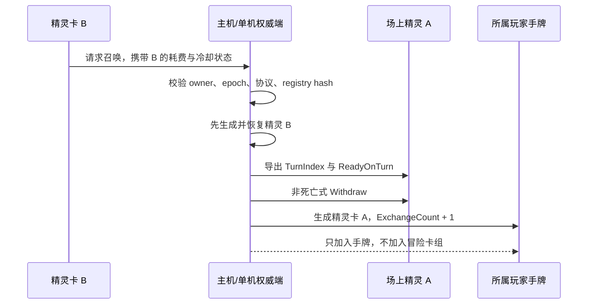

# DPS 伤害归属与精灵专属意图池

> 实现基线：2026-07-13
> 涉及模组：`AuraToolsExp`、`Terrias`
> 作用域：伤害来源归属、冒险结算、结算 CG、精灵轮换、意图冷却继承、PvE/PvP 意图隔离
> 关联文档：[08-精灵球捕获与精灵召唤](./08-精灵球捕获与精灵召唤.md)

## 1. 文档目的

本文记录 2026-07-13 功能测试后完成的两组开发：

1. 修复 DPS 模块把敌人、未知来源和召唤物错误显示为独立玩家的问题。
2. 为精灵建立区别于投影的轮换机制与专属意图池，并完整保留换下精灵的意图冷却状态。

本文同时作为后续实机测试、数值调整、PvP 扩展和问题回溯的实现基线。若后续代码行为与本文不一致，应优先确认注册表版本、联机协议版本和发布 DLL 是否已经重新生成。

## 2. 本轮最终规则

### 2.1 DPS 与结算

- 精灵、投影等具有明确拥有者的召唤物，其伤害归属于召唤它们的玩家及当前角色。
- 战斗内原始伤害记录可以保留敌人和未知来源，用于调试、审计与日志分析。
- 冒险结算、队伍总伤害、MVP 和结算 CG 只统计真实玩家及其对应角色。
- 敌人、未知来源、无角色身份对象和重复玩家身份不得占用结算 CG 排名位置。
- 单人冒险的结算名单最多只能出现一个真实玩家，不会再出现多个同名“洛奈尔”。

### 2.2 精灵轮换

- 投影仍然占用共享投影位置；投影存在时不能召唤精灵。
- 精灵存在时可以使用第二张精灵卡，用新精灵替换旧精灵。
- 被换下的精灵只生成一张对应精灵卡加入当前手牌，不会再次加入 `RoleTable.cardList` 冒险卡组。
- 每次精灵被换下时，该精灵卡的耗费增加 1。
- 被换下精灵的意图回合游标和全部意图冷却随卡保存；再次召唤时继续原冷却，不会因轮换刷新技能。
- 主动换下不是死亡，不执行 `DeadEffect`，也不触发捕获、奖励或敌人死亡语义。

### 2.3 精灵意图

- 精灵不再仅按关键词映射到投影的七项通用意图。
- 当前注册表为 `schemaVersion = 3`，分成 PvE 复合原意图适配池、PvP 预留池和安全后备池。
- PvE 池保留原敌人卡的卡面、图标、特效标识、冷却和优先级信息，但实际效果由精灵专用处理器执行。
- 给对方塞牌、修改对方卡组或货币的效果只进入 PvP 预留池，当前 PvE 战斗不会执行。
- 召唤敌人、阶段唤醒、全局复制等无法安全还原的效果进入后备池。

## 3. DPS 异常的根因

测试日志中，单人结算出现两个额外“洛奈尔”，真实玩家反而排在第三位。对应的实际伤害来源是 `e0`、`e1` 等敌人实例，并不是真实玩家。

旧实现把 `TempDataManager.RoleStatusMap` 当作友方阵容来源。这个表实际是身份与状态路由表，其中可能同时出现：

- 玩家状态；
- 变身或控制状态；
- 敌人状态；
- 临时战斗对象；
- 其他用于同步和归属查找的实例。

因此，“出现在 `RoleStatusMap` 中”不能推出“该对象是真实玩家”。旧流程把表中所有状态都标记为友方，再使用已知玩家显示名覆盖其名称，最终造成以下连锁错误：


问题并不在伤害值本身，而在“战斗对象身份”和“真实玩家阵容”被混用。

## 4. DPS 归属模型

### 4.1 三类身份来源

修复后的 DPS 模块明确区分三类信息：

| 信息 | 权威来源 | 用途 |
| --- | --- | --- |
| 真实玩家阵容 | 冒险开始时捕获的玩家/角色快照、`FightManager.roleQueue`、`FightPlayer.Instance.Status` | 结算、MVP、CG、玩家显示名 |
| 敌人阵容 | `EnemyManager.enemyList`、敌人 `fatherObject` 类型 | 敌我判定、原始伤害记录 |
| 召唤物归属 | 召唤物公开的 `OwnerPlayerId`、`OwnerStatusId` | 把精灵/投影伤害折叠到拥有者 |

`RoleStatusMap` 不再参与 DPS 阵营索引。

### 4.2 伤害来源归属顺序

主机在确认伤害事件、写入战斗账本之前，按以下顺序解析来源：

1. 根据 `SourceInstanceId` 查找当前 `IStatusManager`。
2. 检查对象是否属于 `EnemyManager.enemyList`，或其 `fatherObject` 类型是否为敌人。
3. 若为敌人，优先认定为 `DamageTeam.Enemy`，不会被玩家别名覆盖。
4. 通过通用反射读取 `fatherObject.OwnerPlayerId` 与 `fatherObject.OwnerStatusId`。
5. 如果拥有者能匹配冒险开始时捕获的真实玩家快照，将来源实例改写为该玩家的规范实例 id，并使用对应角色显示名。
6. 没有明确拥有者的对象保持原来源；无法确认阵营时保留为 `Unknown`。

该实现不会让 `AuraToolsExp` 编译依赖 `Terrias`。AuraTools 只识别通用的拥有者公开属性，因此未来其他模组的召唤物只要提供相同所有权字段，也可以接入同一归属链。

### 4.3 召唤物伤害示例

假设玩家 `P1` 使用洛奈尔，拥有状态 `role-lonaire`，召唤精灵 `ss3`：

| 事件阶段 | SourceInstanceId | 显示对象 | 归属 |
| --- | --- | --- | --- |
| 客户端候选事件 | `ss3` | 精灵自身 | 尚未确认 |
| 主机解析拥有者 | `OwnerPlayerId=P1`、`OwnerStatusId=role-lonaire` | 洛奈尔 | 明确玩家 |
| 战斗账本入账 | `role-lonaire` | 洛奈尔 | `Friendly` |
| 冒险结算 | `role-lonaire` | 洛奈尔 | 合并进玩家总伤害 |

精灵的卡牌明细仍可作为伤害详情保存，但不会在玩家排行榜中另占一行。

### 4.4 原始账本与结算账本

敌人和未知来源并未从底层伤害诊断中删除。修复只限制对外结算名单：

| 数据层 | 是否保留敌人/未知来源 | 原因 |
| --- | --- | --- |
| 当前战斗原始事件 | 保留 | 便于定位反伤、环境伤害、脚本来源和异常归属 |
| 战斗聚合 Combatants | 保留 | 维持完整审计能力 |
| 冒险结算 TeamMembers | 不保留 | 这里只表示真实玩家队伍 |
| 队伍总伤害、MVP | 不保留 | 只在真实玩家集合中计算 |
| 结算 CG | 不保留 | 只展示真实玩家和对应角色 |

### 4.5 结算过滤条件

`OutOfRunDamageHistoryBuilder` 不再把所有 `Friendly` 战斗对象自动追加为队员，而是只消费请求中已经捕获的真实玩家列表。

结算 CG 还会执行第二层防御：

- 必须存在非空 `PlayerId`；
- 必须存在非空 `RoleId`；
- 按 `PlayerId` 去重；
- 同一玩家存在多个候选项时保留伤害最高且实例 id 排序稳定的一项；
- 最后再按总伤害、DPS、角色名和玩家 id 排序。

## 5. 精灵轮换状态模型

### 5.1 为什么冷却必须属于精灵卡

如果换下精灵时只保存敌人身份和耗费，不保存冷却，玩家可以通过以下方式刷新高冷却意图：

```text
精灵 A 使用高冷却意图 → 召唤精灵 B 换下 A → 重新使用 A → A 的冷却归零
```

这与“换下的是同一只精灵”不符，也会让轮换成本失去约束力。因此冷却状态必须跟随精灵卡，而不是只存在于场上的 `CompanionBattleState`。

### 5.2 保存字段

战斗内状态只写入可写的 `Vars`，不修改 `IDataConfig.data`：

| Vars 键 | 内容 | 示例 |
| --- | --- | --- |
| `TerriasSpiritExchangeCount` | 累计换下次数，也是当前附加耗费 | `2` |
| `TotalExCost` | 交给宿主卡牌系统读取的附加耗费 | `2` |
| `TerriasSpiritIntentTurnIndex` | 该精灵已经推进到的意图回合 | `4` |
| `TerriasSpiritIntentReadyOnTurn` | `intentId → readyOnTurn` JSON 字典 | `{"intent.a":6}` |

动态展示、捕获快照和上述战斗状态会合并进 `Vars["RawData"]`，用于宿主需要重建动态 DataConfig 的场景；基础 `data` 字典始终只读。

### 5.3 轮换事务



采用“新精灵先生成、旧精灵后退出”的顺序，可以在新精灵生成失败时保留旧精灵，避免玩家因加载失败同时失去两只精灵。

### 5.4 联机同步

精灵召唤协议版本当前为 `6`。`RpcSpiritSummonRequest` 和 `SpiritCompanionSnapshot` 同步：

- 新精灵卡携带的 `TurnIndex` 与 `ReadyOnTurn`；
- 场上精灵当前回合、revision 和冷却表；
- 被换下精灵的 `ReturnedTurnIndex` 与 `ReturnedReadyOnTurn`；
- 换卡代际 `Generation`；
- 一次性回手事件 `CardGrantEventId`。

主机限制冷却表最多 128 项，回合值和 ready 值范围为 `0..10000`，意图 id 长度不超过 160。无效状态不会被广播回其他客户端。客户端按事件 id 去重，并忽略旧代际快照。

## 6. 精灵专属意图池结构

### 6.1 注册表版本

配置文件：`Terrias/spirit.intent.registry.json`

逐个敌人、逐张原始意图卡的中文名、原描述及捕获后实际适配结果，见[游戏主体敌人与精灵专属意图总表](./10-游戏主体敌人与精灵专属意图总表.md)。

当前结构为：

```json
{
  "schemaVersion": 3,
  "intents": [],
  "profiles": []
}
```

当前生成结果：

| 项目 | 数量 |
| --- | ---: |
| 显式敌人 profile | 59 |
| 原敌人卡来源 | 68 |
| PvE 复合意图 | 54 |
| 具有 PvE 适配的来源卡 | 54 |
| PvP 预留意图 | 12 |
| 明确后备来源 | 5 |
| 未分类来源 | 0 |

每张具有安全适配的原卡只生成一个 PvE 复合意图。原卡的伤害、护盾、治疗和多个安全 Buff 存入同一意图的 `effects`；例如 `specialAttack` 的伤害与护盾不再作为两次独立抽取，`CAR_Shield` 的坚毅与活力也会在一次行动中一并执行。部分原卡仍可同时拥有 PvP 预留项，例如 `VenomSpray` 在 PvE 中保留安全伤害，在 PvP 池中预留塞牌行为。

### 6.2 Profile 字段

每个敌人 profile 保存：

- `sourceEnemyCardIds`：原敌人的完整卡表快照；
- `pveAttackTendency`、`pveDefenseTendency`：当前 PvE 可选择意图；
- `pvpAttackTendency`、`pvpDefenseTendency`：未来敌对玩家环境使用的预留意图；
- `fallbackAttackTendency`、`fallbackDefenseTendency`：无法选择安全适配时的通用后备；
- `pvpSourceEnemyCardIds`：被识别为卡组、塞牌或货币交互的来源卡；
- `fallbackSourceEnemyCardIds`：不能安全适配的来源卡；
- 攻防倾向权重和精灵属性倍率。

当前运行环境只请求 `SpiritIntentPool.Pve`。PvP 池虽然完成数据登记和验证，但在建立权威的敌对玩家、手牌区、抽牌堆和货币接口之前不会进入选择器。

### 6.3 运行时身份与注册表身份

精灵卡持续保存敌人在战斗中的原始 `EnemyId` 和 `VariantId`，不会为了命中意图配置而改写存档数据。统一解析器在读取捕获 profile 和意图 profile 时，将明确的运行时前缀映射为稳定配置 id：

| 原始运行时身份 | 配置候选 | 预期结果 |
| --- | --- | --- |
| `enemy_10026#enemy_10026` | `10026#10026`、`10026#*` | 命中游戏主体敌人 `10026` 的专属池 |
| `10026#10026` | `10026#10026`、`10026#*` | 兼容直接保存稳定 id 的数据 |
| `Terrias_terrias_boss_orbit_mirror_array#同值` | `boss_orbit_mirror_array#同值短名`、`boss_orbit_mirror_array#*` | 命中日耀敌人的短 id profile |
| 未知 MOD 完整 id | 仅原始精确、原始敌人通配、`*#*` | 不进行危险的任意后缀猜测 |

命中优先级保证“原始精确配置”高于“别名配置”。因此 MOD 作者仍可为完整运行时 id 提供专用 profile，而历史精灵卡也可以在不迁移 `RawData`、不提升联机协议版本的情况下自动恢复专属意图。

召唤日志中的 `kind` 用于验证实际路径：`exact` 表示原始精确命中，`alias-exact` 表示别名精确命中，`enemy-wildcard` / `alias-enemy-wildcard` 表示敌人级 profile，`global-fallback` 才表示使用通用意图池。日志同时打印匹配后的 profile、PvE/后备池数量与注册表 hash，便于区分身份错误、配置缺项和发布文件不同步。

### 6.4 安全执行边界

精灵会使用原敌人卡 id 创建展示卡，以保留原卡的图标、底图、特效标识和动作信息。但 `SpiritOtherObj` 会先复制来源 DataConfig，再把三段脚本强制替换为：

- `ProjectionScripts.InitAction`；
- `ProjectionScripts.Target`；
- `ProjectionScripts.UseAction`。

因此原敌人卡的 `InitScript`、`TargetScript` 和 `UseScript` 不会由精灵直接执行。真正的数值效果来自已经锁定的 `CompanionIntentPlan.ResolvedEffects`，再由白名单处理器执行。

该边界尤其用于阻止以下原生副作用泄漏到精灵：

- 新增敌人或阶段切换；
- 给玩家卡组塞牌；
- 修改货币；
- 复制全场 Buff；
- BOSS 全局状态机、冠冕、名字和剧情条件；
- 依赖敌人自身对象结构的脚本。

### 6.5 当前处理器

| Handler | 效果 | 允许目标 |
| --- | --- | --- |
| `damage.single` | 对一个敌人造成一次伤害 | `Enemy/Single` |
| `damage.multi` | 对一个敌人造成多段伤害 | `Enemy/Single` |
| `damage.all` | 对所有敌人造成伤害 | `Enemy/All` |
| `block.single` | 给一个友方目标增加防御 | `Friendly/Single` |
| `block.all` | 给全部真实友方增加防御 | `Friendly/All` |
| `buff.apply` | 给安全目标施加指定 Buff | 已登记目标策略 |
| `heal.single` | 治疗受伤最重的真实友方 | `Friendly/Single` |
| `pvp.reserved` | 只完成配置校验，不产生 PvE 效果 | `OpponentPlayer/Single` |

## 7. schema 2 历史拆分清单（仅用于迁移对照）

本节保留 schema 2 时期“一张原卡拆成多个意图”的旧 ID 与旧表格，只用于排查旧存档、旧日志和配置迁移，不代表当前 schema 3 的选择与执行单位。当前完整清单以自动生成的[游戏主体敌人与精灵专属意图总表](./10-游戏主体敌人与精灵专属意图总表.md)为准；其中每张原卡只有一个 `.intent` PvE ID，多段效果列在同一复合意图内。

### 7.1 表格说明

- “冷却”来自原敌人卡的 `Vars["CD"]`。
- “优先级”来自原敌人卡的 `Vars["priority"]`。
- 普通单体伤害统一适配为 `2 + 精灵攻击×0.8`。
- 普通多段伤害统一适配为每段 `2 + 精灵攻击×0.35`，段数保留原意图循环次数。
- 普通防御统一适配为 `4 + 精灵护甲×0.8`。
- 原敌人“Self”效果不会施加给内部 1 HP 附着状态；防御和正向 Buff 重定向给拥有者。
- 原自我治疗改为治疗真实友方中受伤比例最高的角色。

### 7.2 逐项清单

| 原敌人卡 | 精灵适配效果 | 目标策略 | 冷却 | 优先级 |
| --- | --- | --- | ---: | ---: |
| `enemycard_burn` | 施加 `buff_burn` ×4 | `Enemy/Single/enemy.lowest_hp` | 1 | 3 |
| `enemycard_burn1` | 施加 `buff_burn` ×3 | `Enemy/Single/enemy.lowest_hp` | 3 | 4 |
| `enemycard_burn2` | 施加 `buff_burn` ×6 | `Enemy/Single/enemy.lowest_hp` | 3 | 3 |
| `enemycard_CAR_Hammer` | 单体防御：4 + 护甲×0.8 | `Friendly/Single/friendly.owner_or_self_defense` | 2 | 5 |
| `enemycard_CAR_Hammer` | 单体伤害：2 + 攻击×0.8 | `Enemy/Single/enemy.lowest_hp` | 2 | 5 |
| `enemycard_CAR_Shield` | 施加 `buff_impregnable` ×1 | `Friendly/Single/friendly.owner_or_self_defense` | 2 | 3 |
| `enemycard_CAR_Spear` | 施加 `buff_vulnerability` ×2 | `Enemy/Single/enemy.lowest_hp` | 1 | 4 |
| `enemycard_CAR_Spear` | 单体伤害：2 + 攻击×0.8 | `Enemy/Single/enemy.lowest_hp` | 1 | 4 |
| `enemycard_CAR_Sword` | 单体伤害：2 + 攻击×0.8 | `Enemy/Single/enemy.lowest_hp` | 2 | 8 |
| `enemycard_charmed` | 施加 `buff_timestop` ×1 | `Enemy/Single/enemy.lowest_hp` | 3 | 2 |
| `enemycard_defence` | 单体防御：4 + 护甲×0.8 | `Friendly/Single/friendly.owner_or_self_defense` | 0 | 1 |
| `enemycard_Despair` | 施加 `buff_toxin` ×3 | `Enemy/Single/enemy.lowest_hp` | 1 | 5 |
| `enemycard_Despair` | 单体伤害：2 + 攻击×0.8 | `Enemy/Single/enemy.lowest_hp` | 1 | 5 |
| `enemycard_FallenDragon` | 施加 `buff_extraordinary` ×20 | `Friendly/Single/friendly.owner_or_self_defense` | 3 | 4 |
| `enemycard_fearless` | 施加 `buff_vitality` ×4 | `Friendly/Single/friendly.owner_or_self_defense` | 3 | 2 |
| `enemycard_FiveHit` | 五段伤害：每段 2 + 攻击×0.35 | `Enemy/Single/enemy.lowest_hp` | 2 | 3 |
| `enemycard_foraging` | 单体伤害：2 + 攻击×0.8 | `Enemy/Single/enemy.lowest_hp` | 1 | 3 |
| `enemycard_FullSupport` | 单体防御：4 + 护甲×0.8 | `Friendly/Single/friendly.owner_or_self_defense` | 1 | 1 |
| `enemycard_GiantClawStrike` | 施加 `buff_bleeding` ×2 | `Enemy/Single/enemy.lowest_hp` | 3 | 2 |
| `enemycard_GiantClawStrike` | 单体伤害：2 + 攻击×0.8 | `Enemy/Single/enemy.lowest_hp` | 3 | 2 |
| `enemycard_HighFly` | 单体防御：4 + 护甲×0.8 | `Friendly/Single/friendly.owner_or_self_defense` | 0 | 2 |
| `enemycard_IceShield` | 施加 `buff_cripple` ×2 | `Enemy/Single/enemy.lowest_hp` | 4 | 5 |
| `enemycard_Licking` | 施加 `buff_rotten` ×2 | `Enemy/Single/enemy.lowest_hp` | 2 | 2 |
| `enemycard_LimePowder` | 施加 `buff_oblivion` ×1 | `Enemy/Single/enemy.lowest_hp` | 3 | 3 |
| `enemycard_MakeIneffectiveRays1` | 单体防御：4 + 护甲×0.8 | `Friendly/Single/friendly.owner_or_self_defense` | 4 | 3 |
| `enemycard_MakeIneffectiveRays1` | 施加 `buff_impregnable` ×2 | `Friendly/Single/friendly.owner_or_self_defense` | 4 | 3 |
| `enemycard_MT1` | 施加 `buff_lifelink` ×2 | `Friendly/Single/friendly.owner_or_self_defense` | 3 | 9 |
| `enemycard_MT2` | 施加 `buff_extraordinary` ×10 | `Friendly/Single/friendly.owner_or_self_defense` | 3 | 2 |
| `enemycard_NerveReflexes` | 施加 `buff_frenzy` ×1 | `Friendly/Single/friendly.owner_or_self_defense` | 2 | 2 |
| `enemycard_NeverDead` | 施加 `buff_evergreen` ×5 | `Friendly/Single/friendly.owner_or_self_defense` | 2 | 1 |
| `enemycard_Observe` | 施加 `buff_degrade` ×2 | `Enemy/Single/enemy.lowest_hp` | 3 | 2 |
| `enemycard_obtainMoney` | 单体伤害：2 + 攻击×0.8；货币部分仅在 PvP 池预留 | `Enemy/Single/enemy.lowest_hp` | 2 | 4 |
| `enemycard_OrdinaryFiveHit` | 五段伤害：每段 2 + 攻击×0.35 | `Enemy/Single/enemy.lowest_hp` | 1 | 3 |
| `enemycard_OrdinaryHit` | 单体伤害：2 + 攻击×0.8 | `Enemy/Single/enemy.lowest_hp` | 0 | 1 |
| `enemycard_OverrunWorkouts` | 施加 `buff_keenedge` ×1 | `Friendly/Single/friendly.owner_or_self_defense` | 2 | 2 |
| `enemycard_PoisonThrowing` | 施加 `buff_oblivion` ×1 | `Enemy/Single/enemy.lowest_hp` | 3 | 2 |
| `enemycard_psychologicalShock` | 单体伤害：2 + 攻击×0.8；塞牌部分仅在 PvP 池预留 | `Enemy/Single/enemy.lowest_hp` | 3 | 4 |
| `enemycard_QuadrupleHits` | 四段伤害：每段 2 + 攻击×0.35 | `Enemy/Single/enemy.lowest_hp` | 2 | 2 |
| `enemycard_rejuvenation` | 治疗：4 + 魔力×0.6 | `Friendly/Single/friendly.most_wounded` | 1 | 1 |
| `enemycard_RoyalBarrier` | 单体防御：4 + 护甲×0.8 | `Friendly/Single/friendly.owner_or_self_defense` | 1 | 2 |
| `enemycard_Seduce` | 施加 `buff_vulnerability` ×2 | `Enemy/Single/enemy.lowest_hp` | 1 | 3 |
| `enemycard_Seduce` | 单体伤害：2 + 攻击×0.8 | `Enemy/Single/enemy.lowest_hp` | 1 | 3 |
| `enemycard_specialAttack` | 单体防御：4 + 护甲×0.8 | `Friendly/Single/friendly.owner_or_self_defense` | 2 | 3 |
| `enemycard_specialAttack` | 单体伤害：2 + 攻击×0.8 | `Enemy/Single/enemy.lowest_hp` | 2 | 3 |
| `enemycard_SpreadWings` | 给拥有者施加 `buff_burn` ×1 | `Friendly/Single/friendly.owner_or_self_defense` | 0 | 2 |
| `enemycard_SpreadWings` | 单体伤害：2 + 攻击×0.8 | `Enemy/Single/enemy.lowest_hp` | 0 | 2 |
| `enemycard_SuperFireBall` | 两段伤害：每段 2 + 攻击×0.35 | `Enemy/Single/enemy.lowest_hp` | 2 | 2 |
| `enemycard_Toxin1` | 施加 `buff_toxin` ×3 | `Enemy/Single/enemy.lowest_hp` | 1 | 3 |
| `enemycard_Toxin2` | 施加 `buff_toxin` ×4 | `Enemy/Single/enemy.lowest_hp` | 1 | 2 |
| `enemycard_Toxin3` | 施加 `buff_toxin` ×5 | `Enemy/Single/enemy.lowest_hp` | 1 | 1 |
| `enemycard_Toxin4` | 施加 `buff_toxin` ×5 | `Enemy/Single/enemy.lowest_hp` | 2 | 1 |
| `enemycard_VenomSpray` | 单体伤害：2 + 攻击×0.8；塞牌部分仅在 PvP 池预留 | `Enemy/Single/enemy.lowest_hp` | 3 | 4 |
| `enemycard_vulnerabilityLight` | 施加 `buff_vulnerability` ×3 | `Enemy/Single/enemy.lowest_hp` | 2 | 5 |
| `enemycard_Weak` | 给拥有者施加 `buff_weak` ×1，保持原 Self 语义 | `Friendly/Single/friendly.owner_or_self_defense` | 2 | 2 |
| `enemycard_WeakLight` | 施加 `buff_weak` ×2 | `Enemy/Single/enemy.lowest_hp` | 4 | 2 |
| `enemycard_Witness` | 施加 `buff_impregnable` ×2 | `Friendly/Single/friendly.owner_or_self_defense` | 2 | 2 |
| `Terrias_terrias_enemycard_mirror_calibration` | 对所有敌人施加 `buff_burn` ×5 | `Enemy/All/enemy.all` | 0 | 1 |
| `Terrias_terrias_enemycard_mirror_calibration` | 给拥有者增加 10 防御 | `Friendly/Single/friendly.owner_or_self_defense` | 0 | 1 |
| `Terrias_terrias_enemycard_orbit_refraction` | 单体伤害：8 + 攻击×0.9 | `Enemy/Single/enemy.lowest_hp` | 0 | 1 |
| `Terrias_terrias_enemycard_orbit_refraction` | 施加 `buff_burn` ×10 | `Enemy/Single/enemy.lowest_hp` | 0 | 1 |
| `Terrias_terrias_enemycard_last_day_morning_prayer` | 对所有敌人施加 `buff_burn` ×5 | `Enemy/All/enemy.all` | 0 | 1 |
| `Terrias_terrias_enemycard_last_day_morning_prayer` | 给拥有者施加 `Terrias_terrias_gathered_flame` ×10 | `Friendly/Single/friendly.owner_or_self_defense` | 0 | 1 |
| `Terrias_terrias_enemycard_last_day_noon_burn` | 单体伤害：12 + 攻击×1.0 | `Enemy/Single/enemy.lowest_hp` | 0 | 1 |
| `Terrias_terrias_enemycard_saint_purification` | 单体伤害：10 + 攻击×0.9 | `Enemy/Single/enemy.lowest_hp` | 0 | 1 |
| `Terrias_terrias_enemycard_saint_purification` | 施加 `Terrias_terrias_body_burn` ×2 | `Enemy/Single/enemy.lowest_hp` | 0 | 1 |
| `Terrias_terrias_enemycard_saint_return_to_court` | 单体伤害：9 + 攻击×0.85 | `Enemy/Single/enemy.lowest_hp` | 0 | 1 |

## 8. 日耀 BOSS 意图适配

日耀 BOSS 原意图包含普通伤害之外的全局状态机，必须抽取为可安全执行的局部效果，并合并进同一来源卡的复合意图。

| 原意图 | 当前精灵效果 | 明确省略内容 |
| --- | --- | --- |
| `mirror_calibration` 镜阵校准 | 对所有敌人施加灼烧 5；给拥有者增加 10 防御 | 镜阵自身阶段逻辑 |
| `orbit_refraction` 轨道折射 | 单体伤害 `8 + 攻击×0.9`；单体灼烧 10 | 目标已有灼烧时立即触发灼烧 |
| `last_day_morning_prayer` 晨祷 | 对所有敌人施加灼烧 5；给拥有者施加聚焰 10 | 第二日轮全局阶段联动 |
| `last_day_noon_burn` 正午焚灼 | 单体伤害 `12 + 攻击×1.0` | 灼烧阈值判定、立即触发灼烧、虚弱与残废追加 |
| `saint_purification` 圣女净裁 | 单体伤害 `10 + 攻击×0.9`；躯体燃烧 2 | 清除全部正面 Buff、日耀辉光、圣冕晋升 |
| `saint_return_to_court` 圣女归庭 | 单体伤害 `9 + 攻击×0.85` | 保存名字迁移、无名状态、日耀辉光、圣冕晋升 |

这些省略项不是遗漏，而是安全边界：它们依赖 BOSS 自身阶段、全局剧情状态或跨对象持久变量，直接复用会让精灵意图改变整场战斗规则。

## 9. PvP 预留池

以下 12 项意图已进入 `PvpReserved` 池。它们保留来源卡、冷却和优先级，但处理器为不可执行的 `pvp.reserved`。

| 原敌人卡 | 预留原因 | 冷却 | 优先级 |
| --- | --- | ---: | ---: |
| `enemycard_Dragon'sMajesty` | 向对方卡组加入诅咒牌 | 4 | 2 |
| `enemycard_EvilCurse` | 诅咒/塞牌 | 0 | 2 |
| `enemycard_obtainMoney` | 货币交互；PvE 仅保留伤害 | 2 | 4 |
| `enemycard_OriginalSinCard` | 向对方卡组加入特殊牌 | 2 | 5 |
| `enemycard_PlugCards1` | 塞牌 | 4 | 3 |
| `enemycard_PlugCards2` | 塞牌 | 3 | 2 |
| `enemycard_PlugCards3` | 塞牌 | 3 | 5 |
| `enemycard_PowerlessCurse` | 诅咒/塞牌 | 3 | 2 |
| `enemycard_psychologicalShock` | 伤害并塞牌；PvE 仅保留伤害 | 3 | 4 |
| `enemycard_thief` | 货币交互 | 2 | 5 |
| `enemycard_Thieves` | 货币交互 | 2 | 5 |
| `enemycard_VenomSpray` | 伤害并塞牌；PvE 仅保留伤害 | 3 | 4 |

PvP 池未来启用前至少需要补充：敌对玩家权威识别、对手手牌/抽牌堆/弃牌堆接口、主机校验、目标玩家选择、断线重连恢复和重复事件抑制。未完成这些基础设施前，不允许把 `pvp.reserved` 改成可执行处理器。

## 10. 安全后备池

| 原敌人卡 | 无法直接适配的原因 | 当前处理 |
| --- | --- | --- |
| `enemycard_Charge1` | `UseScript` 为空或只承担敌人行动序列占位 | 使用通用攻击/防御后备 |
| `enemycard_Charge2` | `UseScript` 为空或只承担敌人行动序列占位 | 使用通用攻击/防御后备 |
| `enemycard_Come` | 生成新敌人，改变敌方阵容 | 禁止原脚本，使用通用后备 |
| `enemycard_Wake` | 唤醒 BOSS/阶段对象 | 禁止原脚本，使用通用后备 |
| `enemycard_WhereverYouGo` | 复制全场或目标全部 Buff，边界不可控 | 禁止原脚本，使用通用后备 |

后备攻击为 `staff_tap`，后备防御为 `shield_blessing`。后备池的目的不是伪装成原意图，而是在不能安全执行原语义时保证精灵仍可行动。

## 11. 生成与维护规则

`tools/Generate-SpiritRegistries.ps1` 从本体参考敌人 CSV、Terrias 敌人 CSV和对应 EnemyCard CSV 重新生成注册表。

生成器会：

1. 读取敌人的 `CardList`。
2. 读取原卡的 `InitScript`、`TargetScript`、`UseScript`。
3. 提取原冷却、优先级、攻击段数、防御、治疗和全部可安全识别的 Buff。
4. 根据目标脚本映射到真实敌方、真实友方或拥有者。
5. 把塞牌和货币来源登记进 PvP 池。
6. 把已知全局/阶段意图登记进后备池。
7. 对三个日耀 BOSS 使用显式语义映射。
8. 以“一张来源卡一个 PvE 意图”合并复合效果，并为每段效果分配稳定的 `displayIndex`。
9. 输出稳定排序、UTF-8 编码的 JSON。

新增敌人或改动原卡脚本后，应重新运行生成器，并检查：

- 所有 `sourceEnemyCardIds` 是否都出现在 PvE、PvP 或 fallback 分类并集；
- 新 Buff id 是否真实存在；
- Self 效果重定向给拥有者是否符合设计；
- 是否错误把阶段脚本、塞牌或货币行为放入 PvE；
- 冷却与优先级是否从原卡正确读取；
- 生成后的 profile 数和来源卡数是否符合预期。

## 12. 关键实现文件

| 模块 | 文件 |
| --- | --- |
| DPS 阵营与拥有者归属 | `AuraToolsExp-Dev/Features/DamageMeter/Resolution/DamageMeterFightIndex.cs` |
| 主机伤害事件规范化 | `AuraToolsExp-Dev/Features/DamageMeter/Network/DamageMeterNetworkRuntime.cs` |
| 真实玩家结算 | `AuraToolsExp-Dev/Features/DamageMeter/Model/OutOfRunDamageHistoryBuilder.cs` |
| 结算 CG 过滤 | `AuraToolsExp-Dev/Features/DamageMeter/SettlementCg/DamageSettlementCgPayload.cs` |
| 精灵卡 Vars 与 RawData | `Terrias-Dev/Mechanics/SpiritCardFactory.cs` |
| 精灵轮换与网络状态 | `Terrias-Dev/Mechanics/SpiritSummonService.cs` |
| 精灵展示脚本隔离 | `Terrias-Dev/Mechanics/SpiritOtherObj.cs` |
| 精灵原卡展示与适配器身份合成 | `Terrias-Dev/Mechanics/SpiritIntentPresentationDataComposer.cs` |
| 意图注册表加载 | `Terrias-Dev/Mechanics/SpiritIntentRegistry.cs` |
| 意图白名单处理器 | `Terrias-Dev/Mechanics/CompanionIntentHandlers.cs` |
| 精灵 RPC | `Terrias-Dev/Network/RpcSpiritCompanion.cs` |
| 发布注册表 | `Terrias/spirit.intent.registry.json` |
| 注册表生成器 | `tools/Generate-SpiritRegistries.ps1` |

## 13. 验收清单

### 13.1 DPS

- 单人战斗中，玩家与精灵分别造成伤害，DPS 面板最终只出现一个真实玩家总计。
- 投影造成伤害时，伤害归属于投影拥有者。
- 敌人造成伤害时，原始诊断可以看到敌人，但结算 TeamMembers 和 CG 不出现敌人。
- `unknown` 来源不会被自动包装成“未知玩家”。
- 同一玩家存在状态别名时，结算按 `PlayerId` 去重。
- 四人队伍只显示四名真实玩家，不被召唤物挤占位置。

### 13.2 精灵轮换

- A(0费)→B：A 返回手牌且变为 1 费，冒险卡组数量不增加。
- B→A：B 返回手牌且变为 1 费；A 恢复离场前的回合和冷却。
- 再次换下 A：A 返回手牌且变为 2 费。
- 换下过程中若新精灵生成失败，旧精灵仍然保留。
- 换下不触发死亡、奖励、捕获或返还额外卡牌。
- 联机重复收到同一 `CardGrantEventId` 时只生成一张回手卡。
- 联机旧 `Generation` 快照不能覆盖新精灵。

### 13.3 意图

- 原卡图标和动作表现可见，但不会调用原 `UseScript`。
- 精灵展示卡保留原意图的名称、描述、图标和动作字段，但运行时 `Id` 固定切换为 `Terrias_terrias_enemycard_spirit_intent_adapter`；原卡 Id 只记录在 `Vars["TerriasSpiritIntentSourceCardId"]`，避免游戏按原 Id 复用原生预编译脚本。
- 五连击、四连击等段数与注册表一致。
- 正向 Self Buff 施加给精灵拥有者。
- 敌方减益只能命中存活、未受控的敌人。
- 友方目标只能来自真实友方阵容。
- PvP 预留项不会在 PvE 选择器中出现。
- 后备来源不会生成敌人、唤醒阶段或复制全场 Buff。
- 日耀 BOSS 精灵不会修改圣冕、名字或第二日轮阶段状态。

## 14. 自动化验证基线

当前开发完成时的自动化结果：

- AuraTools DPS 测试：594 项断言通过；
- Terrias C# 测试：245 项断言通过；
- Terrias 架构检查通过；
- 精灵专项检查通过，59 个显式 profile 全部有效；
- Network RPC authority 检查通过；
- Content/tool/shared boundary 检查通过；
- `AuraToolsExp/Scripts/Entry.dll` 与 `Terrias/Scripts/Entry.dll` 已重新生成；
- 两个 C# 发布项目均为 0 警告、0 错误。

建议实机日志至少确认以下记录：

```text
[SpiritIntentRegistry] loaded profiles=59
[ProjectionPlan] committed ... intent=spirit.pve.*
[CompanionIntentPresentation] plan=... values=DesVal1=...,DesVal2=...
[Spirit] intent refreshed ...
[DamageMeter] ... SourceInstanceId=<owner status>
```

若实机仍显示旧的七项投影通用意图，应优先检查 `Terrias/spirit.intent.registry.json` 是否为 schema 3、注册表 hash 是否一致。若实际效果有值但描述仍出现 0，应检查日志是否出现 `CompanionIntentPresentation` 的权威 `DesVal`；若同时出现 `[SpiritIntentPresentationAdapter] binding failed`，说明精灵展示卡没有成功绑定独立适配器身份。最后核对游戏目录内 `Terrias/Scripts/Entry.dll` 及 `Data/EnemyCard/terrias.csv` 是否已经同步为本轮构建产物。
