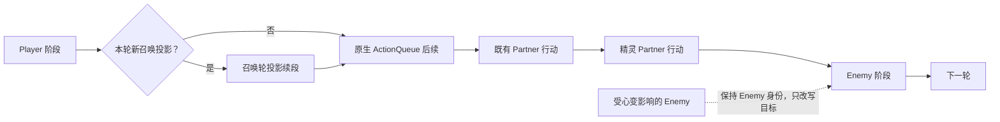
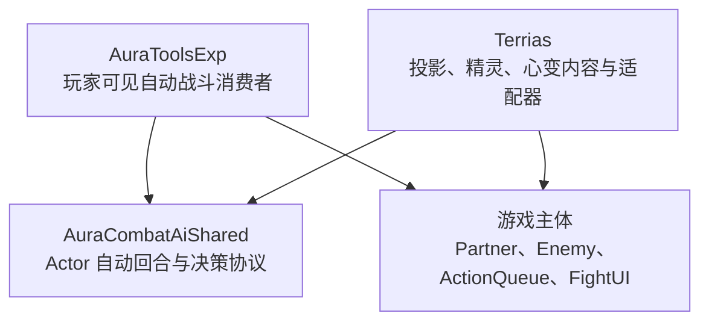
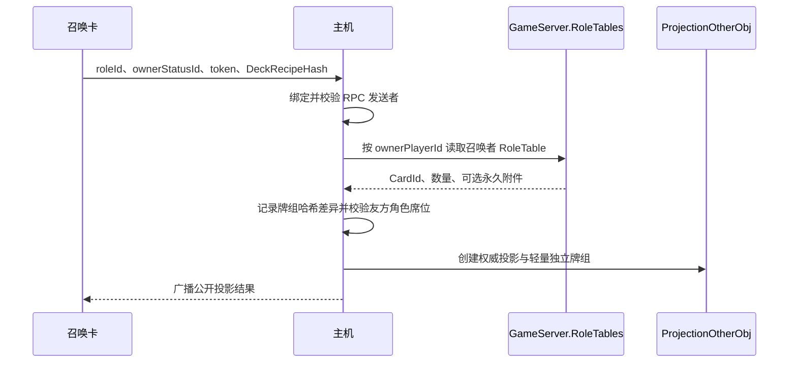

# 投影、精灵与心变机制完整说明

> - 文档状态：当前实现基线（2026-08-25）
> - 适用范围：Terrias、AuraToolsExp、AuraCombatAiShared 以及游戏主体 Partner 战斗流程
> - 伙伴联机协议：`19`
> - 投影牌组模型：`projection-role-deck-v3`

## 1. 文档目的

本文完整说明【投影】【精灵】【心变】在新版战斗流程中的定位、生命周期、行动方式、表现规则和联机边界。

三种机制虽然都可能改变战场上的行动关系，但它们不是同一种“召唤物”实现：

- 【投影】是根据召唤者冒险牌组原始卡牌形成的独立友方 Actor，使用独立牌局自动出牌。
- 【精灵】是与玩家绑定的独立伙伴，拥有自己的属性、资源和意图池。
- 【心变】仍然控制原敌方单位，只修改其下一次原生行动的目标关系。

本文描述当前代码已经实现的行为，不把旧版隐藏回合锚点、独立追加回合或心变代理对象视为有效设计。

## 2. 核心身份对照

| 维度 | 投影 | 精灵 | 心变目标 |
| --- | --- | --- | --- |
| 宿主类型 | `ProjectionOtherObj : Partner` | `SpiritOtherObj : Partner` | 原 `Enemy` |
| 阵营语义 | 独立友方单位 | 独立友方伙伴单位 | 仍是敌方单位 |
| 回合归属 | 原生 `Partner` 阶段 | 原生 `Partner` 阶段 | 原生 Enemy 阶段 |
| 行动来源 | 独立牌局与共享 AI | 独立意图池 | 原敌方卡池 |
| 玩家能否接管 | 不能 | 不能 | 不适用 |
| 意图显示 | 无意图 | 保留伙伴意图 | 保留原敌方意图表现 |
| 正式横向友方槽 | 占用 | 不占用 | 不占用 |
| 画面位置 | 友方横向阵位 | 拥有者右上角固定附着位 | 原敌方位置 |
| 独立生命与属性 | 有，主机从召唤者战斗状态读取核心属性 | 有，来自精灵档案与伙伴属性 | 保留原敌方状态 |
| 联机决策权 | 主机 | 主机 | 主机 |
| 与其他机制共存 | 可与精灵、心变同时存在 | 可与投影、心变同时存在 | 不转化为伙伴 |

这里的“友方”分为两个层次：

- 宿主层：投影和精灵是 `Partner`，心变目标仍是 `Enemy`。
- Terrias 语义层：`CompanionFriendlyRosterService` 将玩家、投影和精灵统一视为真实友方目标；心变目标永远不会被加入该名单。

## 3. 总体战斗流程

`ProjectionTurnCoordinator` 在伙伴生成时将其插入第一个 Enemy 之前，供下一轮及以后由原生队列执行。由于宿主在进入玩家阶段前已冻结本轮 `DOAllAction` 的不可变快照，本轮新投影不能只依赖 live `ActionQueue` 插入。

投影召唤请求通过主机身份、协议和请求一致性校验后，先以召唤 `token` 在当前轮创建
`Reserved` 事务，再读取牌组、占用槽位和生成 Unity Actor。生成完成后事务绑定
`statusId/generation` 并进入 `Ready`；任一失败路径进入 `Failed`。该预留早于实体生成，
所以牌组同步重试、客机请求和玩家结束提交不会越过召唤事务。

所有玩家的结束提交经 `FightManager.UserCode_EndPlayerturn` 到达本机后，协调器只要发现
本轮仍有 `Reserved/Ready` 事务，就将 `FightPlayer.isEnd` 恢复为 false，保持原生
`DOAllAction` 的玩家单元不退出。主机按 `round + order + token` 顺序等待事务就绪并执行
投影 `DoAction()`；客机不自行决策，只等待主机广播的 `Completed/Failed` 版本。所有事务
终结后才释放原生屏障并继续既有 Partner 与 Enemy。该续段不是新回合，不重复触发玩家
阶段，也不补跑既有伙伴；实体生成后的 `fightType` 不再参与召唤轮归属推断。

投影和精灵之间不使用额外隐藏锚点，也不创建另一套 Terrias 私有回合循环。权威事务
快照携带 `battleEpoch/token/round/order/revision/state`，投影公开快照同时携带同一事务身份
用于状态查询修复。重复、过期、倒退或同 revision 冲突的快照均被拒绝。战斗结束、重开
或进入下一轮时清理事务；若开放事务跨轮，会输出常驻错误而不是静默丢弃。

如果两种伙伴同时存在，它们都会处于第一个 Enemy 之前；伙伴之间沿用当前注册到 `ActionQueue` 的顺序，不额外声明固定的“投影先于精灵”或“精灵先于投影”规则。

每个伙伴执行 `DoAction()` 时都会将当前战斗阶段切换为 `FightType.Partner`。这保证依赖宿主阶段判断的事件、动画和行动逻辑看到的是正式伙伴阶段。

## 4. 分层与所有权

### 4.1 共享层负责什么

`AuraCombatAiShared/CombatAgentRuntime.cs` 提供与 Terrias 内容无关的能力：

- `CombatAutoTurnRunner`：自动 Actor 回合状态机。
- `ICombatAgentRuntimePort`：观察、预检、执行、结算和结束回合端口。
- `ICombatAgentDecisionSource`：决策来源边界。
- `CombatActionAutomationRegistry`：无 UI 自动行为能力注册表。
- `CombatAgentFailureScope`：候选、卡牌实例、行动来源和已提交动作的失败隔离范围。

共享层不知道“投影”“精灵”“乌娜”等内容语义，也不直接访问 Terrias 的状态仓库。

### 4.2 Terrias 负责什么

Terrias 负责：

- 创建投影和精灵对象并接入原生 Partner 队列。
- 把投影牌局转换为共享 AI 可以观察的行动候选。
- 在仍有合法 Actor-safe 卡牌时禁止投影主动结束回合。
- 执行投影卡牌并保证效果落在投影自身牌局。
- 规划与执行精灵意图。
- 对心变敌人的原生脚本目标进行重写。
- 管理伙伴显示、死亡清理和联机快照。

### 4.3 AuraToolsExp 负责什么

AuraToolsExp 继续负责玩家可见的自动战斗工具体验。它通过 `player-ui-runtime` 向共享注册表声明玩家 UI 行动能力。

Terrias 通过 `projection-card-runtime` 声明投影的无 UI 卡牌能力。两者是共享层的平级消费者，AuraToolsExp 不依赖 Terrias 内部实现，Terrias 也不调用 AuraToolsExp 的自动战斗控制器。

## 5. Partner 队列、友方名单与位置

### 5.1 队列规则

伙伴生成时执行以下流程：

1. 从 `ActionQueue` 移除同一对象的旧引用，防止重复行动。
2. 查找队列中的第一个 `Enemy`。
3. 将伙伴插入该 Enemy 之前；没有 Enemy 时追加到队尾。
4. 保留所有游戏原生 Partner，不接管或删除其他 MOD 的伙伴。

旧版 `ProjectionTurnAnchorObj` 已删除。当前只保留对陈旧锚点的诊断和清理规则，正常战斗不应再生成锚点。

### 5.2 友方目标规则

Terrias 的真实友方名单包含：

- 宿主 `roleQueue` 中仍存活的玩家角色；
- `FightPlayer.Instance.Status` 兜底玩家；
- 当前存活的投影；
- 当前存活的精灵。

该名单用于伙伴规划、效果目标和心变的有益行动改写。`RoleStatusMap` 只是玩家与状态的归属路由，可能包含敌方状态，因此不能被当作阵营名单。投影和精灵作为合成 `Partner`，必须像宿主 `PatternManager` 创建的原生 Partner 一样，把 status id 唯一注册到实际 `OwnerPlayerId` 对应的列表；该注册只恢复 `ForEachObject/TrySendOnlineEvent` 的原生事件归属，不增加 HUD 行或友方席位。生成、重绑和每次投影出牌前会幂等修复路由，死亡、撤销及战斗清理必须从所有 owner 列表移除该 id。

### 5.3 位置规则

- 投影进入 `CompanionSlotService` 的正式友方横向编队。
- 精灵通过视觉代理附着在拥有者右上角，不参与横向编队重排。
- 心变目标始终停留在原敌方位置，不改变朝向。
- 当前正式友方布局器最多计算 4 个横向显示槽；精灵固定附着位不计入该数量。

## 6. 投影机制

### 6.1 召唤身份与数量限制

每个拥有者同时只能存在一个投影。真实玩家与投影共同占用最多 4 个正式友方角色位置；精灵不进入该席位表。

投影创建后会：

- 注册到 `FightManager.statuses`，使脚本和目标解析可以找到它；
- 注册到 `ProjectionStateStore` 与 `CompanionBattleStateStore`；
- 注册到拥有者的原生 `RoleStatusMap` 事件路由；
- 进入原生 Partner 行动队列；
- 进入正式友方横向编队；
- 由主机读取召唤者的权威 `RoleTable`，建立独立牌组。

### 6.2 主机牌组来源

投影复制的是召唤者的冒险牌组构成，而不是召唤瞬间的实时牌局。联机时主机严格使用 `GameServer.RoleTables[ownerPlayerId]`；主机自己的 `RoleTable.Instance` 只允许服务主机本人的状态，永远不能替代远程召唤者。

客户端召唤请求只携带基础牌组诊断哈希，不携带卡牌列表、附件、运行时变量或脚本数据。该哈希用于观测主客机 RoleTable 到达情况，不是执行前置条件：

主机缺少远程 `RoleTable` 时保留已经建立的 `Reserved` 回合事务并返回可重试的非终态结果，客机以同一 token 重试，不返卡也不创建投影；若玩家已提交结束，该事务会继续持有当前轮屏障。主机连续收到 6 次同 token 请求仍无牌组时，以明确的 `RoleDeckTimedOut/Failed` 终态关闭事务并返卡；若客户端断线导致重试完全停止，主机侧 30 秒命令 TTL 同样会关闭孤儿预留。哈希不一致只记诊断日志，主机仍以自己的 `RoleTable` 配方创建投影。协议、权限、席位或生成失败等确定性终态错误按分类处理；发送结果不确定时不会盲目返卡。系统不会退回到主机牌组，也不会启动完整牌组分块上传。

### 6.3 复制内容

| 类型 | 复制内容 |
| --- | --- |
| 单位状态 | 主机可见的最大生命、当前生命、护盾、攻击 |
| 牌组构成 | `RoleTable.cardList` 中最多 512 张已注册卡牌经 Actor-safe 能力投影后的 id 与数量 |
| 卡牌定义 | 主机本地注册表中的原始数据、费用、标签和脚本 |
| 永久附件 | `RoleTable.enchasedDict` 中可解析的附件 id |
| 投影资源 | 固定 3 点能量上限与每回合 5 张抽牌数 |

召唤时先使用主机注册表的只读定义对完整配方执行一次 Actor-safe 能力投影；需要玩家 UI、玩家手牌/能量或未声明 `CS.*` 包装能力的卡不会进入投影抽牌堆。若结果为空，则使用隐藏的【投影·基础行动】作为唯一循环牌。完成能力投影后只创建轻量卡牌记录；卡牌进入手牌并参与 AI 候选时，才实例化独立 `DataConfig`。投影弃牌、抽牌、焚毁和修改费用不会回写玩家牌组。

### 6.4 不复制的内容

投影不会复制：

- 玩家输入权和手牌 UI 对象；
- 召唤瞬间的手牌、抽牌堆顺序、弃牌堆和焚毁堆；
- 战斗中临时生成或变形的卡牌；
- 单卡 `RawData`、临时 Vars、临时费用和临时标签；
- 召唤者 Buff 与 `dynamicVariables`；
- 正在运行的协程、选择窗口或拖拽状态；
- 玩家自动战斗开关状态；
- 精灵式意图池和意图图标；
- 玩家回合按钮及其结束回合检查流程。

投影复制的是牌组身份，不是实时玩家状态。它是拥有独立牌局的自动 Partner Actor。

### 6.5 第一回合与后续回合

第一回合：

- 使用固定 3 点能量；
- 从独立牌组确定性洗牌后获得最多 5 张初始手牌；
- 从 Actor-safe 牌组行动；原牌组全部不安全时使用【投影·基础行动】，不再生成由不安全卡占满的死手牌。

后续回合：

1. 将投影能量恢复到自己的能量上限。
2. 固定抽 5 张牌。
3. 弃牌堆不足时独立洗回抽牌堆。
4. 自动决策并逐张结算卡牌。
5. 回合结束时处理弃牌、保留和焚毁状态。
6. 推进投影自己的 `TurnIndex` 与牌局 revision。

### 6.6 自动出牌流程

每次投影行动执行以下步骤：

1. `ProjectionCardBattleState` 观察投影自身、友方、敌方、能量和手牌。
2. 为每张合法手牌和目标组合生成 `CombatActionObservation`。
3. `CombatDecisionEngine` 使用 `terrias-projection` 快速决策配置选择行动。
4. 共享 Runner 根据稳定的 `projection-card:<cardId>` 执行路由确认该行动由投影无 UI 运行时接管。
5. Terrias 以当前卡牌实例和附件为唯一权威，再检查费用、目标和脚本安全性。
6. 幂等确认投影 status 仍属于拥有者的原生事件路由。
7. 扣除投影能量，在有界执行作用域内把投影 `Status` 绑定为脚本 `Self`，绑定目标并清空旧 `status`，退出时精确恢复 executor 原状态。
8. 处理附加物、连击、额外使用次数、逐次衰减和使用后区域移动。
9. 等待 `FightUI` 动画及 `WaitCard` 完成结算，再开始下一次决策。
10. 只广播公开单位状态与行动表现，不广播内部牌组。

执行作用域不得伪造 `Vars["Online"]`。宿主 `ForEachObject` 只有在目标不属于本地
`RoleStatusMap` 且不是收到的在线事件时才发送 RPC 并跳过本地变更；正确的 status 归属让
投影对自身施加 BUFF 时走本地分支，同时仍让敌方或其他非本地目标沿用宿主 RPC。用全局
`Online` 标记强迫本地执行会吞掉其它目标的原生网络分发，因此不属于支持路径。

投影不会通过模拟点击玩家手牌或点击结束回合按钮完成行动。
无 UI 执行能力不写入 AI 候选特征：决策边界可以复制、净化和重建候选，执行路由仍由稳定 `SourceId` 声明，具体卡牌能力始终由运行时实例预检决定。

### 6.7 无 UI 卡牌安全边界

以下行为不能直接复用玩家脚本：

- 打开选牌、牌库或转换窗口；
- 依赖 `FightUI` 中的玩家手牌对象；
- 直接读写 `FightPlayer` 能量；
- 通过 `FightCardManager` 修改玩家抽牌堆、弃牌堆或焚毁堆；
- 需要玩家拖拽、点击目标或二次确认；
- 未声明 Actor 安全的任意 `CS.*` 包装脚本。

Terrias 通过 `ProjectionCardExecutionPolicy` 将卡牌能力分类为 `ActorSafe`、`VirtualDeckAdapter` 或 `Unsupported`。普通伤害、治疗、护盾和 Buff 卡牌还必须满足 `ProjectionWrappedCardPolicy`，全部 `CS.*` 调用都属于 `CardScripts` 安全入口时才允许执行。卡牌进入手牌、刷新、使用、离开手牌、进入弃牌堆和回合结束均由独立牌局管理；安全的 `DrawScript` 与 `DropScript` 在投影 Actor 上执行，附件也单独检查能力。

目标能力由 Terrias 内容层声明，共享 AI 只负责在合法候选中选择。当前支持 Self、NoTarget、敌方/友方/任意单体、全体敌方、全体友方、随机敌方 N、随机友方 N 与声明目标集合；NoTarget 不再被映射为 Self。友方观察包含生命、护盾、攻击、Buff 与缺失生命特征。

当前为以下五张会改变牌局状态的卡提供了投影专用适配：

| 卡牌 | 投影专用行为 |
| --- | --- |
| `solar_phase_tuning` | 弃置投影其他手牌、获得辉光、投影抽 3 张 |
| `radiant_oath` | 获得辉光；已有场地时由投影抽 1 张 |
| `solar_return` | 获得辉光并由投影抽 1 张 |
| `solar_origin_core` | 焚毁投影其他手牌，并按数量恢复投影能量 |
| `ember_tower` | 转换投影自身 Buff，并按转换量由投影抽牌 |

适配的核心约束是：任何卡牌区域和能量变化只能写入 `ProjectionCardBattleState`，不能落到玩家全局牌局。

### 6.8 防卡死策略

投影是不可接管的 Actor，因此“安全结束”优先级高于无限重试。

| 情况 | 处理 |
| --- | --- |
| 某个目标失效 | 屏蔽当前候选与该目标，继续寻找其他行动 |
| 某个卡牌实例暂不可用 | 屏蔽该实例；发生有效状态变化后允许重新评估 |
| 行动来源依赖玩家 UI | 当前回合屏蔽该来源 |
| 动作已提交后抛错 | 不重放，立即按致命执行失败结束 |
| 没有剩余合法非结束行动 | 强制结束 |
| 连续失败达到 3 次 | 强制结束 |
| 相同状态连续观察达到 4 次 | 强制结束 |
| 已提交动作达到 32 次 | 强制结束 |
| 单次决策超过 3 秒 | 强制结束 |
| 已提交动作 8 秒未结算 | 强制结束 |
| 整个投影回合超过 45 秒 | 强制结束 |

AI 主动结束回合和保护性强制结束都会直接调用 Actor 端口完成回合，不经过玩家结束回合按钮。

### 6.9 死亡与清理

投影生命归零后由状态生命周期路由撤销：

- 从投影状态仓库注销；
- 从正式友方编队移除并触发重排；
- 释放视觉与网络状态；
- 不再进入后续 Partner 行动。

战斗开始、重开、胜利、失败和逃跑都会清理投影状态、网络去重记录、角色选择 UI 与残留视觉对象。

## 7. 精灵机制

### 7.1 身份与出战规则

精灵来自精灵球捕获结果，详细捕获流程见[精灵球捕获与精灵召唤](08-精灵球捕获与精灵召唤.md)。

精灵球捕获结果永久保存为独立 `SpiritInstance`，不再加入冒险卡组。每场战斗开始时冻结当前六只携带和唯一出战 UID，并只生成一张临时出战卡。

同一拥有者同时只能存在一只场上精灵。使用【换下】会保存生命、护盾、魔能、意图冷却、被动计数和可见 Buff，并把同一只精灵的出战卡加费返回手牌；之后可以再次召唤。精灵死亡不会返卡。deployment token 始终绑定本场冻结的唯一出战 UID，因此撤回不能更换为编队中的其他精灵，复制卡也不能伪造其他个体。

这一限制只作用于精灵自身，不检查投影位置，因此投影和精灵可以同时存在。

### 7.2 独立战斗状态

精灵拥有自己的：

- 最大生命和当前生命；
- 攻击、护甲、最大魔力和当前魔力；
- 来源敌人快照与 profile key；
- 意图池、意图冷却和 `ReadyOnTurn`；
- 当前意图计划、目标顺序和效果解析；
- 威胁状态与伙伴 `TurnIndex`。

精灵不复制玩家牌库，也不使用投影自动出牌 Runner。其行动仍由 `CompanionIntentPlanner`、`CompanionIntentSelector` 和 `ProjectionActionExecutor` 组成的伙伴意图系统驱动。

精灵的生命、攻击和护甲来自永久个体的等级、先天资质、物种种族值与四大本源，不读取玩家本源，也不应用深渊难度倍率。护甲在生成时初始化为原生 `Defend` 护盾，并继续参与防御意图缩放。

详细意图来源和归属规则见[DPS 伤害归属与精灵专属意图池](09-DPS伤害归属与精灵专属意图池.md)。

### 7.3 精灵回合

权威端的精灵回合：

1. 进入 `FightType.Partner`。
2. 检查拥有者是否仍可用。
3. 衰减当前威胁并触发精灵自己的回合开始事件。
4. 等待 0.5 秒，为原生表现与状态事件留出结算时间。
5. 执行当前权威意图。
6. 等待行动表现完成。
7. 恢复 1 点魔力，推进 `TurnIndex`。
8. 规划、提交并广播下一次意图。

如果当前计划为空、是等待意图或已经不可执行，精灵不会永久停在当前回合，而是恢复 1 点魔力、推进回合并刷新下一意图。

拥有者失效时，精灵会推进一次跳过回合并广播；拥有者死亡时，精灵模型和附着代理会随拥有者隐藏或被生命周期清理。

### 7.4 固定附着位

精灵是正式伙伴状态，但不进入横向友方阵位。`SpiritAttachmentPresenter` 创建独立视觉代理：

- 以拥有者模型包围盒为基准定位到右上角；
- 以 1080p 下约 120 像素高度作为缩放基准；
- 跟随分辨率、相机、拥有者模型和动画 sprite 变化更新；
- 攻击、干扰和支援行动使用不同方向的短暂聚焦位移；
- 隐藏精灵原始模型的渲染、碰撞、倒影和底部对象，避免双重显示。

### 7.5 生命条和 hover

精灵不常驻显示原生状态条和 Buff 列表：

- 独立生命条竖向放置在精灵右侧；
- 绿色填充由下向上表示当前生命比例；
- 血条尺寸会抵消父级缩放，避免被附着代理二次缩放；
- `effectListObj` 始终隐藏；
- 鼠标进入精灵区域时，事件转发给原生 `StatusManager`；
- 原生 hover 面板临时显示在精灵下方；
- 鼠标离开、代理隐藏或对象销毁时立即关闭 hover 状态。

## 8. 心变机制

### 8.1 施加条件

心变只能在战斗中施加，并要求：

- 施法者有效；
- 目标是存活的原生 `Enemy`；
- 目标尚未处于心变控制；
- 场上至少还有两个存活且未受控的敌人，使控制后仍有合法敌方目标。

不满足条件时不会创建任何临时对象，并恢复卡牌原本的目标引用。

### 8.2 心变不做什么

心变明确不会：

- 将敌人改造成 `Partner`；
- 把敌人加入真实友方名单；
- 创建友方状态、复制体或代理 `OtherObj`；
- 创建心变专用 EnemyCard 或意图池；
- 占用正式友方槽或精灵附着位；
- 移动敌人、翻转朝向或重排 `ActionQueue`；
- 修改敌人原本的卡池、冷却、优先级或行动次数。

### 8.3 目标改写时机

心变依赖三个时机保证原生脚本不会把目标改回敌对关系：

1. `OtherObj.SetAction` 完成后，对已经准备好的意图卡执行一次目标改写。
2. `ScriptExecutor.SetStatus` 完成后，根据原过滤器重新计算合法目标。
3. `ScriptExecutor.RunScript("UseScript")` 之前，再校正最终提交目标。

这样既保留原敌人的选卡与意图流程，又能覆盖卡牌脚本在执行前重新调用 `SetStatus` 的情况。

### 8.4 行动语义与目标规则

`WitchCombatValueEstimator` 根据行动中的伤害、治疗、护盾、Buff、Debuff、持续伤害和净化估算语义。

| 行动类型 | 目标规则 |
| --- | --- |
| 明确 Self | 保持敌人自身 |
| 有益分数高于有害分数 | 选择存活真实友方，包括玩家、投影和精灵 |
| 有害、相等或无法明确分类 | 选择其他存活且未受控的敌人 |
| 单目标 | 从合法集合中选择一个 |
| 随机 N 目标 | 保留数量语义，从合法集合中无重复抽取 |
| 多目标 | 使用合法集合中的全部目标 |
| 无合法目标 | 将目标集合置空，由原行动安全结算 |

心变目标自身不会作为有益行动的友方目标；明确的 Self 行动是唯一保持自身的分支。

### 8.5 持续时间与解除

心变控制的是目标的下一次原生敌方行动：

- 行动开始前确认目标仍存活；
- 原行动执行完成后立即移除控制状态和心变 Buff；
- 目标在行动前死亡时立即清理；
- 战斗重开、结束、胜利、失败或逃跑时统一清理。

心变不授予一个额外友方回合，也不推迟原敌方行动。它改变的是原行动的对象关系。

## 9. 联机权威与同步

### 9.1 权威原则

| 行为 | 主机 | 客机 |
| --- | --- | --- |
| 校验召唤或控制请求 | 执行 | 发送请求 |
| 创建权威伙伴状态 | 执行 | 根据快照镜像 |
| 投影 AI 决策与出牌 | 执行 | 不执行 |
| 精灵意图规划与执行 | 执行 | 不执行 |
| 心变目标决议 | 执行 | 接收控制状态 |
| 推进伙伴 `TurnIndex` | 执行并广播 | 等待更新 |

所有客户端仍进入同一个原生 Partner 阶段，但客机不会本地运行 AI，否则会出现重复伤害、双重抽牌和队列提前推进。

### 9.2 通用校验字段

伙伴请求和快照会校验：

- `ProtocolVersion = 19`；
- 当前 `BattleEpoch`；
- 请求发送者是否存在于房间；
- 发送者是否拥有请求中的玩家状态；
- 投影卡牌模型版本与基础牌组诊断 hash；
- 去重 token、召唤轮 order/revision/state、spawn generation、state revision、action sequence 和 completed-turn sequence。

### 9.3 投影快照

投影公开快照只包含：

- 拥有者、角色、投影 status id 和显示槽信息；
- 当前生命、攻击、护盾和伙伴进度；
- 投影卡牌模型版本、战斗 epoch、token、spawn generation；
- `StateRevision`、`ActionSequence`、`CompletedTurnSequence`、`SummonRoundSequence`、
  `SummonTurnToken/Order/Revision/State` 与 active tombstone。

投影内部牌组只存在于主机，不向其他客户端广播。客户端只根据公开快照创建表现镜像。每张卡牌只发送一个合并行动帧，包含卡牌 id、目标 id 集合、行动后公开状态和独立序号；客户端缓存表现用卡牌定义，避免每次重新实例化。

请求通过身份校验后先发送 `Reserved`，Actor 完成初始化后发送 `Ready`，召唤轮行动后发送
`Completed`，确定性失败发送 `Failed`；公开投影快照携带同一事务状态用于丢包后的状态查询
修复。每张卡牌发送一个行动帧；每回合发送一个完成快照；死亡发送 tombstone。
`StateRevision` 与事务 revision 各自单调；客户端拒绝倒退、同 revision 冲突以及 tombstone
后的晚到 active 帧。

### 9.4 精灵快照

精灵快照包含：

- 本场冻结的来源敌人、等级、资质、四大本源和 deployment token；
- 独立最大生命与当前生命；
- 攻击、护甲、魔力；
- 当前意图、冷却、威胁和 `TurnIndex`；
- 被动计数，以及最多 24 项只读 Buff/机制 Hover 状态；
- generation、revision 和请求幂等信息。

deployment token 保证本场只能使用冻结的出战个体；`SpiritStateStore` 保证同一拥有者同时只有一只场上精灵。generation 用于拒绝撤回、重召唤之间延迟到达的旧实体快照。只读 Hover 状态不会在客机重新执行 Buff 脚本。

### 9.5 心变快照

心变只同步控制状态：

- `TargetStatusId`；
- 是否 active、accepted；
- 拒绝原因和去重 token；
- `SlotIndex = -1`；
- `IntentCount = 0`。

后两个字段明确表达：心变不占友方位置，也没有代理意图。

### 9.6 客机回合等待

- 召唤当轮由客机按 `token + round + order + revision` 等待主机事务终态；后续原生 Partner
  回合按 `CompletedTurnSequence` 消费完成事件。完成帧即使先于本地调用到达，也会立即满足。
- 等待超过 2 秒没有进展时，客机按限频请求主机重发当前公开状态；等待不再依赖固定 50 秒的下一回合猜测。
- 连续 12 秒仍无法获得权威进展时，只软释放本地这一次 Partner 队列调用，不执行 AI、不提交伤害；后续权威帧仍按序号合并。
- 精灵客机等待权威 `TurnIndex` 推进，最长 15 秒。
- 战斗结束或单位死亡会释放协程；客机始终不会补跑投影 AI。

## 10. 关键不变量

以下规则应被视为后续开发不能破坏的行为契约：

1. 投影和精灵必须直接使用原生 Partner 队列，不能恢复隐藏回合锚点。
2. 投影牌组必须来自召唤者的权威 `RoleTable`，不能回退到主机本地牌组。
3. 投影只复制冒险牌组身份，并使用固定能量、抽牌数和独立牌区。
4. 投影没有意图池，也不能等待玩家接管。
5. 精灵保留独立意图池，但不占正式横向友方槽。
6. 投影和精灵必须允许同时存在。
7. 心变目标始终保持 Enemy 身份，不能进入伙伴名单。
8. 心变只改写原生行动目标，不替换卡池和行动次数。
9. 联机只有主机执行伙伴决策、卡牌和目标改写。
10. 任意异常都必须能够结束当前 Actor 回合，不能阻塞整个战斗队列。
11. 召唤请求一经主机接受，必须在 Actor 生成前预留同轮事务；存在合法 Actor-safe 卡牌时投影不得主动 EndTurn。

## 11. 典型场景

### 11.1 非主机玩家召唤投影

客机只发送角色、拥有者、token 和基础牌组诊断 hash。主机验证发送者后立即用该 token 预留当前召唤轮，再从该客机对应的 `GameServer.RoleTables[playerId]` 创建牌组；即使主机本人的牌组完全不同，也不会被投影读取。若主机尚未收到该角色表，客机以同一 token 最多完成 6 次主机确认重试，之后由主机以 `Failed` 终态释放屏障并返卡；hash 不一致不阻止主机使用权威配方。

### 11.2 拥有者牌组包含需要选牌窗口的卡

这类卡在权威牌组构造时即被排除，不进入洗牌、初始手牌或后续抽牌。投影仍保留其余 Actor-safe 卡的数量和永久附件；若没有任何安全牌，则改用可循环的【投影·基础行动】。运行时若一张已通过静态能力检查的卡仍因定义漂移而初始化失败，会被一次性隔离到焚毁区并立即补抽，而不是每回合重复抽到、报警和静默结束。

### 11.3 投影和精灵同时在场

投影进入横向友方编队，精灵显示在拥有者右上角。二者都在原生 Partner 阶段行动，拥有独立生命和状态，互不占用对方位置。

### 11.4 精灵当前意图无法执行

精灵恢复 1 点魔力、推进自己的回合并重新规划下一意图。它不会因为当前意图失效而停住整个 ActionQueue。

### 11.5 心变敌人抽到治疗行动

行动仍由该 Enemy 在原队列位置执行。若估算结果以治疗、护盾、Buff 或净化为主，目标被改为存活真实友方，可以包含投影或精灵；行动结束后心变解除。

### 11.6 心变敌人抽到 Self 行动

明确 Self 的行动保持作用于该敌人自身，不会强制改为玩家，也不会因为心变而失去自我强化或姿态切换。

## 12. 扩展开发指南

### 12.1 为投影增加新卡牌支持

新增投影可用卡牌时必须判断：

1. 是否只依赖 `ScriptExecutor.Self`、已提交目标和通用 Buff/伤害接口。
2. 是否访问玩家手牌、玩家能量、全局牌堆或 UI。
3. 是否会改变卡牌区域、抽牌、弃牌、焚毁或能量。
4. 是否包含 `CS.*` 包装入口。

纯 Actor 安全的 Terrias 卡可以加入 `ProjectionWrappedCardPolicy` 白名单。涉及独立牌局变化的卡必须在 `ProjectionCardBattleState` 中增加专用适配，不能只把卡 id 加入白名单。

每个新增适配至少需要验证：

- 玩家手牌和能量不变；
- 投影对应区域和能量正确变化；
- 使用后标签和附件行为正确；
- 联机快照 revision 推进；
- 动画未结算时不会提交下一张牌；
- 抛错后不会重放已提交动作。

### 12.2 增加新的伙伴 Actor

新的伙伴 Actor 应：

- 继承宿主 `Partner` 或使用等价的原生伙伴接入；
- 通过 `ProjectionTurnCoordinator.RegisterCompanion` 插入队列；
- 若要求“召唤当轮行动”，必须在实体生成前创建主机权威事务，并以权威终态接入玩家结束提交点；不能假定修改 live `ActionQueue` 会改变宿主已冻结的当前轮快照；
- 明确是否进入正式横向槽、固定附着槽或其他独立表现层；
- 使用稳定 owner id、actor id、协议版本和权威端；
- 提供死亡、战斗结束、重开和联机超时清理；
- 不复用投影或精灵的内容语义作为共享基础设施。

### 12.3 扩展心变目标语义

新增行动类型时应扩展通用战斗语义估算，而不是按某个敌人 id 硬编码目标。需要特别验证 Self、多目标、随机 N 目标、混合伤害与治疗、召唤以及场地类行动。

## 13. 代码导航

| 主题 | 主要文件 |
| --- | --- |
| 共享 Actor Runner 与自动决策 | `AuraCombatAiShared/CombatAgentRuntime.cs` |
| 共享 Runner 行为测试 | `AuraCombatAiShared.Tests/CombatAgentRuntimeBehaviorTests.cs` |
| AuraToolsExp 平级消费者 | `AuraToolsExp-Dev/Features/AutoBattle/AuraToolsAutoBattleRuntime.cs` |
| 投影对象与 Partner 回合 | `Terrias-Dev/Mechanics/ProjectionOtherObj.cs` |
| 投影独立牌局与卡牌适配 | `Terrias-Dev/Mechanics/ProjectionCardBattleRuntime.cs`、`ProjectionActorDeckProjection.cs`、`ProjectionDeckCapabilityInspector.cs` |
| 投影执行能力与目标声明 | `ProjectionCardExecutionPolicy.cs`、`ProjectionCardTargetPolicy.cs`、`ProjectionScripts.RegisterCardCapability` |
| 投影请求、序号与客机回合门 | `Terrias-Dev/Mechanics/ProjectionProtocolState.cs` |
| 投影召唤与公开状态 | `Terrias-Dev/Mechanics/ProjectionSummonService.cs` |
| 权威 RoleTable 牌组配方 | `Terrias-Dev/Mechanics/ProjectionRoleDeckService.cs`、`ProjectionDeckRecipe.cs` |
| Partner 队列与召唤轮权威事务 | `Terrias-Dev/Mechanics/ProjectionTurnCoordinator.cs`、`ProjectionSummonTurnTransactionLedger.cs` |
| 精灵对象与 Partner 回合 | `Terrias-Dev/Mechanics/SpiritOtherObj.cs` |
| 精灵冻结、召唤和同步 | `Terrias-Dev/Mechanics/SpiritBattleDeploymentService.cs`、`SpiritSummonService.cs` |
| 精灵固定附着 UI | `Terrias-Dev/Hooks/Visual/SpiritAttachmentPresenter.cs` |
| 正式友方阵位 | `Terrias-Dev/Mechanics/CompanionSlotService.cs` |
| 真实友方名单 | `Terrias-Dev/Mechanics/CompanionFriendlyRosterService.cs` |
| 心变状态与目标改写 | `Terrias-Dev/Mechanics/HeartChangeControlService.cs` |
| 心变 Hook 接入 | `Terrias-Dev/Hooks/HeartChangeControlRuntime.cs` |
| 投影与心变 RPC | `Terrias-Dev/Network/RpcProjectionCompanion.cs` |
| 精灵 RPC | `Terrias-Dev/Network/RpcSpiritCompanion.cs` |

## 14. 验收重点

### 14.1 自动化验证

- 共享 Runner：无合法动作、失败隔离、重复状态、超时、已提交失败、深复制，以及候选特征净化后仍可按稳定路由完成权威预检和出牌。
- Terrias C#：Partner 队列、`Reserved → Ready → Completed/Failed` 权威事务、阶段先结束/生成先完成两种顺序、快照倒退与冲突拒绝、Actor-safe 牌组投影、基础行动、RoleTable 来源、配方 hash、错误分类、序号时钟、tombstone 与客机回合门。
- 精灵专项：档案、注册表、意图和运行时行为。
- 共享兼容：Aura.Shared 公共 API、三方消费者构建和 DLL 打包一致性。
- 网络：RPC sender authority、协议版本和服务端请求边界。

### 14.2 Unity 实机验证

1. 主机和客机使用完全不同牌组，验证客机投影只使用客机 `RoleTable` 中的卡牌。
2. 验证投影使用固定 3 能量与最多 5 张 Actor-safe 初始手牌；不安全卡不进入牌局，全部不安全时每轮可使用【投影·基础行动】。
3. 验证玩家牌局不受投影弃牌、抽牌、焚毁和能量变化影响。
4. 在玩家阶段召唤投影，分别验证“Actor 先生成”和“结束提交先到达”两种顺序；投影都必须在本轮既有 Partner/Enemy 之前自主出牌至少一次，下一轮只走原生队列且不重复行动。
5. 验证投影与精灵同时存在时位置、血条、意图和行动顺序。
6. 验证精灵 hover 面板、缩放、分辨率变化和拥有者死亡。
7. 验证心变的伤害、治疗、Self、单目标和多目标行动。
8. 验证主机与客机只产生一次伙伴伤害，召唤过程没有牌组分块 RPC。
9. 模拟完成帧提前、延迟、重复和丢失，确认客机立即消费提前帧，并在停滞时发起限频状态查询。
10. 验证胜利、失败、逃跑和重开后不存在残留伙伴、代理或控制状态。

完整人工用例记录在仓库根目录的 `docs/game-test-plan-1.0.24605918.md`。

## 15. 当前边界与后续关注点

- 投影的无 UI 卡牌支持采用明确声明制。未进入安全策略的第三方包装卡会在权威牌组构造时被过滤，不再进入手牌；全空时使用专用基础行动。这是保护玩家牌局同时保证投影可行动的最终契约。
- 主机缺少召唤者 `RoleTable` 时先返回可重试非终态结果，连续 6 次主机确认仍缺失后终态返卡；牌组诊断 hash 不一致不阻止权威配方，不发送完整牌组作为降级数据。
- 正式横向友方布局最多处理 4 个显示槽，高玩家数量与投影并存时需要继续做实机布局验证。
- 权威牌组严格按 `ownerPlayerId` 读取 `GameServer.RoleTables`。仍需实机验证普通模式与日耀回忆模式都在开战前完成原生 RoleTable 提交。
- 心变的混合行动只有在有益分数严格高于有害分数时才选择友方；相等或未知行为默认按有害行动处理，以避免反向伤害友方。
- 投影状态查询是小型权威快照修复协议；持续断线不会让客机补跑 AI，也不会在结果不确定时返卡。

以上边界是当前实现的已知适用范围，不应通过恢复旧版独立回合、临时友方代理或玩家 UI 模拟来绕过。
