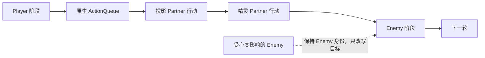
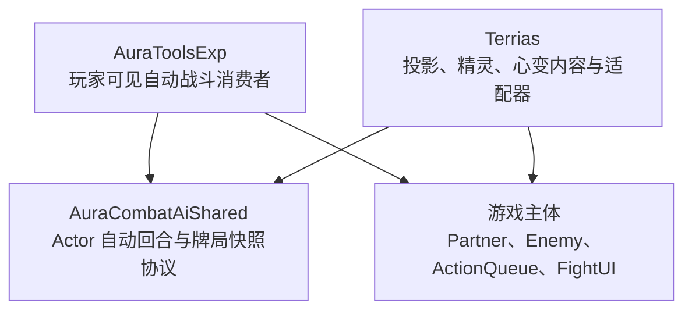
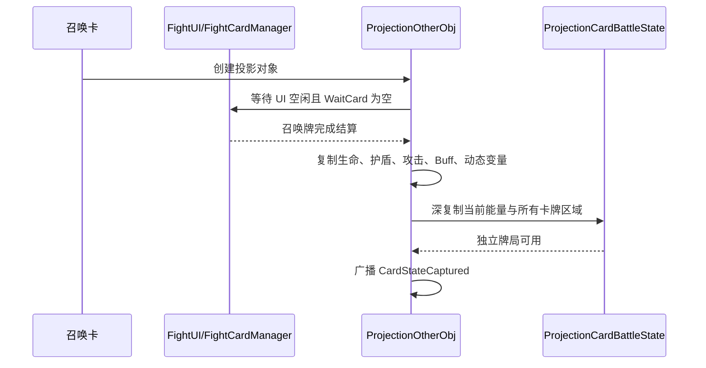

# 投影、精灵与心变机制完整说明

> - 文档状态：当前实现基线（2026-08-10）
> - 适用范围：Terrias、AuraToolsExp、AuraCombatAiShared 以及游戏主体 Partner 战斗流程
> - 伙伴联机协议：`8`
> - 投影牌局协议：`projection-card-state-v1`

## 1. 文档目的

本文完整说明【投影】【精灵】【心变】在新版战斗流程中的定位、生命周期、行动方式、表现规则和联机边界。

三种机制虽然都可能改变战场上的行动关系，但它们不是同一种“召唤物”实现：

- 【投影】是复制玩家当前战斗状态后形成的独立友方 Actor，使用独立牌局自动出牌。
- 【精灵】是与玩家绑定的独立伙伴，拥有自己的属性、资源和意图池。
- 【心变】仍然控制原敌方单位，只修改其下一次原生行动的目标关系。

本文描述当前代码已经实现的行为，不把旧版隐藏回合锚点、独立追加回合或心变代理对象视为有效设计。

## 2. 核心身份对照

| 维度 | 投影 | 精灵 | 心变目标 |
| --- | --- | --- | --- |
| 宿主类型 | `ProjectionOtherObj : Partner` | `SpiritOtherObj : Partner` | 原 `Enemy` |
| 阵营语义 | 独立友方单位 | 独立友方伙伴单位 | 仍是敌方单位 |
| 回合归属 | 原生 `Partner` 阶段 | 原生 `Partner` 阶段 | 原生 Enemy 阶段 |
| 行动来源 | 独立牌局与共享 AI | 独立意图池 | 原敌方卡池 |
| 玩家能否接管 | 不能 | 不能 | 不适用 |
| 意图显示 | 无意图 | 保留伙伴意图 | 保留原敌方意图表现 |
| 正式横向友方槽 | 占用 | 不占用 | 不占用 |
| 画面位置 | 友方横向阵位 | 拥有者右上角固定附着位 | 原敌方位置 |
| 独立生命与属性 | 有，召唤时复制玩家状态 | 有，来自精灵档案与伙伴属性 | 保留原敌方状态 |
| 联机决策权 | 主机 | 主机 | 主机 |
| 与其他机制共存 | 可与精灵、心变同时存在 | 可与投影、心变同时存在 | 不转化为伙伴 |

这里的“友方”分为两个层次：

- 宿主层：投影和精灵是 `Partner`，心变目标仍是 `Enemy`。
- Terrias 语义层：`CompanionFriendlyRosterService` 将玩家、投影和精灵统一视为真实友方目标；心变目标永远不会被加入该名单。

## 3. 总体战斗流程

`ProjectionTurnCoordinator` 在伙伴生成时将其插入第一个 Enemy 之前。投影和精灵之间不使用额外隐藏锚点，也不在玩家回合结束后另起 Terrias 私有回合。

如果两种伙伴同时存在，它们都会处于第一个 Enemy 之前；伙伴之间沿用当前注册到 `ActionQueue` 的顺序，不额外声明固定的“投影先于精灵”或“精灵先于投影”规则。

每个伙伴执行 `DoAction()` 时都会将当前战斗阶段切换为 `FightType.Partner`。这保证依赖宿主阶段判断的事件、动画和行动逻辑看到的是正式伙伴阶段。

## 4. 分层与所有权

### 4.1 共享层负责什么

`AuraCombatAiShared/CombatAgentRuntime.cs` 提供与 Terrias 内容无关的能力：

- `CombatAutoTurnRunner`：自动 Actor 回合状态机。
- `ICombatAgentRuntimePort`：观察、预检、执行、结算和结束回合端口。
- `ICombatAgentDecisionSource`：决策来源边界。
- `CombatActionAutomationRegistry`：无 UI 自动行为能力注册表。
- `CombatActorCardStateSnapshot`：独立牌局的深复制与协议校验模型。
- `CombatAgentFailureScope`：候选、卡牌实例、行动来源和已提交动作的失败隔离范围。

共享层不知道“投影”“精灵”“乌娜”等内容语义，也不直接访问 Terrias 的状态仓库。

### 4.2 Terrias 负责什么

Terrias 负责：

- 创建投影和精灵对象并接入原生 Partner 队列。
- 把投影牌局转换为共享 AI 可以观察的行动候选。
- 执行投影卡牌并保证效果落在投影自身牌局。
- 规划与执行精灵意图。
- 对心变敌人的原生脚本目标进行重写。
- 管理伙伴显示、死亡清理和联机快照。

### 4.3 AuraToolsExp 负责什么

AuraToolsExp 继续负责玩家可见的自动战斗工具体验。它通过 `player-ui-runtime` 向共享注册表声明玩家 UI 行动能力。

Terrias 通过 `projection-card-runtime` 声明投影的无 UI 卡牌能力。两者是共享层的平级消费者，AuraToolsExp 不依赖 Terrias 内部实现，Terrias 也不调用 AuraToolsExp 的自动战斗控制器。

## 5. Partner 队列、友方名单与位置

### 5.1 队列规则

伙伴生成时执行以下流程：

1. 从 `ActionQueue` 移除同一对象的旧引用，防止重复行动。
2. 查找队列中的第一个 `Enemy`。
3. 将伙伴插入该 Enemy 之前；没有 Enemy 时追加到队尾。
4. 保留所有游戏原生 Partner，不接管或删除其他 MOD 的伙伴。

旧版 `ProjectionTurnAnchorObj` 已删除。当前只保留对陈旧锚点的诊断和清理规则，正常战斗不应再生成锚点。

### 5.2 友方目标规则

Terrias 的真实友方名单包含：

- 宿主 `roleQueue` 中仍存活的玩家角色；
- `FightPlayer.Instance.Status` 兜底玩家；
- 当前存活的投影；
- 当前存活的精灵。

该名单用于伙伴规划、效果目标和心变的有益行动改写。`RoleStatusMap` 只是玩家与状态的归属路由，可能包含敌方状态，因此不能被当作阵营名单。

### 5.3 位置规则

- 投影进入 `CompanionSlotService` 的正式友方横向编队。
- 精灵通过视觉代理附着在拥有者右上角，不参与横向编队重排。
- 心变目标始终停留在原敌方位置，不改变朝向。
- 当前正式友方布局器最多计算 4 个横向显示槽；精灵固定附着位不计入该数量。

## 6. 投影机制

### 6.1 召唤身份与数量限制

每个拥有者同时只能存在一个投影。重复使用投影召唤牌时会被使用门禁拦截，并提示投影位置已被占用。

投影创建后会：

- 注册到 `FightManager.statuses`，使脚本和目标解析可以找到它；
- 注册到 `ProjectionStateStore` 与 `CompanionBattleStateStore`；
- 进入原生 Partner 行动队列；
- 进入正式友方横向编队；
- 开始等待召唤卡完整结算，然后复制玩家牌局。

### 6.2 为什么必须在召唤牌结算后复制

召唤牌支付费用、执行脚本、进入弃牌堆以及完成 UI 动画之前，玩家的手牌和能量仍处于变化状态。如果提前复制，会出现召唤牌仍在投影手中、能量未扣除或等待区未清空等错误。

当前捕获时序如下：

结算等待上限为 8 秒。超时后不会复制半结算状态；投影保留在场，但其回合会因牌局未就绪而安全跳过。

### 6.3 复制内容

| 类型 | 复制内容 |
| --- | --- |
| 单位状态 | 最大生命、当前生命、护盾、攻击 |
| Buff | 当前 Buff id 与层数 |
| 动态状态 | `dynamicVariables` 当前值 |
| 能量 | 当前剩余能量、能量上限 |
| 卡牌区域 | 手牌、抽牌堆、弃牌堆、焚毁堆、等待区、保留状态 |
| 卡牌实例 | 卡牌定义、运行时数据覆盖、Vars、标签、费用状态 |
| 附加物 | 附加物 id、类型、运行时数据和变量 |

Buff 初始化可能再次修改属性，因此实现会在 Buff 复制后重新写入捕获到的生命、攻击、护盾和动态变量，确保初始状态与玩家一致。

每张投影卡牌都会获得新的投影实例 id。投影不会与玩家共享 `DataConfig`、Vars 容器、卡牌列表或附加物对象；投影弃牌、抽牌、焚毁和修改费用不会回写玩家牌局。

### 6.4 不复制的内容

投影不会复制：

- 玩家输入权和手牌 UI 对象；
- 正在运行的协程、选择窗口或拖拽状态；
- 玩家自动战斗开关状态；
- 精灵式意图池和意图图标；
- 玩家回合按钮及其结束回合检查流程。

投影“复制玩家当前状态”不等于创建第二个玩家。它是拥有独立牌局的自动 Partner Actor。

### 6.5 第一回合与后续回合

第一回合：

- 不刷新能量；
- 不额外抽牌；
- 直接使用复制出的剩余能量和手牌；
- 可以主动选择结束，也可能因无合法动作或保护条件而强制结束。

后续回合：

1. 将投影能量恢复到自己的能量上限。
2. 按捕获时的宿主抽牌数抽牌。
3. 弃牌堆不足时独立洗回抽牌堆。
4. 自动决策并逐张结算卡牌。
5. 回合结束时处理弃牌、保留和焚毁状态。
6. 推进投影自己的 `TurnIndex` 与牌局 revision。

### 6.6 自动出牌流程

每次投影行动执行以下步骤：

1. `ProjectionCardBattleState` 观察投影自身、友方、敌方、能量和手牌。
2. 为每张合法手牌和目标组合生成 `CombatActionObservation`。
3. `CombatDecisionEngine` 使用 `terrias-projection` 快速决策配置选择行动。
4. 共享 Runner 检查该行动是否声明支持无 UI 执行。
5. Terrias 再检查卡牌实例、费用、目标和脚本安全性。
6. 扣除投影能量，以投影 `Status` 作为脚本 `Self` 执行卡牌。
7. 处理附加物、连击、额外使用次数、逐次衰减和使用后区域移动。
8. 等待 `FightUI` 动画及 `WaitCard` 完成结算，再开始下一次决策。
9. 广播最新牌局快照。

投影不会通过模拟点击玩家手牌或点击结束回合按钮完成行动。

### 6.7 无 UI 卡牌安全边界

以下行为不能直接复用玩家脚本：

- 打开选牌、牌库或转换窗口；
- 依赖 `FightUI` 中的玩家手牌对象；
- 直接读写 `FightPlayer` 能量；
- 通过 `FightCardManager` 修改玩家抽牌堆、弃牌堆或焚毁堆；
- 需要玩家拖拽、点击目标或二次确认；
- 未声明 Actor 安全的任意 `CS.*` 包装脚本。

Terrias 普通伤害、治疗、护盾和 Buff 卡牌只有在 `ProjectionWrappedCardPolicy` 白名单中，且全部 `CS.*` 调用都属于 `CardScripts` 安全入口时才允许执行。

当前为以下五张会改变牌局状态的卡提供了投影专用适配：

| 卡牌 | 投影专用行为 |
| --- | --- |
| `solar_phase_tuning` | 弃置投影其他手牌、获得辉光、投影抽 3 张 |
| `radiant_oath` | 获得辉光；已有场地时由投影抽 1 张 |
| `solar_return` | 获得辉光并由投影抽 1 张 |
| `solar_origin_core` | 焚毁投影其他手牌，并按数量恢复投影能量 |
| `ember_tower` | 转换投影自身 Buff，并按转换量由投影抽牌 |

适配的核心约束是：任何卡牌区域和能量变化只能写入 `ProjectionCardBattleState`，不能落到玩家全局牌局。

### 6.8 防卡死策略

投影是不可接管的 Actor，因此“安全结束”优先级高于无限重试。

| 情况 | 处理 |
| --- | --- |
| 某个目标失效 | 屏蔽当前候选与该目标，继续寻找其他行动 |
| 某个卡牌实例暂不可用 | 屏蔽该实例；发生有效状态变化后允许重新评估 |
| 行动来源依赖玩家 UI | 当前回合屏蔽该来源 |
| 动作已提交后抛错 | 不重放，立即按致命执行失败结束 |
| 没有剩余合法非结束行动 | 强制结束 |
| 连续失败达到 3 次 | 强制结束 |
| 相同状态连续观察达到 4 次 | 强制结束 |
| 已提交动作达到 32 次 | 强制结束 |
| 单次决策超过 3 秒 | 强制结束 |
| 已提交动作 8 秒未结算 | 强制结束 |
| 整个投影回合超过 45 秒 | 强制结束 |

AI 主动结束回合和保护性强制结束都会直接调用 Actor 端口完成回合，不经过玩家结束回合按钮。

### 6.9 死亡与清理

投影生命归零后由状态生命周期路由撤销：

- 从投影状态仓库注销；
- 从正式友方编队移除并触发重排；
- 释放视觉与网络状态；
- 不再进入后续 Partner 行动。

战斗开始、重开、胜利、失败和逃跑都会清理投影状态、网络去重记录、角色选择 UI 与残留视觉对象。

## 7. 精灵机制

### 7.1 身份与出战规则

精灵来自精灵球捕获结果，详细捕获流程见[精灵球捕获与精灵召唤](08-精灵球捕获与精灵召唤.md)。

精灵球捕获结果永久保存为独立 `SpiritInstance`，不再加入冒险卡组。每场战斗开始时冻结当前六只携带和唯一出战 UID，并只生成一张临时出战卡。

同一拥有者一场战斗只能成功召唤一次精灵。精灵死亡后不能替换，复制卡牌也会被 deployment token 与拥有者消费门禁拒绝。旧版精灵交换、撤回返卡和费用递增不再属于正常出战流程。

这一限制只作用于精灵自身，不检查投影位置，因此投影和精灵可以同时存在。

### 7.2 独立战斗状态

精灵拥有自己的：

- 最大生命和当前生命；
- 攻击、护甲、最大魔力和当前魔力；
- 来源敌人快照与 profile key；
- 意图池、意图冷却和 `ReadyOnTurn`；
- 当前意图计划、目标顺序和效果解析；
- 威胁状态与伙伴 `TurnIndex`。

精灵不复制玩家牌库，也不使用投影自动出牌 Runner。其行动仍由 `CompanionIntentPlanner`、`CompanionIntentSelector` 和 `ProjectionActionExecutor` 组成的伙伴意图系统驱动。

精灵的生命、攻击和护甲来自永久个体的等级、先天资质、物种种族值与四大本源，不读取玩家本源，也不应用深渊难度倍率。护甲在生成时初始化为原生 `Defend` 护盾，并继续参与防御意图缩放。

详细意图来源和归属规则见[DPS 伤害归属与精灵专属意图池](09-DPS伤害归属与精灵专属意图池.md)。

### 7.3 精灵回合

权威端的精灵回合：

1. 进入 `FightType.Partner`。
2. 检查拥有者是否仍可用。
3. 衰减当前威胁并触发精灵自己的回合开始事件。
4. 等待 0.5 秒，为原生表现与状态事件留出结算时间。
5. 执行当前权威意图。
6. 等待行动表现完成。
7. 恢复 1 点魔力，推进 `TurnIndex`。
8. 规划、提交并广播下一次意图。

如果当前计划为空、是等待意图或已经不可执行，精灵不会永久停在当前回合，而是恢复 1 点魔力、推进回合并刷新下一意图。

拥有者失效时，精灵会推进一次跳过回合并广播；拥有者死亡时，精灵模型和附着代理会随拥有者隐藏或被生命周期清理。

### 7.4 固定附着位

精灵是正式伙伴状态，但不进入横向友方阵位。`SpiritAttachmentPresenter` 创建独立视觉代理：

- 以拥有者模型包围盒为基准定位到右上角；
- 以 1080p 下约 120 像素高度作为缩放基准；
- 跟随分辨率、相机、拥有者模型和动画 sprite 变化更新；
- 攻击、干扰和支援行动使用不同方向的短暂聚焦位移；
- 隐藏精灵原始模型的渲染、碰撞、倒影和底部对象，避免双重显示。

### 7.5 生命条和 hover

精灵不常驻显示原生状态条和 Buff 列表：

- 独立生命条竖向放置在精灵右侧；
- 绿色填充由下向上表示当前生命比例；
- 血条尺寸会抵消父级缩放，避免被附着代理二次缩放；
- `effectListObj` 始终隐藏；
- 鼠标进入精灵区域时，事件转发给原生 `StatusManager`；
- 原生 hover 面板临时显示在精灵下方；
- 鼠标离开、代理隐藏或对象销毁时立即关闭 hover 状态。

## 8. 心变机制

### 8.1 施加条件

心变只能在战斗中施加，并要求：

- 施法者有效；
- 目标是存活的原生 `Enemy`；
- 目标尚未处于心变控制；
- 场上至少还有两个存活且未受控的敌人，使控制后仍有合法敌方目标。

不满足条件时不会创建任何临时对象，并恢复卡牌原本的目标引用。

### 8.2 心变不做什么

心变明确不会：

- 将敌人改造成 `Partner`；
- 把敌人加入真实友方名单；
- 创建友方状态、复制体或代理 `OtherObj`；
- 创建心变专用 EnemyCard 或意图池；
- 占用正式友方槽或精灵附着位；
- 移动敌人、翻转朝向或重排 `ActionQueue`；
- 修改敌人原本的卡池、冷却、优先级或行动次数。

### 8.3 目标改写时机

心变依赖三个时机保证原生脚本不会把目标改回敌对关系：

1. `OtherObj.SetAction` 完成后，对已经准备好的意图卡执行一次目标改写。
2. `ScriptExecutor.SetStatus` 完成后，根据原过滤器重新计算合法目标。
3. `ScriptExecutor.RunScript("UseScript")` 之前，再校正最终提交目标。

这样既保留原敌人的选卡与意图流程，又能覆盖卡牌脚本在执行前重新调用 `SetStatus` 的情况。

### 8.4 行动语义与目标规则

`WitchCombatValueEstimator` 根据行动中的伤害、治疗、护盾、Buff、Debuff、持续伤害和净化估算语义。

| 行动类型 | 目标规则 |
| --- | --- |
| 明确 Self | 保持敌人自身 |
| 有益分数高于有害分数 | 选择存活真实友方，包括玩家、投影和精灵 |
| 有害、相等或无法明确分类 | 选择其他存活且未受控的敌人 |
| 单目标 | 从合法集合中选择一个 |
| 随机 N 目标 | 保留数量语义，从合法集合中无重复抽取 |
| 多目标 | 使用合法集合中的全部目标 |
| 无合法目标 | 将目标集合置空，由原行动安全结算 |

心变目标自身不会作为有益行动的友方目标；明确的 Self 行动是唯一保持自身的分支。

### 8.5 持续时间与解除

心变控制的是目标的下一次原生敌方行动：

- 行动开始前确认目标仍存活；
- 原行动执行完成后立即移除控制状态和心变 Buff；
- 目标在行动前死亡时立即清理；
- 战斗重开、结束、胜利、失败或逃跑时统一清理。

心变不授予一个额外友方回合，也不推迟原敌方行动。它改变的是原行动的对象关系。

## 9. 联机权威与同步

### 9.1 权威原则

| 行为 | 主机 | 客机 |
| --- | --- | --- |
| 校验召唤或控制请求 | 执行 | 发送请求 |
| 创建权威伙伴状态 | 执行 | 根据快照镜像 |
| 投影 AI 决策与出牌 | 执行 | 不执行 |
| 精灵意图规划与执行 | 执行 | 不执行 |
| 心变目标决议 | 执行 | 接收控制状态 |
| 推进伙伴 `TurnIndex` | 执行并广播 | 等待更新 |

所有客户端仍进入同一个原生 Partner 阶段，但客机不会本地运行 AI，否则会出现重复伤害、双重抽牌和队列提前推进。

### 9.2 通用校验字段

伙伴请求和快照会校验：

- `ProtocolVersion = 8`；
- 当前 `BattleEpoch`；
- 请求发送者是否存在于房间；
- 发送者是否拥有请求中的玩家状态；
- 召唤或意图注册表 hash；
- 去重 token、generation 或 revision。

### 9.3 投影快照

投影快照包含：

- 拥有者、角色、投影 status id 和显示槽信息；
- 当前生命、攻击、护盾和伙伴进度；
- `projection-card-state-v1` 牌局快照；
- 牌局中的能量、卡牌实例、区域、运行时变量和附件状态。

初始召唤广播可能先创建没有 `CardState` 的投影镜像。主机在召唤牌完整结算并捕获牌局后再次广播，客户端再完成牌局 hydration。

每次卡牌提交、自动回合完成和外层伙伴回合推进都会广播最新状态。牌局 revision 单调增加；客户端拒绝比本地更旧的快照。

### 9.4 精灵快照

精灵快照包含：

- 本场冻结的来源敌人、等级、资质、四大本源和 deployment token；
- 独立最大生命与当前生命；
- 攻击、护甲、魔力；
- 当前意图、冷却、威胁和 `TurnIndex`；
- generation、revision 和请求幂等信息。

deployment token 与拥有者级消费门禁保证一场战斗只能成功出战一次。generation 仍用于拒绝延迟的旧实体快照，但正常流程不会在同一战斗交换精灵。

### 9.5 心变快照

心变只同步控制状态：

- `TargetStatusId`；
- 是否 active、accepted；
- 拒绝原因和去重 token；
- `SlotIndex = -1`；
- `IntentCount = 0`。

后两个字段明确表达：心变不占友方位置，也没有代理意图。

### 9.6 客机回合等待

- 投影客机等待权威 `TurnIndex` 推进，最长 50 秒。
- 精灵客机等待权威 `TurnIndex` 推进，最长 15 秒。
- 战斗结束、单位死亡或等待超时都会释放协程。
- 超时只用于防止本地流程永久卡住，不会赋予客机补跑 AI 的权力。

## 10. 关键不变量

以下规则应被视为后续开发不能破坏的行为契约：

1. 投影和精灵必须直接使用原生 Partner 队列，不能恢复隐藏回合锚点。
2. 投影牌局必须与玩家牌局深隔离。
3. 投影第一回合必须使用召唤结算后的剩余能量和手牌。
4. 投影没有意图池，也不能等待玩家接管。
5. 精灵保留独立意图池，但不占正式横向友方槽。
6. 投影和精灵必须允许同时存在。
7. 心变目标始终保持 Enemy 身份，不能进入伙伴名单。
8. 心变只改写原生行动目标，不替换卡池和行动次数。
9. 联机只有主机执行伙伴决策、卡牌和目标改写。
10. 任意异常都必须能够结束当前 Actor 回合，不能阻塞整个战斗队列。

## 11. 典型场景

### 11.1 玩家用最后 1 点能量召唤投影

召唤卡完整结算后，玩家剩余能量为 0，召唤卡已经离开手牌。投影复制的是这个状态，所以第一回合不会凭空获得满能量，也不会再次拿到召唤卡。若没有零费合法牌，它会直接安全结束。

### 11.2 投影复制到需要选牌窗口的卡

该卡仍存在于投影牌局，但预检会判定其不支持无 UI 执行。Runner 屏蔽对应来源并继续寻找其他合法动作；没有其他动作时结束回合，而不是打开玩家窗口或永久等待。

### 11.3 投影和精灵同时在场

投影进入横向友方编队，精灵显示在拥有者右上角。二者都在原生 Partner 阶段行动，拥有独立生命和状态，互不占用对方位置。

### 11.4 精灵当前意图无法执行

精灵恢复 1 点魔力、推进自己的回合并重新规划下一意图。它不会因为当前意图失效而停住整个 ActionQueue。

### 11.5 心变敌人抽到治疗行动

行动仍由该 Enemy 在原队列位置执行。若估算结果以治疗、护盾、Buff 或净化为主，目标被改为存活真实友方，可以包含投影或精灵；行动结束后心变解除。

### 11.6 心变敌人抽到 Self 行动

明确 Self 的行动保持作用于该敌人自身，不会强制改为玩家，也不会因为心变而失去自我强化或姿态切换。

## 12. 扩展开发指南

### 12.1 为投影增加新卡牌支持

新增投影可用卡牌时必须判断：

1. 是否只依赖 `ScriptExecutor.Self`、已提交目标和通用 Buff/伤害接口。
2. 是否访问玩家手牌、玩家能量、全局牌堆或 UI。
3. 是否会改变卡牌区域、抽牌、弃牌、焚毁或能量。
4. 是否包含 `CS.*` 包装入口。

纯 Actor 安全的 Terrias 卡可以加入 `ProjectionWrappedCardPolicy` 白名单。涉及独立牌局变化的卡必须在 `ProjectionCardBattleState` 中增加专用适配，不能只把卡 id 加入白名单。

每个新增适配至少需要验证：

- 玩家手牌和能量不变；
- 投影对应区域和能量正确变化；
- 使用后标签和附件行为正确；
- 联机快照 revision 推进；
- 动画未结算时不会提交下一张牌；
- 抛错后不会重放已提交动作。

### 12.2 增加新的伙伴 Actor

新的伙伴 Actor 应：

- 继承宿主 `Partner` 或使用等价的原生伙伴接入；
- 通过 `ProjectionTurnCoordinator.RegisterCompanion` 插入队列；
- 明确是否进入正式横向槽、固定附着槽或其他独立表现层；
- 使用稳定 owner id、actor id、协议版本和权威端；
- 提供死亡、战斗结束、重开和联机超时清理；
- 不复用投影或精灵的内容语义作为共享基础设施。

### 12.3 扩展心变目标语义

新增行动类型时应扩展通用战斗语义估算，而不是按某个敌人 id 硬编码目标。需要特别验证 Self、多目标、随机 N 目标、混合伤害与治疗、召唤以及场地类行动。

## 13. 代码导航

| 主题 | 主要文件 |
| --- | --- |
| 共享 Actor Runner 与牌局快照 | `AuraCombatAiShared/CombatAgentRuntime.cs` |
| 共享 Runner 行为测试 | `AuraCombatAiShared.Tests/CombatAgentRuntimeBehaviorTests.cs` |
| AuraToolsExp 平级消费者 | `AuraToolsExp-Dev/Features/AutoBattle/AuraToolsAutoBattleRuntime.cs` |
| 投影对象与 Partner 回合 | `Terrias-Dev/Mechanics/ProjectionOtherObj.cs` |
| 投影独立牌局与卡牌适配 | `Terrias-Dev/Mechanics/ProjectionCardBattleRuntime.cs` |
| 投影召唤和快照 | `Terrias-Dev/Mechanics/ProjectionSummonService.cs` |
| Partner 队列接入 | `Terrias-Dev/Mechanics/ProjectionTurnCoordinator.cs` |
| 精灵对象与 Partner 回合 | `Terrias-Dev/Mechanics/SpiritOtherObj.cs` |
| 精灵冻结、召唤和同步 | `Terrias-Dev/Mechanics/SpiritBattleDeploymentService.cs`、`SpiritSummonService.cs` |
| 精灵固定附着 UI | `Terrias-Dev/Hooks/Visual/SpiritAttachmentPresenter.cs` |
| 正式友方阵位 | `Terrias-Dev/Mechanics/CompanionSlotService.cs` |
| 真实友方名单 | `Terrias-Dev/Mechanics/CompanionFriendlyRosterService.cs` |
| 心变状态与目标改写 | `Terrias-Dev/Mechanics/HeartChangeControlService.cs` |
| 心变 Hook 接入 | `Terrias-Dev/Hooks/HeartChangeControlRuntime.cs` |
| 投影与心变 RPC | `Terrias-Dev/Network/RpcProjectionCompanion.cs` |
| 精灵 RPC | `Terrias-Dev/Network/RpcSpiritCompanion.cs` |

## 14. 验收重点

### 14.1 自动化验证

- 共享 Runner：无合法动作、失败隔离、重复状态、超时、已提交失败和深复制。
- Terrias C#：Partner 队列保留原生伙伴、移除陈旧锚点、投影与精灵直接排队。
- 精灵专项：档案、注册表、意图和运行时行为。
- 共享兼容：Aura.Shared 公共 API、三方消费者构建和 DLL 打包一致性。
- 网络：RPC sender authority、协议版本和服务端请求边界。

### 14.2 Unity 实机验证

1. 在不同剩余能量、手牌数和牌堆状态下召唤投影。
2. 验证召唤卡不会出现在投影首回合手牌。
3. 验证玩家牌局不受投影弃牌、抽牌、焚毁和能量变化影响。
4. 验证投影自动结束后 Enemy 阶段能够继续。
5. 验证投影与精灵同时存在时位置、血条、意图和行动顺序。
6. 验证精灵 hover 面板、缩放、分辨率变化和拥有者死亡。
7. 验证心变的伤害、治疗、Self、单目标和多目标行动。
8. 验证主机与客机只产生一次伙伴伤害和一次牌局变化。
9. 模拟快照延迟或丢失，确认客机等待上限能够释放协程。
10. 验证胜利、失败、逃跑和重开后不存在残留伙伴、代理或控制状态。

完整人工用例记录在仓库根目录的 `docs/game-test-plan-1.0.24605918.md`。

## 15. 当前边界与后续关注点

- 投影的无 UI 卡牌支持采用明确声明制。未进入安全策略的第三方包装卡会被跳过，这是保护玩家牌局的预期行为。
- 投影召唤结算捕获只尝试一次；8 秒内始终无法稳定时不会复制部分牌局。
- 正式横向友方布局最多处理 4 个显示槽，高玩家数量与投影并存时需要继续做实机布局验证。
- 投影牌局捕获适配当前读取宿主 `FightPlayer` 与 `FightCardManager` 单例。非主机拥有者在联机场景中的牌局归属必须作为重点联机用例验证；若宿主不能在权威端提供对应玩家牌局，后续需要扩展为拥有者牌局快照请求，而不能猜测或复制主机牌局。
- 心变的混合行动只有在有益分数严格高于有害分数时才选择友方；相等或未知行为默认按有害行动处理，以避免反向伤害友方。
- 客机等待超时是流程保险，不是状态修复协议。持续丢包仍应通过权威快照重发或重同步解决。

以上边界是当前实现的已知适用范围，不应通过恢复旧版独立回合、临时友方代理或玩家 UI 模拟来绕过。
