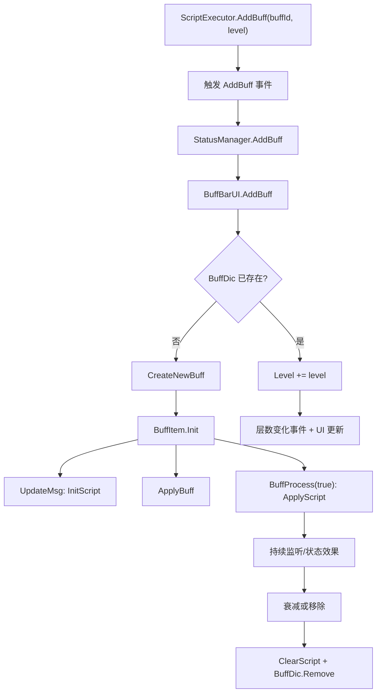

# 祝福与 Buff 机制

本页整理游戏本体中 `Bless` 与 `Buff` 的运行时设计，以及 SunExp 当前如何复用这两套机制。

源码锚点：

- `开发参考资料/反编译文件夹v1.0.23715745/Witch/RoleTable.cs`
- `开发参考资料/反编译文件夹v1.0.23715745/Witch/BlessingRelic.cs`
- `开发参考资料/反编译文件夹v1.0.23715745/Witch/UI/Window/BlessingChoiceGenerator.cs`
- `开发参考资料/反编译文件夹v1.0.23715745/Witch/ScriptExecutor.cs`
- `开发参考资料/反编译文件夹v1.0.23715745/Witch/Commands.cs`
- `开发参考资料/反编译文件夹v1.0.23715745/Witch/StatusManager.cs`
- `开发参考资料/反编译文件夹v1.0.23715745/Witch/UI/Window/BuffBarUI.cs`
- `开发参考资料/反编译文件夹v1.0.23715745/Witch/BuffItem.cs`
- `开发参考资料/反编译文件夹v1.0.23715745/Witch/BuffItemConfig.cs`
- `SunExp/Data/Blessing/sunexp.csv`
- `SunExp/Data/Buff/sunexp.csv`
- `SunExp-Dev/Scripting/BuffScripts.cs`
- `SunExp-Dev/Hooks/DuskPartnerRuntime.cs`
- `SunExp-Dev/Hooks/SolarMemoryBlessingPickerRuntime.cs`

## 两套系统的定位

| 项目 | 祝福 Bless | Buff |
| --- | --- | --- |
| 数据类型 | `DataType.Bless` | `DataType.Buff` |
| 生命周期 | 局内/角色持有，跨战斗生效 | 战斗状态，挂在某个 `StatusManager` 上 |
| 运行时容器 | `RoleTable.Instance.blessingConfigs` | `StatusManager -> BuffBarUI.BuffDic` |
| 是否有层数 | 没有内建层数，重复持有就是多条 `DataConfig` | 有 `Level`，受 `UpperBound` 与衰减字段控制 |
| 主要脚本列 | `OwnScript`、`FightScript` | `InitScript`、`ApplyScript`、`ClearScript` |
| 典型用途 | 长期被动、遗物式局内加成、解锁/构筑奖励 | 临时状态、可叠层状态、战斗事件监听、显示图标 |

代码里常见的口语写法是 "buf"，但正式表、类型和脚本接口都是 `Buff`。

## 祝福数据结构

`Data/Blessing` 表字段：

| 字段 | 用途 |
| --- | --- |
| `Id` | 唯一标识 |
| `Weight` | 原版祝福选择器里的额度成本，也可能被命令式随机池使用 |
| `OwnScript` | 获得祝福时执行 |
| `FightScript` | 进入战斗时执行 |
| `Icon` | 图标路径 |
| `Type` | 显示/分类文本 |
| `Source` | 原版选择器分池，常见为 `物资`、`技能` |
| `Rarity` | 稀有度/阶层 |

祝福本质是 `DataConfig`。它被加入 `RoleTable.Instance.blessingConfigs` 后才算持有。

```mermaid
flowchart TD
    A["获得祝福入口"] --> B["PlayerInfo.AddBless(id)"]
    B --> C["Commands.give(\"bless\", id)"]
    C --> D["RoleTable.Instance.blessingConfigs.Add(DataConfig)"]
    D --> E["CollectionChanged: 运行 OwnScript"]
    E --> F["局内持有祝福"]
    F --> G["战斗开始 BlessingRelic.Init/Apply"]
    G --> H["运行 FightScript"]
```

关键路径：

- `ScriptExecutor.PlayerInfo.AddBless(id)` 会调用 `Commands.give("bless", id)`。
- `Commands.give("bless", id)` 创建 `new DataConfig(id, DataType.Bless)` 并加入 `RoleTable.Instance.blessingConfigs`。
- `RoleTable.Listen()` 为 `blessingConfigs.CollectionChanged` 注册监听；新增祝福时会运行 `OwnScript`，并处理提示、成就/记录等副作用。
- 战斗开始时，`BlessingRelic.Init()` 收集遗物、硬标签、槽位标签和持有祝福；其中 `FightScript` 非空的祝福会进入待执行列表。
- `BlessingRelic.Apply(status)` 会设置脚本上下文，然后依次运行这些 `FightScript`。

`blessingConfigs` 是 `ObservableCollection<DataConfig>`，不是按 Id 去重的集合。游戏 UI 或统计逻辑可以按 Id 聚合显示，但底层容器允许重复条目。

## 原版祝福选择器

`BlessingChoiceGenerator` 是原版三选一祝福界面的核心。

初始化时它从 `GameConfigManager.GetTable(DataType.Bless).Getlines()` 读取全部祝福，然后按以下规则分池：

- 普通池：未锁定、通过卡包检查、`Weight < 6`、`Rarity < 3`。
- 普通池再按 `Source` 拆成 `物资` 与 `技能` 两组。
- 高潮池：`Rarity == 4` 且 `Weight >= 6`。

普通选项不是单个祝福，而是一组祝福：

- 技能祝福：`SelectBlessings(skillBlessings, 5)`
- 物资祝福：`SelectBlessings(varBlessings, 5 + ExBless)`

`SelectBlessings(pool, maxQuota)` 会随机打乱候选；如果某个祝福 `Weight <= 剩余额度`，就加入结果并扣除额度。额度耗尽或选中数量超过限制后停止。也就是说，在这个界面里 `Weight` 更像占用额度，不是简单概率。

当玩家确认一个 UI 选项时，该选项里技能组和物资组的所有 `DataConfig` 都会被加入 `RoleTable.Instance.blessingConfigs`。如果处于 `InHighTide`，`GenerateHighOptions()` 会额外提供高阶祝福。

## Buff 数据结构

`Data/Buff` 表字段：

| 字段 | 用途 |
| --- | --- |
| `Id` | 唯一标识 |
| `InitScript` | 刷新显示信息时执行，常用于动态描述 |
| `ApplyScript` | Buff 生效时执行 |
| `ClearScript` | Buff 清除时执行 |
| `ReducePerTurn` | 每回合减少层数 |
| `ReducePerAttacked` | 每次受击减少层数 |
| `ReducePerUse` | 每次行动/使用减少层数 |
| `UpperBound` | 层数上限 |
| `Icon` | 图标路径 |
| `Type` | 显示分类与排序 |
| `Rarity` | 稀有度 |
| `Effects` | 特效 |
| `SoundEffects` | 音效 |
| `Action` | 行为/动作字段 |
| `CanZero` | 只有字符串值为 `True` 时，0 层 Buff 才不会自动清除 |

Buff 挂在战斗中的 `StatusManager` 上，每个状态对象的同一 `buffId` 通常只有一个 `BuffItem` 实例。



关键路径：

- `ScriptExecutor.AddBuff(buffId, level)` 先触发 `AddBuff{Self.InstanceId}` 事件，再调用 `status.AddBuff(buffId, level)`。
- `StatusManager.AddBuff` 委托给 `BuffBarUI.AddBuff`。
- `BuffBarUI.CreateNewBuff` 会检查层数大于 0、Buff 数据存在、创建 `BuffItemConfig`，并把实例放进 `BuffDic`。
- 已存在同 Id Buff 时，不新建实例，而是累加 `BuffItemConfig.Level`。
- `BuffItem.Init` 设置脚本上下文，把 `stack` 写入 `dataConfig.Vars`，然后执行显示刷新、生效和事件注册流程。
- `BuffItem.UpdateMsg` 运行 `InitScript`，并追加上限、衰减等提示文本。
- `BuffItem.BuffProcess(true)` 运行 `ApplyScript`，并注册层数变化事件与触发效果监听。
- `BuffItem.ClearBuff` 运行 `ClearScript`，从 `BuffDic` 移除实例，并清理动态变量。

## Buff 层数与清理

`BuffItemConfig.Level` setter 会集中处理层数规则：

- 超过 `UpperBound` 时截断到上限。
- 小于 0 时截断到 0。
- 当层数变成 0 且 `CanZero != True` 时，调用 `ClearBuff()`。
- 层数变化会触发 `BuffId + "OnLevelChange" + InstanceId` 事件，并请求 UI 更新。

`DurationCheck(way)` 根据调用方传入的衰减类型扣层。常见来源包括每回合、受击、使用/行动等路径，对应表里的 `ReducePerTurn`、`ReducePerAttacked`、`ReducePerUse`。

`Type` 会影响 Buff 显示排序。反编译代码中可见的优先序大致是：

1. `特性`
2. `能力`
3. `正面`
4. `负面`
5. `契印`
6. 其他类型

## SunExp 当前用法

### Buff

`SunExp/Data/Buff/sunexp.csv` 目前定义了太阳光辉、火苗、余烬、日冕、余晖预兆、伙伴特性等 Buff。大多数行的脚本列都保持短调用：

```csv
CS.SunExp.Dll.Scripting.BuffScripts.Apply(self, "solar_radiance");
CS.SunExp.Dll.Scripting.BuffScripts.Clear(self, "solar_radiance");
```

实际行为集中在 `SunExp-Dev/Scripting/BuffScripts.cs`：

- `Apply(self, id)` 根据 Buff Id 分发注册行为。
- `Clear(self, id)` 根据 Buff Id 分发清理行为。
- 需要事件监听的 Buff 会在 Apply 中注册 token/owner，在 Clear 中移除，避免重复注册或跨战斗残留。

这符合本仓库约定：CSV 负责声明，C# DLL 负责行为。

### 祝福

`SunExp/Data/Blessing/sunexp.csv` 当前只有 `dusk_afterheat_recovery`：

- `Weight = 0`
- `Type = 伙伴占位`
- `Rarity = 5`
- `OwnScript` 与 `FightScript` 为空

它不是面向玩家随机池的普通祝福，而是伙伴被动的占位/技术标记。`DuskPartnerRuntime` 在特定生命周期中清理这个占位祝福；战斗开始时如果当前伙伴是黄昏，则直接给玩家状态添加 `dusk_afterheat_recovery_trait` Buff。

`SolarMemoryBlessingPickerRuntime` 则是 SunExp 自定义祝福选择界面：

- 从 `DataType.Bless` 表读取候选。
- 跳过锁定、重复、卡包不可用和技术祝福。
- 按 `Rarity` 分层。
- 当前配额是 4 阶 2 个、3 阶 3 个、2 阶 5 个、1 阶 5 个，总计 15 个。
- 确认时调用 `PlayerApi.AddBless(id)`，最终仍然进入原版 `PlayerInfo.AddBless` / `RoleTable.blessingConfigs` 路径。

也就是说，SunExp 可以自定义选择 UI 和配额规则，但真正持有与战斗生效仍复用本体 Bless 系统。

## 作者落地规则

新增祝福时：

- 同步新增 `Data/Blessing` 与 `Text/Blessing` 行。
- 明确它是玩家可见祝福，还是技术占位。技术占位要从自定义随机/选择池中过滤。
- 获得即生效的长期副作用放 `OwnScript`。
- 每场战斗都要注册或施加的效果放 `FightScript`。
- 如果只是战斗状态，优先考虑做成 Buff，而不是 Bless。
- 在 SunExp 中优先通过 `PlayerApi.AddBless(id)` 或稳定 C# wrapper 间接调用原版入口。

新增 Buff 时：

- 同步新增 `Data/Buff` 与 `Text/Buff` 行。
- `UpperBound` 必须符合设计；不希望自动清除时才把 `CanZero` 写成 `True`。
- 持续事件监听在 `ApplyScript` 注册，在 `ClearScript` 清理。
- CSV 脚本列保持短调用，行为放到 `SunExp-Dev/Scripting/BuffScripts.cs` 或更专门的 C# helper。
- 不要把战斗临时状态写回基础 CSV `Data/*` 行；使用运行时变量、token 或 C# 状态容器。
- 如果 Buff 只是给别的脚本读的隐藏计数，仍要考虑图标、类型、文本和是否应显示给玩家。

## 设计判断

选择 Bless 还是 Buff，可以按这个问题判断：

- 是否跨战斗、代表一次构筑选择或永久被动？用 Bless。
- 是否挂在某个角色/敌人身上、需要层数或衰减？用 Buff。
- 是否需要战斗中显示图标、被清理、被触发事件管理？用 Buff。
- 是否需要进入战斗时统一初始化一批长期能力？用 Bless 的 `FightScript`，再由它注册事件或添加 Buff。
- 是否只是为了让剧情/伙伴系统暂存一个选择？可以用 Bless 占位，但要在选择池中过滤并在合适生命周期清理。
