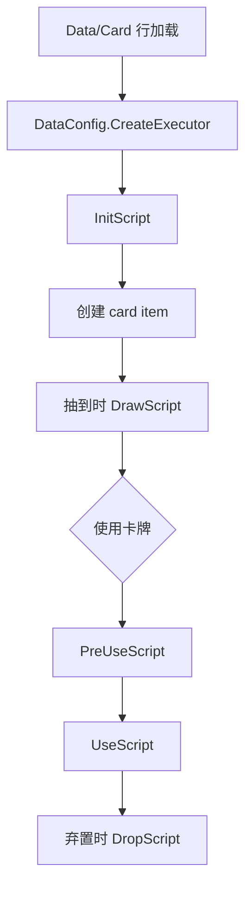
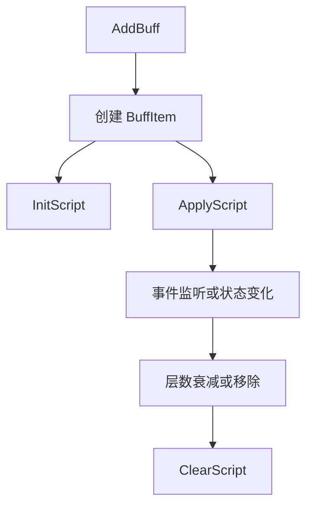
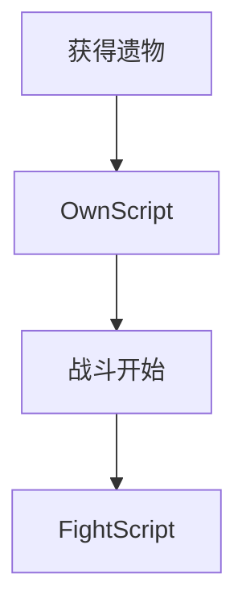

# 卡牌战斗流程

源码锚点：

- `开发参考资料/反编译文件夹v1.0.23693118/Witch/CardItem.cs`
- `开发参考资料/反编译文件夹v1.0.23693118/Witch/CommonCardItem.cs`
- `开发参考资料/反编译文件夹v1.0.23693118/Witch/AttackCardItem.cs`
- `开发参考资料/反编译文件夹v1.0.23693118/Witch/BuffItem.cs`
- `开发参考资料/反编译文件夹v1.0.23693118/Witch/BlessingRelic.cs`

## 卡牌生命周期

`InitScript` 通常负责设置卡牌基础运行时类型：

- 需要选目标的卡牌使用 `AttackCardItem`
- 不需要选目标的卡牌使用 `CommonCardItem`

SunExp 中，这类设置由 C# helper 封装，并通过 `CardScripts.Init(self, id)` 暴露。

## 目标卡与非目标卡

`CommonCardItem.TrueUse()` 和 `AttackCardItem.TrueUse()` 都会运行 `PreUseScript`
与 `UseScript`，但攻击卡路径包含目标选择行为。如果卡牌需要目标，`Action` 与
base script 设置必须一致。

## Buff 生命周期

持续性效果和事件 Hook 应优先使用 Buff 行承载。注册与清理要成对处理。

## 遗物生命周期

`FightScript` 通常用于注册战斗事件监听。如果遗物显示状态会变化，应通过 C#
遗物脚本或 wrapper 暴露更新。

## 描述值

`{0}` 之类动态文本占位符应由 `InitScript` 通过描述 API 填充。尽量让显示值与
运行时数值来自同一个 C# 分支。
