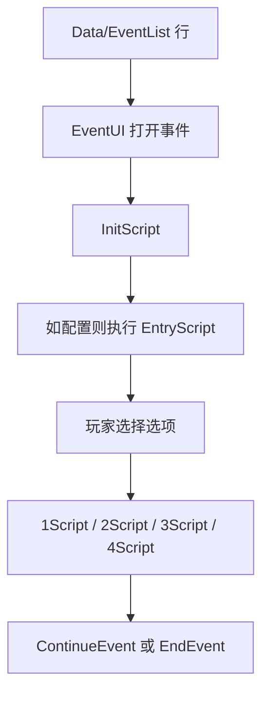
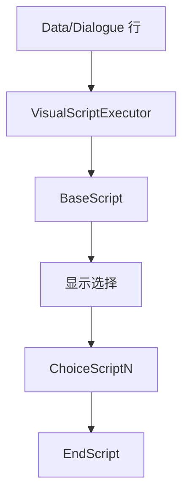
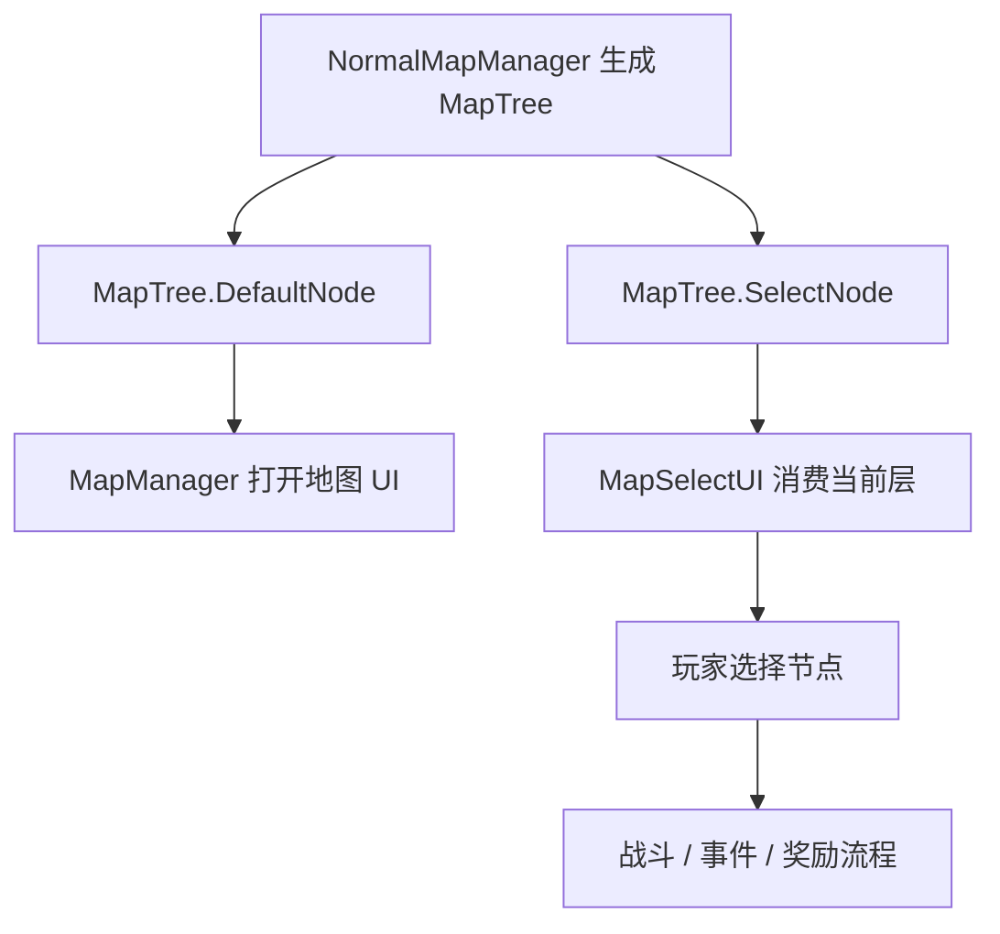

# 事件、对话与地图流程

本页覆盖 MOD 可见的剧情与地图流程。它偏实用：先用它定位 CSV 行进入运行时的
位置，再回到源码锚点确认精确行为。

## EventList 流程

源码锚点：

- `开发参考资料/反编译文件夹v1.0.23693118/Witch/UI/Window/EventUI.cs`
- `开发参考资料/反编译文件夹v1.0.23693118/AllScripts/AllScripts.cs`
- `SunExp/Data/EventList/sunexp.csv`
- `SunExp-Dev/Scripting/EventScripts.cs`

SunExp 让 EventList 脚本列保持为对 `EventScripts` 的短调用。剧情事件、奖励、
模式设置和分支逻辑都推荐采用这种形状。

## Dialogue 流程

源码锚点：

- `开发参考资料/反编译文件夹v1.0.23693118/Witch/UI/Window/DialogueUI.cs`
- `开发参考资料/反编译文件夹v1.0.23693118/Witch/DialogueManager.cs`

保持 `ChoiceCount`、选项脚本和本地化选项文本一致。

## Map 流程

源码锚点：

- `开发参考资料/反编译文件夹v1.0.23693118/Witch/NormalMapManager.cs`
- `开发参考资料/反编译文件夹v1.0.23693118/Witch/MapManager.cs`
- `SunExp/Data/Map/sunexp.csv`
- `SunExp-Dev/Hooks/SolarMemoryModeRuntime.cs`
- `SunExp-Dev/Mechanics/SolarMemoryMapNodePoolFactory.cs`

地图可见 MOD 内容通常同时需要表行和 Hook。对 Solar Memory 来说，较安全的边界
是 `MapTree` 节点池：在原生生成后、UI 消费当前层前生成或改写节点。

## 实用规则

- 保持 `Data/EventList` 与 `Text/EventList` 同步。
- 事件奖励、分支和状态 flag 使用 C# 入口实现。
- 地图生成与 UI 消费是两个阶段，不要混在一个职责里。
- 编辑地图 Hook 前，先在反编译快照中确认 `NormalMapManager`、`MapManager`
  与 `MapSelectUI` 签名。
