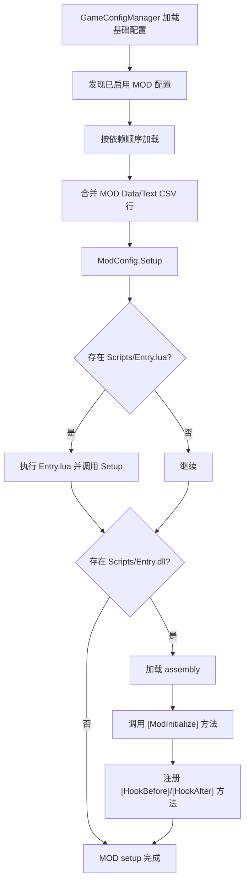
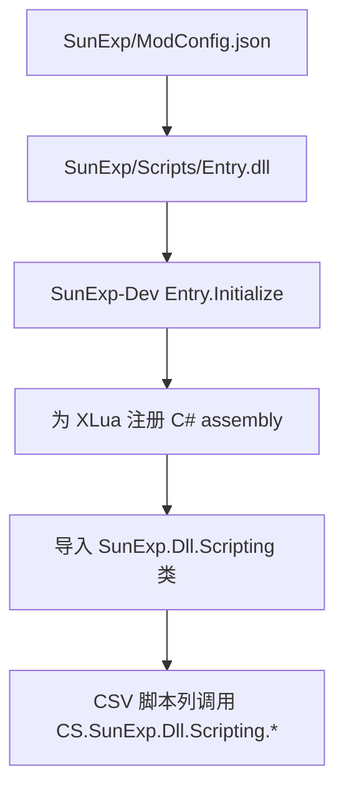

# MOD 加载流程

本页总结 MOD 如何进入游戏运行时。

源码锚点：

- `开发参考资料/反编译文件夹v1.0.23715745/Witch/GameConfigManager.cs`
- `开发参考资料/反编译文件夹v1.0.23715745/Witch/Mod/ModConfig.cs`
- `apocalyptic-journey-mod-tutorial/ModTemplate/README.zh-CN.md`
- `apocalyptic-journey-mod-tutorial/DllTemplate/readme.zh-CN.md`

## 重要结论

- `ModName` 应与运行时 MOD 文件夹名一致。
- `Scripts/Entry.dll` 是发布态 DLL 的固定文件名。
- C# assembly name 可以也应该保持唯一，以避免运行时冲突。
- Data/Text CSV 行按表和 ID 加载，脚本列稍后由对应生命周期执行。
- 通过 `SetDataConfig`、`ModifyDataConfig` 或 `MergeDataConfig` 改动脚本列时，
  内部会标记脚本数据已变化。

## SunExp 风格流程

SunExp 采用 DLL 优先的桥接方式：

这种方式让内容留在 CSV，同时把行为放进类型明确、可测试的 C#。
