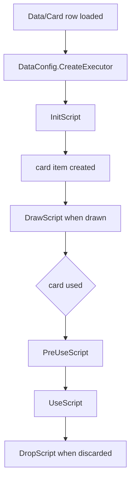
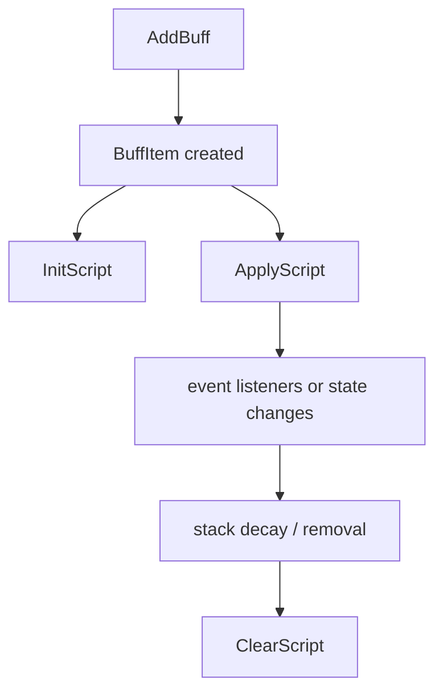
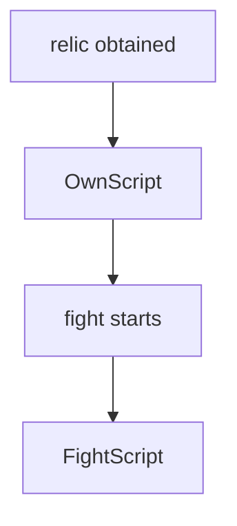

# Card Combat Flow

Source anchors:

- `开发参考资料/反编译文件夹v1.0.23715745/Witch/CardItem.cs`
- `开发参考资料/反编译文件夹v1.0.23715745/Witch/CommonCardItem.cs`
- `开发参考资料/反编译文件夹v1.0.23715745/Witch/AttackCardItem.cs`
- `开发参考资料/反编译文件夹v1.0.23715745/Witch/BuffItem.cs`
- `开发参考资料/反编译文件夹v1.0.23715745/Witch/BlessingRelic.cs`

## Card Lifecycle

`InitScript` normally configures the card's base runtime type:

- `AttackCardItem` for target cards
- `CommonCardItem` for non-target cards

In SunExp, this setup is wrapped in C# helpers and exposed through
`CardScripts.Init(self, id)`.

## Targeted vs Non-Targeted Cards

`CommonCardItem.TrueUse()` and `AttackCardItem.TrueUse()` both run `PreUseScript`
and `UseScript`, but the attack card path has target selection behavior. If a
card needs a target, make sure the `Action` and base script setup agree.

## Buff Lifecycle

Use Buff rows for persistent effects and event hooks. Pair registration and
cleanup carefully.

## Relic Lifecycle

`FightScript` is the usual place for combat event listeners. If a relic's
displayed state changes, expose that through the C# relic script or a wrapper.

## Description Values

Dynamic text placeholders such as `{0}` should be filled by `InitScript` using
description APIs. Keep displayed values and runtime values in the same C# source
branch whenever possible.
