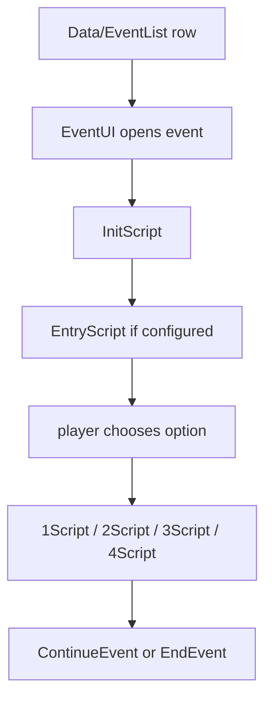
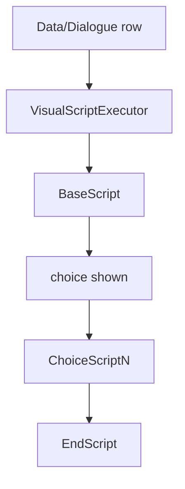
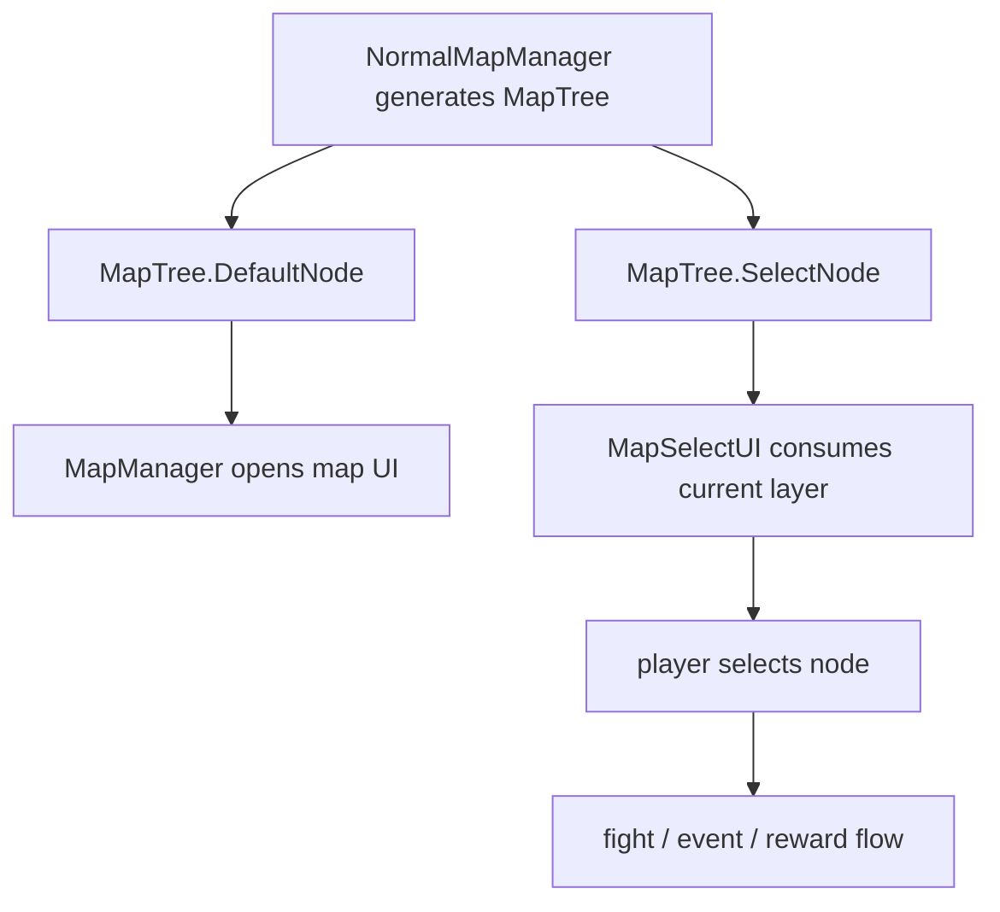

# Event, Dialogue, and Map Flow

This page covers MOD-visible story and map flows. It is intentionally pragmatic:
use it to find where a CSV row enters runtime, then inspect the source anchor for
exact behavior.

## EventList Flow

Source anchors:

- `开发参考资料/反编译文件夹v1.0.23693118/Witch/UI/Window/EventUI.cs`
- `开发参考资料/反编译文件夹v1.0.23693118/AllScripts/AllScripts.cs`
- `SunExp/Data/EventList/sunexp.csv`
- `SunExp-Dev/Scripting/EventScripts.cs`

SunExp keeps EventList script columns as short calls into `EventScripts`. This is
the recommended shape for story events, rewards, mode setup, and branching.

## Dialogue Flow

Source anchors:

- `开发参考资料/反编译文件夹v1.0.23693118/Witch/UI/Window/DialogueUI.cs`
- `开发参考资料/反编译文件夹v1.0.23693118/Witch/DialogueManager.cs`

Keep `ChoiceCount`, choice scripts, and localized choice text aligned.

## Map Flow

Source anchors:

- `开发参考资料/反编译文件夹v1.0.23693118/Witch/NormalMapManager.cs`
- `开发参考资料/反编译文件夹v1.0.23693118/Witch/MapManager.cs`
- `SunExp/Data/Map/sunexp.csv`
- `SunExp-Dev/Hooks/SolarMemoryModeRuntime.cs`
- `SunExp-Dev/Mechanics/SolarMemoryMapNodePoolFactory.cs`

Map-visible MOD content usually needs both table rows and hooks. For Solar
Memory, the safe boundary is the `MapTree` node pool: generate or rewrite nodes
after native generation and before the UI consumes the current layer.

## Practical Rules

- Keep `Data/EventList` and `Text/EventList` synchronized.
- Use C# entry points for event rewards, branching, and state flags.
- Treat map generation and UI consumption as separate phases.
- For map hooks, verify `NormalMapManager`, `MapManager`, and `MapSelectUI`
  signatures in the decompiled snapshot before editing.
