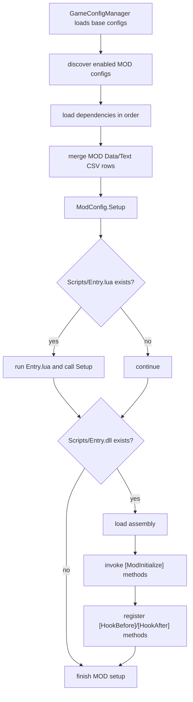
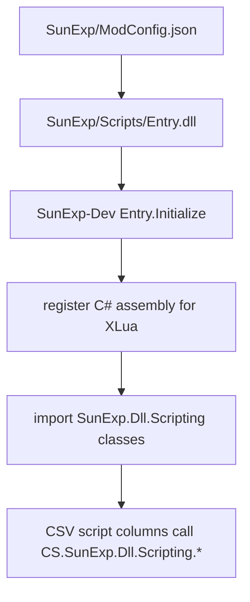

# MOD Load Flow

This flow summarizes how a MOD enters the game runtime.

Source anchors:

- `开发参考资料/反编译文件夹v1.0.23715745/Witch/GameConfigManager.cs`
- `开发参考资料/反编译文件夹v1.0.23715745/Witch/Mod/ModConfig.cs`
- `apocalyptic-journey-mod-tutorial/ModTemplate/README.zh-CN.md`
- `apocalyptic-journey-mod-tutorial/DllTemplate/readme.zh-CN.md`

## Important Consequences

- `ModName` should match the runtime MOD folder name.
- `Scripts/Entry.dll` is the required published DLL filename.
- The C# assembly name can and should be unique to avoid runtime conflicts.
- Data/Text CSV rows are loaded by table and ID, then script columns execute later
  through the relevant lifecycle.
- Changing script columns through `SetDataConfig`, `ModifyDataConfig`, or
  `MergeDataConfig` marks script data as changed internally.

## SunExp-Style Flow

SunExp uses a DLL-first bridge:

This keeps content in CSV while keeping behavior in typed, testable C#.
