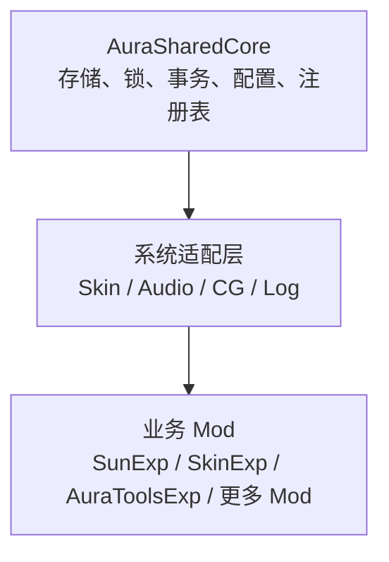

**开发目标**

把当前“路径共享 + SkinShared 专用实现”升级为：

````

````

核心原则：

- Core 不理解皮肤、音频等业务含义。
- Core 负责唯一写入口、原子提交、版本、所有权和恢复。
- 各系统只负责解析自己的清单和运行时行为。
- 不把所有系统塞进同一个巨大运行时，保持故障隔离。

## 第一阶段：共享存储与并发层

新增 `AuraSharedStorageRuntime`，作为所有共享文件的唯一写入口。

提供：

```
ReadSnapshot(system, logicalId)
CommitJson(request, expectedRevision)
InstallDirectory(request, expectedRevision)
```

实现：

- 全局 `AuraShared.Global` 统一调度。
- 每个资源键使用 `ReaderWriterLockSlim`。
- 读取返回不可变快照和 `revision`。
- 写入使用 `expectedRevision`，防止旧数据覆盖新数据。
- JSON 使用 `Flush + File.Replace` 原子替换。
- 目录资源继续使用 `Staging → Backup → Commit`。
- Windows 命名互斥锁，阻止两个游戏进程同时写入。
- 写入完成、释放锁后再发送变更通知。

验收标准：

- 多线程读取不会得到半份 JSON。
- 同一资源只能有一个写事务。
- revision 冲突会被拒绝，不会静默覆盖。
- 模拟写入中断后能够恢复旧数据。

## 第二阶段：配置作用域

建立正式配置模型：

```
Config/
├─ Shared/<System>/       # 多 Mod 共同读取
├─ Owners/<Owner>/<System>/ # Mod 独有
└─ Runtime/<System>/      # 可重建状态，不作为用户配置
```

提供：

```
ReadSharedConfig<T>()
WriteSharedConfig<T>()
ReadOwnerConfig<T>()
WriteOwnerConfig<T>()
```

写权限规则：

- `Shared`：只能由对应共享系统运行时写入。
- `Owners`：只能由所属 Mod 写入。
- 其他 Mod 可以读取公开配置，但不能直接写文件。
- 每个配置都包含 `schemaVersion`、`revision`、`updatedBy`。

随后迁移：

- Skin 选择配置使用 `Shared/Skin`。
- AuraTools 设置使用 `Owners/AuraToolsExp`。
- 不再允许业务模块自行拼路径并直接 `File.WriteAllText`。

## 第三阶段：通用资源注册表

将当前注册表身份从：

```
system + ownerModId + resourceId
```

改为：

```
system::logicalResourceId
```

所有者改成来源记录：

```
resource
├─ logicalId
├─ version
├─ contentHash
├─ canonicalPath
└─ sources[]
   ├─ ownerModId
   └─ packageId
```

统一规则：

- 身份相同、哈希相同：合并来源。
- 同一所有者、版本更高：允许更新。
- 不同所有者、内容不同：拒绝隐式覆盖。
- 注册表自动持久化和启动恢复。
- 所有查询返回确定性排序快照。

## 第四阶段：通用资源包引擎

从 [SkinPackageInstaller.cs](D:/Project/Apocalypic-journey-mods-creator/ModExp/AuraSkinShared/Services/SkinPackageInstaller.cs) 提取：

```
AuraSharedPackageEngine
├─ 清单验证
├─ SHA-256
├─ 所有权判断
├─ 版本仲裁
├─ 暂存与回滚
└─ 注册表提交
```

SkinShared 缩减为皮肤适配器，只负责：

- 解析 `character.json` 和 `skin.json`。
- 生成逻辑身份与规范目标路径。
- 安装后刷新皮肤索引。

随后增加：

- `AuraAudioShared`：音频包安装、格式验证、提供者注册。
- `AuraCgShared`：CG 包安装、角色/技能身份绑定。
- `AuraLogShared`：各 Mod 独有写入、共享聚合读取。

## 第五阶段：事务恢复与验证

增加写前日志：

```
Transactions/<transactionId>.json
```

事务状态：

```
Prepared → ContentCommitted → RegistryCommitted → Completed
```

启动时自动处理未完成事务。

测试覆盖：

- SkinExp、SunExp、AuraToolsExp 的所有加载顺序。
- 重复注册和不同所有者冲突。
- 配置 revision 冲突。
- 多线程读写。
- 两个进程竞争写锁。
- 暂存、目录替换、注册表写入三个阶段的故障注入。
- 损坏注册表和遗留 `.tmp` 文件恢复。
- 仅加载 SunExp 时读取持久 WuNa 皮肤。

## 发布顺序

1. 完成 Core v2 存储与配置协议。
2. 同时重建所有共享 Core 消费者，避免混用不同 BuildId。
3. 用 SkinShared 验证通用包引擎。
4. 接入 Audio 和 CG。
5. 最后接入 Log 与更多运行时共享系统。

完成后，[AuraSharedCore](D:/Project/Apocalypic-journey-mods-creator/ModExp/AuraSharedCore) 将真正负责“并发读、唯一写、持久注册、事务恢复”，Skin、Audio、CG 等只保留自己的业务适配逻辑。建议下一轮从第一、二阶段一起开发，因为存储协议和配置作用域必须同步定型。